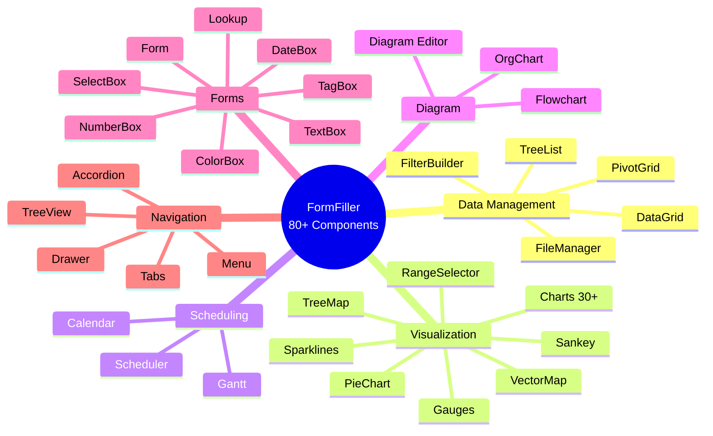

[← Back to Applicability Main Page](index.md)

# Extension Possibilities

This page summarizes development directions for the FormFiller system that would increase applicability across various industries and functional areas.

## Table of Contents

1. [Component Integration](#component-integration)
2. [AI Capabilities](#ai-capabilities)
3. [Priority Matrix](#priority-matrix)
4. [High Priority Extensions](#high-priority-extensions)
5. [Medium Priority Extensions](#medium-priority-extensions)
6. [Low Priority Extensions](#low-priority-extensions)
7. [Industry-Specific Extensions](#industry-specific-extensions)
8. [Technical Foundations](#technical-foundations)

---

## Component Integration

FormFiller provides **80+ professional, enterprise-grade UI components**. This means the following components are **natively available** or can be integrated with minimal configuration.

### Available Components by Category

### New Capabilities Enabled by Components

| Component | New Capability | Industries |
|-----------|---------------|------------|
| **Gantt** | Project scheduling, dependencies | Grants, Construction, HR |
| **Scheduler** | Calendar, appointments | Healthcare, Education |
| **PivotGrid** | OLAP analysis, drill-down | Finance, Grants |
| **Diagram** | Workflow visualization | All |
| **VectorMap** | Geographic visualization | Logistics, Energy |
| **Sankey** | Flow visualization | Finance, Energy |

---

## AI Capabilities

The unified JSON schema architecture enables powerful AI features.

### Current AI Features

| Feature | Status | Description |
|---------|--------|-------------|
| **Schema generation** | ✅ Working | Generate forms from natural language |
| **Validation suggestions** | ✅ Working | AI-suggested validation rules |
| **Field recommendations** | ✅ Working | Suggested fields for use case |

### Planned AI Features

| Feature | Priority | Description |
|---------|----------|-------------|
| **Auto-fill** | High | Predictive field completion |
| **Document OCR** | High | Extract data from documents |
| **Anomaly detection** | Medium | Flag unusual submissions |
| **Natural language query** | Medium | Query data with questions |
| **Form optimization** | Low | UX improvement suggestions |

---

## Priority Matrix

| Extension | Impact | Effort | Priority |
|-----------|:------:|:------:|:--------:|
| E-signature integration | High | Low | **High** |
| PDF export templates | High | Low | **High** |
| Offline PWA support | High | Medium | **High** |
| Document OCR | High | Medium | **High** |
| Payment integration | Medium | Medium | Medium |
| Calendar sync | Medium | Low | Medium |
| Barcode/QR scanning | Medium | Medium | Medium |
| Video conferencing | Low | High | Low |
| 3D visualization | Low | High | Low |

---

## High Priority Extensions

### E-Signature Integration

| Attribute | Value |
|-----------|-------|
| Complexity | Low |
| Impact | High |
| Industries | Finance, Legal, Healthcare, HR |

**Options:**
- DocuSign integration
- Adobe Sign integration
- HelloSign integration
- Native signature pad component

### PDF Export Templates

| Attribute | Value |
|-----------|-------|
| Complexity | Low |
| Impact | High |
| Industries | All |

**Features:**
- Custom PDF templates
- Form data population
- Header/footer customization
- Multi-page support

### Offline PWA Support

| Attribute | Value |
|-----------|-------|
| Complexity | Medium |
| Impact | High |
| Industries | Field services, Construction, Agriculture |

**Features:**
- Service worker caching
- IndexedDB storage
- Background sync
- Conflict resolution

### Document OCR

| Attribute | Value |
|-----------|-------|
| Complexity | Medium |
| Impact | High |
| Industries | Finance, Healthcare, HR |

**Features:**
- ID document scanning
- Invoice processing
- Receipt capture
- Form auto-fill

---

## Medium Priority Extensions

### Payment Integration

| Attribute | Value |
|-----------|-------|
| Complexity | Medium |
| Impact | Medium |
| Industries | E-commerce, Events, Non-profit |

**Options:**
- Stripe integration
- PayPal integration
- Bank transfer support

### Calendar Synchronization

| Attribute | Value |
|-----------|-------|
| Complexity | Low |
| Impact | Medium |
| Industries | Healthcare, HR, Education |

**Features:**
- Google Calendar sync
- Outlook Calendar sync
- iCal export

### Barcode/QR Scanning

| Attribute | Value |
|-----------|-------|
| Complexity | Medium |
| Impact | Medium |
| Industries | Logistics, Retail, Manufacturing |

**Features:**
- Camera-based scanning
- Code generation
- Inventory lookup

---

## Low Priority Extensions

### Video Conferencing Integration

| Attribute | Value |
|-----------|-------|
| Complexity | High |
| Impact | Low |
| Industries | Telemedicine, Remote work |

### 3D Visualization

| Attribute | Value |
|-----------|-------|
| Complexity | High |
| Impact | Low |
| Industries | Manufacturing, Architecture |

### Biometric Authentication

| Attribute | Value |
|-----------|-------|
| Complexity | High |
| Impact | Low |
| Industries | High-security applications |

---

## Industry-Specific Extensions

### Healthcare

| Extension | Priority |
|-----------|:--------:|
| HL7 FHIR connector | High |
| ICD-10 lookup | Medium |
| SNOMED CT integration | Medium |
| DICOM viewer | Low |

### Finance

| Extension | Priority |
|-----------|:--------:|
| Core banking connector | Medium |
| Credit scoring API | Medium |
| PCI DSS compliance | Medium |
| SWIFT integration | Low |

### Public Sector

| Extension | Priority |
|-----------|:--------:|
| National ID integration | High |
| Digital signature (eIDAS) | High |
| Document management | Medium |
| GIS integration | Low |

### Education

| Extension | Priority |
|-----------|:--------:|
| LMS integration (LTI) | High |
| Plagiarism detection | Medium |
| Auto-grading engine | Medium |
| Proctoring integration | Low |

---

## Technical Foundations

### API & Integration

| Feature | Status |
|---------|--------|
| REST API | ✅ Available |
| GraphQL | 🔶 Planned |
| Webhooks | ✅ Available |
| OAuth 2.0 | ✅ Available |
| SAML SSO | 🔶 Planned |

### Performance & Scalability

| Feature | Status |
|---------|--------|
| Horizontal scaling | ✅ Available |
| Redis caching | ✅ Available |
| CDN support | ✅ Available |
| Load balancing | ✅ Available |

### Security

| Feature | Status |
|---------|--------|
| HTTPS/TLS | ✅ Available |
| Data encryption | ✅ Available |
| RBAC | ✅ Available |
| Audit logging | ✅ Available |
| GDPR compliance | ✅ Available |
| SOC 2 | 🔶 Self-hosted |

---

## Summary

FormFiller's extension roadmap focuses on:

1. **High-impact, low-effort** integrations (e-signature, PDF, OCR)
2. **Offline capability** for field applications
3. **Industry connectors** for healthcare, finance, public sector
4. **AI enhancements** leveraging the unified schema

> The modular architecture means extensions can be added incrementally without disrupting existing functionality.

---

## Related Documentation

- [Applicability Main Page](./index.md)
- [Creative Use Cases](./creative-uses.md)
- [Industry Analysis](./industries/index.md)
- [Roadmap](../roadmap.md)
