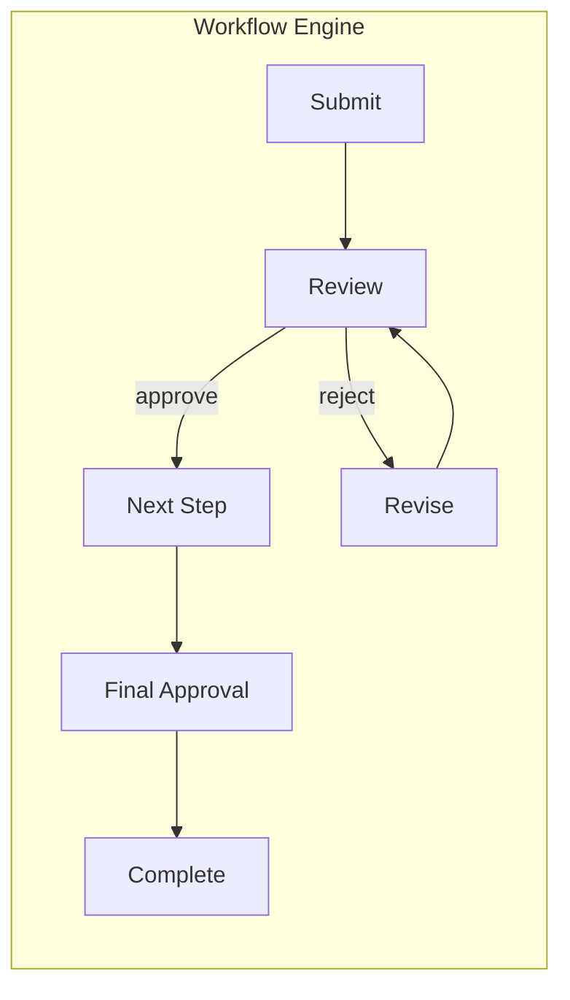

[← Back to Functions](index.md)

# Approval Workflow

Approval workflow is one of FormFiller's most outstanding capabilities, where the built-in workflow engine provides full support for multi-step authorization processes.

## Evaluation

| Metric | Value |
|--------|-------|
| **Current fit** | ★★★★★ |
| **Development potential** | ★★★★★ |
| **Market size** | $10-20B |
| **Savings** | 70-90% |
| **Success** | High |

## Market Solutions

| Software | Type | Typical Price |
|----------|------|---------------|
| **ServiceNow** | ITSM/Workflow | $100-200/user/mo |
| **Kissflow** | Workflow | $15-30/user/mo |
| **ProcessMaker** | BPM | $25-50/user/mo |
| **Microsoft Power Automate** | Automation | $15-40/user/mo |

## Key Areas

- **Multi-step approvals** - Sequential and parallel approvers
- **Leave/expense requests** - Common HR workflows
- **Document approvals** - Contracts, policies, publications
- **Procurement workflows** - Purchase requests, vendor approval

## FormFiller Workflow Features

| Feature | Description |
|---------|-------------|
| **Sequential approval** | Step-by-step approvers |
| **Parallel approval** | Multiple simultaneous approvers |
| **Conditional routing** | Route based on form data |
| **Escalation** | SLA-based escalation |
| **Delegation** | Temporary delegation |
| **Audit trail** | Complete history |

## FormFiller Advantages

| Advantage | Description |
|-----------|-------------|
| **Built-in engine** | No additional tools needed |
| **Visual workflow** | Diagram component for visualization |
| **Flexible conditions** | Any form field for routing |
| **Cost efficiency** | 70-90% savings |

## When to Choose FormFiller?

| Scenario | Recommended? |
|----------|:-----------:|
| Leave requests | ✅ Yes |
| Expense approvals | ✅ Yes |
| Document workflows | ✅ Yes |
| Complex BPM processes | 🔶 Partial |
| Enterprise ITSM | ❌ No |

---

## Related Documentation

- [Functions Summary](./index.md)
- [HR Industry](../industries/hr.md)
