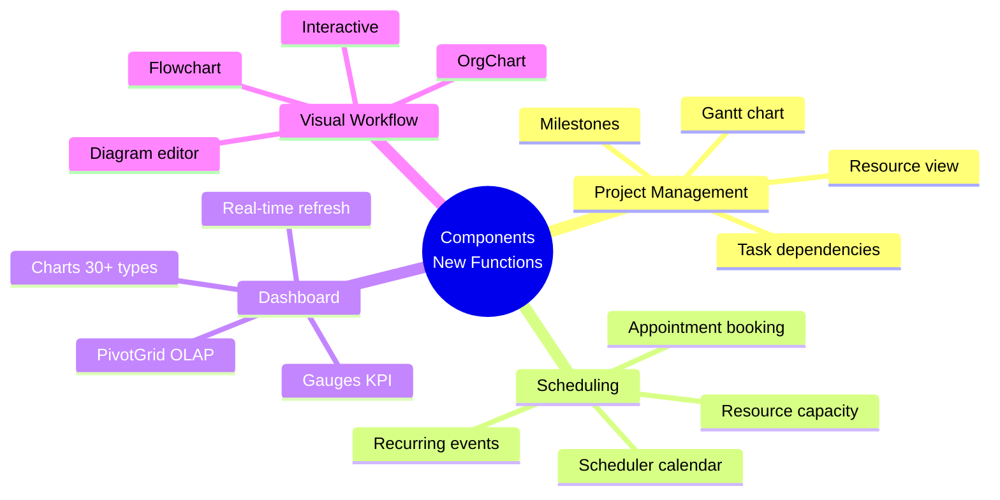

[← Back to Applicability Main Page](../index.md)

# Functional Applicability

This page summarizes the applicability of the FormFiller system across various functional areas, comparing it with market solutions.

## Table of Contents

1. [Evaluation Methodology](#evaluation-methodology)
2. [Functions Enabled by Components](#functions-enabled-by-components)
3. [AI Automation](#ai-automation)
4. [Key Functions (with detailed analysis)](#key-functions)
5. [Additional Functions](#additional-functions)
6. [Summary Table](#summary-table)

---

## Evaluation Methodology

### Evaluation Criteria

| Criterion | Description |
|-----------|-------------|
| **Fit** | How suitable FormFiller is in its current state |
| **Potential** | What development opportunities exist |
| **Market Size** | Estimated global market value |
| **Savings** | Expected cost reduction |
| **Success** | Probability of market success |

### Star Rating

| Stars | Meaning |
|-------|---------|
| ★★★★★ | Excellent - Immediately applicable |
| ★★★★☆ | Very good - With minor customization |
| ★★★☆☆ | Good - With moderate development |
| ★★☆☆☆ | Moderate - Significant development needed |
| ★☆☆☆☆ | Low - Not recommended |

---

## Functions Enabled by Components

FormFiller offers **80+ professional UI components**. This significantly expands functional capabilities beyond basic form management.

### New Functional Capabilities

### Gantt Chart Integration

The **Gantt component** enables complex project scheduling directly within FormFiller.

| Feature | Description | Application |
|---------|-------------|-------------|
| **Task scheduling** | Drag & drop tasks | Grant timeline, HR onboarding |
| **Dependencies** | Finish-to-start, etc. | Construction projects, processes |
| **Resources** | Resource assignment | Capacity planning |
| **Milestones** | Key dates | Project monitoring |
| **Critical path** | Auto calculation | Project optimization |
| **Export** | PDF, PNG | Reports |

### Scheduler / Appointment Booking

The **Scheduler component** provides calendar and appointment booking functionality.

| Feature | Description | Application |
|---------|-------------|-------------|
| **Calendar views** | Day, week, month, agenda | Appointments, meetings |
| **Resources** | Multi-resource calendar | Doctor schedules, rooms |
| **Recurring** | Repeat patterns | Regular meetings |
| **Drag & drop** | Easy rescheduling | User-friendly booking |
| **Integration** | Google/Outlook sync | Calendar sync |

### Dashboard & Analytics

DevExtreme **Charts, Gauges, and PivotGrid** enable rich analytics dashboards.

| Component | Application |
|-----------|-------------|
| **Charts (30+ types)** | Trends, comparisons, distributions |
| **Gauges** | KPI monitoring, status indicators |
| **PivotGrid** | OLAP-like analysis, drill-down |
| **Sparklines** | Inline mini charts in tables |

---

## AI Automation

The unified JSON schema architecture enables powerful AI automation.

### AI Capabilities by Function

| Function | AI Capability | Benefit |
|----------|---------------|---------|
| **Surveys** | Auto question generation, sentiment analysis | Faster creation, insights |
| **CRM** | Lead scoring, duplicate detection | Better conversion |
| **Helpdesk** | Ticket classification, auto-routing | Faster resolution |
| **Approval** | Risk assessment, anomaly detection | Smarter decisions |
| **Configurator** | Recommendations, constraint validation | Better UX |

---

## Key Functions

Detailed analysis has been prepared for the following functions on separate pages.

### Surveys / Questionnaires

**[Detailed analysis →](./survey.md)**

| Attribute | Value |
|-----------|-------|
| Fit | ★★★★★ |
| Potential | ★★★★☆ |
| Market Size | $5-10B |
| Savings | 90-98% |
| Success | High |

**Key areas:**
- Customer satisfaction surveys
- Employee feedback
- Market research
- Academic research

**Market solutions:** SurveyMonkey, Typeform, Google Forms, Qualtrics

---

### Approval Workflow

**[Detailed analysis →](./approval-workflow.md)**

| Attribute | Value |
|-----------|-------|
| Fit | ★★★★★ |
| Potential | ★★★★★ |
| Market Size | $10-20B |
| Savings | 70-90% |
| Success | High |

**Key areas:**
- Multi-step approvals
- Leave/expense requests
- Document approvals
- Procurement workflows

**Market solutions:** ServiceNow, Kissflow, ProcessMaker

---

### Helpdesk / Ticketing

**[Detailed analysis →](./ticketing.md)**

| Attribute | Value |
|-----------|-------|
| Fit | ★★★★☆ |
| Potential | ★★★★★ |
| Market Size | $15-25B |
| Savings | 60-80% |
| Success | High |

**Key areas:**
- IT support tickets
- Customer service
- Internal requests
- SLA tracking

**Market solutions:** Zendesk, Freshdesk, Jira Service Management

---

### CRM / Customer Management

**[Detailed analysis →](./crm.md)**

| Attribute | Value |
|-----------|-------|
| Fit | ★★★☆☆ |
| Potential | ★★★★☆ |
| Market Size | $60-90B |
| Savings | 40-60% |
| Success | Medium |

**Key areas:**
- Lead capture forms
- Contact management
- Sales pipeline forms
- Customer onboarding

**Market solutions:** Salesforce, HubSpot, Zoho CRM

---

### Configurator

**[Detailed analysis →](./configurator.md)**

| Attribute | Value |
|-----------|-------|
| Fit | ★★★☆☆ |
| Potential | ★★★★★ |
| Market Size | $20-40B |
| Savings | 50-70% |
| Success | Medium |

**Key areas:**
- Product configuration
- Service selection
- Quote generation
- Order customization

**Market solutions:** Salesforce CPQ, Oracle CPQ, SAP CPQ

---

## Additional Functions

### Project Management

| Attribute | Value |
|-----------|-------|
| Fit | ★★☆☆☆ |
| Potential | ★★★☆☆ |
| Market Size | $8-15B |
| Savings | 30-50% |

FormFiller can handle project-related forms (status reports, timesheets) but is not a full project management replacement.

### Document Management

| Attribute | Value |
|-----------|-------|
| Fit | ★★★☆☆ |
| Potential | ★★★★☆ |
| Market Size | $10-20B |
| Savings | 40-60% |

Good for document collection forms, metadata capture, and approval workflows. Not a full DMS.

### Appointment Booking

| Attribute | Value |
|-----------|-------|
| Fit | ★★★★☆ |
| Potential | ★★★★☆ |
| Market Size | $3-6B |
| Savings | 70-85% |

The Scheduler component provides excellent appointment booking capabilities.

### Compliance/Audit

| Attribute | Value |
|-----------|-------|
| Fit | ★★★★☆ |
| Potential | ★★★★★ |
| Market Size | $8-15B |
| Savings | 60-80% |

Excellent for checklists, audit forms, and compliance documentation with audit trail.

### Inventory

| Attribute | Value |
|-----------|-------|
| Fit | ★★★☆☆ |
| Potential | ★★★☆☆ |
| Market Size | $5-10B |
| Savings | 40-60% |

Good for inventory intake forms, stock checks, but not a full inventory system.

### Contract Management

| Attribute | Value |
|-----------|-------|
| Fit | ★★★★☆ |
| Potential | ★★★★☆ |
| Market Size | $5-10B |
| Savings | 50-70% |

Excellent for contract request forms, approval workflows, and metadata management.

### Registration

| Attribute | Value |
|-----------|-------|
| Fit | ★★★★★ |
| Potential | ★★★★☆ |
| Market Size | $3-6B |
| Savings | 80-95% |

Native support for all types of registration forms - events, courses, memberships.

### Complaint Handling

| Attribute | Value |
|-----------|-------|
| Fit | ★★★★☆ |
| Potential | ★★★★★ |
| Market Size | $4-8B |
| Savings | 60-80% |

Good workflow support for complaint intake, routing, and resolution tracking.

### Quality Assurance (QA)

| Attribute | Value |
|-----------|-------|
| Fit | ★★★★☆ |
| Potential | ★★★★☆ |
| Market Size | $6-12B |
| Savings | 50-70% |

Excellent for QA checklists, inspection forms, and non-conformance reports.

---

## Summary Table

| Function | Fit | Potential | Market Size | Savings | Components | AI Potential | Details |
|----------|:---:|:---------:|------------:|:-------:|:----------:|:------------:|:-------:|
| **Surveys** | ★★★★★ | ★★★★☆ | $5-10B | 90-98% | Form | High | [Link](./survey.md) |
| **Approval Workflow** | ★★★★★ | ★★★★★ | $10-20B | 70-90% | Diagram, Gantt | High | [Link](./approval-workflow.md) |
| **Helpdesk** | ★★★★☆ | ★★★★★ | $15-25B | 60-80% | DataGrid | High | [Link](./ticketing.md) |
| **CRM** | ★★★☆☆ | ★★★★☆ | $60-90B | 40-60% | DataGrid, Charts | Medium | [Link](./crm.md) |
| **Configurator** | ★★★☆☆ | ★★★★★ | $20-40B | 50-70% | TreeList | High | [Link](./configurator.md) |
| Data Collection | ★★★★★ | ★★★★★ | $5-10B | 90-98% | Form | High | - |
| Project Management | ★★☆☆☆ | ★★★☆☆ | $8-15B | 30-50% | Gantt | Low | - |
| Document Management | ★★★☆☆ | ★★★★☆ | $10-20B | 40-60% | FileManager | Medium | - |
| Appointment Booking | ★★★★☆ | ★★★★☆ | $3-6B | 70-85% | Scheduler | Medium | - |
| Compliance/Audit | ★★★★☆ | ★★★★★ | $8-15B | 60-80% | Form | High | - |
| Inventory | ★★★☆☆ | ★★★☆☆ | $5-10B | 40-60% | DataGrid | Low | - |
| Contract Management | ★★★★☆ | ★★★★☆ | $5-10B | 50-70% | Form, Workflow | Medium | - |
| Registration | ★★★★★ | ★★★★☆ | $3-6B | 80-95% | Form | Medium | - |
| Complaint Handling | ★★★★☆ | ★★★★★ | $4-8B | 60-80% | Form, Workflow | High | - |
| Quality Assurance | ★★★★☆ | ★★★★☆ | $6-12B | 50-70% | Form | Medium | - |

---

## Related Documentation

- [Applicability Main Page](../index.md) - Comprehensive summary
- [Industry Analysis](../industries/index.md) - Industry-based evaluation
- [Extension Possibilities](../extensions.md) - Development directions
