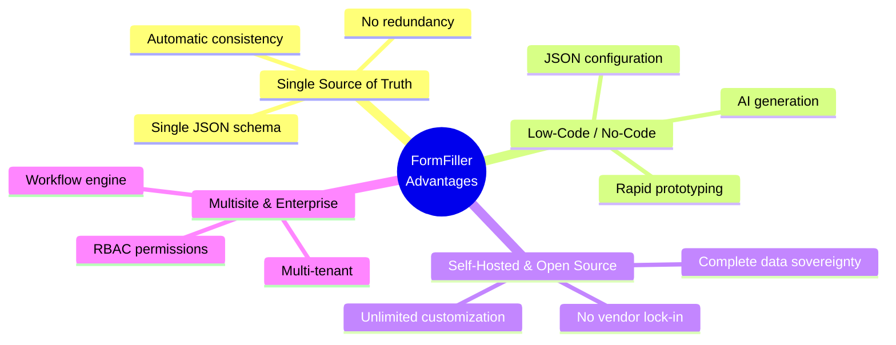
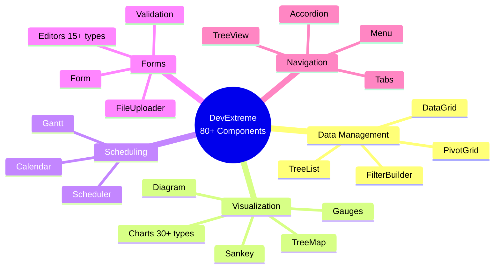
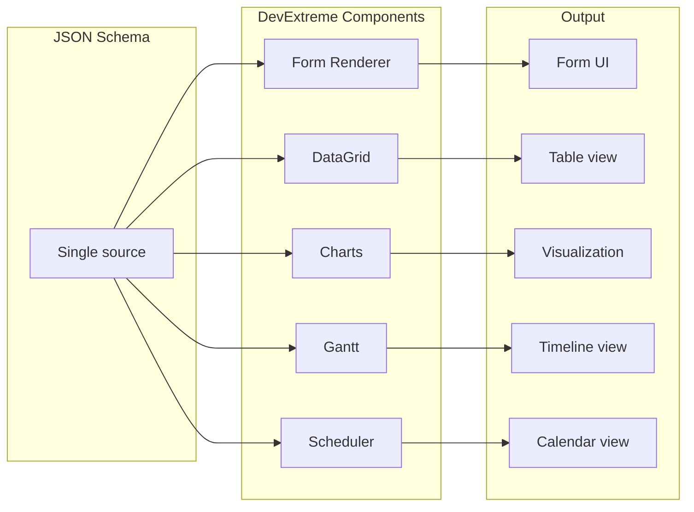
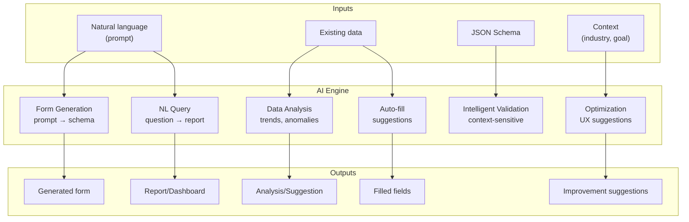
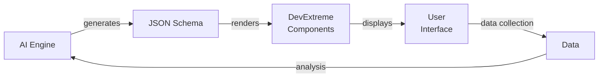
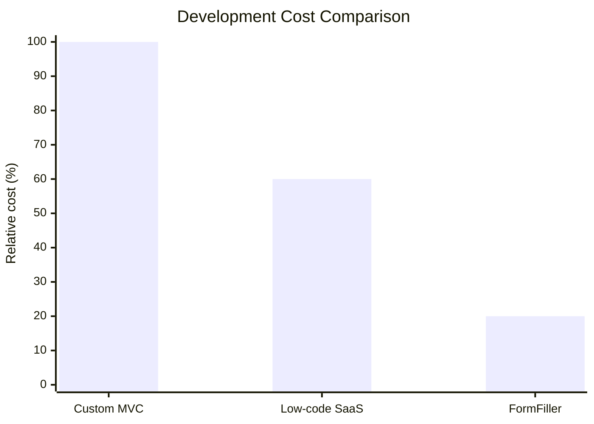
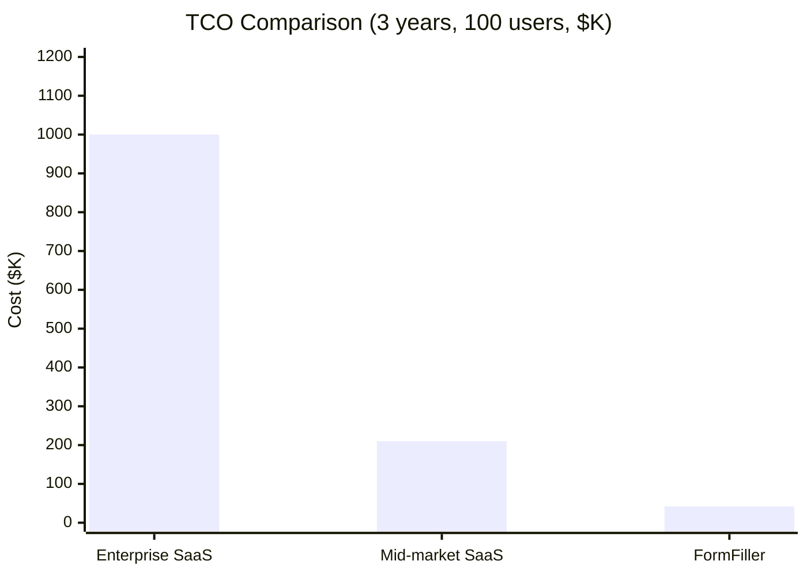
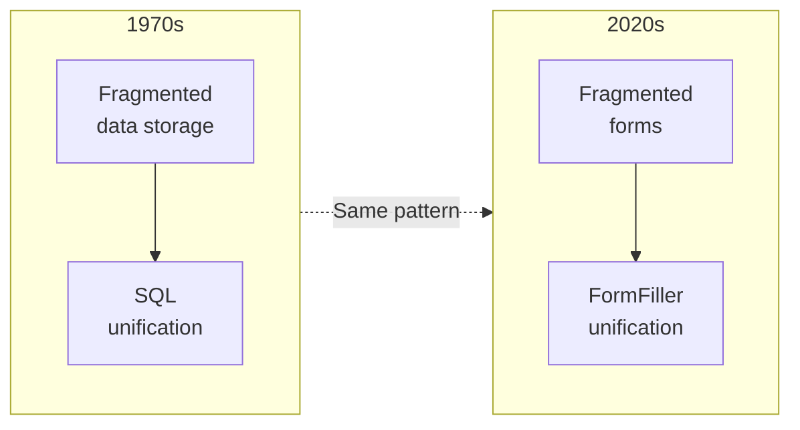

# FormFiller Applicability

This documentation comprehensively examines the applicability of the FormFiller system across various industries and functional areas, comparing it with traditional software solutions available on the market.

## Table of Contents

1. [Why FormFiller?](#why-formfiller)
2. [DevExtreme Ecosystem](#devextreme-ecosystem)
3. [AI Integration](#ai-integration)
4. [Industry Evaluation](#industry-evaluation)
5. [Functional Evaluation](#functional-evaluation)
6. [Business Value Proposition](#business-value-proposition)
7. [Analysis Conclusion](#analysis-conclusion)
8. [Navigation](#navigation)

---

## Why FormFiller?

The FormFiller architecture offers unique advantages over traditional software:

---

## DevExtreme Ecosystem

FormFiller is built on the DevExtreme component library, providing access to **80+ professional UI components**. This means all visualization and data management features mentioned in this documentation are easily implementable.

### Key DevExtreme Components

| Component | Function | FormFiller Application |
|-----------|----------|------------------------|
| **Gantt** | Project scheduling, timeline view | Grant scheduling, HR onboarding, construction projects |
| **Scheduler** | Calendar, appointment booking | Medical appointments, interviews, class schedules |
| **Charts** | 30+ chart types | Dashboard, analytics, KPI monitoring |
| **Diagram** | Workflow visualization | Approval processes, organizational charts |
| **PivotGrid** | Pivot tables, aggregations | Grant monitoring, financial reports |
| **DataGrid** | Advanced tables | Data management, filtering, export |
| **TreeList** | Hierarchical data | Organizational structure, product catalog |
| **FileManager** | File management | Document management, attachments |

### DevExtreme + FormFiller Synergy

> **Important:** DevExtreme component integration means FormFiller is suitable not only for form management but also for building **complex business applications** - with dashboard, project management, scheduling, and analytics functionality.

---

## AI Integration

The unified JSON schema architecture makes FormFiller **particularly suitable** for AI-based features. The schema as "single source of truth" enables AI systems to get a complete picture of form structure, validation rules, and business logic.

### AI Capabilities

### Specific AI Use Cases

| AI Function | Description | Example |
|-------------|-------------|---------|
| **Form Generation** | JSON schema from natural language description | "Create a KYC form for banks" → complete schema |
| **Intelligent Validation** | Context-sensitive verification | Tax ID format based on country |
| **Auto-fill** | Suggestions based on previous data | Address fields from postal code |
| **Anomaly Detection** | Flagging unusual values | Outlier amount in budget |
| **Natural Language Query** | Report from question | "Show last month's approvals" |
| **Form Optimization** | UX improvement suggestions | "This field is empty 80% of the time" |
| **Document Processing** | PDF/image → filled form | Invoice OCR → procurement form |

### Why is AI Effective with FormFiller?

| Factor | Explanation |
|--------|-------------|
| **Unified Schema** | AI sees all information in one place |
| **Structured Data** | JSON format is easily processable |
| **Explicit Rules** | Validation rules built into schema |
| **Context** | Field labels, descriptions, types are richly documented |
| **Version Control** | Schema changes are trackable |

### AI + DevExtreme Collaboration

> **Example workflow:** User describes a need with prompt → AI generates JSON schema → DevExtreme renders the form → Users fill it out → AI analyzes the data → Dashboard visualization with DevExtreme Charts

---

## Industry Evaluation

The table below summarizes FormFiller's applicability across various industries, including current fit, development potential, and business values.

### Rating Scale

| Symbol | Meaning |
|--------|---------|
| ★★★★★ | Excellent - Immediately applicable, full coverage |
| ★★★★☆ | Very good - Applicable with minor customization |
| ★★★☆☆ | Good - Applicable with moderate development |
| ★★☆☆☆ | Moderate - Significant development required |
| ★☆☆☆☆ | Low - Basic features missing |

### Industry Summary Table

| Industry | Fit | Potential | Market Size (TAM) | Savings | Success | Details |
|----------|:---:|:---------:|------------------:|:-------:|:-------:|:-------:|
| **Healthcare** | ★★★☆☆ | ★★★★★ | $50-100B | 60-80% | High | [Details](./industries/healthcare.md) |
| **Finance/Insurance** | ★★★★☆ | ★★★★★ | $80-150B | 50-70% | High | [Details](./industries/finance.md) |
| **Public Sector** | ★★★★☆ | ★★★★★ | $30-60B | 70-90% | High | [Details](./industries/public-sector.md) |
| **Education** | ★★★★★ | ★★★★☆ | $10-25B | 80-95% | High | [Details](./industries/education.md) |
| **HR/Recruiting** | ★★★★★ | ★★★★☆ | $15-30B | 70-85% | High | [Details](./industries/hr.md) |
| **Telecommunications** | ★★★☆☆ | ★★★★★ | $40-80B | 50-70% | Medium | [Details](./industries/telco.md) |
| **Grant Systems** | ★★★★☆ | ★★★★★ | $5-15B | 80-95% | High | [Details](./industries/grants.md) |
| Manufacturing | ★★★☆☆ | ★★★★☆ | $40-70B | 50-70% | Medium | [Summary](./industries/index.md#manufacturing) |
| Retail/E-commerce | ★★☆☆☆ | ★★★☆☆ | $25-50B | 40-60% | Medium | [Summary](./industries/index.md#retail-e-commerce) |
| Logistics | ★★★☆☆ | ★★★★☆ | $20-40B | 50-70% | Medium | [Summary](./industries/index.md#logistics) |
| Real Estate | ★★★★☆ | ★★★★☆ | $10-20B | 60-80% | Medium | [Summary](./industries/index.md#real-estate) |
| Non-profit | ★★★★★ | ★★★★☆ | $5-10B | 80-95% | High | [Summary](./industries/index.md#non-profit) |
| Legal Sector | ★★★★☆ | ★★★★☆ | $10-20B | 60-80% | Medium | [Summary](./industries/index.md#legal-sector) |
| Construction | ★★★☆☆ | ★★★★☆ | $15-30B | 50-70% | Medium | [Summary](./industries/index.md#construction) |
| Energy/Utilities | ★★★☆☆ | ★★★★☆ | $20-40B | 50-70% | Medium | [Summary](./industries/index.md#energy-utilities) |
| Agriculture | ★★★☆☆ | ★★★★☆ | $8-15B | 60-80% | Medium | [Summary](./industries/index.md#agriculture) |
| Tourism/Hospitality | ★★★★☆ | ★★★★☆ | $10-20B | 60-80% | Medium | [Summary](./industries/index.md#tourism-hospitality) |
| Sports/Events | ★★★★☆ | ★★★★☆ | $5-10B | 70-85% | Medium | [Summary](./industries/index.md#sports-events) |

> 📊 Detailed industry analysis: [Industries](./industries/index.md)

---

## Functional Evaluation

The table below compares FormFiller from a functional perspective with market solutions.

### Functional Summary Table

| Function | Fit | Potential | Market Size | Savings | Success | Details |
|----------|:---:|:---------:|------------:|:-------:|:-------:|:-------:|
| **CRM/Customer Management** | ★★★☆☆ | ★★★★☆ | $60-90B | 40-60% | Medium | [Details](./functions/crm.md) |
| **Helpdesk/Ticketing** | ★★★★☆ | ★★★★★ | $15-25B | 60-80% | High | [Details](./functions/ticketing.md) |
| **Surveys/Questionnaires** | ★★★★★ | ★★★★☆ | $5-10B | 90-98% | High | [Details](./functions/survey.md) |
| **Approval Workflow** | ★★★★★ | ★★★★★ | $10-20B | 70-90% | High | [Details](./functions/approval-workflow.md) |
| **Configurator** | ★★★☆☆ | ★★★★★ | $20-40B | 50-70% | Medium | [Details](./functions/configurator.md) |
| Data Collection/Forms | ★★★★★ | ★★★★★ | $5-10B | 90-98% | High | [Comparison](../comparison.md) |
| Project Management | ★★☆☆☆ | ★★★☆☆ | $8-15B | 30-50% | Low | [Summary](./functions/index.md#project-management) |
| Document Management | ★★★☆☆ | ★★★★☆ | $10-20B | 40-60% | Medium | [Summary](./functions/index.md#document-management) |
| Appointment Booking | ★★★★☆ | ★★★★☆ | $3-6B | 70-85% | Medium | [Summary](./functions/index.md#appointment-booking) |
| Compliance/Audit | ★★★★☆ | ★★★★★ | $8-15B | 60-80% | High | [Summary](./functions/index.md#compliance-audit) |
| Inventory | ★★★☆☆ | ★★★☆☆ | $5-10B | 40-60% | Low | [Summary](./functions/index.md#inventory) |
| Contract Management | ★★★★☆ | ★★★★☆ | $5-10B | 50-70% | Medium | [Summary](./functions/index.md#contract-management) |
| Registration | ★★★★★ | ★★★★☆ | $3-6B | 80-95% | High | [Summary](./functions/index.md#registration) |
| Complaint Handling | ★★★★☆ | ★★★★★ | $4-8B | 60-80% | High | [Summary](./functions/index.md#complaint-handling) |
| Quality Assurance | ★★★★☆ | ★★★★☆ | $6-12B | 50-70% | Medium | [Summary](./functions/index.md#quality-assurance) |

> 📊 Detailed functional analysis: [Functions](./functions/index.md)

---

## Business Value Proposition

### Development Cost Savings

> **Savings:** 80% compared to custom development, 67% compared to SaaS low-code platforms

### Savings Calculation Methodology

| Category | Traditional | FormFiller | Savings |
|----------|-------------|------------|---------|
| **Lines of code (simple form)** | 500-600 lines | 25-50 lines | ~90% |
| **Definition locations** | 4-6 (DB, API, DTO, UI) | 1 (Schema) | ~80% |
| **Adding new field** | 6+ file modifications | 1 file | ~85% |
| **Maintenance cost** | High (synchronization) | Low | ~70% |
| **Time-to-market** | Weeks/months | Hours/days | ~80% |
| **License cost** | $50-500/user/month | $0 (open source) | 100% |

### TCO (Total Cost of Ownership) - 3 Years

**TCO breakdown:**

| Solution | License | Implementation | Other | Total |
|----------|--------:|---------------:|------:|------:|
| **Enterprise SaaS** | $540K-1.08M | $50K-200K | $30K-100K | **$620K-1.38M** |
| **Mid-market SaaS** | $72K-288K | $10K-30K | $5K-20K | **$87K-338K** |
| **FormFiller** | $0 | $5K-15K | $16K-48K | **$21K-63K** |

> **Savings:** 95-97% vs Enterprise SaaS, 75-85% vs Mid-market SaaS

### ROI Calculator

| Users | Period | SaaS Cost (avg) | FormFiller Cost | Savings | ROI |
|------:|-------:|----------------:|----------------:|--------:|----:|
| 50 | 1 year | €30,000 | €8,000 | €22,000 | 275% |
| 100 | 1 year | €60,000 | €12,000 | €48,000 | 400% |
| 100 | 3 years | €180,000 | €40,000 | €140,000 | 350% |
| 500 | 3 years | €750,000 | €100,000 | €650,000 | 650% |
| 1000 | 3 years | €1,500,000 | €180,000 | €1,320,000 | 733% |

### Market Success Evaluation

| Success Level | Meaning | Example Industries |
|---------------|---------|-------------------|
| **High** | Immediate competitive advantage, minimal development | Education, HR, Grants, Non-profit |
| **Medium** | Competitive, excellent with targeted development | Telco, Manufacturing, Construction |
| **Low** | Significant development required | E-commerce (webshop features) |

---

## Analysis Conclusion

### Key Findings

Analysis of 18 industries and 15+ functional areas led to three fundamental conclusions:

| Finding | Description |
|---------|-------------|
| **Horizontal platform** | FormFiller is not a tool optimized for one industry, but a universal platform - meaningfully applicable in 16/18 industries |
| **Flat cost curve** | Cost doesn't grow exponentially with complexity because everything builds on the same JSON schema foundation |
| **AI-native advantage** | Unified representation provides identical AI capabilities across all industries - no need for vertical AI models |

### The SQL Parallel

The significance of FormFiller architecture is best understood through an IT-historical parallel.

**Before the 1970s**, every application used its own data storage solution. **SQL and the relational model** eliminated this fragmentation with a single abstraction.

**Today's form world** is exactly where databases were before SQL: every industry (healthcare, finance, public sector) uses its own systems, with its own form definitions, validation languages, and workflow engines.

FormFiller **performs the same unification** in the form world that SQL did in databases:

| SQL/RDBMS | FormFiller |
|-----------|------------|
| One query language | One schema format (JSON) |
| One optimization engine | One validation engine |
| One permission system | One RBAC system |
| Implementation-independent | Swappable renderers |

### The Critical Difference: AI

In the SQL era, databases were passive stores. In the FormFiller era, AI can be an active partner - the unified schema enables automatic generation, validation, filling, and analysis.

> *"SQL didn't win because it was better than all alternatives. It won because it was good enough for enough things, and radically simplified the ecosystem."*
>
> FormFiller follows the same path - but in the AI era, this path may be shorter.

📖 **Detailed analysis:** [The SQL Moment - Historical Parallel](./industries/index.md#historical-parallel-the-sql-moment)

---

## Navigation

### Detailed Analyses

#### Industries (with detailed pages)

- [Healthcare](./industries/healthcare.md) - HIPAA, patient data, clinical forms
- [Finance/Insurance](./industries/finance.md) - KYC, compliance, claims
- [Public Sector](./industries/public-sector.md) - e-government, case management
- [Education](./industries/education.md) - exams, assignments, enrollment
- [HR/Recruiting](./industries/hr.md) - onboarding, evaluation, leave
- [Telecommunications](./industries/telco.md) - service configuration, customer portal
- [Grant Systems](./industries/grants.md) - EU grants, evaluation, monitoring

#### Functions (with detailed pages)

- [CRM/Customer Management](./functions/crm.md) - lead management, sales pipeline
- [Helpdesk/Ticketing](./functions/ticketing.md) - ticket management, SLA
- [Surveys/Questionnaires](./functions/survey.md) - research, feedback
- [Approval Workflow](./functions/approval-workflow.md) - multi-step approval
- [Configurator](./functions/configurator.md) - product/service configuration

### Additional Pages

- [Industry Summary](./industries/index.md) - Overview of 18 industries
- [Functional Summary](./functions/index.md) - Overview of 15+ functions
- [Creative Use Cases](./creative-uses.md) - Innovative applications
- [Extension Possibilities](./extensions.md) - Development directions

---

## Related Documentation

- [Architecture](../architecture.md) - System structure
- [Comparisons](../comparison.md) - Form builder comparison
- [Future Development](../roadmap.md) - Development directions
- [DevExtreme Demos](https://js.devexpress.com/React/Demos/WidgetsGallery/) - Component gallery (external link)
