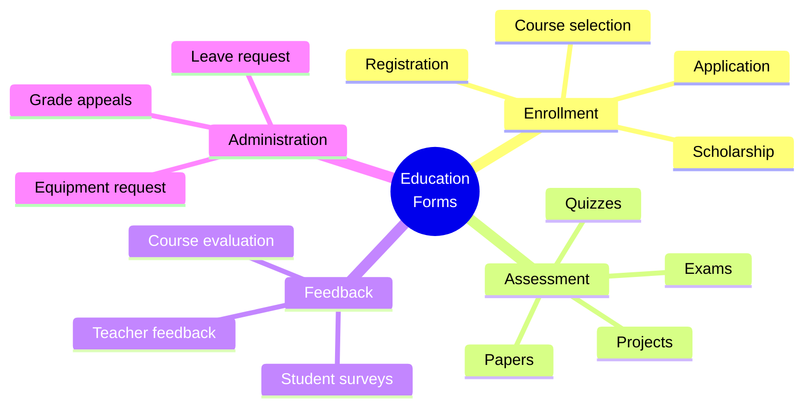

[← Back to Industries](index.md)

# Education

The education sector is one of the most suitable areas for FormFiller, where it can create immediate value in exams, assignments, enrollment, and administration.

## Evaluation

| Metric | Value |
|--------|-------|
| **Current fit** | ★★★★★ |
| **Development potential** | ★★★★☆ |
| **Market size** | $10-25B |
| **Savings** | 80-95% |
| **Success** | High |

## Market Solutions

| Software | Type | Typical Price |
|----------|------|---------------|
| **Canvas** | LMS | $10-50/student/year |
| **Blackboard** | LMS | $20-100/student/year |
| **Moodle** | LMS (Open) | Free + hosting |
| **Google Classroom** | LMS | Free/Workspace |

## Form Types

## Key Areas

- **Enrollment, applications** - Complex multi-step forms
- **Exams, papers, quizzes** - Validation, auto-grading potential
- **Assignment, project evaluation** - Rubrics, feedback
- **Course evaluation, feedback** - Anonymous surveys

## FormFiller Advantages

| Advantage | Description |
|-----------|-------------|
| **Native forms** | Perfect for surveys and assessments |
| **Cost efficiency** | 80-95% savings |
| **Flexibility** | Quick form creation |
| **AI potential** | Auto-grading, plagiarism check |

## When to Choose FormFiller?

| Scenario | Recommended? |
|----------|:-----------:|
| Student surveys | ✅ Yes |
| Enrollment forms | ✅ Yes |
| Online exams | ✅ Yes |
| Full LMS replacement | ❌ No |
| Assignment submission | ✅ Yes |

---

## Related Documentation

- [Industry Summary](./index.md)
- [Surveys](../functions/survey.md)
