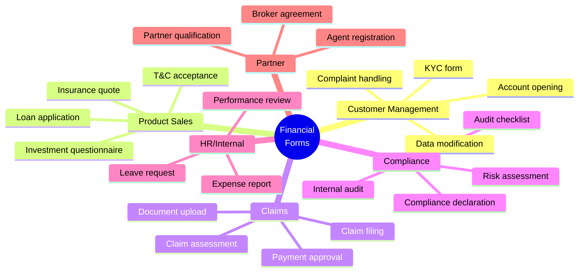
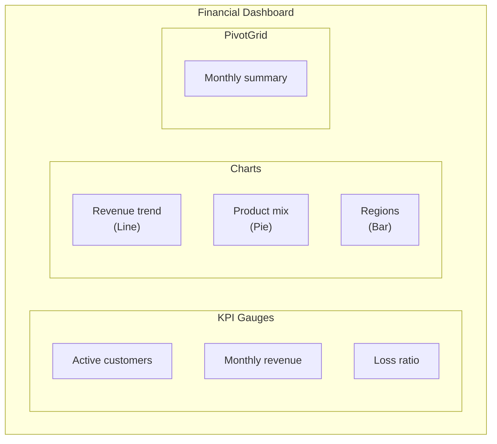
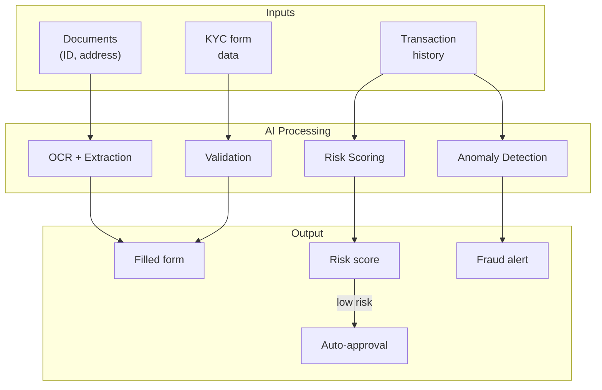
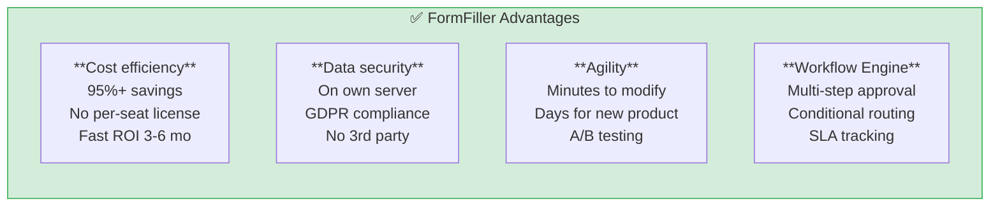
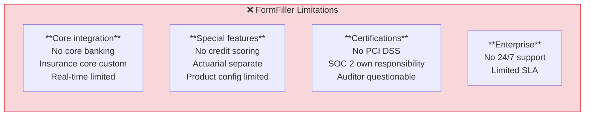

[← Back to Industries](index.md)

# Finance and Insurance

The financial sector operates in a strict regulatory environment where FormFiller architecture can offer significant advantages in compliance, customer management, and internal processes.

## Table of Contents

1. [Industry Overview](#industry-overview)
2. [Typical Needs](#typical-needs)
3. [Extension Possibilities](#extension-possibilities)
4. [AI Integration](#ai-integration)
5. [FormFiller Mapping](#formfiller-mapping)
6. [Comparison Table](#comparison-table)
7. [Pros/Cons Analysis](#proscons-analysis)
8. [Extension Recommendations](#extension-recommendations)
9. [Business Evaluation](#business-evaluation)

---

## Industry Overview

### Market Size and Players

| Attribute | Value |
|-----------|-------|
| **Global market size** | $80-150B (financial IT) |
| **Annual growth** | 10-15% |
| **Key segments** | Banks, Insurers, FinTech |

### Traditional Solutions

| Software | Type | Market Position | Typical Price |
|----------|------|-----------------|---------------|
| **Salesforce FSC** | CRM + compliance | Market leader | $300-500/user/mo |
| **Guidewire** | Insurance core | Leader (P&C) | $1M - $50M |
| **Duck Creek** | Insurance platform | Strong | $500K - $20M |
| **Temenos** | Banking core | Leader | $1M - $100M |
| **FIS/Fiserv** | Financial services | Market leader | Variable |

### Regulatory Environment

- **KYC/AML**: Customer identification, anti-money laundering
- **PSD2/PSD3**: Payment services regulation
- **MiFID II**: Investment services
- **GDPR**: Data protection
- **SOX**: Financial reporting
- **Basel III/IV**: Capital adequacy

---

## Typical Needs

### Form Types

### Special Requirements

| Requirement | Description | FormFiller Support |
|-------------|-------------|-------------------|
| **Audit trail** | Logging all modifications | ✅ Built-in |
| **Digital signature** | Contract authentication | 🔶 Planned |
| **Encryption** | Sensitive data protection | ✅ Self-hosted |
| **Version control** | Document versions | 🔶 With extension |
| **Workflow** | Multi-step approval | ✅ Built-in |
| **Integration** | Core banking, CRM | 🔶 Via API |

---

## Extension Possibilities

FormFiller provides particularly valuable components for the financial sector.

### Relevant Components

| Component | Financial Application | Advantage |
|-----------|----------------------|-----------|
| **Charts** | Portfolio dashboard, KPIs | 30+ chart types |
| **PivotGrid** | Financial reports, summaries | OLAP-like analysis |
| **DataGrid** | Transaction list, customer search | Advanced filtering, export |
| **Diagram** | Workflow visualization | Approval processes |
| **Gauges** | KPI indicators, performance | Visual status |
| **Sankey** | Cash flow visualization | Flow diagram |
| **TreeList** | Organizational structure, approvers | Hierarchy |

### Specific Use Cases

#### Financial Dashboard (Charts + Gauges)

**Features:**
- Real-time KPI monitoring
- Drill-down analysis
- Period comparison
- Export PDF/Excel

#### Approval Workflow Visualization (Diagram)

| Diagram Type | Application |
|--------------|-------------|
| **Flowchart** | Loan approval process |
| **OrgChart** | Approval hierarchy |
| **Custom** | Compliance check steps |

---

## AI Integration

The unified JSON schema architecture enables effective AI integration in the financial sector.

### AI Use Cases

| AI Function | Description | Expected Benefit |
|-------------|-------------|------------------|
| **KYC document OCR** | ID, address processing | 80% manual work savings |
| **Automatic validation** | Tax ID, IBAN verification | 90% data entry error reduction |
| **Fraud detection** | Anomaly detection | Early warning |
| **Risk scoring** | Creditworthiness estimation | Faster decision making |
| **Document classification** | Contract, invoice recognition | Automatic routing |
| **Chatbot assistant** | Customer self-service | 24/7 availability |

### AI + Schema Synergy in Finance

### AI Benefits Summary

| Benefit | Traditional | AI-Assisted | Improvement |
|---------|-------------|-------------|-------------|
| KYC processing | 2-3 days | 15-30 min | 95% |
| Manual verification | 100% | 20-30% | 70-80% |
| Data entry errors | 5-8% | < 1% | 90% reduction |
| Fraud detection | After the fact | Real-time | Immediate |

---

## FormFiller Mapping

### Currently Supported Features

| Feature | FormFiller Capability | Notes |
|---------|----------------------|-------|
| **KYC form** | ✅ Excellent | Complex validation, document upload |
| **Loan application** | ✅ Excellent | Calculated fields, conditional logic |
| **Claim filing** | ✅ Good | Workflow support |
| **Compliance checklist** | ★★★★★ | Native support |
| **Expense report** | ✅ Excellent | Approval workflow |
| **Complaint handling** | ✅ Good | Ticketing features |

### Supported with Extension

| Feature | Required Extension | Complexity |
|---------|-------------------|------------|
| **E-signature** | DocuSign/Adobe Sign | Low |
| **Core banking API** | Custom connector | Medium |
| **Credit scoring** | External API integration | Medium |
| **PDF contract** | Template engine | Low |
| **Biometric ID** | eKYC integration | High |

---

## Comparison Table

### FormFiller vs. Traditional Solutions

| Criterion | Salesforce FSC | Guidewire | Temenos | FormFiller |
|-----------|:--------------:|:---------:|:-------:|:----------:|
| **Annual price (100 users)** | $360K+ | $1M+ | $500K+ | ~$20K* |
| **Implementation** | 6-12 mo | 12-24 mo | 12-36 mo | 1-3 mo |
| **Customization** | Medium | Limited | Limited | Excellent |
| **Self-hosted** | No | Optional | Optional | Yes |
| **Compliance ready** | Yes | Yes | Yes | Configurable |
| **Audit trail** | Yes | Yes | Yes | Yes |
| **Workflow** | Complex | Complex | Complex | Good |
| **API** | Good | Limited | Limited | Open |

*Infrastructure + maintenance cost

### Functional Comparison

| Feature | Salesforce | Guidewire | Duck Creek | FormFiller |
|---------|:----------:|:---------:|:----------:|:----------:|
| KYC/Onboarding | ★★★★★ | ★★★☆☆ | ★★★☆☆ | ★★★★☆ |
| Claims | ★★★☆☆ | ★★★★★ | ★★★★★ | ★★★☆☆ |
| Compliance | ★★★★☆ | ★★★★☆ | ★★★★☆ | ★★★★☆ |
| Internal processes | ★★★☆☆ | ★★☆☆☆ | ★★☆☆☆ | ★★★★★ |
| Cost/value | ★★☆☆☆ | ★★☆☆☆ | ★★☆☆☆ | ★★★★★ |

---

## Pros/Cons Analysis

### FormFiller Advantages

### FormFiller Limitations

### When to Choose FormFiller?

| Scenario | Recommended? | Reasoning |
|----------|:-----------:|-----------|
| FinTech startup MVP | ✅ Yes | Fast, cost-effective |
| Bank internal processes | ✅ Yes | HR, compliance, admin |
| Insurer customer portal | ✅ Yes | Claims, modifications |
| Core banking system | ❌ No | Special features needed |
| Lending platform | 🔶 Partial | Good for front-end forms |
| Compliance documentation | ✅ Yes | Audit trail, workflow |

---

## Business Evaluation

### Summary

| Metric | Value |
|--------|-------|
| **Current fit** | ★★★★☆ |
| **Development potential** | ★★★★★ |
| **Market size (TAM)** | $80-150B |
| **Achievable savings** | 50-70% |
| **Market success chance** | High |

### ROI Estimate

| Scenario | Traditional Cost | FormFiller Cost | Savings |
|----------|----------------:|----------------:|--------:|
| FinTech startup | €100,000/year | €20,000/year | €80,000 (80%) |
| Bank (internal) | €500,000/year | €80,000/year | €420,000 (84%) |
| Insurer customer portal | €300,000/year | €50,000/year | €250,000 (83%) |

### Target Market

| Segment | Potential | Priority |
|---------|:---------:|:--------:|
| FinTech startups | High | 1 |
| Insurers (customer side) | High | 1 |
| Banks (internal processes) | High | 2 |
| Brokers/Agents | Medium | 2 |
| Factoring/Leasing | Medium | 3 |

---

## Related Documentation

- [Industry Summary](./index.md)
- [Healthcare](./healthcare.md) - Similar compliance needs
- [Approval Workflow](../functions/approval-workflow.md)
- [CRM Functions](../functions/crm.md)
