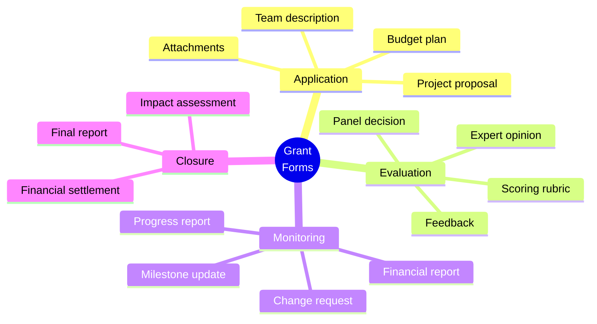

[← Back to Industries](index.md)

# Grant Systems

The grants area is excellently suited for FormFiller, where it can create significant value in complex forms, multi-step evaluation, monitoring, and reporting.

## Evaluation

| Metric | Value |
|--------|-------|
| **Current fit** | ★★★★☆ |
| **Development potential** | ★★★★★ |
| **Market size** | $5-15B |
| **Savings** | 80-95% |
| **Success** | High |

## Market Solutions

| Software | Type | Typical Price |
|----------|------|---------------|
| **Submittable** | Grant management | $10K-100K/year |
| **Fluxx** | Grant management | $25K-200K/year |
| **OpenGrants** | Grant platform | Variable |
| **Custom systems** | Government | $100K-10M |

## Form Types

## Key Areas

- **Grant submission, multi-page forms** - Complex conditional logic
- **Evaluation process, scoring** - Multi-evaluator workflows
- **Budget management** - Calculations, validations
- **Monitoring, reports** - Periodic data collection

## FormFiller Advantages

| Advantage | Description |
|-----------|-------------|
| **Complex forms** | Multi-page with dependencies |
| **Workflow engine** | Multi-step evaluation |
| **Gantt charts** | Project scheduling |
| **Cost efficiency** | 80-95% savings |

## When to Choose FormFiller?

| Scenario | Recommended? |
|----------|:-----------:|
| Grant applications | ✅ Yes |
| Evaluation workflows | ✅ Yes |
| Progress reports | ✅ Yes |
| Financial management | 🔶 Partial |
| Full ERP integration | ❌ No |

---

## Related Documentation

- [Industry Summary](./index.md)
- [Approval Workflow](../functions/approval-workflow.md)
