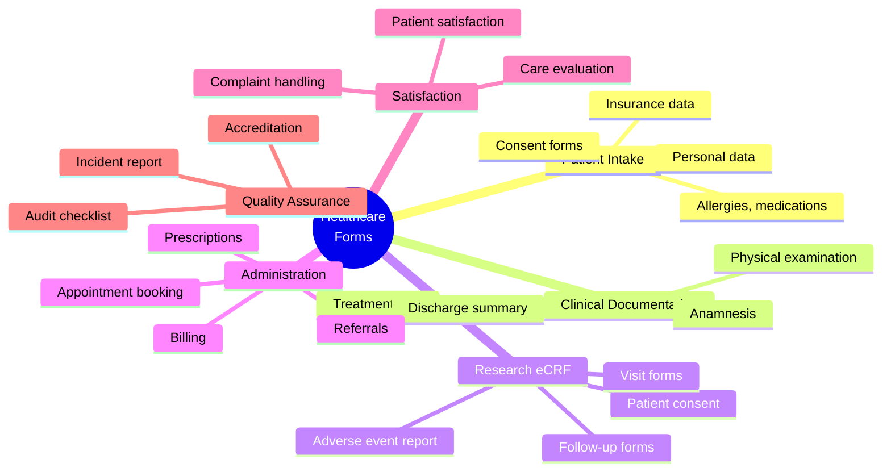
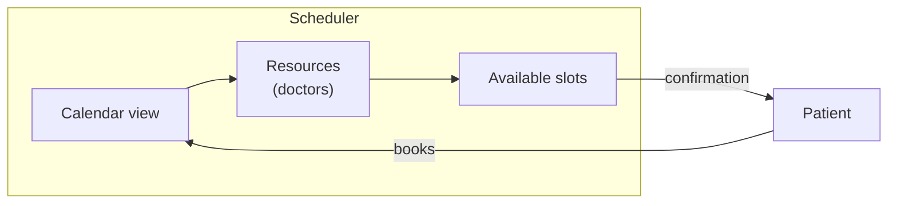
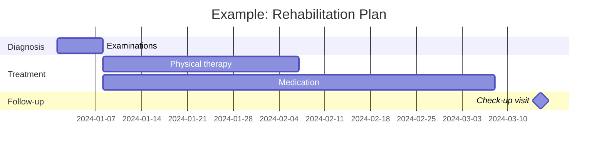
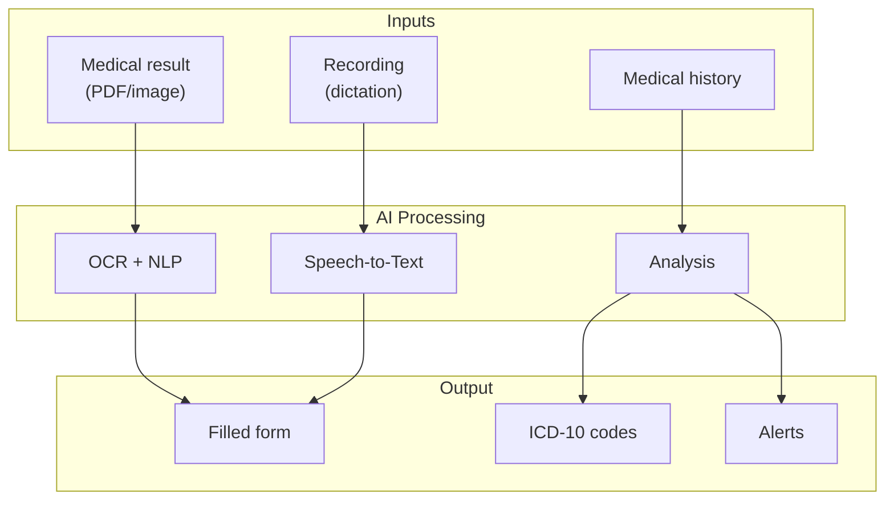
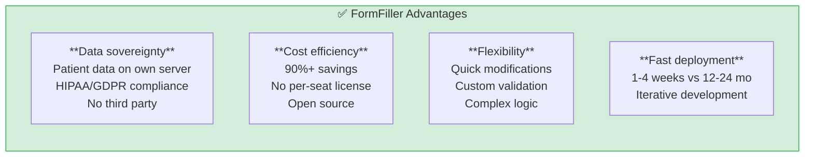
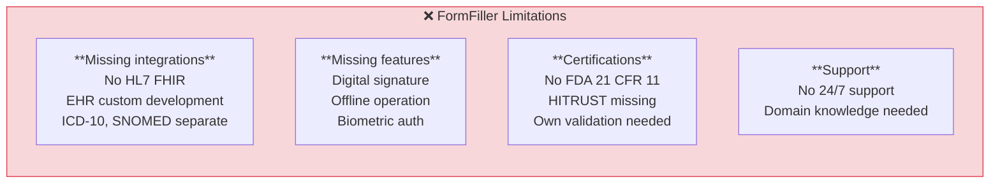

[← Back to Industries](index.md)

# Healthcare

The healthcare sector is one of the most regulated and complex industries where FormFiller architecture can offer significant advantages over traditional solutions.

## Table of Contents

1. [Industry Overview](#industry-overview)
2. [Typical Needs](#typical-needs)
3. [Extension Possibilities](#extension-possibilities)
4. [AI Integration](#ai-integration)
5. [FormFiller Mapping](#formfiller-mapping)
6. [Comparison Table](#comparison-table)
7. [Pros/Cons Analysis](#proscons-analysis)
8. [Extension Recommendations](#extension-recommendations)
9. [Business Evaluation](#business-evaluation)

---

## Industry Overview

### Market Size and Players

| Attribute | Value |
|-----------|-------|
| **Global market size** | $50-100B (healthcare IT) |
| **Annual growth** | 8-12% |
| **Key markets** | USA, EU, Asia |

### Traditional Solutions

| Software | Type | Market Share | Typical Price |
|----------|------|--------------|---------------|
| **Epic** | EHR/EMR | ~30% (US hospitals) | $500K - $50M |
| **Cerner** | EHR/EMR | ~25% (US) | $300K - $30M |
| **Meditech** | EHR/EMR | ~15% (smaller hospitals) | $100K - $5M |
| **Veeva** | Clinical research | Leader (pharma) | $50K - $500K/year |
| **REDCap** | Research data collection | Open source | Free |

### Regulatory Environment

- **HIPAA** (USA): Healthcare data protection
- **GDPR** (EU): Personal data protection
- **FDA 21 CFR Part 11**: Electronic signatures, audit trail
- **HITRUST**: Security framework

---

## Typical Needs

### Form Types



### Special Requirements

| Requirement | Description | FormFiller Support |
|-------------|-------------|-------------------|
| **Audit trail** | Logging all modifications | ✅ Built-in |
| **Digital signature** | Medical document authentication | 🔶 Planned |
| **HIPAA compliance** | Data protection compliance | ✅ Self-hosted |
| **Interoperability** | HL7 FHIR, DICOM integration | 🔶 With extension |
| **Offline operation** | Mobile devices without network | 🔶 Planned |
| **Multilingual** | Patient's native language | ✅ Built-in |

---

## Extension Possibilities

FormFiller provides particularly useful components for healthcare.

### Relevant Components

| Component | Healthcare Application | Advantage |
|-----------|------------------------|-----------|
| **Scheduler** | Medical appointment booking | Multi-doctor calendars, resource view |
| **Charts** | Vital signs visualization | Blood pressure, pulse trends |
| **Gantt** | Treatment plan scheduling | Therapy timeline view |
| **DataGrid** | Patient list, search | Filtering, sorting, export |
| **Form** | Anamnesis, patient intake | Complex conditional logic |
| **FileUploader** | Document upload | Results, images, PDF |
| **HtmlEditor** | Medical reports | Formatted text |

### Specific Use Cases

#### Appointment Booking System (Scheduler)



**Features:**
- Multiple doctor parallel calendars
- Office hours slot configuration
- Capacity management (e.g., max 20 patients/day)
- Drag & drop rescheduling
- Google/Outlook synchronization

#### Vital Monitoring Dashboard (Charts)

| Chart Type | Application |
|------------|-------------|
| **Line Chart** | Blood pressure, pulse trends |
| **Area Chart** | Weight changes |
| **Range Area** | Normal range indication |
| **Sparklines** | Table-embedded mini charts |

#### Treatment Plan (Gantt)



---

## AI Integration

The unified JSON schema architecture enables particularly effective AI integration in healthcare.

### AI Use Cases

| AI Function | Description | Expected Benefit |
|-------------|-------------|------------------|
| **Medical document OCR** | Result, prescription digitization | 70% data entry time savings |
| **Intelligent anamnesis** | Adapting questions based on answers | More accurate data collection |
| **ICD-10 code suggestion** | Code suggestion based on diagnosis | Faster coding |
| **Predictive filling** | Suggestions from previous data | 50% fill time reduction |
| **Anomaly detection** | Flagging outlier vital values | Early warning |
| **Natural language search** | "Show high blood pressure patients" | Quick queries |

### AI + Schema Synergy in Healthcare



### Example: AI-Assisted Patient Intake

| Step | AI Function | Result |
|------|-------------|--------|
| 1 | ID document OCR | Automatic personal data filling |
| 2 | Insurance card scan | Insurance data loading |
| 3 | Previous visit | Anamnesis pre-fill |
| 4 | Symptom analysis | Relevant question activation |
| 5 | Diagnosis suggestion | ICD-10 code recommendation |

### AI Benefits Summary

| Benefit | Traditional | AI-Assisted | Improvement |
|---------|-------------|-------------|-------------|
| Patient intake time | 15-20 min | 5-8 min | 60-70% |
| Data entry errors | 5-10% | 1-2% | 80% reduction |
| ICD coding time | 5 min/patient | 1 min/patient | 80% |
| Document search | 2-5 min | < 30 sec | 90% |

---

## FormFiller Mapping

### Currently Supported Features

| Feature | FormFiller Capability | Notes |
|---------|----------------------|-------|
| **Patient intake form** | ✅ Excellent | JSON schema based, conditional fields |
| **Consent form** | ✅ Good | With digital signature extension |
| **Anamnesis form** | ✅ Excellent | Complex logic, validation |
| **Satisfaction survey** | ★★★★★ | Native support |
| **Research data collection** | ✅ Good | Basic eCRF functions |
| **Incident report** | ✅ Excellent | Workflow support |

### Supported with Extension

| Feature | Required Extension | Complexity |
|---------|-------------------|------------|
| **HL7 FHIR integration** | API connector | Medium |
| **Digital signature** | E-sign plugin | Low |
| **ICD-10 code search** | Lookup integration | Low |
| **PDF generation** | Export module | Low |
| **Biometric authentication** | Auth plugin | High |

---

## Comparison Table

### FormFiller vs. Traditional Solutions

| Criterion | Epic | Veeva | REDCap | FormFiller |
|-----------|:----:|:-----:|:------:|:----------:|
| **Annual price** | $500K+ | $50K+ | Free | Free* |
| **Implementation** | 12-24 mo | 3-6 mo | 1-2 mo | 1-4 weeks |
| **Customization** | Limited | Medium | Good | Excellent |
| **Self-hosted** | No | No | Yes | Yes |
| **HIPAA ready** | Yes | Yes | Partial | Yes** |
| **Audit trail** | Yes | Yes | Yes | Yes |
| **Workflow** | Complex | Good | Basic | Good |
| **API** | Closed | Limited | Open | Open |
| **Offline** | No | No | No | Planned |

*Infrastructure cost: $200-500/month  
**Self-hosted, with proper configuration

### Functional Comparison

| Feature | Epic | Veeva | REDCap | FormFiller |
|---------|:----:|:-----:|:------:|:----------:|
| Patient intake | ★★★★★ | ★★☆☆☆ | ★★★☆☆ | ★★★★☆ |
| Clinical research | ★★★☆☆ | ★★★★★ | ★★★★★ | ★★★☆☆ |
| Satisfaction | ★★☆☆☆ | ★★★☆☆ | ★★★★☆ | ★★★★★ |
| Integration | ★★★★★ | ★★★★☆ | ★★★☆☆ | ★★★☆☆ |
| Cost/value | ★★☆☆☆ | ★★★☆☆ | ★★★★★ | ★★★★★ |

---

## Pros/Cons Analysis

### FormFiller Advantages



### FormFiller Limitations



### When to Choose FormFiller?

| Scenario | Recommended? | Reasoning |
|----------|:-----------:|-----------|
| Small clinic patient intake | ✅ Yes | Simple, cost-effective |
| Hospital EHR system | ❌ No | Complex integration required |
| Clinical research (non-FDA) | ✅ Yes | Flexible, customizable |
| FDA-regulated research | 🔶 Partial | Validation required |
| Patient satisfaction | ✅ Yes | Native support |
| Telemedicine intake | ✅ Yes | Fast, mobile-friendly |

---

## Extension Recommendations

### Priority Developments

| Development | Description | Complexity | Priority |
|-------------|-------------|:----------:|:--------:|
| **E-signature plugin** | DocuSign/HelloSign integration | Low | High |
| **HL7 FHIR connector** | Medical data exchange standard | Medium | High |
| **ICD-10 lookup** | Diagnosis code search | Low | Medium |
| **SNOMED CT** | Clinical terminology | Medium | Medium |
| **PDF export templates** | Medical document formats | Low | Medium |
| **Offline PWA** | Mobile offline operation | Medium | Medium |
| **Biometric auth** | Fingerprint, face | High | Low |

### Example: E-Signature Integration

```json
{
  "name": "patientConsent",
  "type": "group",
  "items": [
    {
      "name": "consentText",
      "type": "richtext",
      "readonly": true,
      "content": "I consent to the treatment..."
    },
    {
      "name": "signature",
      "type": "signature",
      "label": "Signature",
      "validationRules": [
        { "type": "required", "message": "Signature required" }
      ]
    },
    {
      "name": "signedAt",
      "type": "datetime",
      "readonly": true,
      "defaultValue": "{{now}}"
    }
  ]
}
```

---

## Business Evaluation

### Summary

| Metric | Value |
|--------|-------|
| **Current fit** | ★★★☆☆ |
| **Development potential** | ★★★★★ |
| **Market size (TAM)** | $50-100B |
| **Achievable savings** | 60-80% |
| **Market success chance** | High |

### ROI Estimate

| Scenario | Traditional Cost | FormFiller Cost | Savings |
|----------|----------------:|----------------:|--------:|
| Small clinic (10 doctors) | €20,000/year | €3,000/year | €17,000 (85%) |
| Medium clinic (50 doctors) | €100,000/year | €15,000/year | €85,000 (85%) |
| Research project | €50,000 | €10,000 | €40,000 (80%) |

### Target Market

| Segment | Potential | Priority |
|---------|:---------:|:--------:|
| Private clinics | High | 1 |
| Research institutes | High | 1 |
| Telemedicine | High | 2 |
| Hospitals (supplementary) | Medium | 3 |
| Pharma (non-FDA) | Medium | 3 |

---

## Related Documentation

- [Industry Summary](./index.md)
- [Finance/Insurance](./finance.md) - Similar compliance needs
- [Approval Workflow](../functions/approval-workflow.md)
- [Surveys](../functions/survey.md)
