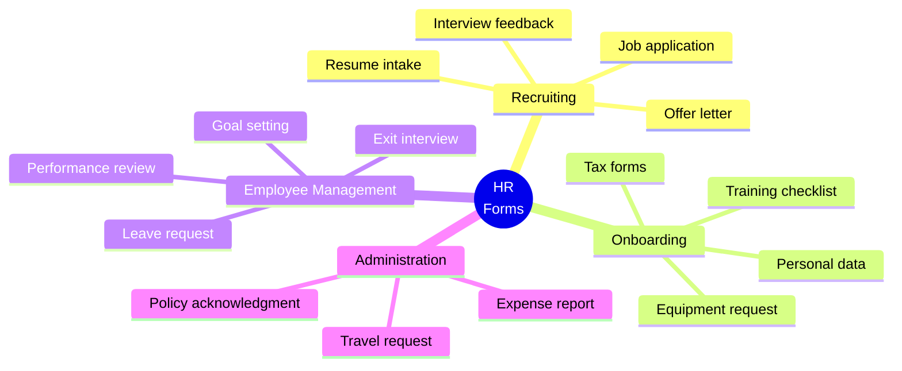

[← Back to Industries](index.md)

# HR and Recruiting

The HR and recruiting area is excellently suited for FormFiller, providing immediate value in onboarding, performance evaluation, leave management, and recruiting.

## Evaluation

| Metric | Value |
|--------|-------|
| **Current fit** | ★★★★★ |
| **Development potential** | ★★★★☆ |
| **Market size** | $15-30B |
| **Savings** | 70-85% |
| **Success** | High |

## Market Solutions

| Software | Type | Typical Price |
|----------|------|---------------|
| **Workday** | HCM | $100-300/employee/year |
| **BambooHR** | HRIS | $8-25/employee/month |
| **SAP SuccessFactors** | HCM | $80-200/employee/year |
| **Greenhouse** | ATS | $6,000-25,000/year |

## Form Types

## Key Areas

- **Job application, resume intake** - Multi-step with file uploads
- **Onboarding process** - Checklists, document collection
- **Performance evaluation** - Complex forms with scoring
- **Leave request, remote work** - Approval workflows

## FormFiller Advantages

| Advantage | Description |
|-----------|-------------|
| **Workflow engine** | Multi-step approvals |
| **Cost efficiency** | 70-85% savings |
| **Flexibility** | Custom evaluation forms |
| **Integration** | API for HRIS systems |

## When to Choose FormFiller?

| Scenario | Recommended? |
|----------|:-----------:|
| Leave/expense requests | ✅ Yes |
| Performance reviews | ✅ Yes |
| Onboarding forms | ✅ Yes |
| Full HRIS replacement | ❌ No |
| Job applications | ✅ Yes |

---

## Related Documentation

- [Industry Summary](./index.md)
- [Approval Workflow](../functions/approval-workflow.md)
