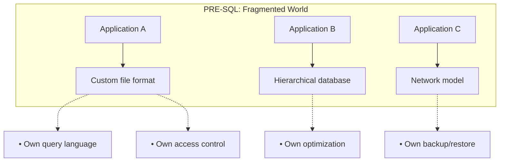
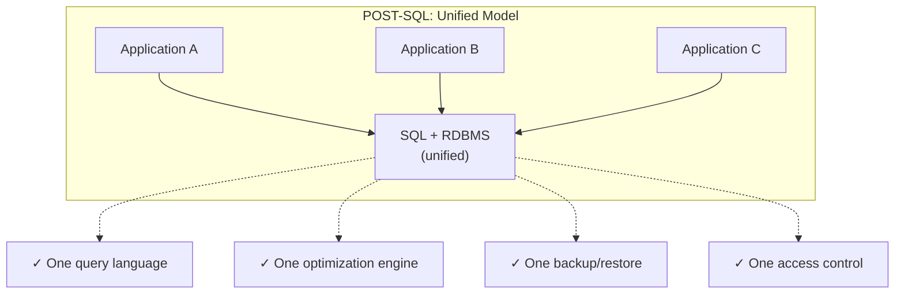
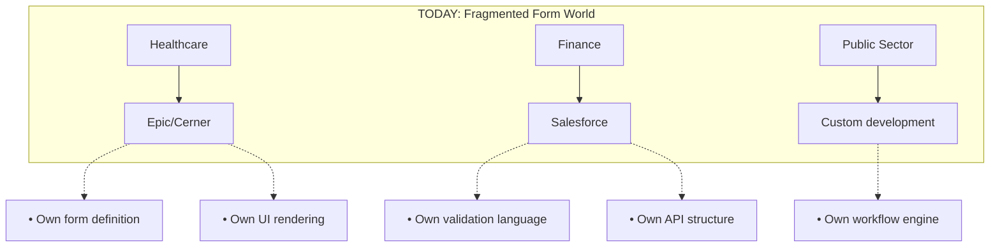
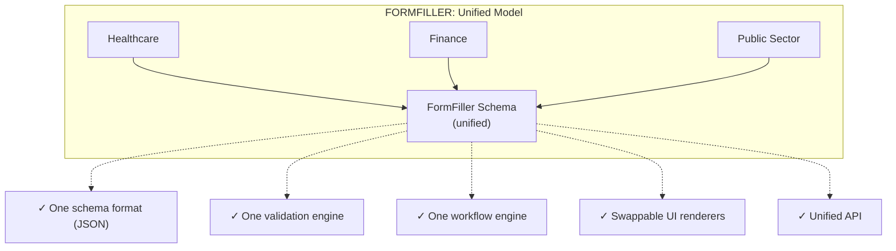
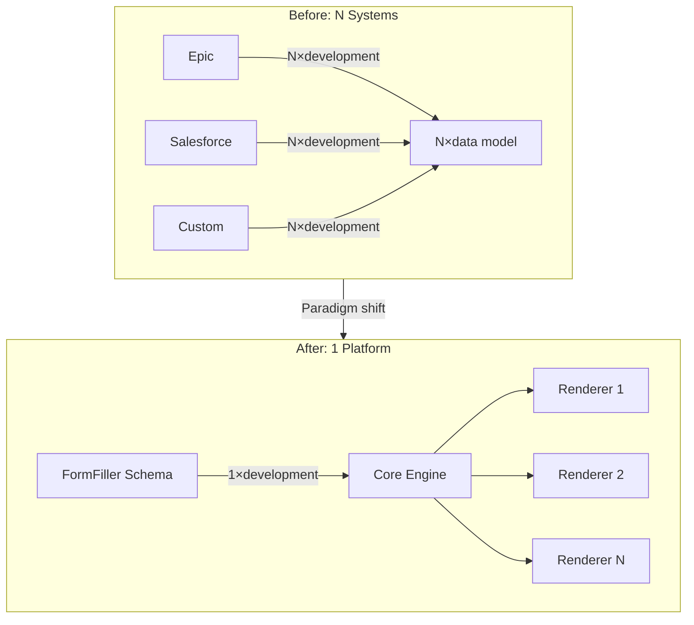

[← Back to Applicability Main Page](../index.md)

# Industry Applicability

This page summarizes the applicability of the FormFiller system across 18 different industries, with detailed analysis for key areas.

## Table of Contents

1. [Evaluation Methodology](#evaluation-methodology)
2. [Component and AI Capabilities](#component-and-ai-capabilities)
3. [Key Industries (with detailed analysis)](#key-industries)
4. [Additional Industries](#additional-industries)
5. [Summary Table](#summary-table)
6. [Analysis Findings](#analysis-findings)
7. [Historical Parallel: The SQL Moment](#historical-parallel-the-sql-moment)

---

## Evaluation Methodology

### Evaluation Criteria

| Criterion | Description |
|-----------|-------------|
| **Fit** | How suitable FormFiller is in its current state for industry needs |
| **Potential** | What development opportunities exist in the platform |
| **Market Size (TAM)** | Estimated global market value (Total Addressable Market) |
| **Savings** | Expected cost reduction compared to traditional solutions |
| **Success** | Probability of market success in the given industry |

### Star Rating

| Stars | Meaning |
|-------|---------|
| ★★★★★ | Excellent - Immediately applicable |
| ★★★★☆ | Very good - With minor customization |
| ★★★☆☆ | Good - With moderate development |
| ★★☆☆☆ | Moderate - Significant development needed |
| ★☆☆☆☆ | Low - Basic features missing |

---

## Component and AI Capabilities

FormFiller provides 80+ professional UI components for every industry. The unified JSON schema architecture enables particularly effective AI integration.

### Components by Industry

| Industry | Key Components | Main Application |
|----------|----------------|------------------|
| **Healthcare** | Scheduler, Charts, Gantt, Form | Appointments, vital monitoring, treatment plans |
| **Finance** | Charts, PivotGrid, Diagram, DataGrid | Dashboard, reports, workflow, transactions |
| **Public Sector** | Gantt, Diagram, TreeView, FileManager | Projects, processes, organization, documents |
| **Education** | Scheduler, Charts, DataGrid, HtmlEditor | Schedule, grades, students, assignments |
| **HR** | Scheduler, Gantt, Charts, DataGrid | Interviews, onboarding, performance, employees |
| **Telco** | Charts, TreeList, Diagram, DataGrid | Analytics, services, network, customers |
| **Grants** | Gantt, Charts, PivotGrid, TreeView | Scheduling, budget, monitoring, structure |
| **Manufacturing** | DataGrid, Charts, Gauges, Scheduler | Production data, KPI, status, maintenance |
| **Real Estate** | Gallery, DataGrid, Charts, Scheduler | Portfolio, tenants, analytics, appointments |
| **Construction** | Gantt, Charts, DataGrid, FileManager | Project scheduling, costs, reports, documents |

### AI Potential by Industry

| Industry | AI Function | Expected Benefit |
|----------|-------------|------------------|
| **Healthcare** | Medical document OCR, intelligent anamnesis, predictive filling | 40-60% administration reduction |
| **Finance** | KYC auto-validation, anomaly detection, document processing | 50-70% manual verification savings |
| **Public Sector** | Request classification, automatic routing, NL query | 60-80% case handling time reduction |
| **Education** | Automatic grading, plagiarism checking, adaptive questions | 70-90% grading time savings |
| **HR** | Resume analysis, interview scheduling, onboarding automation | 50-70% HR administration reduction |
| **Telco** | Predictive troubleshooting, chatbot support, churn prediction | 30-50% customer service cost reduction |
| **Grants** | Application pre-evaluation, budget validation, automatic summaries | 60-80% evaluation time savings |

---

## Key Industries

Detailed analysis has been prepared for the following industries on separate pages.

### Healthcare

**[Detailed analysis →](./healthcare.md)**

| Attribute | Value |
|-----------|-------|
| Fit | ★★★☆☆ |
| Potential | ★★★★★ |
| Market Size | $50-100B |
| Savings | 60-80% |
| Success | High |

**Key areas:**
- Patient intake forms, anamnesis
- Clinical research data collection (eCRF)
- Patient satisfaction surveys
- Medical reports, documentation

**Traditional solutions:** Epic, Cerner, Meditech, Veeva

---

### Finance/Insurance

**[Detailed analysis →](./finance.md)**

| Attribute | Value |
|-----------|-------|
| Fit | ★★★★☆ |
| Potential | ★★★★★ |
| Market Size | $80-150B |
| Savings | 50-70% |
| Success | High |

**Key areas:**
- KYC (Know Your Customer) forms
- Loan application, account opening
- Claims filing and processing
- Compliance and audit checklists

**Traditional solutions:** Salesforce FSC, Guidewire, Duck Creek

---

### Public Sector

**[Detailed analysis →](./public-sector.md)**

| Attribute | Value |
|-----------|-------|
| Fit | ★★★★☆ |
| Potential | ★★★★★ |
| Market Size | $30-60B |
| Savings | 70-90% |
| Success | High |

**Key areas:**
- E-government, citizen applications
- Permit processes
- Tax filing, subsidy applications
- Internal administration

**Traditional solutions:** SAP Public Sector, Oracle, custom development

---

### Education

**[Detailed analysis →](./education.md)**

| Attribute | Value |
|-----------|-------|
| Fit | ★★★★★ |
| Potential | ★★★★☆ |
| Market Size | $10-25B |
| Savings | 80-95% |
| Success | High |

**Key areas:**
- Enrollment, applications
- Exams, papers, quizzes
- Assignment, project evaluation
- Course evaluation, feedback

**Traditional solutions:** Canvas, Blackboard, Moodle, Google Classroom

---

### HR/Recruiting

**[Detailed analysis →](./hr.md)**

| Attribute | Value |
|-----------|-------|
| Fit | ★★★★★ |
| Potential | ★★★★☆ |
| Market Size | $15-30B |
| Savings | 70-85% |
| Success | High |

**Key areas:**
- Job application, resume intake
- Onboarding process
- Performance evaluation
- Leave request, remote work application

**Traditional solutions:** Workday, BambooHR, SAP SuccessFactors

---

### Telecommunications

**[Detailed analysis →](./telco.md)**

| Attribute | Value |
|-----------|-------|
| Fit | ★★★☆☆ |
| Potential | ★★★★★ |
| Market Size | $40-80B |
| Savings | 50-70% |
| Success | Medium |

**Key areas:**
- Service configuration, tariff selection
- Customer portal, contract modification
- Trouble ticket, technician work orders
- SIM/eSIM activation

**Traditional solutions:** Amdocs, Comarch BSS, Netcracker

---

### Grant Systems

**[Detailed analysis →](./grants.md)**

| Attribute | Value |
|-----------|-------|
| Fit | ★★★★☆ |
| Potential | ★★★★★ |
| Market Size | $5-15B |
| Savings | 80-95% |
| Success | High |

**Key areas:**
- Grant submission, multi-page forms
- Evaluation process, scoring
- Budget management
- Monitoring, reports

**Traditional solutions:** Submittable, Fluxx, OpenGrants

---

## Additional Industries

Summary analysis has been prepared for the following industries.

### Manufacturing

| Attribute | Value |
|-----------|-------|
| Fit | ★★★☆☆ |
| Potential | ★★★★☆ |
| Market Size | $40-70B |
| Savings | 50-70% |
| Success | Medium |

**Application areas:**
- Quality control checklists
- Equipment maintenance reports
- Safety documentation
- Supplier qualification

**Traditional solutions:** SAP Manufacturing, Oracle, Siemens

**FormFiller advantages:**
- Offline support (planned)
- Mobile-first forms
- Easy integration with existing ERP

**Required extensions:**
- Barcode/QR reader integration
- Offline synchronization
- ERP connectors (SAP, Oracle)

---

### Retail/E-commerce

| Attribute | Value |
|-----------|-------|
| Fit | ★★☆☆☆ |
| Potential | ★★★☆☆ |
| Market Size | $25-50B |
| Savings | 40-60% |
| Success | Medium |

**Application areas:**
- Customer registration, loyalty program
- Product configuration (custom products)
- Returns, complaints handling
- Supplier forms

**Traditional solutions:** Shopify, Magento, WooCommerce

**FormFiller advantages:**
- Custom product configuration
- Complex returns workflow
- B2B partner portal

**Limitations:**
- Does not replace webshop features
- Payment integration required

---

### Logistics

| Attribute | Value |
|-----------|-------|
| Fit | ★★★☆☆ |
| Potential | ★★★★☆ |
| Market Size | $20-40B |
| Savings | 50-70% |
| Success | Medium |

**Application areas:**
- Bill of lading, CMR documents
- Loading checklists
- Driver reports
- Customs forms

**Traditional solutions:** SAP TM, Oracle TMS, Transporeon

**FormFiller advantages:**
- Mobile forms for drivers
- Digital signature capability
- Real-time data collection

---

### Real Estate

| Attribute | Value |
|-----------|-------|
| Fit | ★★★★☆ |
| Potential | ★★★★☆ |
| Market Size | $10-20B |
| Savings | 60-80% |
| Success | Medium |

**Application areas:**
- Lease agreement, needs assessment
- Property condition assessment
- Maintenance requests
- Customer registration, inquiries

**Traditional solutions:** Yardi, AppFolio, Propertyware

**FormFiller advantages:**
- Complex condition assessment forms
- Photo attachment capability
- Tenant portal

---

### Non-profit

| Attribute | Value |
|-----------|-------|
| Fit | ★★★★★ |
| Potential | ★★★★☆ |
| Market Size | $5-10B |
| Savings | 80-95% |
| Success | High |

**Application areas:**
- Donor registration
- Volunteer application
- Program enrollment
- Impact measurement, reports

**Traditional solutions:** Blackbaud, Salesforce NPSP, Bloomerang

**FormFiller advantages:**
- Free (open source) - cost-sensitive sector
- Easy customization
- GDPR compliance

---

### Legal Sector

| Attribute | Value |
|-----------|-------|
| Fit | ★★★★☆ |
| Potential | ★★★★☆ |
| Market Size | $10-20B |
| Savings | 60-80% |
| Success | Medium |

**Application areas:**
- Client intake form
- Case documentation
- Checklists (due diligence)
- Time tracking

**Traditional solutions:** Clio, PracticePanther, MyCase

**FormFiller advantages:**
- Confidential data on own server
- Complex conditional logic
- Audit trail

---

### Construction

| Attribute | Value |
|-----------|-------|
| Fit | ★★★☆☆ |
| Potential | ★★★★☆ |
| Market Size | $15-30B |
| Savings | 50-70% |
| Success | Medium |

**Application areas:**
- Safety checklists
- Daily reports, progress logs
- Material orders
- Subcontractor qualification

**Traditional solutions:** Procore, Buildertrend, PlanGrid

**FormFiller advantages:**
- Mobile forms on-site
- Photo documentation
- Offline support (planned)

---

### Energy/Utilities

| Attribute | Value |
|-----------|-------|
| Fit | ★★★☆☆ |
| Potential | ★★★★☆ |
| Market Size | $20-40B |
| Savings | 50-70% |
| Success | Medium |

**Application areas:**
- Meter reading
- Trouble tickets, field service
- Contract signing, tariff changes
- Regulatory reports

**Traditional solutions:** SAP Utilities, Oracle Utilities, Itron

**FormFiller advantages:**
- Mobile field service forms
- Customer self-service portal
- Workflow automation

---

### Agriculture

| Attribute | Value |
|-----------|-------|
| Fit | ★★★☆☆ |
| Potential | ★★★★☆ |
| Market Size | $8-15B |
| Savings | 60-80% |
| Success | Medium |

**Application areas:**
- Farm logs
- Crop protection reports
- Subsidy applications
- Quality assurance, traceability

**Traditional solutions:** Trimble, Climate Corp, Granular

**FormFiller advantages:**
- Simple, customizable forms
- EU subsidy formats
- Offline operation (planned)

---

### Tourism/Hospitality

| Attribute | Value |
|-----------|-------|
| Fit | ★★★★☆ |
| Potential | ★★★★☆ |
| Market Size | $10-20B |
| Savings | 60-80% |
| Success | Medium |

**Application areas:**
- Booking forms
- Guest registration, check-in
- Restaurant orders, menu configuration
- Guest satisfaction surveys

**Traditional solutions:** Opera, Cloudbeds, Mews

**FormFiller advantages:**
- Multi-language support
- Mobile-friendly forms
- Easy integration

---

### Sports/Events

| Attribute | Value |
|-----------|-------|
| Fit | ★★★★☆ |
| Potential | ★★★★☆ |
| Market Size | $5-10B |
| Savings | 70-85% |
| Success | Medium |

**Application areas:**
- Event registration
- Application forms (competition, camp)
- Health declaration
- Volunteer coordination

**Traditional solutions:** Eventbrite, Bizzabo, Cvent

**FormFiller advantages:**
- Complex registration logic
- Group applications
- Payment integration capability

---

## Summary Table

| Industry | Fit | Potential | Market Size | Savings | Components | AI Potential | Details |
|----------|:---:|:---------:|------------:|:-------:|:----------:|:------------:|:-------:|
| **Healthcare** | ★★★☆☆ | ★★★★★ | $50-100B | 60-80% | Scheduler, Charts | High | [Link](./healthcare.md) |
| **Finance/Insurance** | ★★★★☆ | ★★★★★ | $80-150B | 50-70% | PivotGrid, Diagram | High | [Link](./finance.md) |
| **Public Sector** | ★★★★☆ | ★★★★★ | $30-60B | 70-90% | Gantt, TreeView | High | [Link](./public-sector.md) |
| **Education** | ★★★★★ | ★★★★☆ | $10-25B | 80-95% | Scheduler, Charts | High | [Link](./education.md) |
| **HR/Recruiting** | ★★★★★ | ★★★★☆ | $15-30B | 70-85% | Gantt, Scheduler | High | [Link](./hr.md) |
| **Telecommunications** | ★★★☆☆ | ★★★★★ | $40-80B | 50-70% | TreeList, Charts | Medium | [Link](./telco.md) |
| **Grant Systems** | ★★★★☆ | ★★★★★ | $5-15B | 80-95% | Gantt, PivotGrid | High | [Link](./grants.md) |
| Manufacturing | ★★★☆☆ | ★★★★☆ | $40-70B | 50-70% | Gauges, DataGrid | Medium | - |
| Retail/E-commerce | ★★☆☆☆ | ★★★☆☆ | $25-50B | 40-60% | DataGrid, Gallery | Low | - |
| Logistics | ★★★☆☆ | ★★★★☆ | $20-40B | 50-70% | VectorMap, Gantt | Medium | - |
| Real Estate | ★★★★☆ | ★★★★☆ | $10-20B | 60-80% | Gallery, Scheduler | Medium | - |
| Non-profit | ★★★★★ | ★★★★☆ | $5-10B | 80-95% | Charts, Form | Medium | - |
| Legal Sector | ★★★★☆ | ★★★★☆ | $10-20B | 60-80% | DataGrid, FileManager | High | - |
| Construction | ★★★☆☆ | ★★★★☆ | $15-30B | 50-70% | Gantt, Gallery | Medium | - |
| Energy/Utilities | ★★★☆☆ | ★★★★☆ | $20-40B | 50-70% | Gauges, VectorMap | Medium | - |
| Agriculture | ★★★☆☆ | ★★★★☆ | $8-15B | 60-80% | VectorMap, Charts | Medium | - |
| Tourism/Hospitality | ★★★★☆ | ★★★★☆ | $10-20B | 60-80% | Scheduler, Gallery | Medium | - |
| Sports/Events | ★★★★☆ | ★★★★☆ | $5-10B | 70-85% | Scheduler, DataGrid | Medium | - |

---

## Analysis Findings

### Summary Observations

The industry analysis revealed three fundamental findings:

**1. Universal Applicability**

The FormFiller architecture is not a tool optimized for a single vertical, but a **horizontal platform** that is meaningfully applicable in 16 out of 18 analyzed industries (★★★☆☆ or better). This is not coincidental: every industry fundamentally solves the same problems - data collection, validation, workflow, reporting - just in different domain languages.

**2. Inverted Cost-Complexity Ratio**

With traditional solutions, cost grows exponentially with complexity. With FormFiller, this curve is **flat**: a simple form and a 50-field, 15-validation-rule complex workflow **require the same infrastructure**. The only difference is the JSON schema size.

**3. AI-Native Architecture Advantage**

The unified JSON schema representation is not just technical elegance - it enables AI integration to **work identically across all industries**. No industry-specific AI models are needed: the same generation, validation, and auto-fill engine works from healthcare anamnesis to grant applications.

### In Numbers

| Metric | Value |
|--------|-------|
| Industries analyzed | 18 |
| Immediately applicable (★★★★☆+) | 12 (67%) |
| Total market size (TAM) | $400-850B |
| Average savings | 60-80% |
| High AI potential | 10 industries (56%) |

---

## Historical Parallel: The SQL Moment

### The Problem Then and Now

To understand the significance of FormFiller architecture, it's worth looking back at one of the largest paradigm shifts in IT history.

**Before the 1970s**, every application used its own unique data storage solution:

Every new application required reimplementing every aspect of data management.

**SQL and the relational model** eliminated this fragmentation with a single, universal abstraction:

### The FormFiller Parallel

**2020s** - The world of forms and workflows is exactly where databases were before SQL:

**FormFiller architecture** performs the same unification in the form world:

### Why Did SQL Work?

SQL's success wasn't in its syntax, but in finding the **right abstraction level**:

| Property | SQL/Relational model | FormFiller Schema |
|----------|---------------------|-------------------|
| **Declarative** | WHAT I want, not HOW | WHAT I collect, not HOW I render |
| **Implementation-independent** | Any RDBMS can interpret | Any renderer can display |
| **Mathematically grounded** | Relational algebra | JSON Schema + validation rules |
| **Extensible** | Stored procedures, triggers | Custom components, workflow steps |
| **Optimizable** | Query optimizer | Conditional rendering, lazy loading |

### The AI Dimension: What SQL Couldn't Do

There is, however, a critical difference that potentially makes FormFiller architecture even more significant:

**In the SQL era, databases were passive stores** - intelligence lived in the application.

**In the FormFiller era, AI can be an active partner** - the unified schema enables:

| AI Capability | In SQL World | In FormFiller World |
|---------------|--------------|---------------------|
| **Generation** | ❌ Not interpreted | ✅ Schema generation from natural language |
| **Validation** | ⚠️ Constraints, but not contextual | ✅ Semantic validation, anomaly detection |
| **Filling** | ❌ Not interpreted | ✅ Auto-complete, predictive input |
| **Analysis** | ⚠️ OLAP, but manual setup | ✅ Automatic pattern recognition |

### Repeating the "Database Moment"

SQL didn't win overnight - it took decades for hierarchical and network models to disappear. But the transition was inevitable because SQL **radically reduced complexity** without sacrificing expressiveness.

FormFiller architecture aims for the same balance:

### Conclusion

FormFiller is not "yet another form builder". It is **structural innovation** that can fill the same role in the world of form-based data collection and workflow management as SQL/RDBMS did in data storage.

The difference: while SQL needed decades to spread, FormFiller arrives in the AI era, where unified, machine-interpretable representation provides **immediate, exponential advantages**.

> *"SQL didn't win because it was better than all alternatives in every way. It won because it was good enough for enough things, and radically simplified the ecosystem."*
> 
> FormFiller follows the same path - but in the AI era, this path may be shorter.

---

## Related Documentation

- [Applicability Main Page](../index.md) - Comprehensive summary
- [Functional Analysis](../functions/index.md) - Function-based evaluation
- [Extension Possibilities](../extensions.md) - Development directions
