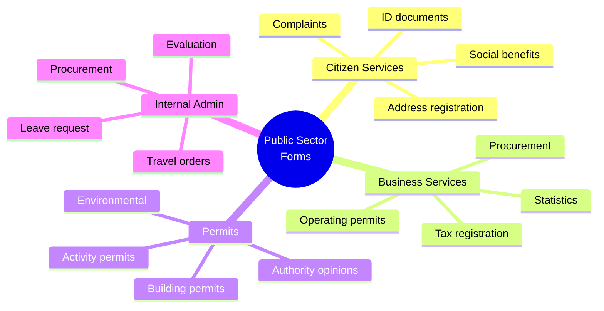

[← Back to Industries](index.md)

# Public Sector

The public sector is a key area for FormFiller, where it can create significant value in e-government, digital case management, and internal administration.

## Evaluation

| Metric | Value |
|--------|-------|
| **Current fit** | ★★★★☆ |
| **Development potential** | ★★★★★ |
| **Market size** | $30-60B |
| **Savings** | 70-90% |
| **Success** | High |

## Market Solutions

| Software | Type | Typical Price |
|----------|------|---------------|
| **SAP Public Sector** | ERP + Forms | $1M - $50M |
| **Oracle** | ERP + E-Gov | $500K - $20M |
| **Microsoft Dynamics** | CRM + ERP | $100K - $5M |
| **Custom development** | Tailored | $100K - $10M |

## Form Types

## Key Areas

- **E-government, citizen applications** - Digital case management
- **Permit processes** - Multi-step approvals
- **Tax filing, subsidy applications** - Complex forms with validation
- **Internal administration** - HR, procurement, compliance

## FormFiller Advantages

| Advantage | Description |
|-----------|-------------|
| **Data sovereignty** | Citizen data on own servers |
| **Cost efficiency** | 70-90% savings vs commercial |
| **Transparency** | Open source, auditable |
| **Flexibility** | Quick adaptation to regulations |

## When to Choose FormFiller?

| Scenario | Recommended? |
|----------|:-----------:|
| Citizen portal forms | ✅ Yes |
| Internal HR/admin | ✅ Yes |
| Permit applications | ✅ Yes |
| Complex ERP replacement | ❌ No |
| Document management | 🔶 Partial |

---

## Related Documentation

- [Industry Summary](./index.md)
- [Approval Workflow](../functions/approval-workflow.md)
