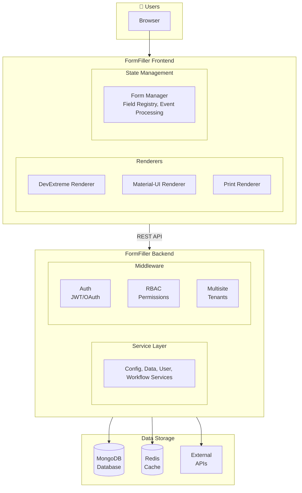
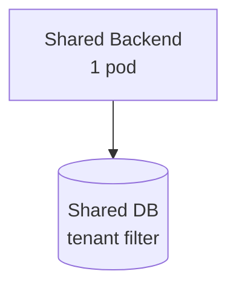
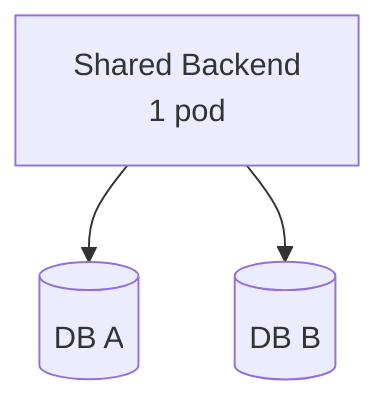
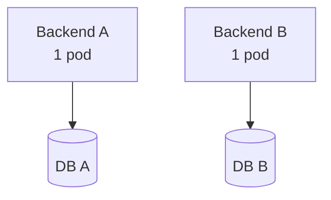
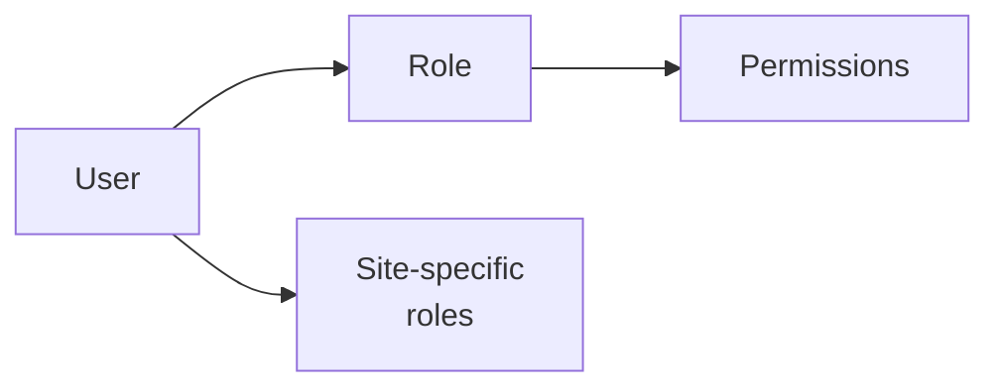

# FormFiller Architecture

## System Overview

FormFiller is a modular, multisite-capable form management system. The following diagram shows the relationship between the main components:



## Components

### Frontend

The frontend is React and TypeScript based, using DevExtreme UI components.

**Main modules:**
- **Renderers**: Form rendering engines (DevExtreme, MUI, Print)
- **Form Manager**: Central state manager for forms
- **Event Handler Registry**: Event handler registration and execution
- **Field Update Services**: Field update logic

**Directory structure:**
```
src/
├── components/      # React components
│   ├── form/       # Form components
│   └── views/      # View components (Grid, Tree)
├── services/       # Business logic and API calls
├── factories/      # Renderer factories
├── managers/       # State managers
├── eventHandlers/  # Event handlers
└── contexts/       # React contexts
```

### Backend

The backend is Node.js and TypeScript based, with Express framework.

**Main modules:**
- **Service Layer**: Business logic (Config, Data, User, Workflow)
- **Middleware**: Auth, RBAC, Multisite, Validation
- **Models**: Mongoose models for MongoDB

**Directory structure:**
```
src/
├── config/        # Configuration files
├── middleware/    # Express middlewares
├── models/        # Mongoose models
├── services/      # Business logic
├── routes/        # API routes
├── types/         # TypeScript types
└── utils/         # Utility functions
```

### Schema

Shared type definitions and validation logic between frontend and backend.

**Main components:**
- **FieldConfig**: Field type definitions
- **ItemConfig**: View configurations
- **ValidationRule**: Validation rules
- **SchemaValidator**: Validation engine

### Validator

Advanced validation system with support for nested structures and conditional rules.

**Features:**
- Parallel validation execution
- Dependency graph-based processing
- Caching
- External API integration

## Data Flow

### Form Loading

```
1. Frontend requests configuration (GET /api/config/:configId)
2. Backend returns the JSON schema
3. Frontend Form Manager processes the schema
4. Appropriate Renderer renders the form
5. If there's a record, load the data (GET /api/data/:configId/:recordId)
```

### Form Saving

```
1. User fills out the form
2. Form Manager collects field values
3. Validator validates the data
4. Frontend sends the data (POST/PUT /api/data/:configId)
5. Backend validates and saves to MongoDB
```

### Event Handling

```
1. Field value changes
2. Form Manager triggers the event
3. Event Handler Registry finds the handlers
4. Handlers execute (setValue, calculate, validate, etc.)
5. Affected fields update
```

## Multisite Architecture

The system supports three deployment modes:

### 1. Shared Backend - Shared DB



- Single backend and database
- Tenant filtering in every query
- Simplest and most cost-effective

### 2. Shared Backend - Isolated DB



- Single backend
- Separate database per tenant
- Better data isolation

### 3. Isolated Backend



- Separate backend and database per tenant
- Complete isolation
- Independent scaling

## Security

### Authentication

- **JWT Token**: Authentication for API calls
- **OAuth 2.0**: Google login support
- **Token Blacklist**: Logout and token revocation

### Access Control (RBAC)



**Built-in roles:**
- admin, manager, owner, editor, contributor, creator, viewer

### Multisite Security

- Tenant isolation at all levels
- Site-specific permissions
- Cross-tenant access blocking

## Performance

### Frontend Optimizations

- Lazy loading components
- Memoization (useMemo, useCallback)
- Virtual scrolling for large lists
- Code splitting

### Backend Optimizations

- Redis cache
- MongoDB indexes
- Lean queries
- Response compression (gzip)

### Validation Optimizations

- Schema caching
- Parallel validation
- Incremental validation

## Technology Stack

| Layer | Technology |
|-------|------------|
| Frontend | React 19, TypeScript, DevExtreme, Vite |
| Backend | Node.js 18+, Express, TypeScript |
| Database | MongoDB 4.4+ |
| Cache | Redis (optional) |
| Containerization | Docker |
| Orchestration | Kubernetes, Helm |
| CI/CD | GitHub Actions |

