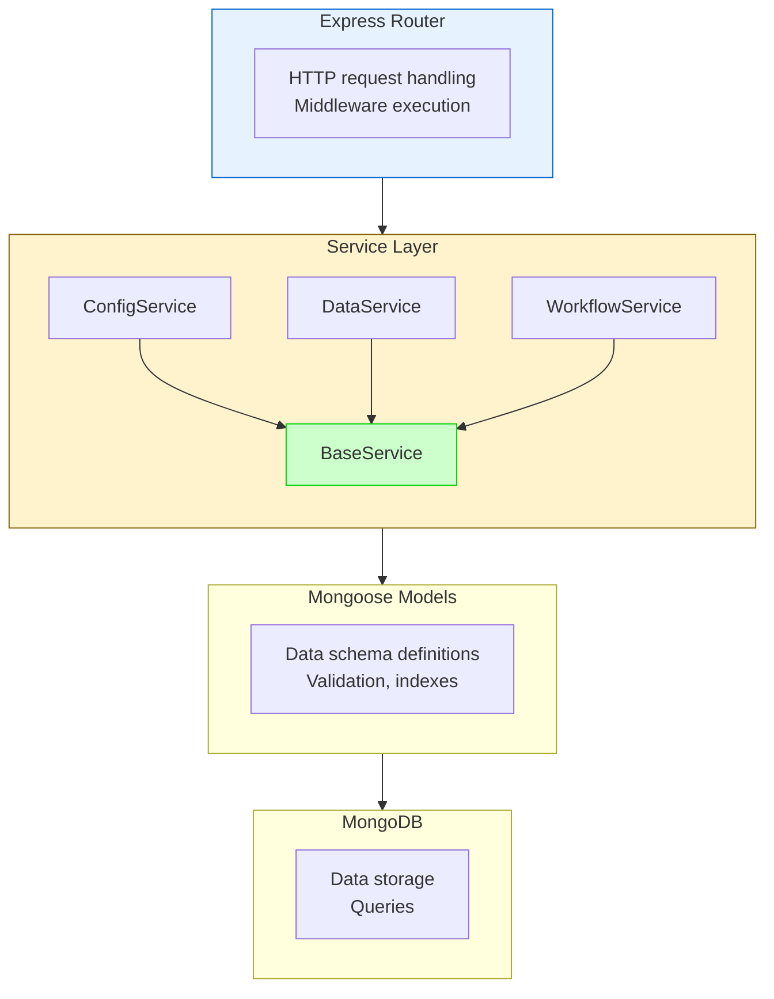
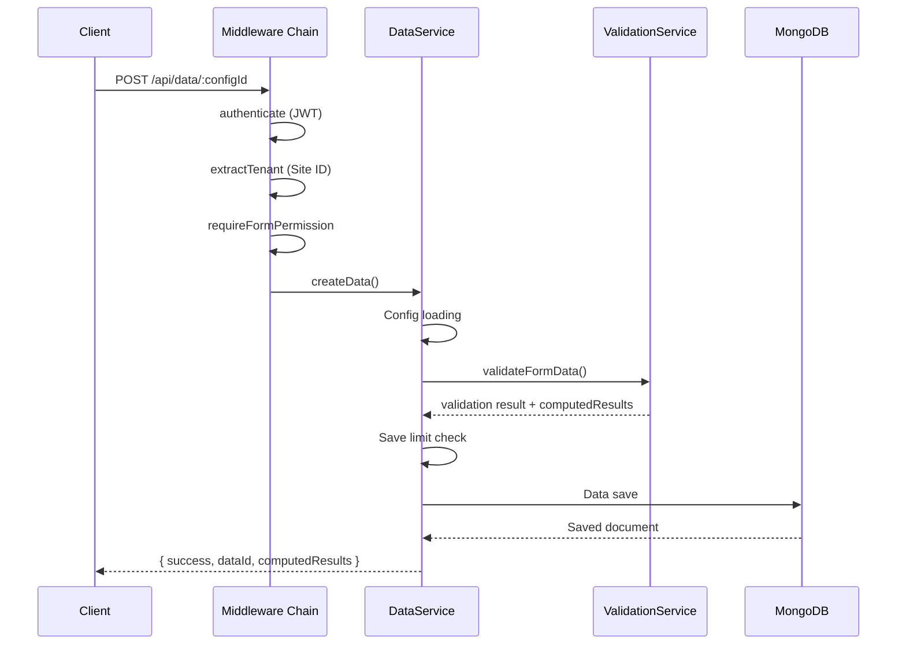
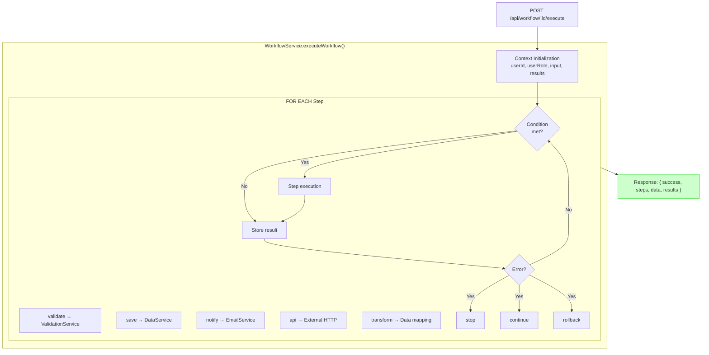
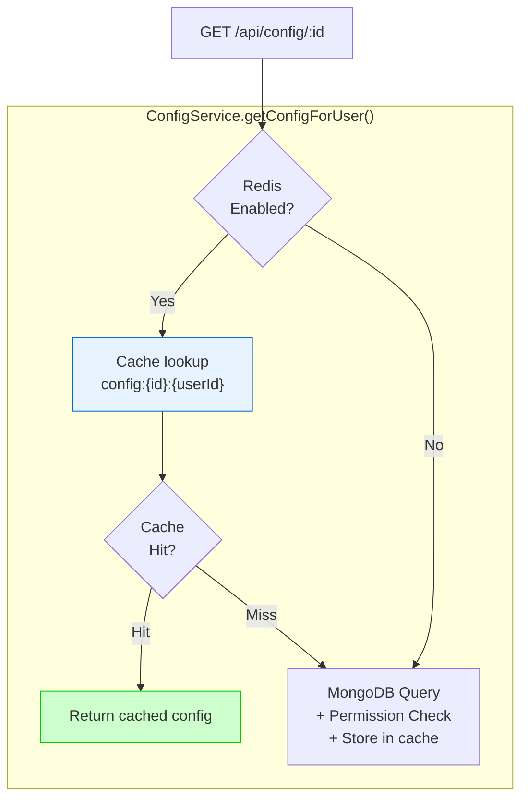

# Backend Development

## Overview

The FormFiller backend is a Node.js and TypeScript based server application built on the Express framework. The backend is responsible for managing form configurations, validating and storing data, executing workflows, and managing user permissions.

## Architecture Advantages

### Service-Based Structure



### Main Advantages

| Advantage | Description |
|-----------|-------------|
| **Modularity** | Each function in separate service, easy maintenance and testing |
| **BaseService inheritance** | Common CRUD operations implemented once, all services inherit |
| **Type safety** | TypeScript types throughout the application |
| **Middleware chain** | Authentication, authorization, validation in middlewares |
| **Centralized error handling** | AppError class for uniform error format |
| **Scalability** | Stateless design, horizontally scalable |

### BaseService - Common Base Operations

Every domain-specific service inherits from the `BaseService` class:

```typescript
export abstract class BaseService<T extends Document> {
  constructor(protected model: Model<T>) {}

  async findById(id: string): Promise<T | null>
  async findOne(query: any): Promise<T | null>
  async findAll(query: any = {}): Promise<T[]>
  async create(data: Partial<T>): Promise<T>
  async update(id: string, data: Partial<T>): Promise<T | null>
  async delete(id: string): Promise<T | null>
  async count(query: any = {}): Promise<number>
  async exists(query: any): Promise<boolean>
}
```

This ensures:
- **DRY principle** - No need to reimplement CRUD operations in every service
- **Consistency** - All services work the same way for basic operations
- **Extensibility** - Easy to add domain-specific methods

## Project Structure

```
src/
├── config/              # Environment and application configuration
│   ├── env.ts          # Environment variable validation
│   ├── auth.ts         # JWT and authentication settings
│   └── i18n.ts         # Internationalization configuration
│
├── middleware/          # Express middlewares
│   ├── auth.ts         # JWT token verification
│   ├── rbac.ts         # Role-based access control
│   ├── multisite.ts    # Multi-tenant system tenant handling
│   ├── rateLimiter.ts  # Rate limiting
│   └── errorHandler.ts # Centralized error handling
│
├── models/              # Mongoose data models
│   ├── User.ts         # Users
│   ├── Config.ts       # Form configurations
│   ├── Data.ts         # Submitted data
│   ├── Workflow.ts     # Workflow definitions
│   ├── FormRole.ts     # Form-level roles
│   ├── FormPermission.ts # Form permissions
│   └── Site.ts         # Multisite tenants
│
├── services/            # Business logic layer
│   ├── BaseService.ts       # Common CRUD operations
│   ├── UserService.ts       # User management
│   ├── ConfigService.ts     # Configuration management
│   ├── DataService.ts       # Data handling and validation
│   ├── WorkflowService.ts   # Workflow execution
│   ├── ValidationService.ts # Validation integration
│   ├── RoleService.ts       # Role management
│   ├── PermissionService.ts # Permission management
│   └── EmailService.ts      # Email sending
│
├── routes/              # API endpoints
│   ├── auth.ts         # /api/auth/*
│   ├── users.ts        # /api/users/*
│   ├── config.ts       # /api/config/*
│   ├── data.ts         # /api/data/*
│   ├── workflow.ts     # /api/workflow/*
│   ├── roles.ts        # /api/roles/*
│   └── permissions.ts  # /api/permissions/*
│
├── types/               # TypeScript type definitions
│   └── express.d.ts    # Express request extension
│
└── utils/               # Utility functions
    ├── logger.ts       # Winston logger
    ├── cache.ts        # Redis cache handling
    ├── errors.ts       # Custom error classes
    └── configValidator.ts # Schema validation
```

## Call Chains

### 1. Form Save Process



### 2. Workflow Execution Process



### 3. Cached Config Retrieval Process



## Workflow Management Overview

The workflow system enables declarative definition and automatic execution of complex business processes.

### Supported Step Types

| Type | Description | Usage |
|------|-------------|-------|
| `validate` | Form data validation | Schema and rule checking |
| `save` | Save data to database | DataService.createData() call |
| `notify` | Send email notification | EmailService integration |
| `api` | External API call | Webhook, integration |
| `transform` | Data transformation | Mapping, formatting |
| `conditional` | Conditional branching | Based on business logic |

### Error Handling Strategies

- **stop**: Workflow stops on error
- **continue**: Continues to next step on error
- **rollback**: Rollback on error (limited support)

Detailed workflow documentation: [features/workflow.md](./features/workflow.md)

## Cache and Performance

### Redis Cache

If enabled (`REDIS_ENABLED=true`), the system caches:

```typescript
// Cache prefixes and TTLs
const CachePrefix = {
  CONFIG: 'config:',           // Form configurations
  USER: 'user:',               // User data
  PERMISSION: 'permission:',   // Permissions
};

const CacheTTL = {
  CONFIG: 300,      // 5 minutes
  USER: 600,        // 10 minutes
  PERMISSION: 120,  // 2 minutes
};
```

### Optimized Queries

```typescript
// Load only necessary fields
const config = await Config.findById(configId)
  .select('preferences siteId')  // Only what's needed
  .lean();                       // Plain JS object (faster)

// Index usage
configSchema.index({ createdBy: 1, isActive: 1 });
configSchema.index({ siteId: 1, type: 1 });
```

### Performance Tips

1. **Lean queries**: Use `.lean()` when Mongoose document is not needed
2. **Projection**: Retrieve only necessary fields with `.select()`
3. **Indexes**: Define indexes for frequently filtered fields
4. **Batch operations**: Use `insertMany()`, `bulkWrite()`
5. **Connection pooling**: Mongoose default pool handling

## Middlewares

### Authentication

```typescript
import { authenticate } from './middleware/auth';

router.get('/protected', authenticate, (req, res) => {
  // req.user available (userId, role, email)
});
```

### Access Control

```typescript
import { checkPermission } from './middleware/rbac';

router.post('/admin', 
  authenticate,
  checkPermission('configs', 'create'),
  (req, res) => {
    // Admin operation
  }
);
```

### Form-Level Permission

```typescript
import { requireFormPermission } from './middleware/formPermission';

router.post('/data/:configId',
  authenticate,
  requireFormPermission('createResults'),
  async (req, res) => {
    // Has permission for form
  }
);
```

### Multisite

```typescript
import { extractTenant } from './middleware/multisite';

// Automatically sets req.tenantId based on Host header
router.use(extractTenant);
```

## API Development

### Adding New Endpoint

1. Create the route in the `routes/` directory
2. Implement the service method
3. Document with Swagger

```typescript
// routes/example.ts
import { Router } from 'express';
import { exampleService } from '../services';
import { authenticate } from '../middleware/auth';

const router = Router();

/**
 * @swagger
 * /api/example:
 *   get:
 *     summary: Example endpoint
 *     responses:
 *       200:
 *         description: Successful response
 */
router.get('/', authenticate, async (req, res, next) => {
  try {
    const result = await exampleService.getAll();
    res.json(result);
  } catch (error) {
    next(error);
  }
});

export default router;
```

## Error Handling

### AppError Class

```typescript
import { AppError } from '../middleware/errorHandler';

// Simple error
throw new AppError('Configuration not found', 404);

// Error with extra data
throw new AppError('Validation failed', 400, {
  validationErrors: errors,
  fieldResults: results
});
```

### Centralized Error Handler

All errors go through the central error handler:

```typescript
// middleware/errorHandler.ts
export const errorHandler = (err, req, res, next) => {
  logger.error('Error:', { 
    message: err.message, 
    stack: err.stack,
    statusCode: err.statusCode 
  });
  
  res.status(err.statusCode || 500).json({
    success: false,
    error: err.message,
    ...(process.env.NODE_ENV === 'development' && { stack: err.stack })
  });
};
```

## Testing

```bash
# Run tests
npm test

# Coverage report
npm run test:coverage

# Run specific test
npm test -- --grep "ConfigService"
```

## Useful Commands

```bash
# Development server (hot reload)
npm run dev

# Build
npm run build

# Production run
npm start

# Database seed
npm run seed

# Create admin user
npm run create-admin

# Generate API documentation
npm run docs

# Linter
npm run lint
```

## Related Documentation

- [Workflow Management](./features/workflow.md) - Detailed workflow documentation
- [Data Management](./features/data-management.md) - Data Service and export
- [Access Control](./features/rbac.md) - RBAC system
- [User Management](./features/user-management.md) - User Service
- [Validation](./validation.md) - Validation rules

