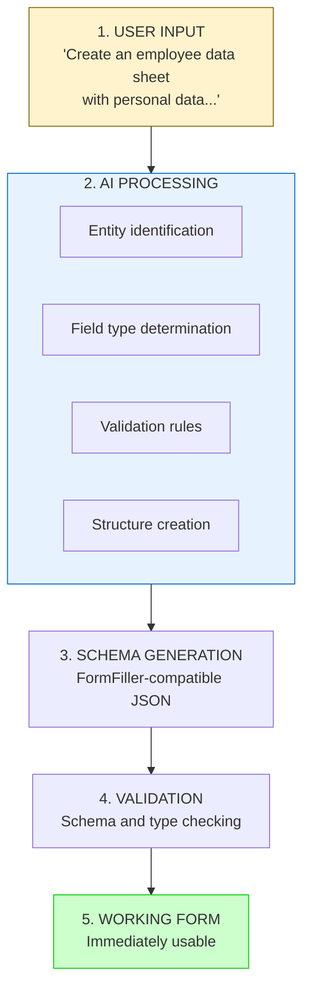
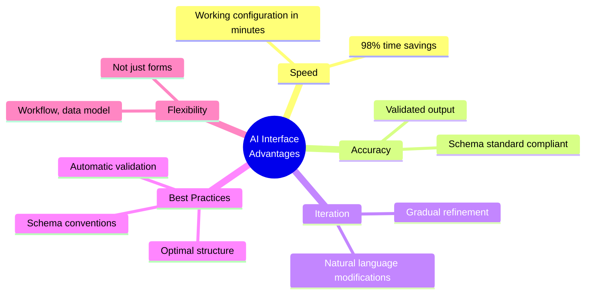

# AI Interface

The FormFiller system provides a **working AI interface** that drastically reduces the time to create forms and other structures. This is not a future plan, but a **currently available, production feature**.

## Overview

The AI interface enables:

- **Natural language form generation** - Working schema from simple text description
- **Complex structure creation** - Not just forms, but workflows, data models too
- **Iterative refinement** - Handling "Add to it..." type requests
- **Automatic validation rule recognition** - Rules inferred from description

## Drastic Time Savings

| Method | Average Time | Savings |
|--------|--------------|---------|
| Traditional coding (MVC) | 4-8 hours | - |
| Manual JSON schema writing | 30-60 minutes | ~85% |
| **AI generation** | **2-5 minutes** | **~98%** |

The AI interface represents **up to 98% time savings** compared to traditional development!

## Operating Principle



## Usage Guide

### Basic Generation

Simple prompt on the frontend interface:

```
Prompt: "Create a contact form with name, email, 
        phone number and message fields. Email should be required."
```

Result:
```json
{
  "type": "form",
  "title": "Contact",
  "items": [
    { 
      "name": "name", 
      "title": "Name", 
      "type": "text",
      "validationRules": [{ "type": "required" }]
    },
    { 
      "name": "email", 
      "title": "Email", 
      "type": "text",
      "validationRules": [
        { "type": "required" },
        { "type": "email" }
      ]
    },
    { 
      "name": "phone", 
      "title": "Phone Number", 
      "type": "text" 
    },
    { 
      "name": "message", 
      "title": "Message", 
      "type": "textarea" 
    }
  ]
}
```

### Complex Structure Generation

The AI can generate complex, nested structures:

```
Prompt: "Create an order form where customer data 
        (name, email) and shipping address are in separate groups.
        Allow adding multiple products with quantity and price,
        and automatically calculate the total."
```

The AI recognizes:
- Need for grouping
- Grid (tabular) input requirement
- ComputedRules need for sum calculation

### Iterative Refinement

The AI supports iterative development:

```
1. Prompt: "Create a registration form"
   → Basic registration form generated

2. Prompt: "Add phone number too, and add password confirmation"
   → Existing schema extended

3. Prompt: "Password should be minimum 8 characters"
   → Validation rule added
```

## Supported Generation Types

### 1. Forms

```
Prompt types:
• "Create a [type] form..."
• "Create a data entry form..."
• "Generate a registration form..."
```

### 2. Workflow Definitions

```
Prompt: "Create an approval workflow where first the 
        direct supervisor, then the HR manager approves the leave request.
        In case of rejection, send notification to the requester."
```

The AI generates:
- Workflow steps
- State transitions
- Notification rules

### 3. Data Structures

```
Prompt: "Design a CRM data structure with customers, contacts,
        and business opportunities. Projects should belong to customers."
```

The AI generates:
- Entity definitions
- Relationships
- Basic validations

### 4. Exam Sheets and Quizzes

```
Prompt: "Create a 10-question test about JavaScript basics.
        Each question is worth 10 points, and calculate total score.
        Above 60% the exam should be successful."
```

The AI generates:
- Question fields
- ComputedRules for scoring
- Result evaluation

## Non-Form Applications

The AI interface is **not limited to forms**. FormFiller's declarative schema language is suitable for describing any structured data:

| Application | Example Prompt |
|-------------|----------------|
| **System configuration** | "Define an e-commerce settings structure" |
| **API specification** | "Create endpoint definition for product CRUD" |
| **Access control** | "Design RBAC structure with admin, manager, user roles" |
| **Content management** | "Create blog post schema with categories and tags" |
| **Report definition** | "Define monthly sales report structure" |

## AI Advantages Summary



## System Integration

The AI-generated schema is immediately usable:

1. **Frontend rendering** - Generated JSON can be displayed immediately
2. **Backend validation** - Validation rules are automatically enforced
3. **Database storage** - Structure can be stored in MongoDB
4. **Workflow integration** - Workflow definitions are immediately executable

## Example: Complete Workflow

```
1. User: "Create a leave request form with dates,
               justification, and approval workflow"

2. AI generates:
   - Form schema (date fields, justification textarea)
   - Validations (date range, required fields)
   - Workflow (submission → approval → notification)

3. Result: Working leave request system in 2 minutes
   (Traditional development: 1-2 days)
```

## Next Steps

The AI interface is continuously evolving. Planned expansions:

- Visual editor integration (AI + Drag & Drop)
- Analysis and optimization of existing systems
- Multi-language prompt support
- Template suggestions based on context

