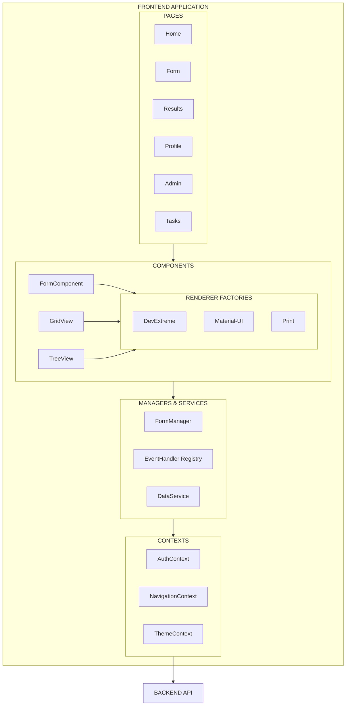
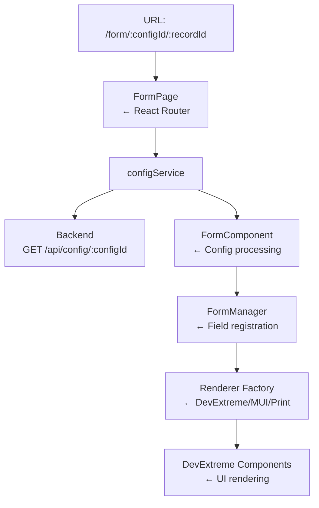
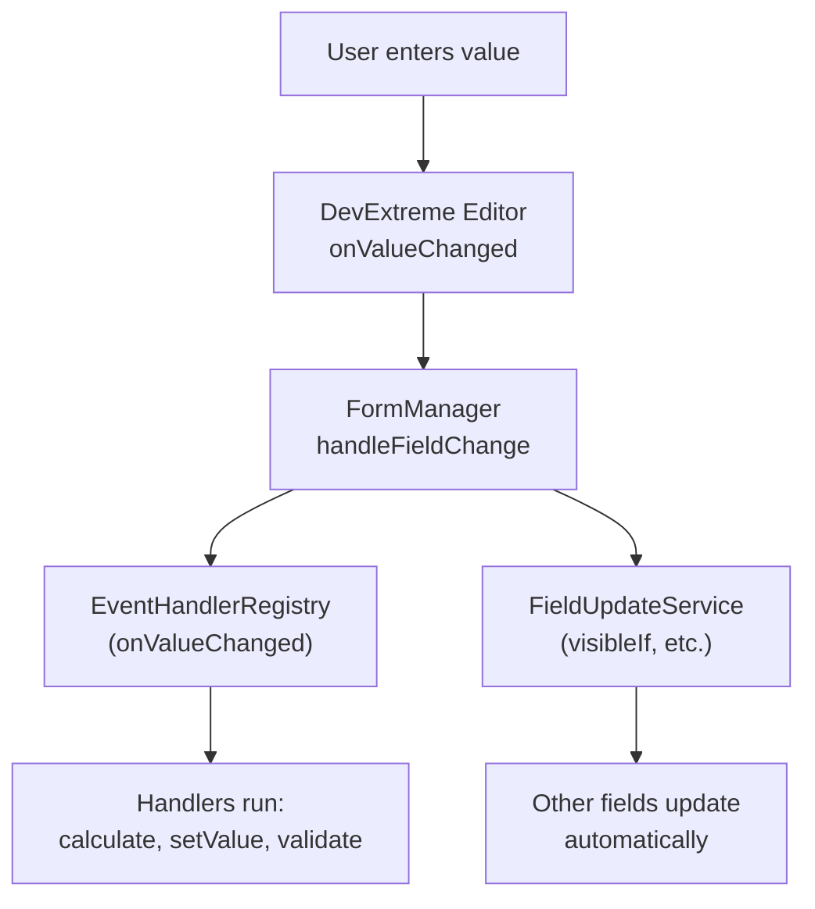
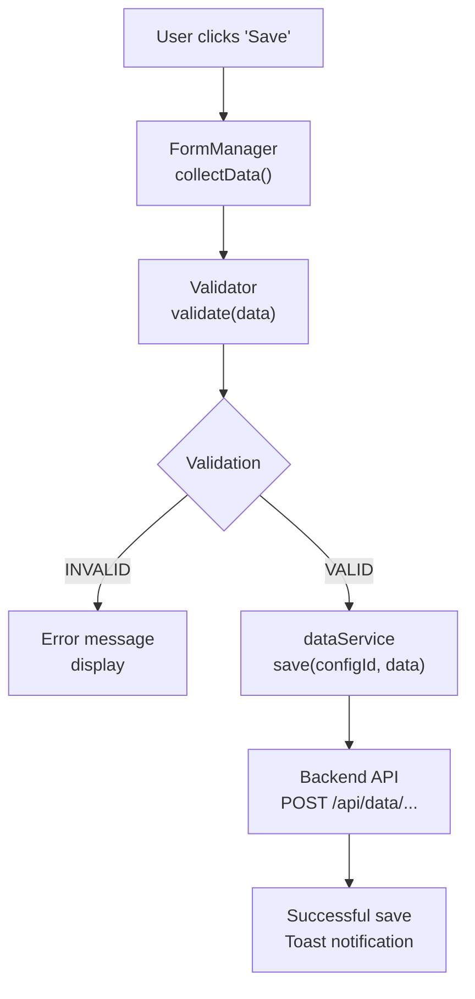

# Frontend Development

## Overview

The FormFiller frontend is a modern, React and TypeScript based single-page application (SPA) that dynamically renders forms, data grids, and tree structures based on JSON configuration.

### Main Advantages

| Advantage | Description |
|-----------|-------------|
| **Configuration-driven** | No hardcoded UI - everything comes from the schema |
| **Multiple render engines** | DevExtreme, Material-UI, Print - same config |
| **Reactive** | Fields automatically react to each other |
| **Type-safe** | Full TypeScript coverage |
| **Modular** | Easy to extend with new components |
| **Offline-capable** | Optimistic UI, background synchronization |

### Schematic Structure



### Call Chains

#### Form Display



#### Field Value Change



#### Save Process



## Detailed Documentation

Detailed descriptions of specific features in separate documents:

- [User Management](./features/user-management.md) - Registration, login, profile
- [Access Control (RBAC)](./features/rbac.md) - Roles, permissions, UI filtering
- [Multisite Management](./features/multisite.md) - Multi-tenant operation on frontend
- [Theme and Localization](./features/theming.md) - Themes, multi-language

## Architecture

The frontend is React and TypeScript based, with Vite build system and DevExtreme UI components.

## Project Structure

```
src/
├── components/          # React components
│   ├── form/           # Form components
│   ├── header/         # Header
│   ├── footer/         # Footer
│   └── views/          # View modules (Grid, Tree)
├── pages/              # Page components
│   ├── home/           # Home page
│   ├── form/           # Form page
│   ├── results/        # Results page
│   └── profile/        # Profile page
├── services/           # Business logic and API
│   ├── dataService.ts  # API calls
│   └── EventHandlerRegistry.ts
├── factories/          # Renderer factories
├── managers/           # State managers
├── eventHandlers/      # Event handlers
├── contexts/           # React contexts
├── interfaces/         # TypeScript interfaces
├── types/              # Type definitions
├── utils/              # Utility functions
└── themes/             # DevExtreme themes
```

## Renderers

The system supports three rendering engines:

### DevExtreme Renderer

The main rendering engine with full functionality:

```typescript
import { DevExtremeFormRenderer } from './factories/DevExtremeFormRenderer';

const renderer = new DevExtremeFormRenderer();
const form = renderer.render(config, data, mode);
```

### Material-UI Renderer

Alternative Material Design appearance:

```typescript
import { MUIFormRenderer } from './factories/MUIFormRenderer';
```

### Print Renderer

Print-optimized view.

## Form Manager

Central state manager for forms:

```typescript
import { FormManager } from './managers/FormManager';

const formManager = new FormManager();

// Register field
formManager.registerField('firstName', {
  value: '',
  onChange: (value) => console.log('Changed:', value)
});

// Set value
formManager.setValue('firstName', 'John');

// Collect data
const formData = formManager.collectData();
```

## Event Handling

Declarative event handling system:

```typescript
// Configuration
const fieldConfig = {
  name: 'quantity',
  type: 'number',
  onValueChanged: [
    { handler: 'log', params: { message: 'Quantity changed' } },
    { handler: 'calculate', params: { target: 'total', formula: 'quantity * price' } }
  ]
};

// Register custom handler
EventHandlerRegistry.register('myHandler', (context, params) => {
  // Handler implementation
});
```

## API Calls

The `dataService` handles API communication:

```typescript
import { configService, dataService } from './services/dataService';

// Get configuration
const config = await configService.getById(configId);

// Get data
const data = await dataService.query(configId, { filter, sort, skip, take });

// Save
await dataService.save(configId, formData);
```

## Contexts

### Auth Context

```typescript
import { useAuth } from './contexts/AuthContext';

const { user, login, logout, isAuthenticated } = useAuth();
```

### Navigation Context

```typescript
import { useNavigation } from './contexts/NavigationContext';

const { navigate, currentRoute } = useNavigation();
```

## Component Development

### Creating New Component

```typescript
// components/MyComponent/MyComponent.tsx
import React from 'react';
import './MyComponent.scss';

interface MyComponentProps {
  title: string;
  onAction: () => void;
}

export const MyComponent: React.FC<MyComponentProps> = ({ title, onAction }) => {
  return (
    <div className="my-component">
      <h2>{title}</h2>
      <button onClick={onAction}>Action</button>
    </div>
  );
};
```

## Themes

DevExtreme themes in the `themes/` directory:

```bash
# Theme build
npm run build-themes
```

## Useful Commands

```bash
# Development server
npm start

# Build
npm run build

# Tests
npm test

# Theme build
npm run build-themes
```

