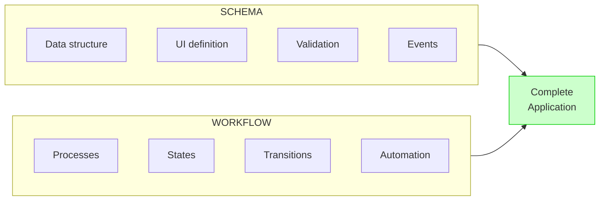

# Schema and Types

The `formfiller-schema` package is the **central element** of the FormFiller system - it defines the structural composition of elements achievable by the low-code platform.

## The Role of Schema

### Low-Code Definition Language

The schema can essentially be interpreted as a **declarative programming language**. A single JSON structure defines:

- **Data structure**: Fields, types, relationships
- **Display**: Forms, grids, tree structures
- **Behavior**: Validations, conditional logic, events
- **Business rules**: ComputedRules, cross-field validation


### Single Source of Truth

Unlike traditional MVC architectures where the data model, display, and validation must be defined separately and redundantly:

| Traditional MVC | FormFiller Schema |
|-----------------|-------------------|
| Model definition (backend) | **Single schema** |
| Database migration | defines all |
| API endpoints | layers at once |
| Frontend form components | |
| Frontend validation | |
| Backend validation | |

**Advantages:**
- No redundancy - modifying in one place applies everywhere
- Guaranteed consistency - frontend and backend use the same definition
- Faster development - no need to implement each layer separately
- Fewer errors - no discrepancies between layers
- AI compatibility - easily processable and generatable by artificial intelligence

### AI Compatibility

One of the less obvious but extremely valuable advantages of the schema structure is its **compatibility with AI technologies**.

> **Important:** The AI interface is a **currently working, production feature** in the FormFiller system, not a future plan!

#### Why Is It Ideal for AI Processing?

The schema defines clear, declarative rules:

| Property | AI Advantage |
|----------|--------------|
| **Structured JSON format** | Easily parseable, generatable |
| **Finite type set** | AI knows exactly what elements exist |
| **Explicit rules** | No hidden logic, everything is declared |
| **Hierarchical structure** | Natural tree structure for AI |
| **Validatable output** | AI-generated schema can be verified |

#### AI Generated Forms

FormFiller's built-in AI function can generate working forms from natural language descriptions:


**How it works:**

1. **Prompt interpretation**: AI understands the user need
2. **Schema generation**: AI generates JSON according to schema rules
3. **Validation**: Generated schema is automatically validated
4. **Fine-tuning**: User can modify, AI can regenerate

**Example AI Generated Schema:**

```json
// User request: "Simple contact form"
{
  "type": "form",
  "title": "Contact",
  "items": [
    { "name": "name", "title": "Name", "type": "text", 
      "validationRules": [{"type": "required"}] },
    { "name": "email", "title": "Email", "type": "text",
      "validationRules": [{"type": "required"}, {"type": "email"}] },
    { "name": "subject", "title": "Subject", "type": "text" },
    { "name": "message", "title": "Message", "type": "textarea",
      "validationRules": [{"type": "required"}] }
  ],
  "preferences": { "addSaveBtn": true }
}
```

#### AI Advantages in Development

| Feature | Description |
|---------|-------------|
| **Quick prototype** | Working form from natural language in minutes |
| **Iterative refinement** | "Add a phone number field too" |
| **Complex structures** | AI handles nested groups, conditions |
| **Best practices** | AI generates according to schema rules |
| **Error-free output** | Validatable, type-correct output |

#### Drastic Time Savings

The working AI interface **radically reduces development time**:

| Method | Average Time | Savings |
|--------|--------------|---------|
| Traditional coding (MVC) | 4-8 hours | - |
| Manual JSON schema writing | 30-60 minutes | ~85% |
| **AI generation** | **2-5 minutes** | **~98%** |

#### Non-Form Applications

The AI interface is **not limited to forms**. FormFiller's declarative schema language is suitable for describing any structured data:

| Application | Example |
|-------------|---------|
| **Workflow definitions** | Approval processes, state machines |
| **Data structures** | CRM, ERP entity models |
| **System configurations** | Settings, parameters |
| **Business rules** | Pricing, discounts, permissions |
| **Report definitions** | Report structures, dashboards |

> 📚 Detailed documentation: [AI Interface](./features/ai-interface.md)

#### Comparison with Traditional Code

| | Traditional Code | FormFiller Schema |
|-|------------------|-------------------|
| AI generation | Difficult - syntax sensitive | Simple - structured JSON |
| Validation | Must run the code | JSON Schema validation |
| Error rate | High (syntax errors) | Low (type checking) |
| Interpretation | Hard for AI to understand | Explicit, declarative |

The declarative nature of schema thus not only simplifies development but **opens new possibilities for AI-based development tools**.

### Schema + Workflow = Complete Application

The schema combined with Workflow schema can describe **almost any typical business application**:



**Example: Webshop operation in FormFiller**

| Function | Schema element | Workflow element |
|----------|----------------|------------------|
| Product catalog | Grid config + lookup | - |
| Cart management | Nested grid + computedRules (sum) | - |
| Order form | Form config + validation | - |
| Order processing | - | Status transitions |
| Notifications | - | Email workflow steps |
| Inventory update | - | Automatic workflow |

**Other implementable systems:**
- CRM system
- Project management
- HR administration
- Customer service (ticketing)
- Inventory management
- Document workflow
- Examination system

### Path-Based Field Management

One of FormFiller's unique and extremely useful features is **path-based field management**, which enables storing data in complex, hierarchical structures.

#### Path Syntax

```
simple field:        name                              → { "name": "..." }
group field:         address.city                      → { "address": { "city": "..." } }
deep nesting:        customer.billing.zipCode          → { "customer": { "billing": { "zipCode": "..." } } }
grid row:            items[0].quantity                 → { "items": [{ "quantity": ... }] }
all grid rows:       items[*].total                    → (total field of every row)
```

#### Advantages

| Advantage | Description |
|-----------|-------------|
| **Semantic structure** | Data hierarchy carries meaning - e.g. `billing.address` vs `shipping.address` |
| **Logical grouping** | Related fields stored together in database |
| **Form-data correspondence** | Data structure reflects form's logical layout |
| **MongoDB compatibility** | Native embedded document storage, no joins needed |
| **Easier querying** | Path-based search and aggregation (`"customer.billing.city": "Budapest"`) |
| **Meaningful content** | Data is self-describing, structure itself carries information |

#### Example: Order Form Data Structure

```json
// Schema definition
{
  "type": "form",
  "items": [
    {
      "type": "group",
      "name": "customer",
      "items": [
        { "name": "name", "type": "text" },
        {
          "type": "group",
          "name": "billing",
          "items": [
            { "name": "address", "type": "text" },
            { "name": "zipCode", "type": "text" }
          ]
        },
        {
          "type": "group", 
          "name": "shipping",
          "items": [
            { "name": "address", "type": "text" },
            { "name": "zipCode", "type": "text" }
          ]
        }
      ]
    },
    {
      "name": "items",
      "type": "grid",
      "gridConfig": {
        "columns": [
          { "dataField": "product", "type": "text" },
          { "dataField": "quantity", "dataType": "number" },
          { "dataField": "price", "dataType": "number" }
        ]
      }
    }
  ]
}
```

Data saved based on the above schema:

```json
{
  "customer": {
    "name": "John Smith",
    "billing": {
      "address": "123 Main St, New York",
      "zipCode": "10001"
    },
    "shipping": {
      "address": "456 Oak Ave, Boston",
      "zipCode": "02101"
    }
  },
  "items": [
    { "product": "Laptop", "quantity": 1, "price": 1200 },
    { "product": "Mouse", "quantity": 2, "price": 25 }
  ]
}
```

#### Comparison with Flat Structure

| Flat structure | Hierarchical (FormFiller) |
|----------------|---------------------------|
| `billingAddress`, `shippingAddress` | `billing.address`, `shipping.address` |
| Must group manually | Automatic grouping |
| No semantic meaning | Structure itself carries meaning |
| Hard to extend | Easily extendable with new levels |
| JOIN required (relational DB) | Embedded document (MongoDB) |

#### MongoDB Query Advantages

```javascript
// With flat structure
db.orders.find({ billingCity: "Budapest" });

// With FormFiller hierarchical structure
db.orders.find({ "customer.billing.city": "Budapest" });

// Aggregation on nested array
db.orders.aggregate([
  { $unwind: "$items" },
  { $group: { _id: "$customer.name", total: { $sum: "$items.price" } } }
]);
```

Path-based structure thus not only improves schema readability but **data gains meaningful content**, and storage reflects business logic.

### Concise Program Code

A complex form that would be hundreds of lines in traditional code can be described concisely in schema:

```json
{
  "type": "form",
  "title": "Order",
  "items": [
    {
      "itemType": "group",
      "caption": "Customer Data",
      "items": [
        { "name": "customerName", "type": "text", "validationRules": [{"type": "required"}] },
        { "name": "email", "type": "text", "validationRules": [{"type": "email"}] }
      ]
    },
    {
      "name": "orderItems",
      "type": "grid",
      "gridConfig": {
        "columns": [
          { "dataField": "product", "lookup": { "dataSource": "/api/products" } },
          { "dataField": "quantity", "dataType": "number" },
          { "dataField": "unitPrice", "dataType": "number" },
          { "dataField": "lineTotal", "dataType": "number", "calculateValue": "quantity * unitPrice" }
        ]
      }
    }
  ],
  "computedRules": [
    { "targetField": "orderTotal", "formula": "sum(orderItems[*].lineTotal)" }
  ]
}
```

This ~30-line JSON description includes:
- Data structure (fields, types)
- UI (grouping, grid, form)
- Validation (required, email format)
- Business logic (line total, grand total)
- Data relationships (product lookup)

## Main Types

### FieldConfig

Field configuration type:

```typescript
interface FieldConfig {
  name: string;                    // Field identifier
  title?: string;                  // Display title
  type: FieldType;                 // Field type
  dataType?: DataType;             // Data type
  editorOptions?: EditorOptions;   // Editor settings
  validationRules?: ValidationRule[]; // Validation rules
  visibleIf?: ConditionalRule;     // Conditional visibility
  disabledIf?: ConditionalRule;    // Conditional disable
  requiredIf?: ConditionalRule;    // Conditional required
  lookup?: LookupConfig;           // Lookup configuration
}
```

### FieldType

Supported field types:

```typescript
type FieldType = 
  | 'text' | 'number' | 'date' | 'datetime' | 'boolean'
  | 'lookup' | 'tagbox' | 'textarea' | 'html'
  | 'file' | 'image' | 'signature'
  | 'group' | 'tabbed' | 'tab'
  | 'grid' | 'tree' | 'form';
```

### ValidationRule

DevExtreme-compatible validation rules:

```typescript
interface ValidationRule {
  type: ValidationType;
  message?: string;
  // Type-specific fields
  min?: number;
  max?: number;
  pattern?: string;
  // ...
}

type ValidationType = 
  | 'required' | 'email' | 'numeric'
  | 'stringLength' | 'range' | 'pattern'
  | 'compare' | 'custom';
```

### ItemConfig

View configuration (grid, tree, form):

```typescript
interface ItemConfig {
  id: string;
  title: string;
  type: 'grid' | 'tree' | 'form';
  items: FieldConfig[];
  preferences?: FormPreferences;
}
```

## Usage

### Frontend

```typescript
import { 
  FieldConfig, 
  ItemConfig, 
  validateField 
} from 'formfiller-schema';

// Typed configuration
const field: FieldConfig = {
  name: 'email',
  title: 'Email address',
  type: 'text',
  validationRules: [
    { type: 'required' },
    { type: 'email' }
  ]
};

// Validation
const result = validateField(field);
```

### Backend

```typescript
import { 
  ViewConfig, 
  validateConfig,
  SchemaValidator 
} from 'formfiller-schema';

// Config model with TypeScript interface
const config: ViewConfig = req.body.config;

// Validation
const validator = new SchemaValidator();
const result = validator.validate(config, schema);

if (!result.valid) {
  return res.status(400).json({ errors: result.errors });
}
```

## SchemaValidator

Multi-level validation support:

```typescript
import { SchemaValidator, ValidationLevel } from 'formfiller-schema';

const validator = new SchemaValidator();

// STRICT - for production
const strictResult = validator.validate(config, schema, {
  level: ValidationLevel.STRICT
});

// LOOSE - for staging
const looseResult = validator.validate(config, schema, {
  level: ValidationLevel.LOOSE
});

// DEVELOPMENT - for development
const devResult = validator.validate(config, schema, {
  level: ValidationLevel.DEVELOPMENT
});
```

## SchemaCache

Cached validators:

```typescript
import { getSchemaCache } from 'formfiller-schema';

const cache = getSchemaCache();
const validator = cache.getValidator('configSchema', schema);

// Multiple uses - from cache
validator(config1);
validator(config2);

// Statistics
console.log(`Hit rate: ${cache.getHitRate() * 100}%`);
```

## Development

### Modifying Schema

1. Modify types in the `formfiller-schema` project
2. Run build: `npm run build`
3. Distribute: `npm run distribute`
4. Restart backend and frontend projects

### Adding New Field Type

1. Add to the `FieldType` union
2. Define type-specific interface
3. Implement validation
4. Implement frontend rendering

