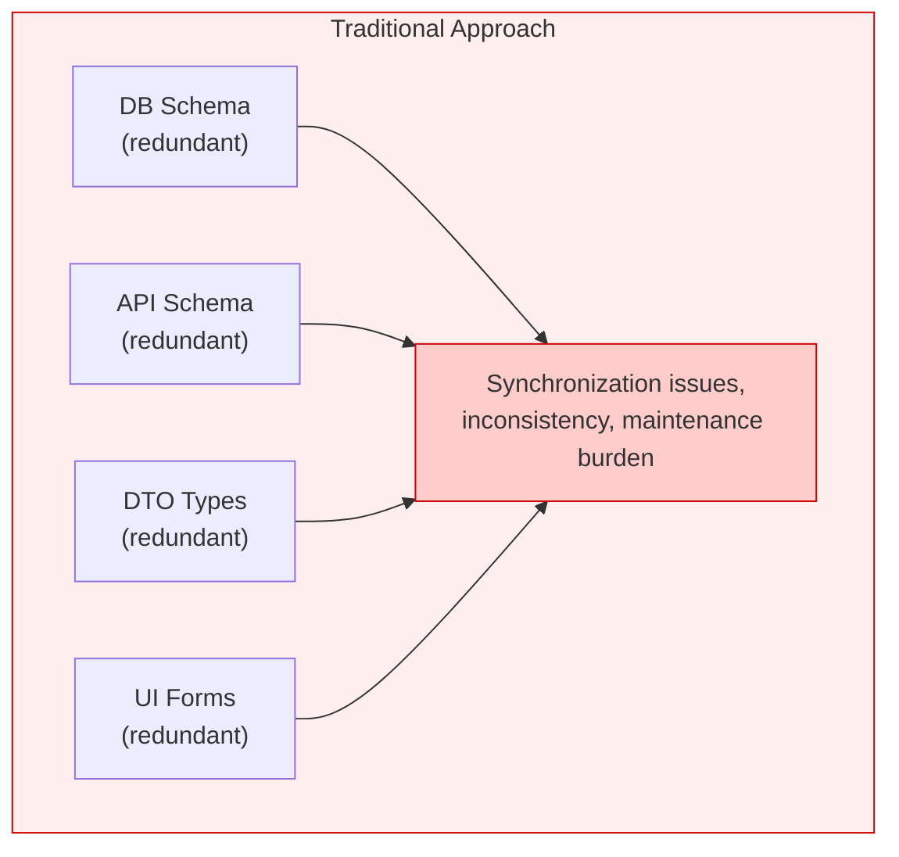
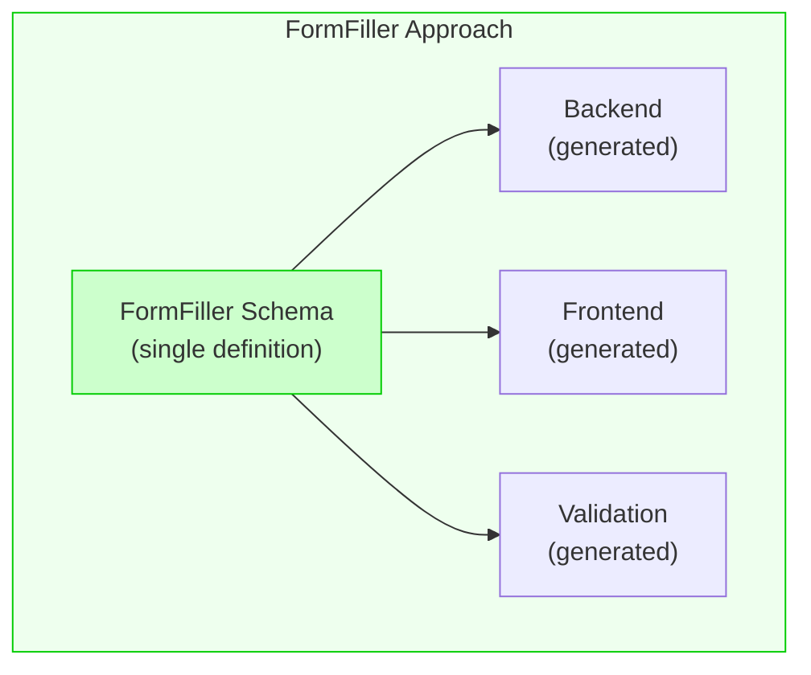
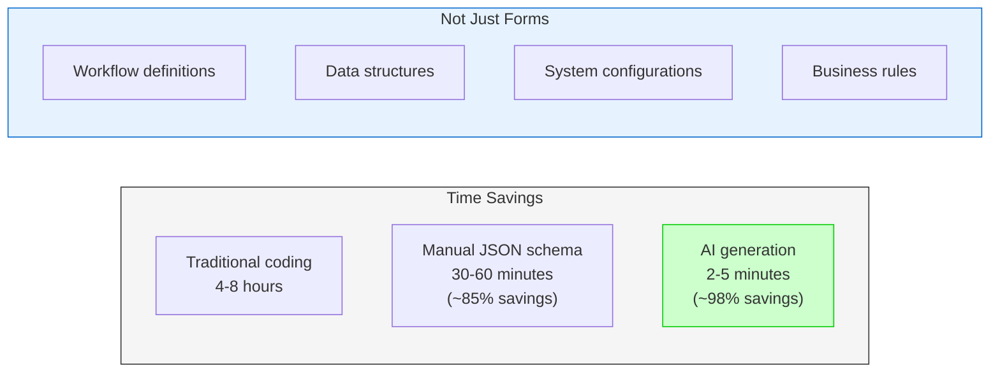

# FormFiller Documentation

> This documentation is also available in [Hungarian](/hu/).

FormFiller is a modern, configurable form management system that enables the creation and management of dynamic forms, data grids, and tree structures based on JSON schema.

## Motivation

### What Need Gave Rise to This Project?

During the development of business applications, we repeatedly face the same challenges:

**Traditional Development Problems:**
- Custom code must be written for each form
- Validation rules are implemented multiple times (frontend, backend, database)
- Modifying a field requires changes in multiple files
- Maintenance costs grow exponentially with complexity

**Limitations of Existing Form Builders:**
- SaaS solutions (Google Forms, Typeform) are inflexible for complex business logic
- No control over data (privacy, GDPR)
- Limited customization and integration
- Workflow and automation missing or expensive

**Pitfalls of Custom Development:**
- High initial and ongoing development costs
- Technical debt accumulation
- Difficult scalability and maintenance

### Design Philosophy

> *"Perfection is achieved not when there is nothing more to add, but when there is nothing left to take away."*
> 
> — Antoine de Saint-Exupéry

FormFiller follows this philosophy through these principles:

#### Single Source of Truth

**Traditional Approach:**



**FormFiller Approach:**



#### Minimalism in Practice

| Principle | Traditional | FormFiller |
|-----------|-------------|------------|
| **Field definition** | 4+ places (DB, API, DTO, UI) | 1 place (Schema) |
| **Validation** | Frontend + Backend separate | Once, valid everywhere |
| **UI changes** | Code modification + deploy | JSON configuration change |
| **New form** | Days of development | Configurable in minutes |

#### Declarative vs Imperative

FormFiller applies a declarative approach: **we describe WHAT we want**, not HOW to achieve it.

```json
// Traditional (imperative): ~50 lines of code
// - Form component
// - State management
// - Validation logic
// - API calls
// - Error handling

// FormFiller (declarative): ~10 lines of configuration
{
  "name": "email",
  "type": "text",
  "label": "Email address",
  "validationRules": [
    { "type": "required", "message": "Required field" },
    { "type": "email", "message": "Invalid email" }
  ]
}
```

### Why "Less is More"?

FormFiller meets Saint-Exupéry's principle because:

1. **No redundancy**: A single JSON defines everything
2. **No unnecessary abstraction**: Direct mapping from configuration → UI
3. **No boilerplate code**: The system generates what's needed
4. **No lock-in**: Open source, own infrastructure

Detailed comparison with other systems: [Comparison](./comparison.md)

---

## System Overview

FormFiller is a multisite-capable application consisting of the following main components:

| Component | Description | Technology |
|-----------|-------------|------------|
| [Backend](https://github.com/LowCoders/formfiller-backend) (coming soon) | REST API and business logic | Node.js, TypeScript, Express, MongoDB |
| [Frontend](https://github.com/LowCoders/formfiller-frontend) (coming soon) | User interface | React, TypeScript, DevExtreme |
| [Schema](https://github.com/LowCoders/formfiller-schema) | Shared types and validation | TypeScript, JSON Schema |
| [Validator](https://github.com/LowCoders/formfiller-validator) | Advanced validation system | TypeScript |
| [Types](https://github.com/LowCoders/formfiller-types) | Shared type definitions | TypeScript |
| [Deployment](https://github.com/LowCoders/formfiller-deployment) (coming soon) | Deployment configurations | Helm, Kubernetes, Docker |

## Main Features

- **Dynamic Forms**: JSON schema-based form rendering
- **Multiple Render Engines**: DevExtreme, Material-UI, Print view
- **Data Grids and Tree Structures**: Complex data display
- **Conditional Fields**: visibleIf, disabledIf, requiredIf support
- **Lookup Fields**: Dynamic dropdown lists with dependencies
- **Event Handling**: Declarative event handling system
- **RBAC**: Role-based access control
- **Multisite**: Multi-tenant architecture
- **🤖 AI Interface**: Working artificial intelligence-based configuration generation

### AI Interface - Working Feature

FormFiller has a **currently working AI interface** that drastically reduces the time to create forms and other structures:



**Example usage:**
```
Prompt: "Create a leave request form with start and end date,
        justification, and approval workflow"

Result: Working system in 2-3 minutes
(Traditional development: 1-2 days)
```

> 📚 Detailed documentation: [AI Interface](./developer/features/ai-interface.md)

## Documentation Structure

### [Developer Documentation](./developer/index.md)

- Backend development
- Frontend development
- Schema and types
- API reference
- Event handling
- Validation

### [User Documentation](./user/index.md)

- Getting started
- Form configuration
- Administration

### [Deployment Documentation](./deployment/index.md)

- Traditional (VPS) deployment
- Docker deployment
- Kubernetes deployment

### [Comparisons](./comparison.md)

- Comparison with MVC/MVP systems
- Form builder service comparison
- Summary table with star ratings

### [Future Development](./roadmap.md)

- AI and machine learning improvements
- Visual editor and collaboration
- Platform extensions and integrations
- Development roadmap

## Architecture

Detailed description of system structure: [Architecture](./architecture.md)

## Quick Start

### Development Environment

```bash
# Backend
cd formfiller-backend
npm install
npm run dev

# Frontend (in another terminal)
cd formfiller-frontend
npm install
npm start
```

### Docker

```bash
cd formfiller-deployment/docker-compose
docker-compose up -d
```

### Kubernetes

```bash
cd formfiller-deployment
./scripts/deploy.sh minikube
```

## Support

For questions and bugs, use the issue tracker in the appropriate repo.

