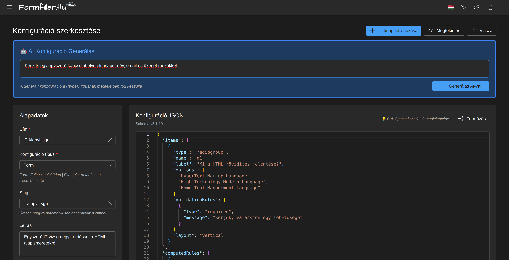
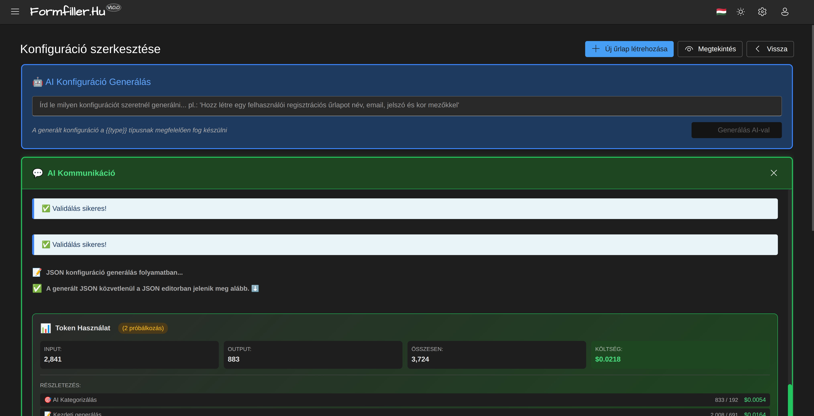

# Form Configuration

This guide helps you create and customize forms.

*The configuration editor interface*

## Overview

Forms are created based on JSON configuration. The configuration determines:
- What fields appear
- What types they are
- What validations apply
- How they behave (conditional display, calculations)

## Configuration Editor

### Opening

1. Open the Administration menu
2. Select "Configurations"
3. Click an existing configuration or "New" button

### Interface Elements

- **Tree structure**: Field hierarchy on the left
- **Properties**: Current element settings on the right
- **Preview**: Live preview of the form
- **JSON Editor**: For advanced users

## AI Configuration Generation

With AI, you can automatically generate form configurations from natural language descriptions.

### Usage

1. Type the desired form description in the prompt field
2. Click "Generate with AI" button

*AI prompt input for generation*

### Generation Process

*AI categorizing and analyzing the request*

The system:
- Automatically categorizes the form type
- Suggests appropriate settings (e.g., saveUrl)
- Generates field names and validations

### Result

*Generation result with token usage*

The generated configuration:
- Appears directly in the JSON editor
- Contains validation rules
- Shows token usage and cost

## Field Types

### Text Fields

| Type | Description | Usage |
|------|-------------|-------|
| `text` | Single line text | Name, title |
| `textarea` | Multi-line text | Comments, description |
| `html` | Rich text editor | Formatted content |

### Numbers

| Type | Description | Usage |
|------|-------------|-------|
| `number` | Number | Quantity, price |

**Settings:**
- Minimum/maximum value
- Decimal places
- Show spinner buttons

### Dates

| Type | Description | Usage |
|------|-------------|-------|
| `date` | Date only | Birth date |
| `datetime` | Date and time | Appointment booking |

**Settings:**
- Minimum/maximum date
- Display format

### Selections

| Type | Description | Usage |
|------|-------------|-------|
| `boolean` | Yes/No | Acceptance |
| `lookup` | Dropdown list | Category selection |
| `tagbox` | Multiple selection | Tags |

### Files

| Type | Description | Usage |
|------|-------------|-------|
| `file` | File upload | Documents |
| `image` | Image upload | Profile picture |
| `signature` | Signature | Approval |

## Structure Elements

### Groups

Visual grouping of fields:

1. Add "Group" element
2. Set the title
3. Drag fields into it

**Settings:**
- Number of columns (1-4)
- Collapsible

### Tabs

Splitting into multiple tabs:

1. Add "Tabs" element
2. Create the tabs
3. Distribute fields among tabs

### Nested Grid

Tabular data entry within the form:

1. Add "Grid" field
2. Define columns
3. Set add/delete permissions

## Validation Setup

### Required Field

1. Select the field
2. In Properties panel check "Required" option
3. Enter error message (optional)

### String Length

1. Select "String Length" validation
2. Set minimum and/or maximum value
3. Enter error message

### Number Range

1. Select "Range" validation
2. Set minimum and/or maximum value
3. Enter error message

### Custom Pattern (Regex)

1. Select "Pattern" validation
2. Enter regex pattern
3. Enter error message

**Common patterns:**
- Phone number: `^\+?[0-9]{9,15}$`
- Postal code: `^[0-9]{5}$`
- URL: `^https?://.*`

## Conditional Logic

### Conditional Display

Show field based on another field's value:

1. Select the field
2. Open "Conditions" tab
3. Select "Visible if" option
4. Enter condition:
   - Referenced field
   - Expected values

**Example:** "Spouse name" field only appears when "Marital status" value is "Married".

### Conditional Disable

Similarly, for disabling field:

1. Select "Disabled if" option
2. Enter condition

### Conditional Required

Make field conditionally required:

1. Select "Required if" option
2. Enter condition

## Lookup Fields

### Static List

Predefined values:

1. Select `lookup` type
2. Select "Static list" source
3. Enter values

### Dynamic List

Values loaded from database:

1. Select `lookup` type
2. Select "API" source
3. Enter API endpoint

### Dependent Lookup

List dependent on another field's value:

1. Configure main lookup field
2. On dependent field select "Depends on" option
3. Select parent field
4. Enter filter expression

## Calculated Fields

### Simple Calculation

Value calculated from field values:

1. Create calculated field
2. Set to "Read only"
3. Add event handler:
   - Event: When source field changes
   - Action: Calculate
   - Formula: e.g., `quantity * unitPrice`

### Summation

Summing nested grid rows:

1. Create total field
2. Add calculation event
3. Use `sum()` function

## Preview and Testing

### Live Preview

See live preview on right side of editor.

### Testing

1. Click "Test" button
2. Fill with test data
3. Verify behavior

## Save and Publish

### Save Draft

- `Ctrl+S` or "Save" button
- Draft is not visible to users

### Publish

1. Review configuration
2. Click "Publish" button
3. Form becomes available

## Tips

### User-Friendly Forms

- Group related fields
- Use clear labels
- Enter placeholder text
- Describe expected format

### Performance

- Avoid too many fields on one form
- Use tabs for long forms
- Optimize lookup data sources

### Maintainability

- Use descriptive field names
- Document custom logic
- Test changes

