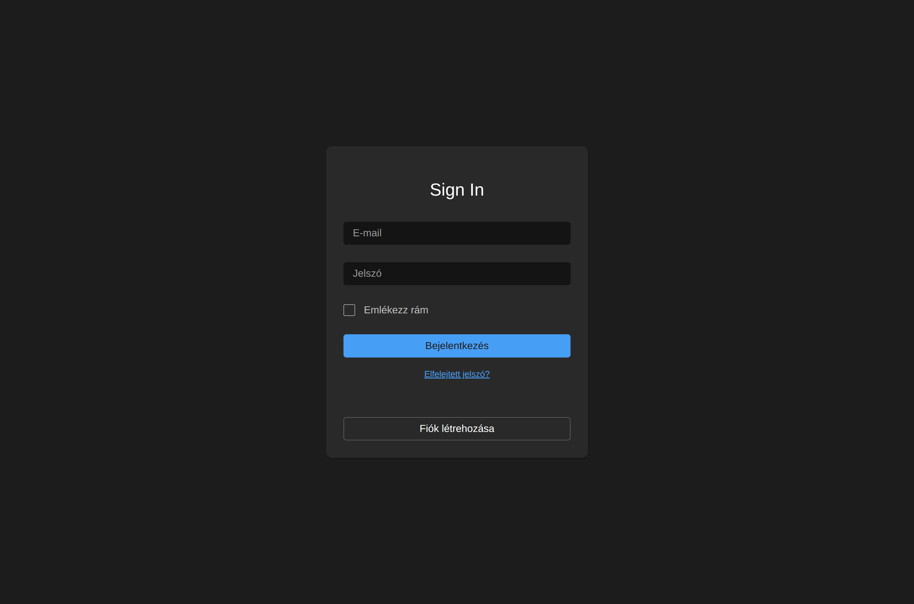
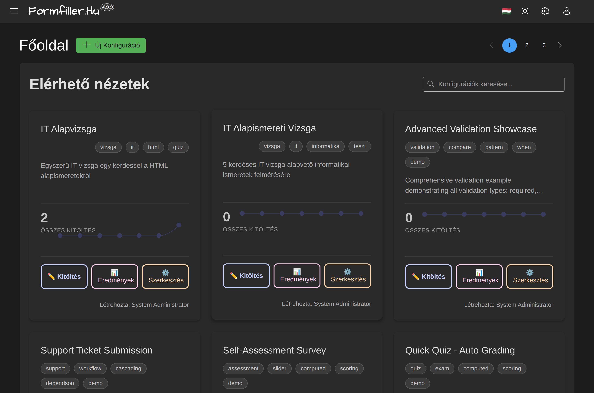
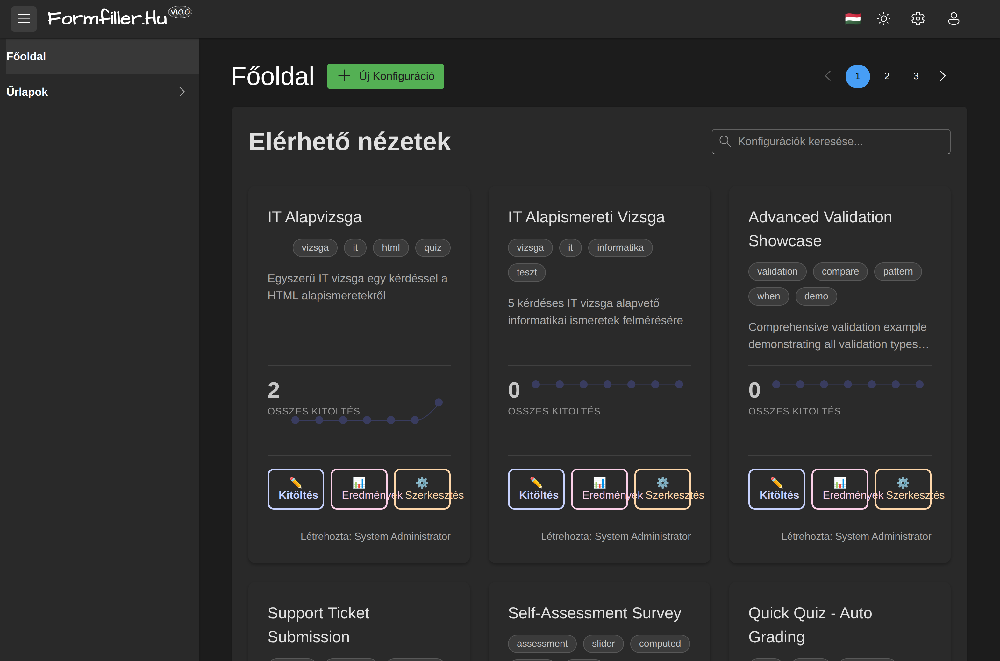
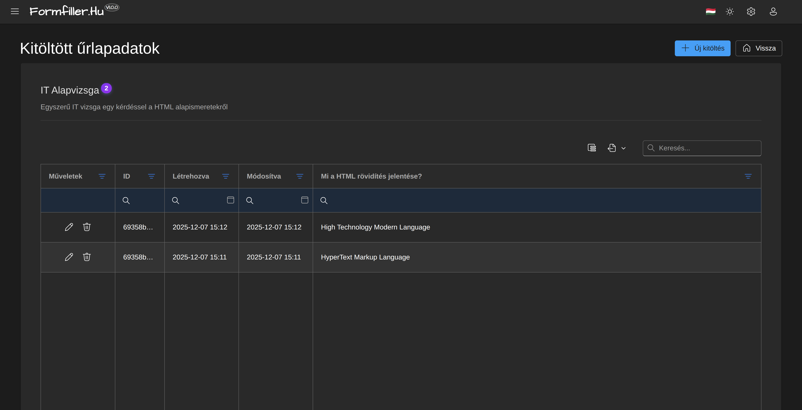

# Getting Started

This guide helps you take the first steps in using the FormFiller system.

## Login

*The login screen*

### With Google Account

1. Open the application URL
2. Click the "Login with Google" button
3. Select your Google account
4. Allow application access

### Email and Password

1. Open the application URL
2. Enter your email and password
3. Click the "Login" button

### Registration

If you don't have an account yet:

1. Click the "Register" link
2. Enter your details:
   - Name
   - Email address
   - Password (minimum 8 characters)
3. Click the "Register" button
4. Confirm your email address (if required)

## Interface Overview

### Header

- **Logo**: Click to navigate to home page
- **Menu**: Available features
- **Profile**: User settings and logout

### Home Page

*The home page with available configurations*

On the home page you see available forms and features:

- **Forms**: Create new records
- **Results**: View existing data

### Navigation

*The main menu with available features*

- Use the menu for navigation
- Breadcrumb shows current position
- Back button takes you to previous page

## Filling Out Your First Form

*A form during filling*

### 1. Select Form

1. Find the form you want to fill on the home page
2. Click the form name or "New" button

### 2. Fill Fields

- **Required fields**: Marked with red asterisk
- **Text fields**: Type the value
- **Dropdown lists**: Select from list
- **Date fields**: Use the calendar
- **Checkboxes**: Click to check

### 3. Validation

- Errors are shown in red text below the field
- Fix errors before saving

### 4. Save

1. Review the data
2. Click the "Save" button
3. Wait for confirmation

## Viewing Data

*Tabular view of filled data*

### Results View

1. Select "Results" menu item
2. Select the desired form

### Filtering

- Use the filter row below column headers
- Click filter icon for more options

### Sorting

- Click column header to sort
- Click again: ascending/descending order

### Edit Record

1. Click the row
2. Click "Edit" button
3. Modify the data
4. Save

### Export

1. Apply filters (optional)
2. Click "Export" button
3. Choose format:
   - **Excel**: For spreadsheets
   - **PDF**: For printing

## Profile Settings

*The profile settings page*

### Edit Profile

1. Click profile icon
2. Select "Profile" menu item
3. Modify data:
   - Name
   - Email
   - Language
4. Save

### Change Password

1. Open Profile page
2. Click "Change Password" button
3. Enter current password
4. Enter new password (twice)
5. Save

### Logout

1. Click profile icon
2. Select "Logout" menu item

## Tips and Tricks

### Keyboard Shortcuts

| Key | Action |
|-----|--------|
| `Enter` | Save (on form) |
| `Escape` | Cancel / Close |
| `Tab` | Next field |
| `Shift+Tab` | Previous field |

### Browser Support

The application supports the following browsers:
- Chrome (recommended)
- Firefox
- Safari
- Edge

### Mobile Devices

The application is responsive, usable on mobile devices:
- Navigate with touch
- Menu accessible via hamburger icon
- Scroll by dragging

## FAQ

### I Forgot My Password

1. Click "Forgot Password" link
2. Enter your email address
3. Follow the instructions in the email

### I Can't Save the Form

Check:
1. All required fields are filled
2. There are no validation errors
3. You have internet connection

### I Can't See My Data

Possible reasons:
1. You don't have permission to view
2. A filter is applied
3. Data is on another site

## Help

If you need further assistance:
1. Check the documentation
2. Contact the system administrator

