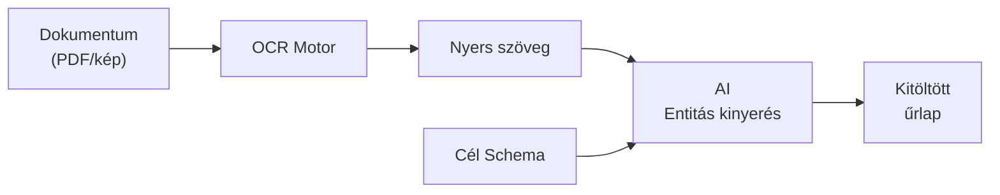
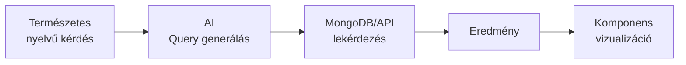
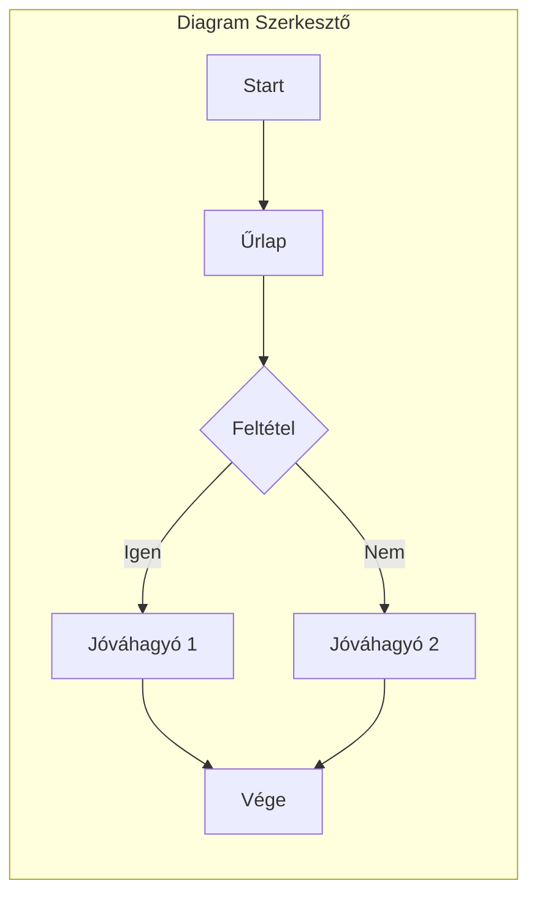
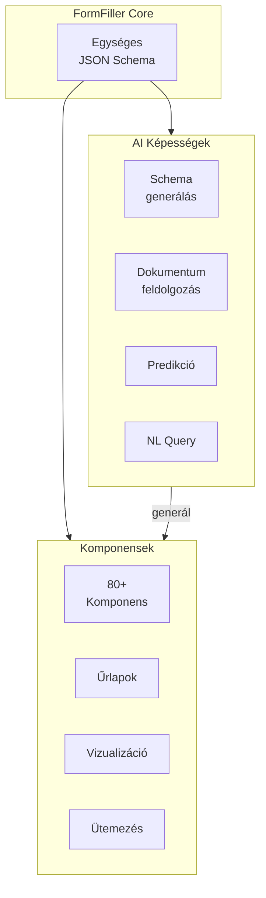

[← Vissza az Alkalmazhatóság főoldalra](index.md)

# Kreatív Felhasználási Esetek

Ez az oldal szokatlan, innovatív alkalmazási területeket mutat be, ahol a FormFiller architektúra váratlan előnyöket kínálhat.

## Tartalomjegyzék

1. [AI-alapú Alkalmazások](#ai-alapú-alkalmazások)
2. [Vizualizációs Use Case-ek](#vizualizációs-use-case-ek)
3. [Gamifikáció és Interaktív Tartalom](#gamifikáció-és-interaktív-tartalom)
4. [Tudományos Adatgyűjtés](#tudományos-adatgyűjtés)
5. [Konfiguráció és Kalkuláció](#konfiguráció-és-kalkuláció)
6. [Compliance és Értékelés](#compliance-és-értékelés)
7. [Speciális Alkalmazások](#speciális-alkalmazások)

---

## AI-alapú Alkalmazások

Az egységes JSON schema architektúra különösen alkalmassá teszi a FormFiller-t innovatív AI alkalmazásokra.

### AI Schema Generátor

**Természetes nyelvből űrlap generálás**

| Jellemző | Érték |
|----------|-------|
| Potenciál | ★★★★★ |
| Komplexitás | Közepes |
| Célpiac | Minden iparág |

**Működés:**
1. Felhasználó leírja szöveges formában az igényt
2. AI (LLM) generálja a JSON schema-t
3. FormFiller rendereli az űrlapot
4. Felhasználó finomhangol

**Példa prompt és eredmény:**

```
Prompt: "Készíts egy szabadságkérelem űrlapot: dátum-tól, dátum-ig, 
helyettesítő kiválasztása, indoklás, vezetői jóváhagyás kell"
```

```json
{
  "name": "leaveRequest",
  "title": "Szabadságkérelem",
  "items": [
    { "name": "startDate", "type": "date", "label": "Kezdő dátum", "required": true },
    { "name": "endDate", "type": "date", "label": "Befejező dátum", "required": true },
    { "name": "substitute", "type": "lookup", "label": "Helyettesítő", "dataSource": "employees" },
    { "name": "reason", "type": "textarea", "label": "Indoklás" }
  ],
  "workflow": { "approver": "manager" }
}
```

---

### Intelligens Dokumentum Feldolgozás

**OCR + AI = Automatikus űrlap kitöltés**

| Jellemző | Érték |
|----------|-------|
| Potenciál | ★★★★★ |
| Komplexitás | Közepes |
| Célpiac | Pénzügy, HR, Közigazgatás |

**Alkalmazások:**
- Személyi igazolvány → KYC űrlap kitöltés
- Számla PDF → Költségelszámolás
- Orvosi lelet → Beteg adatlap
- Önéletrajz → Jelentkezési űrlap



---

### Chatbot Alapú Adatgyűjtés

**Társalgási UI az űrlapkitöltéshez**

| Jellemző | Érték |
|----------|-------|
| Potenciál | ★★★★★ |
| Komplexitás | Közepes |
| Célpiac | Ügyfélszolgálat, Onboarding |

**Működés:**
- JSON schema alapján AI generálja a kérdéseket
- Természetes társalgás az adatgyűjtéshez
- Validáció menet közben
- Végén strukturált adat

**Példa dialógus:**

```
Bot: Üdvözöllek! Segítek kitölteni a szabadságkérelmet. 
     Mikortól szeretnél szabadságra menni?
User: Jövő hétfőtől
Bot: Rendben, 2024-01-15. És meddig?
User: Péntekig
Bot: Jó, 5 munkanap. Ki helyettesít majd?
User: Kovács Péter
Bot: Megvan! Van valami speciális indok?
User: Családi ügyek
Bot: Tökéletes, elkészítettem a kérelmet, csak aláírás kell.
```

---

### Prediktív Űrlap Kitöltés

**AI javaslatok korábbi adatok alapján**

| Jellemző | Érték |
|----------|-------|
| Potenciál | ★★★★★ |
| Komplexitás | Alacsony |
| Célpiac | Minden ismétlődő folyamat |

**Alkalmazások:**
- Költségelszámolás: gyakori kategóriák, összegek
- Beszerzés: szokásos beszállítók, termékek
- HR: tipikus indoklások

---

### Természetes Nyelvű Lekérdezés

**Kérdésből riport**

| Jellemző | Érték |
|----------|-------|
| Potenciál | ★★★★★ |
| Komplexitás | Közepes |
| Célpiac | Menedzsment, Riporting |

**Példa kérdések:**
- "Hány szabadságkérelem érkezett idén?"
- "Mutasd a legnagyobb beszerzéseket"
- "Ki hagyta jóvá a legtöbb kérelmet?"
- "Mi a leggyakoribb hibaok a ticketekben?"



---

## Vizualizációs Use Case-ek

A FormFiller 80+ komponense innovatív vizualizációkat tesz lehetővé.

### Interaktív Dashboard Építő

**Felhasználók saját dashboard-ot építenek**

| Jellemző | Érték |
|----------|-------|
| Potenciál | ★★★★★ |
| Komplexitás | Közepes |
| Célpiac | BI, Menedzsment |

**Komponensek:**
- Charts (30+ típus)
- PivotGrid
- Gauges
- DataGrid

**Működés:**
- Drag & drop widget elhelyezés
- Adatforrás kiválasztás
- Testreszabható szűrők
- Real-time frissítés

---

### Vizuális Workflow Szerkesztő

**Diagram komponenssel interaktív folyamat tervezés**

| Jellemző | Érték |
|----------|-------|
| Potenciál | ★★★★★ |
| Komplexitás | Magas |
| Célpiac | BPM, Low-code |

**Funkciók:**
- Drag & drop elemek
- Kapcsolatok húzása
- Feltételek beállítása
- Export JSON schema



---

### Projekt Portfolio Nézet

**Gantt + Charts kombinációja**

| Jellemző | Érték |
|----------|-------|
| Potenciál | ★★★★★ |
| Komplexitás | Közepes |
| Célpiac | Projekt menedzsment |

**Komponensek:**
- Gantt: projekt ütemezés
- Charts: költség/erőforrás grafikon
- DataGrid: feladat lista
- TreeView: projekt hierarchia

---

### Földrajzi Adatvizualizáció

**VectorMap komponenssel térképes megjelenítés**

| Jellemző | Érték |
|----------|-------|
| Potenciál | ★★★★☆ |
| Komplexitás | Közepes |
| Célpiac | Logisztika, Értékesítés |

**Alkalmazások:**
- Értékesítési régiók
- Ügyfél eloszlás
- Telephelyek
- Service területek

---

### Szervezeti Ábra

**Diagram komponens OrgChart preset**

| Jellemző | Érték |
|----------|-------|
| Potenciál | ★★★★☆ |
| Komplexitás | Alacsony |
| Célpiac | HR, Közigazgatás |

**Funkciók:**
- Hierarchia megjelenítés
- Kattintásra részletek
- Keresés
- Export kép

---

## Gamifikáció és Interaktív Tartalom

### Interaktív Történetmesélés

**"Choose Your Own Adventure" típusú narratívák**

| Jellemző | Érték |
|----------|-------|
| Potenciál | ★★★☆☆ |
| Komplexitás | Alacsony |
| Célpiac | E-learning, Marketing |

**Működés:**
- Feltételes logika (`visibleIf`) alapján elágazó történet
- Olvasó döntései befolyásolják a következő "oldalt"
- Végső eredmény számítása a döntések alapján

**Példa használat:**
- Interaktív termékbemutató
- Onboarding játékos formában
- Kampány landing page

```json
{
  "name": "storyBranch1",
  "type": "radioGroup",
  "label": "Mit választasz?",
  "items": [
    { "value": "door1", "label": "Belépek az ajtón" },
    { "value": "door2", "label": "Megyek tovább" }
  ]
},
{
  "name": "chapter2a",
  "type": "group",
  "visibleIf": "storyBranch1 === 'door1'",
  "items": [...]
}
```

---

### Gamifikált Tanulás

**Kvízek pontrendszerrel és ranglistákkal**

| Jellemző | Érték |
|----------|-------|
| Potenciál | ★★★★★ |
| Komplexitás | Közepes |
| Célpiac | Oktatás, HR képzés |

**Működés:**
- Automatikus pontozás (`ComputedRules`)
- Szintrendszer, badge-ek
- Időmérés, verseny

**Bővítési ötletek:**
- Leaderboard modul
- Pont-badge rendszer
- Achievement rendszer

---

## Tudományos Adatgyűjtés

### Citizen Science

**Közösségi adatgyűjtés tudományos kutatáshoz**

| Jellemző | Érték |
|----------|-------|
| Potenciál | ★★★★★ |
| Komplexitás | Alacsony |
| Célpiac | Kutatóintézetek, Civil szervezetek |

**Alkalmazások:**
- Madármegfigyelés, fajleírás
- Környezeti monitoring (levegőminőség, zajszint)
- Csillagászati megfigyelések
- Régészeti lelőhely bejelentés

**FormFiller előnyök:**
- Mobil-barát űrlapok
- GPS koordináta rögzítés
- Fotó csatolás
- Offline támogatás (PWA)

**Példa: Madármegfigyelés**

```json
{
  "name": "birdObservation",
  "items": [
    {
      "name": "species",
      "type": "lookup",
      "label": "Faj",
      "dataSource": "birdSpecies"
    },
    {
      "name": "count",
      "type": "number",
      "label": "Egyedszám",
      "min": 1
    },
    {
      "name": "location",
      "type": "geolocation",
      "label": "Helyszín"
    },
    {
      "name": "photo",
      "type": "file",
      "label": "Fotó",
      "accept": "image/*",
      "capture": "environment"
    },
    {
      "name": "behavior",
      "type": "checkboxGroup",
      "label": "Viselkedés",
      "items": [
        { "value": "feeding", "label": "Táplálkozás" },
        { "value": "nesting", "label": "Fészkelés" },
        { "value": "singing", "label": "Éneklés" }
      ]
    }
  ]
}
```

---

### Klinikai Kutatás (nem FDA)

**eCRF kisebb kutatásokhoz**

| Jellemző | Érték |
|----------|-------|
| Potenciál | ★★★★☆ |
| Komplexitás | Közepes |
| Célpiac | Egyetemek, Kutatóintézetek |

**Alkalmazások:**
- Orvosi kérdőívek
- Páciens követés
- Életminőség felmérés
- Mellékhatás jelentés

---

## Konfiguráció és Kalkuláció

### Szabályalapú Díjkalkulátor

**Komplex árképzési logika**

| Jellemző | Érték |
|----------|-------|
| Potenciál | ★★★★★ |
| Komplexitás | Közepes |
| Célpiac | Biztosítás, Szolgáltatók |

**Alkalmazások:**
- Biztosítási díjkalkulátor
- Hitelkalkulátor
- Szállítási költség számítás
- Energia tarifaszámítás

**Példa: Biztosítási kalkulátor**

```json
{
  "computedFields": [
    {
      "name": "basePremium",
      "expression": "coverage * 0.001"
    },
    {
      "name": "ageMultiplier",
      "expression": "age < 25 ? 1.5 : age > 60 ? 1.3 : 1.0"
    },
    {
      "name": "riskMultiplier",
      "expression": "smoker ? 1.4 : 1.0"
    },
    {
      "name": "finalPremium",
      "expression": "basePremium * ageMultiplier * riskMultiplier"
    }
  ]
}
```

---

### Személyre Szabott Ajánlórendszer

**Kérdőív alapú termék/szolgáltatás ajánlás**

| Jellemző | Érték |
|----------|-------|
| Potenciál | ★★★★★ |
| Komplexitás | Közepes |
| Célpiac | E-commerce, Szolgáltatók |

**Működés:**
1. Kérdőív a preferenciákról
2. Pontozás kategóriánként
3. Legjobb match ajánlása

**Alkalmazások:**
- "Melyik termék illik hozzád?"
- Pénzügyi termék ajánlás
- Utazás típus választó
- Karrier tanácsadó

---

### Receptúra / Formula Kezelés

**Élelmiszer/kozmetika összetevők**

| Jellemző | Érték |
|----------|-------|
| Potenciál | ★★★☆☆ |
| Komplexitás | Közepes |
| Célpiac | Élelmiszer, Kozmetika, Gyógyszer |

**Alkalmazások:**
- Receptúra összeállítás
- Összetevő arányok
- Allergén kezelés
- Tápérték számítás

---

## Compliance és Értékelés

### Compliance Ellenőrzőlista

**GDPR, ISO, SOC2 self-assessment**

| Jellemző | Érték |
|----------|-------|
| Potenciál | ★★★★★ |
| Komplexitás | Alacsony |
| Célpiac | Minden vállalat |

**Alkalmazások:**
- GDPR megfelelőségi audit
- ISO 27001 checklist
- SOC 2 self-assessment
- Munkavédelmi ellenőrzés
- Tűzvédelmi szemle

**FormFiller előnyök:**
- Automatikus pontszám
- Kockázati kategorizálás
- Akciótervek
- Audit trail

---

### Digitális Anamnézis

**Orvosi előzmények strukturált rögzítése**

| Jellemző | Érték |
|----------|-------|
| Potenciál | ★★★★★ |
| Komplexitás | Közepes |
| Célpiac | Egészségügy |

**Működés:**
- Beteg önállóan tölti ki várakozás közben
- Feltételes kérdések (pl. "Ha igen, mióta?")
- Automatikus összefoglaló orvosnak

---

## Speciális Alkalmazások

### Esküvő / Rendezvény Tervező

**Vendéglista, menü, ülésrend**

| Jellemző | Érték |
|----------|-------|
| Potenciál | ★★★☆☆ |
| Komplexitás | Közepes |
| Célpiac | Rendezvényszervezők |

**Alkalmazások:**
- RSVP űrlap
- Menüválasztás (allergia kezelés)
- Szállás igénylés
- Ajándék registry

---

### Digitális Ikrek Konfigurálása

**IoT eszközök paraméterezése**

| Jellemző | Érték |
|----------|-------|
| Potenciál | ★★★☆☆ |
| Komplexitás | Magas |
| Célpiac | Gyártás, Smart Building |

**Alkalmazások:**
- Szenzor beállítások
- Automatizálási szabályok
- Riasztási küszöbök
- Eszköz regisztráció

---

### Szabadalom / IP Dokumentáció

**Szellemi tulajdon leírása**

| Jellemző | Érték |
|----------|-------|
| Potenciál | ★★★☆☆ |
| Komplexitás | Közepes |
| Célpiac | K+F, Jogászok |

**Alkalmazások:**
- Találmányi bejelentés
- Prior art dokumentáció
- IP értékelés

---

## Összefoglaló Táblázat

### AI-alapú Alkalmazások

| Kreatív felhasználás | Potenciál | Komplexitás | Komponensek | Bővítés kell? |
|---------------------|:---------:|:-----------:|:----------:|:-------------:|
| AI Schema Generátor | ★★★★★ | Közepes | Form | LLM integráció |
| Dokumentum OCR | ★★★★★ | Közepes | Form, FileUploader | OCR API |
| Chatbot Adatgyűjtés | ★★★★★ | Közepes | - | Chatbot UI |
| Prediktív Kitöltés | ★★★★★ | Alacsony | Form | ML modell |
| NL Lekérdezés | ★★★★★ | Közepes | Charts, DataGrid | LLM integráció |

### Vizualizáció

| Kreatív felhasználás | Potenciál | Komplexitás | Komponensek | Bővítés kell? |
|---------------------|:---------:|:-----------:|:----------:|:-------------:|
| Dashboard Építő | ★★★★★ | Közepes | Charts, Gauges, PivotGrid | Drag & drop |
| Workflow Szerkesztő | ★★★★★ | Magas | Diagram | Szerkesztő UI |
| Projekt Portfolio | ★★★★★ | Közepes | Gantt, Charts | Nem |
| Térképes Vizualizáció | ★★★★☆ | Közepes | VectorMap | Nem |
| Szervezeti Ábra | ★★★★☆ | Alacsony | Diagram (OrgChart) | Nem |

### Egyéb Kreatív

| Kreatív felhasználás | Potenciál | Komplexitás | Komponensek | Bővítés kell? |
|---------------------|:---------:|:-----------:|:----------:|:-------------:|
| Interaktív történet | ★★★☆☆ | Alacsony | Form | Nem |
| Gamifikált tanulás | ★★★★★ | Közepes | Charts, Gauges | Leaderboard |
| Citizen Science | ★★★★★ | Alacsony | VectorMap, Form | PWA |
| Díjkalkulátor | ★★★★★ | Közepes | Charts | Nem |
| Ajánlórendszer | ★★★★★ | Közepes | Form, Charts | Nem |
| Receptúra kezelés | ★★★☆☆ | Közepes | DataGrid | Igen |
| Compliance checklist | ★★★★★ | Alacsony | Charts, Gauges | Nem |
| Digitális anamnézis | ★★★★★ | Közepes | Form, Charts | Nem |
| Rendezvény tervező | ★★★☆☆ | Közepes | Scheduler, Gallery | Nem |
| IoT konfiguráció | ★★★☆☆ | Magas | Gauges, Charts | Igen |

---

## Következtetések

A FormFiller + AI kombináció rendkívül rugalmas platform:

### Kulcs Szinergiák



### Fő Megállapítások

1. **AI + Schema = Hatékonyság**: Az egységes JSON schema ideális az AI rendszerek számára
2. **Teljes UI**: 80+ komponens bármilyen üzleti alkalmazáshoz
3. **Kreatív lehetőségek**: Gamifikáció, dashboard építő, chatbot adatgyűjtés
4. **Bővítési irányok**: LLM integráció, vizuális szerkesztők, real-time együttműködés

---

## Kapcsolódó Dokumentációk

- [Alkalmazhatóság Főoldal](./index.md)
- [Oktatás](./industries/education.md) - Gamifikáció
- [Egészségügy](./industries/healthcare.md) - Anamnézis
- [Bővítési Lehetőségek](./extensions.md)
