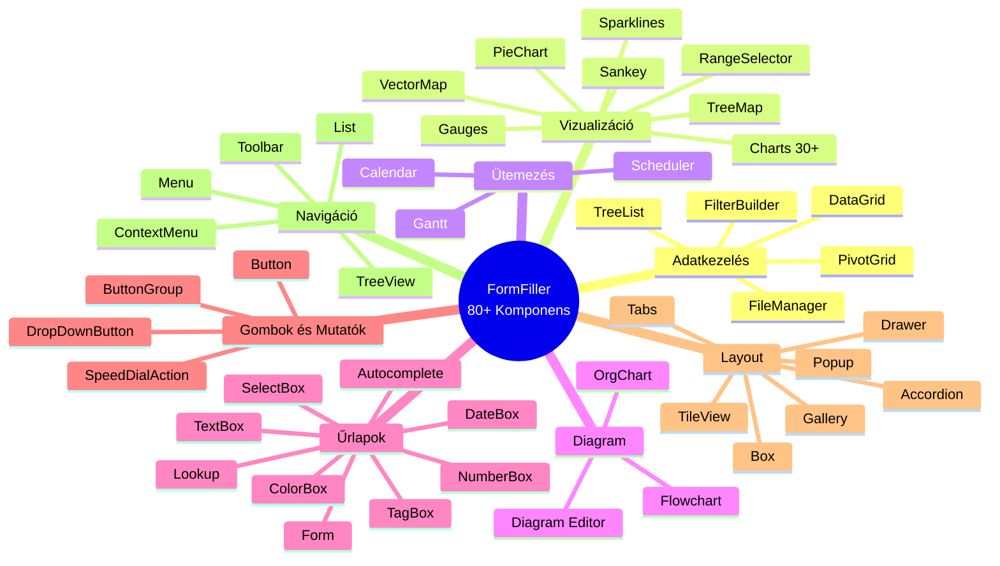
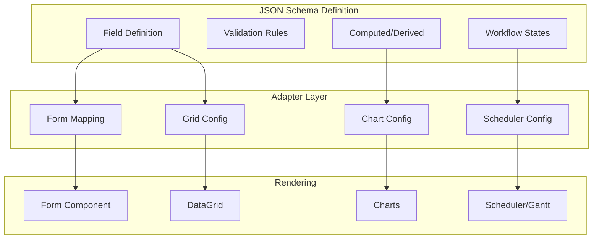
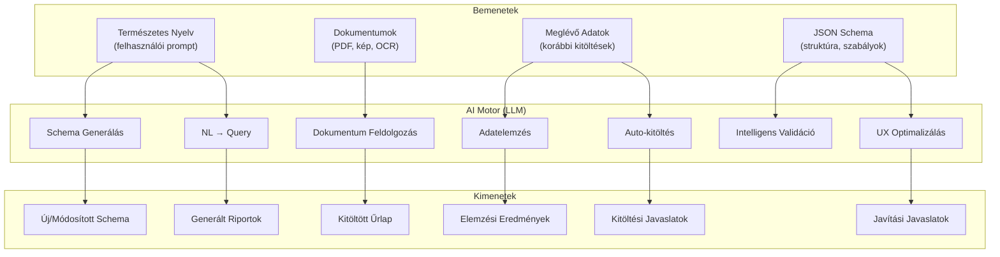
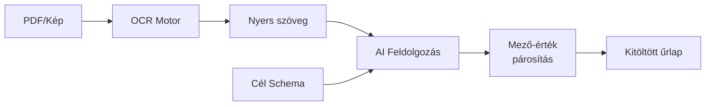
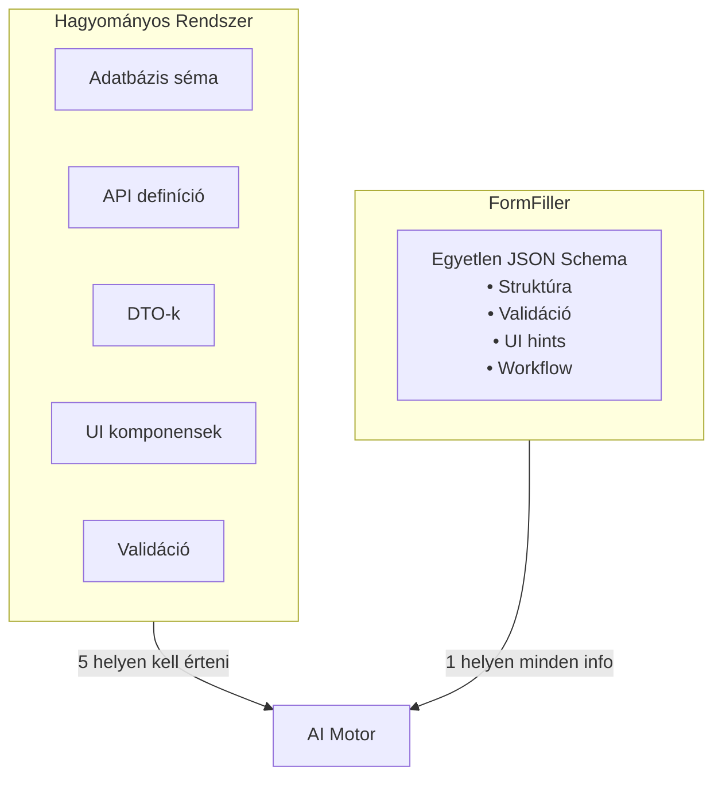
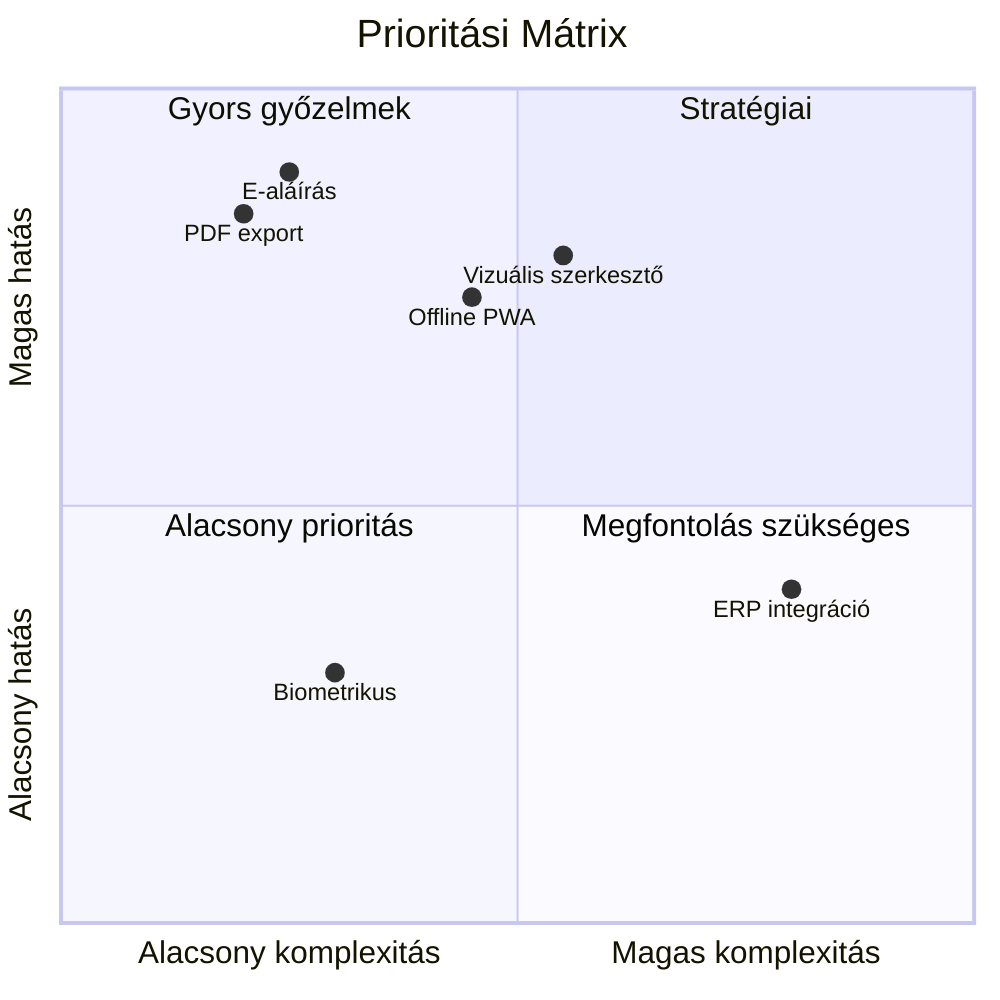
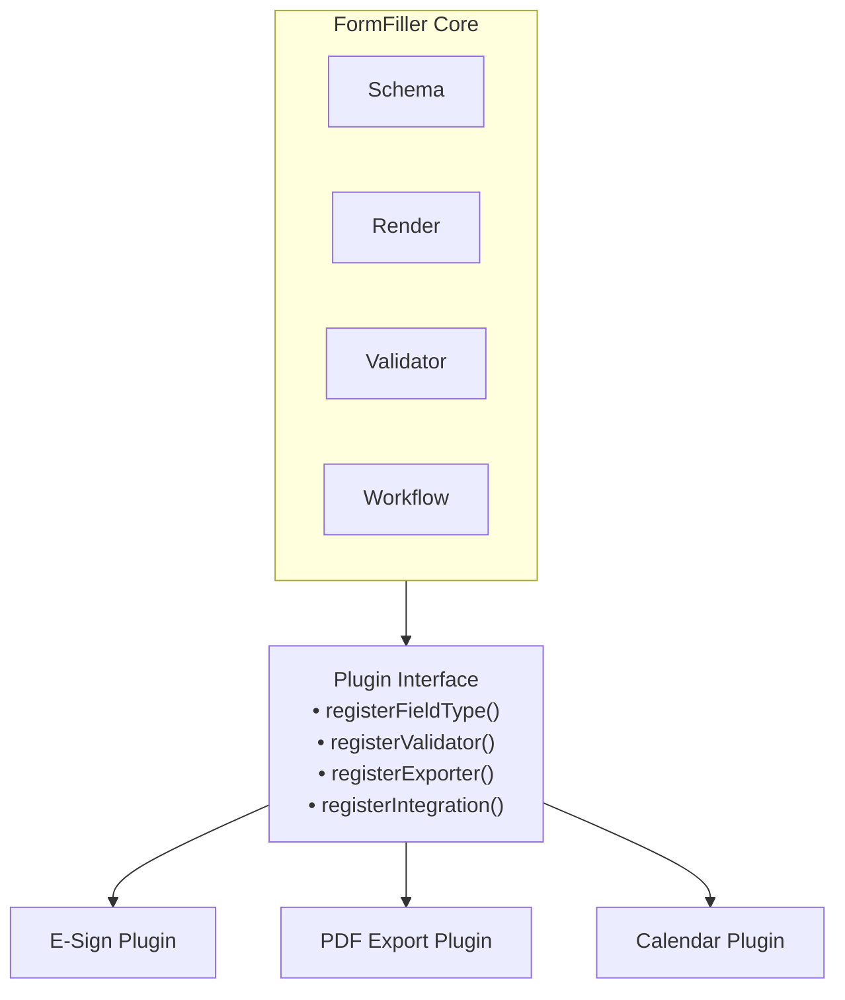

[← Vissza az Alkalmazhatóság főoldalra](index.md)

# Bővítési Lehetőségek

Ez az oldal összefoglalja a FormFiller rendszer fejlesztési irányait, amelyek növelnék az alkalmazhatóságot a különböző iparágakban és funkcionális területeken.

## Tartalomjegyzék

1. [Komponens Integráció](#komponens-integráció)
2. [AI Képességek](#ai-képességek)
3. [Prioritási Mátrix](#prioritási-mátrix)
4. [Magas Prioritású Bővítések](#magas-prioritású-bővítések)
5. [Közepes Prioritású Bővítések](#közepes-prioritású-bővítések)
6. [Alacsony Prioritású Bővítések](#alacsony-prioritású-bővítések)
7. [Iparág-specifikus Bővítések](#iparág-specifikus-bővítések)
8. [Technikai Alapok](#technikai-alapok)

---

## Komponens Integráció

A FormFiller **80+ professzionális, enterprise-grade UI komponenst** biztosít. Ez azt jelenti, hogy az alábbi komponensek mindegyike **natívan elérhető** vagy minimális konfigurációval integrálható.

### Elérhető Komponensek Kategóriánként



### Részletes Komponens Lista

#### Adatkezelés (Data Management)

| Komponens | Leírás | FormFiller Alkalmazás |
|-----------|--------|----------------------|
| **DataGrid** | Fejlett táblázat szűréssel, rendezéssel, csoportosítással | Listák, adatbevitel, keresés, export |
| **TreeList** | Hierarchikus táblázat | Szervezeti struktúra, termékkategóriák |
| **PivotGrid** | Pivot tábla, OLAP-szerű elemzés | Pályázat monitoring, pénzügyi összesítések |
| **FileManager** | Fájl kezelő UI | Dokumentumkezelés, csatolmányok |
| **FilterBuilder** | Vizuális szűrő építő | Komplex keresési feltételek |

#### Vizualizáció (Charts & Gauges)

| Komponens | Leírás | FormFiller Alkalmazás |
|-----------|--------|----------------------|
| **Charts** | 30+ diagram típus (line, bar, area, stb.) | Dashboard, KPI, statisztika |
| **PieChart** | Kör és fánk diagramok | Megoszlás vizualizáció |
| **Gauges** | Körkörös és lineáris mutatók | Teljesítmény, státusz |
| **Sparklines** | Mini inline grafikonok | Táblázatba ágyazott trendek |
| **TreeMap** | Hierarchikus terület diagram | Költségvetés vizualizáció |
| **Sankey** | Folyam diagram | Folyamat/konverzió vizualizáció |
| **VectorMap** | Interaktív térképek | Földrajzi adatok |
| **RangeSelector** | Idősáv választó | Időszak szűrés |

#### Ütemezés (Scheduling)

| Komponens | Leírás | FormFiller Alkalmazás |
|-----------|--------|----------------------|
| **Scheduler** | Naptár és időpontfoglaló | Orvosi időpontok, HR interjúk, oktatási órarend |
| **Gantt** | Projekt ütemezés, függőségek | Pályázat ütemterv, HR onboarding, építési projektek |
| **Calendar** | Egyszerű naptár | Dátum választás |

#### Diagram

| Komponens | Leírás | FormFiller Alkalmazás |
|-----------|--------|----------------------|
| **Diagram** | Általános diagram szerkesztő | Workflow vizualizáció, szervezeti ábra |
| **OrgChart preset** | Szervezeti struktúra | HR, szervezeti felépítés |
| **Flowchart preset** | Folyamatábra | Jóváhagyási folyamatok |

#### Űrlap Elemek (Form Editors)

| Komponens | Leírás | FormFiller Alkalmazás |
|-----------|--------|----------------------|
| **Form** | Layout engine mezőcsoportokkal | Űrlap struktúra |
| **TextBox** | Szöveges input | Általános szöveg |
| **TextArea** | Többsoros szöveg | Leírások, megjegyzések |
| **NumberBox** | Szám input spin gombokkal | Mennyiségek, összegek |
| **DateBox** | Dátum/idő választó | Dátumok |
| **SelectBox** | Lenyíló lista | Egyszeres választás |
| **TagBox** | Többszörös választás címkékkel | Többszörös választás |
| **Lookup** | Kereshető választólista | Nagy listák |
| **Autocomplete** | Automatikus kiegészítés | Keresés |
| **ColorBox** | Szín választó | Testreszabás |
| **Switch** | Be/Ki kapcsoló | Boolean értékek |
| **CheckBox** | Jelölőnégyzet | Elfogadás, opciók |
| **RadioGroup** | Rádiógombok | Kizárólagos választás |
| **Slider** | Csúszka | Tartomány érték |
| **RangeSlider** | Tartomány választó | Min-max |
| **FileUploader** | Fájl feltöltés drag&drop-pal | Csatolmányok |
| **HtmlEditor** | Rich text szerkesztő | Formázott szöveg |
| **Signature** | Aláírás capture | E-aláírás (bővítéssel) |

### Komponensek Iparáganként

| Iparág | Legfontosabb Komponensek |
|--------|--------------------------|
| **Egészségügy** | Scheduler (időpontfoglalás), Charts (vitálok), Gantt (kezelési terv), Form (anamnézis) |
| **Pénzügy** | Charts (dashboard), PivotGrid (riportok), Diagram (workflow), DataGrid (tranzakciók) |
| **Közigazgatás** | Gantt (projektek), Diagram (folyamatok), TreeView (szervezet), FileManager (iratok) |
| **Oktatás** | Scheduler (órarend), Charts (eredmények), DataGrid (hallgatók), HtmlEditor (feladatok) |
| **HR** | Scheduler (interjúk), Gantt (onboarding), Charts (teljesítmény), DataGrid (alkalmazottak) |
| **Telco** | Charts (analitika), TreeList (szolgáltatások), Diagram (hálózat), DataGrid (ügyfelek) |
| **Pályázatok** | Gantt (ütemezés), Charts (költségvetés), PivotGrid (monitoring), TreeView (pályázat struktúra) |

### Integráció a FormFiller Schema-val



> **Fontos:** A komponensek közvetlen integrációja azt jelenti, hogy a FormFiller **nem limitált** az alapvető űrlap funkcionalitásra. Dashboard-ok, projekt menedzsment eszközök, analitika és időpontfoglaló rendszerek mind megvalósíthatók a meglévő architektúrán belül.

---

## AI Képességek

Az egységes JSON schema architektúra **különösen alkalmassá teszi** a FormFiller-t AI-alapú funkciókra. Az alábbiakban részletezzük az elérhető és tervezett AI képességeket.

### AI Integráció Architektúra



### AI Funkciók Részletesen

#### 1. Schema Generálás Természetes Nyelvből

| Jellemző | Leírás |
|----------|--------|
| **Input** | Természetes nyelvű leírás |
| **Output** | Teljes JSON schema validációval |
| **Példa prompt** | "Készíts egy KYC űrlapot bankoknak: személyes adatok, lakcím, foglalkozás, jövedelem, forrás" |

```json
{
  "name": "kyc_form",
  "fields": [
    { "name": "fullName", "type": "text", "label": "Teljes név", "required": true },
    { "name": "birthDate", "type": "date", "label": "Születési dátum", "required": true },
    { "name": "address", "type": "group", "fields": [
      { "name": "zip", "type": "text", "label": "Irányítószám", "validation": { "pattern": "^\\d{4}$" } },
      { "name": "city", "type": "text", "label": "Város" },
      { "name": "street", "type": "text", "label": "Utca, házszám" }
    ]},
    { "name": "occupation", "type": "select", "label": "Foglalkozás", "options": ["Alkalmazott", "Vállalkozó", "Nyugdíjas", "Egyéb"] },
    { "name": "monthlyIncome", "type": "number", "label": "Havi nettó jövedelem (HUF)" },
    { "name": "incomeSource", "type": "multiselect", "label": "Jövedelem forrása", "options": ["Munkabér", "Vállalkozás", "Befektetés", "Nyugdíj", "Egyéb"] }
  ]
}
```

#### 2. Intelligens Validáció

| Validáció típus | Leírás | Példa |
|-----------------|--------|-------|
| **Kontextus-érzékeny** | Ország alapján más formátum | Magyar adószám vs német Steuernummer |
| **Cross-field** | Mezők közötti összefüggés | Születési dátum + életkorfüggő mező |
| **Semantikus** | Értelem alapú ellenőrzés | "Ügyvezető" foglalkozás + "0 Ft jövedelem" → figyelmeztetés |
| **Anomália detekció** | Kiugró értékek jelzése | Átlagostól 10x eltérő összeg |

#### 3. Auto-kitöltés és Javaslatok

| Funkció | Működés |
|---------|---------|
| **Korábbi adatokból** | Felhasználó profiljából előtöltés |
| **Külső adatforrásból** | Irányítószám → város, utcanév |
| **Mintafelismerés** | Hasonló űrlapokból tanulás |
| **Predikció** | Valószínű értékek javaslata |

#### 4. Dokumentum Feldolgozás (OCR + AI)



**Alkalmazási területek:**
- Számla → beszerzési igénylés
- Orvosi lelet → betegdokumentáció
- Igazolvány → személyes adatok
- Szerződés → szerződéskezelő űrlap

#### 5. Természetes Nyelvű Lekérdezés

| Kérdés típus | Példa | Kimenet |
|--------------|-------|---------|
| **Statisztika** | "Hány pályázatot nyújtottak be idén?" | Szám + trend |
| **Szűrés** | "Mutasd az elutasított jóváhagyásokat" | Lista |
| **Összesítés** | "Mi a teljes igényelt támogatás összege?" | Aggregált érték |
| **Trend** | "Hogyan változott a beadások száma?" | Chart |

#### 6. UX Optimalizálás

| Javaslat típus | Leírás |
|----------------|--------|
| **Mező sorrend** | Gyakori kitöltési sorrend alapján átrendezés |
| **Kötelező mezők** | "Ez a mező 95%-ban kitöltetlen, legyen opcionális?" |
| **Alapértelmezések** | "Ezt a mezőt 80%-ban így töltik ki, legyen default?" |
| **Csoportosítás** | "Ezek a mezők gyakran együtt változnak" |

### AI + Komponens Szinergia

| Komponens | AI Funkció | Eredmény |
|---------------------|------------|----------|
| **Form** | Schema generálás | AI generált űrlap automatikusan renderelve |
| **DataGrid** | NL Query | "Mutasd a mai jóváhagyásokat" → szűrt grid |
| **Charts** | Adatelemzés | AI felismert trend → automatikus vizualizáció |
| **Scheduler** | Auto-ütemezés | AI optimalizált időpontok |
| **Gantt** | Projekt tervezés | AI javasolt ütemterv |

### Miért Hatékony az AI a FormFiller-rel?



| Előny | Magyarázat |
|-------|------------|
| **Single Source of Truth** | Az AI egyetlen fájlból kapja meg az összes információt |
| **Strukturált formátum** | JSON natívan feldolgozható az LLM-ek által |
| **Explicit szabályok** | Validáció, típusok, kötelezőség explicit módon definiált |
| **Gazdag kontextus** | Mezőcímkék, leírások, opciók mind benne vannak |
| **Generálhatóság** | AI kimenet közvetlenül használható schema-ként |

---

## Prioritási Mátrix

A bővítéseket az alábbi szempontok alapján értékeljük:

| Szempont | Súly |
|----------|:----:|
| Piaci igény | 30% |
| Több iparágat érint | 25% |
| Implementációs komplexitás (fordított) | 20% |
| ROI potenciál | 15% |
| Stratégiai jelentőség | 10% |



---

## Magas Prioritású Bővítések

### 1. Elektronikus Aláírás (E-Sign)

| Jellemző | Érték |
|----------|-------|
| **Érintett iparágak** | Pénzügy, HR, Közigazgatás, Egészségügy |
| **Komplexitás** | Alacsony-Közepes |
| **Becsült fejlesztési idő** | 2-4 hét |
| **Piaci érték** | Magas |

**Megoldási lehetőségek:**

| Megoldás | Típus | Előny | Hátrány |
|----------|-------|-------|---------|
| DocuSign API | SaaS integráció | Piacvezető, megbízható | Költséges |
| HelloSign | SaaS integráció | Egyszerű API | Limitált funkciók |
| Adobe Sign | SaaS integráció | Enterprise grade | Drága |
| SignatureCanvas | Beépített | Nincs külső függőség | Nem hitelesített |

**Implementációs terv:**

```json
{
  "name": "signature",
  "type": "signature",
  "label": "Aláírás",
  "config": {
    "provider": "docusign|hellosign|native",
    "captureTimestamp": true,
    "captureIP": true,
    "requirePIN": false
  }
}
```

---

### 2. PDF Export / Generálás

| Jellemző | Érték |
|----------|-------|
| **Érintett iparágak** | Pályázat, Közigazgatás, HR, Egészségügy |
| **Komplexitás** | Alacsony |
| **Becsült fejlesztési idő** | 1-2 hét |
| **Piaci érték** | Magas |

**Funkciók:**
- Sablon alapú PDF generálás
- Űrlap adatok behelyettesítése
- PDF/A archiválási formátum
- Vízjel, fejléc/lábléc

**Technológiai opciók:**
- Puppeteer (HTML → PDF)
- PDFKit (Node.js natív)
- Handlebars + PDF sablon

---

### 3. Vizuális Űrlap Szerkesztő (Drag & Drop)

| Jellemző | Érték |
|----------|-------|
| **Érintett iparágak** | Mind |
| **Komplexitás** | Magas |
| **Becsült fejlesztési idő** | 8-12 hét |
| **Piaci érték** | Nagyon magas |

**Funkciók:**
- Drag-and-drop építő
- Előnézet real-time
- JSON export/import
- Sablon galéria

**Technológiai opciók:**
- React DnD / dnd-kit
- GrapesJS alapú
- Egyedi megoldás

---

### 4. Offline PWA Támogatás

| Jellemző | Érték |
|----------|-------|
| **Érintett iparágak** | Gyártás, Építőipar, Mezőgazdaság, Field Service |
| **Komplexitás** | Közepes |
| **Becsült fejlesztési idő** | 4-6 hét |
| **Piaci érték** | Magas |

**Funkciók:**
- Service Worker cache
- IndexedDB adattárolás
- Background sync
- Push értesítések

---

## Közepes Prioritású Bővítések

### 5. WCAG 2.1 AA Akadálymentesség

| Jellemző | Érték |
|----------|-------|
| **Érintett iparágak** | Közigazgatás, Oktatás |
| **Komplexitás** | Közepes |
| **Becsült fejlesztési idő** | 3-4 hét |

**Követelmények:**
- Képernyőolvasó támogatás (ARIA)
- Billentyűzet navigáció
- Kontraszt megfelelőség
- Focus management

---

### 6. Verziókezelés és Audit Trail Bővítés

| Jellemző | Érték |
|----------|-------|
| **Érintett iparágak** | Pályázat, Compliance, Pénzügy |
| **Komplexitás** | Közepes |
| **Becsült fejlesztési idő** | 2-3 hét |

**Funkciók:**
- Verzió összehasonlítás (diff)
- Visszaállítás korábbi verzióra
- Módosítás történet vizualizáció

---

### 7. Naptár Integráció

| Jellemző | Érték |
|----------|-------|
| **Érintett iparágak** | HR, Szolgáltatók, Egészségügy |
| **Komplexitás** | Közepes |
| **Becsült fejlesztési idő** | 2-3 hét |

**Integrációk:**
- Google Calendar API
- Microsoft Graph (Outlook)
- CalDAV standard

---

### 8. Kérdésbank / Randomizálás

| Jellemző | Érték |
|----------|-------|
| **Érintett iparágak** | Oktatás |
| **Komplexitás** | Közepes |
| **Becsült fejlesztési idő** | 3-4 hét |

**Funkciók:**
- Kérdés pool kezelés
- Véletlenszerű sorrend
- Stratified sampling

---

## Alacsony Prioritású Bővítések

### 9. Biometrikus Azonosítás

| Jellemző | Érték |
|----------|-------|
| **Érintett iparágak** | Pénzügy, Egészségügy |
| **Komplexitás** | Magas |
| **Becsült fejlesztési idő** | 6-8 hét |

---

### 10. ERP / Core System Integráció

| Jellemző | Érték |
|----------|-------|
| **Érintett iparágak** | Gyártás, Pénzügy, Telco |
| **Komplexitás** | Magas |
| **Becsült fejlesztési idő** | 8-16 hét (rendszerenként) |

**Potenciális integrációk:**
- SAP RFC/BAPI
- Oracle REST
- Microsoft Dynamics

---

### 11. Machine Learning Integráció

| Jellemző | Érték |
|----------|-------|
| **Érintett iparágak** | CRM, Compliance |
| **Komplexitás** | Magas |
| **Becsült fejlesztési idő** | 8-12 hét |

**Alkalmazások:**
- Automatikus kategorizálás
- Anomália detektálás
- Prediktív kitöltés

---

## Iparág-specifikus Bővítések

### Egészségügy

| Bővítés | Prioritás | Komplexitás |
|---------|:---------:|:-----------:|
| HL7 FHIR API | Magas | Közepes |
| ICD-10 lookup | Közepes | Alacsony |
| HIPAA compliance tools | Magas | Közepes |

### Pénzügy

| Bővítés | Prioritás | Komplexitás |
|---------|:---------:|:-----------:|
| KYC/AML integráció | Közepes | Közepes |
| Hitelminősítő API | Közepes | Közepes |
| PSD2 compliance | Alacsony | Magas |

### Közigazgatás

| Bővítés | Prioritás | Komplexitás |
|---------|:---------:|:-----------:|
| Ügyfélkapu OAuth | Magas | Közepes |
| ÁNYK export | Közepes | Alacsony |
| E-Szignó integráció | Magas | Közepes |

### Telco

| Bővítés | Prioritás | Komplexitás |
|---------|:---------:|:-----------:|
| CPQ modul | Magas | Magas |
| Termékkatalógus | Magas | Közepes |
| Provisioning API | Közepes | Magas |

### Pályázat

| Bővítés | Prioritás | Komplexitás |
|---------|:---------:|:-----------:|
| PDF export sablonok | Magas | Alacsony |
| Indikátor dashboard | Közepes | Alacsony |
| Verzió diff | Magas | Közepes |

---

## Technikai Alapok

### Plugin Architektúra

A bővítések támogatásához javasolt plugin rendszer:



### Marketplace Koncepció

Jövőbeli cél: plugin marketplace

| Kategória | Példák |
|-----------|--------|
| Integrations | DocuSign, Salesforce, SAP |
| Field Types | Signature, Calendar, Map |
| Exporters | PDF, Excel, SPSS |
| Themes | Material, Bootstrap |
| Industry Packs | Healthcare, Finance, Gov |

---

## Összefoglaló Táblázat

| Bővítés | Prioritás | Komplexitás | Érintett iparágak | Státusz |
|---------|:---------:|:-----------:|-------------------|:-------:|
| E-aláírás | Magas | Alacsony | Mind | Tervezett |
| PDF export | Magas | Alacsony | Mind | Tervezett |
| Vizuális szerkesztő | Magas | Magas | Mind | Roadmap |
| Offline PWA | Magas | Közepes | Field service | Roadmap |
| WCAG 2.1 | Közepes | Közepes | Közigazgatás | Roadmap |
| Verziókezelés | Közepes | Közepes | Pályázat | Roadmap |
| Naptár integráció | Közepes | Közepes | HR, Szolgáltatás | Roadmap |
| Kérdésbank | Közepes | Közepes | Oktatás | Roadmap |
| HL7 FHIR | Közepes | Közepes | Egészségügy | Roadmap |
| Ügyfélkapu | Közepes | Közepes | Közigazgatás | Roadmap |
| CPQ modul | Közepes | Magas | Telco, Értékesítés | Roadmap |
| ERP integráció | Alacsony | Magas | Enterprise | Hosszú táv |
| ML integráció | Alacsony | Magas | Speciális | Hosszú táv |

---

## Kapcsolódó Dokumentációk

- [Alkalmazhatóság Főoldal](./index.md)
- [Roadmap](../roadmap.md) - Hivatalos fejlesztési terv
- [Architektúra](../architecture.md) - Technikai alapok
