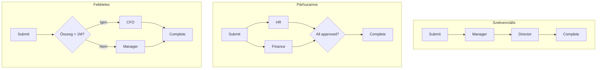

[← Vissza a Funkciók oldalra](index.md)

# Jóváhagyási Workflow

A jóváhagyási workflow a FormFiller egyik legkiemelkedőbb képessége, ahol a beépített workflow engine teljes körű támogatást nyújt többlépcsős engedélyezési folyamatokhoz.

## Értékelés

| Metrika | Érték |
|---------|-------|
| **Jelenlegi megfelelőség** | ★★★★★ |
| **Fejlesztési potenciál** | ★★★★★ |
| **Piaci méret** | $10-20 Mrd |
| **Megtakarítás** | 70-90% |
| **Siker** | Magas |

## Piaci Megoldások

| Szoftver | Típus | Ár (felh./hó) |
|----------|-------|---------------|
| ServiceNow | Enterprise BPM | $100+ |
| Kissflow | Low-code workflow | $15-30 |
| ProcessMaker | Open source BPM | $0-50 |
| Microsoft Power Automate | Workflow | $15-40 |

## FormFiller Alkalmazási Területek

### Támogatott Funkciók

| Funkció | Támogatás | Megjegyzés |
|---------|:---------:|------------|
| Többlépcsős jóváhagyás | ★★★★★ | Workflow engine |
| Szekvenciális routing | ★★★★★ | Beépített |
| Párhuzamos jóváhagyás | ★★★★☆ | Konfigurálható |
| Feltételes routing | ★★★★★ | Szabályalapú |
| Delegálás | ★★★★☆ | RBAC |
| Határidő kezelés | ★★★★☆ | SLA |
| Email értesítés | ★★★★☆ | Webhook |

### Workflow Típusok



## Bővítési Lehetőségek

| Komponens | Workflow Alkalmazás | Előny |
|-----------|---------------------|-------|
| **Diagram** | Workflow vizualizáció | Interaktív folyamatábra |
| **DataGrid** | Jóváhagyás lista | Szűrés, státusz |
| **Gantt** | SLA ütemezés | Határidő nyomon követés |
| **Charts** | Workflow dashboard | KPI-k, teljesítmény |
| **TreeView** | Jóváhagyási hierarchia | Szervezeti struktúra |

## AI Integráció

| AI Funkció | Leírás | Előny |
|------------|--------|-------|
| **Automatikus előszűrés** | Szabályalapú ellenőrzés | Gyorsabb feldolgozás |
| **Anomália detekció** | Szokatlan kérések | Fraud megelőzés |
| **Jóváhagyó javaslat** | Historikus adatok alapján | Optimális routing |
| **SLA predikció** | Átfutási idő becslés | Proaktív escalation |
| **Döntés támogatás** | Hasonló esetek | Konzisztens döntések |
| **NL keresés** | "Mutasd az én függő jóváhagyásaimat" | Gyors áttekintés |

## Pro/Kontra

**Előnyök:**
- Beépített workflow engine
- 70-90% költségmegtakarítás
- Komplex routing szabályok
- Audit trail
- Self-hosted

**Hátrányok:**
- Nincs vizuális workflow tervező
- Komplex workflow kódolást igényel
- Korlátozott párhuzamos ágak

## Mikor Válaszd?

| Szcenárió | Ajánlott? |
|-----------|:---------:|
| Szabadságkérelem | ✅ Igen |
| Beszerzési igénylés | ✅ Igen |
| Dokumentum jóváhagyás | ✅ Igen |
| Komplex BPM | 🔶 Részben |
| Integráció-intenzív | 🔶 Részben |

## Példa: Beszerzési Workflow

```json
{
  "name": "purchaseRequest",
  "workflow": {
    "steps": [
      {
        "id": "submit",
        "type": "form",
        "next": "managerApproval"
      },
      {
        "id": "managerApproval",
        "type": "approval",
        "assignee": "{{submitter.manager}}",
        "sla": "3 days",
        "actions": {
          "approve": {
            "next": "{{amount > 1000000 ? 'cfoApproval' : 'procurement'}}"
          },
          "reject": { "next": "rejected" },
          "requestInfo": { "next": "submit" }
        }
      },
      {
        "id": "cfoApproval",
        "type": "approval",
        "assignee": "role:cfo",
        "sla": "5 days",
        "actions": {
          "approve": { "next": "procurement" },
          "reject": { "next": "rejected" }
        }
      },
      {
        "id": "procurement",
        "type": "task",
        "assignee": "role:procurement",
        "next": "completed"
      },
      {
        "id": "completed",
        "type": "end",
        "actions": [
          { "type": "notify", "to": "submitter" },
          { "type": "archive" }
        ]
      },
      {
        "id": "rejected",
        "type": "end",
        "actions": [
          { "type": "notify", "to": "submitter", "template": "rejected" }
        ]
      }
    ]
  }
}
```

## Bővítési Lehetőségek

| Fejlesztés | Komplexitás |
|------------|:-----------:|
| Vizuális workflow editor | Magas |
| Escalation automatikus | Alacsony |
| SLA dashboard | Alacsony |
| Helyettesítés kezelés | Közepes |

---

[← Vissza a Funkciók Összefoglalóhoz](./index.md)
