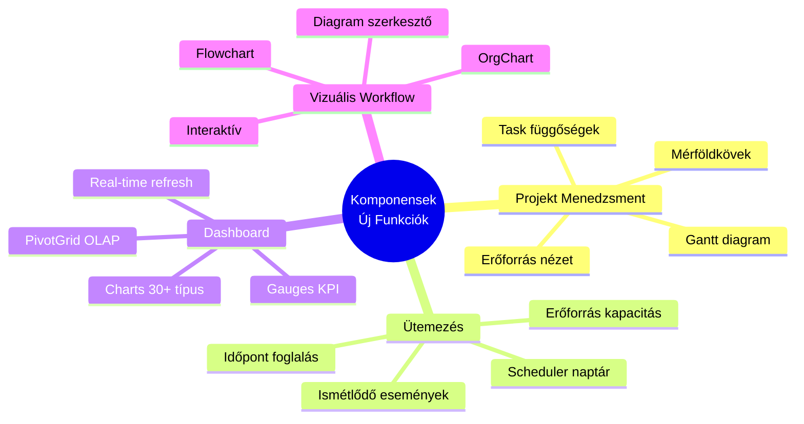
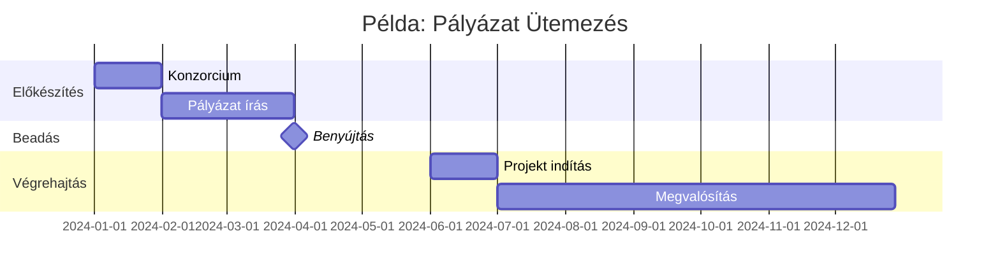
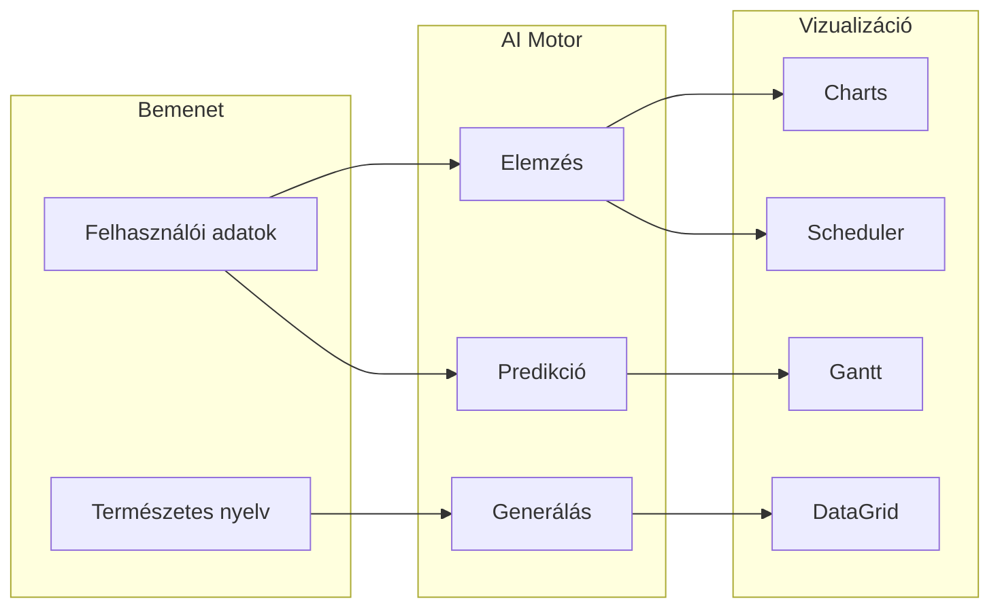

[← Vissza az Alkalmazhatóság főoldalra](../index.md)

# Funkcionális Alkalmazhatóság

Ez az oldal összefoglalja a FormFiller rendszer alkalmazhatóságát különböző funkcionális területeken, összehasonlítva a piaci megoldásokkal.

## Tartalomjegyzék

1. [Értékelési Módszertan](#értékelési-módszertan)
2. [Komponensek Által Lehetővé Tett Funkciók](#komponensek-által-lehetővé-tett-funkciók)
3. [AI Automatizáció](#ai-automatizáció)
4. [Kiemelt Funkciók (részletes elemzéssel)](#kiemelt-funkciók)
5. [További Funkciók](#további-funkciók)
6. [Összefoglaló Táblázat](#összefoglaló-táblázat)

---

## Értékelési Módszertan

### Értékelési Szempontok

| Szempont | Leírás |
|----------|--------|
| **Megfelelőség** | Mennyire alkalmas a FormFiller jelenlegi állapotában |
| **Potenciál** | Milyen fejlesztési lehetőségek rejlenek |
| **Piaci méret** | Globális piac becsült értéke |
| **Megtakarítás** | Várható költségcsökkenés |
| **Siker** | Piaci siker valószínűsége |

### Csillagos Értékelés

| Csillag | Jelentés |
|---------|----------|
| ★★★★★ | Kiváló - Azonnal alkalmazható |
| ★★★★☆ | Nagyon jó - Kisebb testreszabással |
| ★★★☆☆ | Jó - Közepes fejlesztéssel |
| ★★☆☆☆ | Mérsékelt - Jelentős fejlesztés kell |
| ★☆☆☆☆ | Alacsony - Nem ajánlott |

---

## Komponensek Által Lehetővé Tett Funkciók

A FormFiller **80+ professzionális UI komponenst** kínál. Ez jelentősen kibővíti a funkcionális képességeit az alap űrlapkezelésen túl.

### Új Funkcionális Képességek

### Gantt Diagram Integráció

A **Gantt komponens** lehetővé teszi a komplex projekt ütemezést közvetlenül a FormFiller-ben.

| Funkció | Leírás | Alkalmazás |
|---------|--------|------------|
| **Task ütemezés** | Drag & drop feladatok | Pályázat ütemterv, HR onboarding |
| **Függőségek** | Finish-to-start, stb. | Építési projektek, folyamatok |
| **Erőforrások** | Erőforrás hozzárendelés | Kapacitás tervezés |
| **Mérföldkövek** | Kulcs dátumok | Projekt monitoring |
| **Kritikus út** | Auto számítás | Projekt optimalizálás |
| **Export** | PDF, PNG | Riportok |

### Scheduler / Időpontfoglaló

A **Scheduler komponens** teljes naptár funkcionalitást biztosít.

| Funkció | Leírás | Alkalmazás |
|---------|--------|------------|
| **Naptár nézetek** | Nap, hét, hónap, agenda | Orvosi időpontok, interjúk |
| **Erőforrás csoportok** | Párhuzamos naptárak | Több orvos, tárgyaló |
| **Drag & drop** | Esemény mozgatás | Átütemezés |
| **Ismétlődés** | RRule támogatás | Rendszeres találkozók |
| **Színkódolás** | Státusz alapú | Vizuális kategorizálás |
| **Integráció** | Google/Outlook sync | Külső naptár |

### Dashboard és Analitika

A **Charts, Gauges és PivotGrid** komponensek komplex dashboard-ok építését teszik lehetővé.

| Komponens | Típusok | Alkalmazás |
|-----------|---------|------------|
| **Charts** | Line, Bar, Area, Pie, Doughnut, Scatter, Bubble, Stock, Range, Polar | KPI, trendek, összehasonlítás |
| **Gauges** | Circular, Linear, Bullet | Státusz, teljesítmény |
| **PivotGrid** | OLAP-szerű pivot | Pénzügyi riportok, monitoring |
| **Sparklines** | Inline mini charts | Táblázatba ágyazott trendek |
| **TreeMap** | Hierarchikus | Költségvetés vizualizáció |
| **Sankey** | Flow diagram | Konverzió, folyamat |

### Diagram / Workflow Vizualizáció

A **Diagram komponens** interaktív workflow szerkesztést és megjelenítést tesz lehetővé.

| Funkció | Leírás | Alkalmazás |
|---------|--------|------------|
| **Flowchart** | Folyamatábra | Jóváhagyási workflow |
| **OrgChart** | Szervezeti ábra | HR, struktúra |
| **Custom shapes** | Egyedi alakzatok | Iparág-specifikus |
| **Auto-layout** | Automatikus elrendezés | Komplex diagramok |
| **Export** | SVG, PNG | Dokumentáció |

### Komponens-Funkció Megfeleltetés

| Funkció | Fő Komponens | Kiegészítő Komponensek |
|---------|-------------------------|------------------------|
| **Projektmenedzsment** | Gantt | DataGrid, Charts |
| **Időpontfoglalás** | Scheduler | Calendar, Form |
| **Dashboard** | Charts, PivotGrid | Gauges, DataGrid |
| **Workflow vizualizáció** | Diagram | TreeView |
| **CRM** | DataGrid | Charts, Form |
| **Ticketing** | DataGrid | Diagram, Charts |
| **Felmérések** | Form | Charts, PivotGrid |
| **Dokumentumkezelés** | FileManager | DataGrid, TreeView |
| **Konfigurátor** | TreeView, Form | DataGrid, Charts |

---

## AI Automatizáció

Az egységes JSON schema architektúra **minden funkcióban** lehetővé teszi az AI integrációt.

### AI Funkciónként

| Funkció | AI Alkalmazás | Várható Megtakarítás |
|---------|---------------|---------------------|
| **CRM** | Lead scoring, auto-routing, prediktív értékesítés | 30-50% |
| **Ticketing** | Automatikus kategorizálás, prioritás, válasz javaslat | 40-60% |
| **Felmérések** | Automatikus elemzés, sentiment analysis, javaslatok | 50-70% |
| **Jóváhagyás** | Automatikus előszűrés, anomália detekció | 30-50% |
| **Konfigurátor** | Intelligens javaslatok, optimalizálás | 20-40% |
| **Compliance** | Automatikus ellenőrzés, kockázat scoring | 40-60% |
| **Regisztráció** | Automatikus validáció, duplikáció detekció | 30-50% |
| **Dokumentumkezelés** | OCR, automatikus kategorizálás, keresés | 50-70% |

### AI + Komponens Szinergia

**Példa munkafolyamatok:**

1. **AI Generált Dashboard**: "Mutasd az elmúlt hónap KPI-jait" → AI query → Charts komponens megjelenítés
2. **Intelligens Ütemezés**: AI optimalizált időpontok → Scheduler automatikus kitöltés
3. **Prediktív Projekt Terv**: Historikus adatok alapján → Gantt diagram javaslat
4. **Automatikus Riport**: NL kérdés → PivotGrid aggregáció

---

## Kiemelt Funkciók

Az alábbi funkciókhoz részletes elemzés készült.

### CRM / Ügyfélkezelés

**[Részletes elemzés →](./crm.md)**

| Jellemző | Érték |
|----------|-------|
| Megfelelőség | ★★★☆☆ |
| Potenciál | ★★★★☆ |
| Piaci méret | $60-90 Mrd |
| Megtakarítás | 40-60% |
| Siker | Közepes |

**Alkalmazási területek:**
- Lead capture űrlapok
- Ügyfél adatlap
- Kapcsolatfelvételi űrlap
- Sales pipeline űrlapok

**Piaci megoldások:** Salesforce, HubSpot, Zoho CRM, Pipedrive

---

### Helpdesk / Ticketing

**[Részletes elemzés →](./ticketing.md)**

| Jellemző | Érték |
|----------|-------|
| Megfelelőség | ★★★★☆ |
| Potenciál | ★★★★★ |
| Piaci méret | $15-25 Mrd |
| Megtakarítás | 60-80% |
| Siker | Magas |

**Alkalmazási területek:**
- Hibabejelentés, ticket nyitás
- Kategorizálás, prioritás
- Jóváhagyási workflow
- SLA követés

**Piaci megoldások:** Zendesk, Freshdesk, Jira Service Desk

---

### Felmérések / Kérdőívek

**[Részletes elemzés →](./survey.md)**

| Jellemző | Érték |
|----------|-------|
| Megfelelőség | ★★★★★ |
| Potenciál | ★★★★☆ |
| Piaci méret | $5-10 Mrd |
| Megtakarítás | 90-98% |
| Siker | Magas |

**Alkalmazási területek:**
- Piackutatás
- Elégedettségi felmérés
- Visszajelzés gyűjtés
- 360° értékelés

**Piaci megoldások:** SurveyMonkey, Typeform, Qualtrics, Google Forms

---

### Jóváhagyási Workflow

**[Részletes elemzés →](./approval-workflow.md)**

| Jellemző | Érték |
|----------|-------|
| Megfelelőség | ★★★★★ |
| Potenciál | ★★★★★ |
| Piaci méret | $10-20 Mrd |
| Megtakarítás | 70-90% |
| Siker | Magas |

**Alkalmazási területek:**
- Beszerzési igénylés
- Szabadságkérelem
- Dokumentum jóváhagyás
- Többlépcsős engedélyezés

**Piaci megoldások:** ServiceNow, Kissflow, ProcessMaker

---

### Konfigurátor Rendszerek

**[Részletes elemzés →](./configurator.md)**

| Jellemző | Érték |
|----------|-------|
| Megfelelőség | ★★★☆☆ |
| Potenciál | ★★★★★ |
| Piaci méret | $20-40 Mrd |
| Megtakarítás | 50-70% |
| Siker | Közepes |

**Alkalmazási területek:**
- Termék konfiguráció
- Szolgáltatás összeállítás
- Árkalkuláció (CPQ)
- Ajánlatkészítés

**Piaci megoldások:** Salesforce CPQ, Configure One, Tacton

---

## További Funkciók

### Projektmenedzsment

| Jellemző | Érték |
|----------|-------|
| Megfelelőség | ★★★★☆ |
| Potenciál | ★★★★★ |
| Piaci méret | $8-15 Mrd |
| Megtakarítás | 50-70% |
| Siker | Közepes |
| **Komponensek** | Gantt, DataGrid, Charts |

**Mire alkalmas:**
- Projekt indító űrlap
- Státusz jelentés
- Erőforrás igénylés
- Változáskérelem
- **Gantt diagram**
- **Task függőségek és mérföldkövek**
- **Erőforrás naptár** (Scheduler)

**Bővítések:**
- Gantt komponens: vizuális ütemezés, drag & drop
- Scheduler: erőforrás kapacitás nézet
- Charts: projekt dashboard, KPI-k

**AI lehetőségek:**
- Automatikus ütemterv javaslat historikus adatokból
- Kockázat előrejelzés
- Erőforrás optimalizálás

**Piaci megoldások:** Asana, Monday, ClickUp, Jira

---

### Dokumentumkezelés

| Jellemző | Érték |
|----------|-------|
| Megfelelőség | ★★★★☆ |
| Potenciál | ★★★★★ |
| Piaci méret | $10-20 Mrd |
| Megtakarítás | 50-70% |
| Siker | Közepes |
| **Komponensek** | FileManager, DataGrid, TreeView |

**Mire alkalmas:**
- Dokumentum feltöltés, metaadat
- **Vizuális fájlkezelő** (FileManager)
- Jóváhagyási workflow
- Verziókezelés
- **Mappák és hierarchia** (TreeView)
- Keresés, szűrés

**Bővítések:**
- FileManager: teljes fájlkezelő UI
- Drag & drop feltöltés
- Thumbnail előnézet
- Context menu műveletek

**AI lehetőségek:**
- OCR alapú dokumentum feldolgozás
- Automatikus kategorizálás
- Tartalom alapú keresés
- Metaadat kinyerés

**Piaci megoldások:** SharePoint, Alfresco, M-Files

---

### Időpontfoglalás

| Jellemző | Érték |
|----------|-------|
| Megfelelőség | ★★★★★ |
| Potenciál | ★★★★★ |
| Piaci méret | $3-6 Mrd |
| Megtakarítás | 80-95% |
| Siker | Magas |
| **Komponensek** | Scheduler, Calendar, Form |

**Mire alkalmas:**
- Foglalási űrlap
- **Vizuális naptár nézet** (Scheduler)
- **Erőforrás kapacitás kezelés**
- Visszaigazolás workflow
- **Ismétlődő események** (RRule)
- **Drag & drop átütemezés**

**Bővítések:**
- Scheduler: teljes naptár funkcionalitás
- Több nézet: nap, hét, hónap, agenda
- Erőforrás csoportok: több orvos, tárgyaló
- Színkódolás státusz alapján

**AI lehetőségek:**
- Intelligens időpont javaslat preferenciák alapján
- Automatikus konfliktus kezelés
- Prediktív kapacitás tervezés

**Külső integráció:**
- Google Calendar sync
- Microsoft Outlook sync

**Piaci megoldások:** Calendly, Acuity, SimplyBook.me

---

### Compliance / Audit

| Jellemző | Érték |
|----------|-------|
| Megfelelőség | ★★★★☆ |
| Potenciál | ★★★★★ |
| Piaci méret | $8-15 Mrd |
| Megtakarítás | 60-80% |
| Siker | Magas |

**Mire alkalmas:**
- Ellenőrzőlisták (checklist)
- Kockázatértékelés űrlapok
- Audit jelentések
- Megfelelőségi nyilatkozatok

**FormFiller előnyök:**
- Beépített audit trail
- Verziókövetés
- RBAC jogosultságkezelés

**Piaci megoldások:** AuditBoard, LogicGate, ServiceNow GRC

---

### Inventory / Leltár

| Jellemző | Érték |
|----------|-------|
| Megfelelőség | ★★★☆☆ |
| Potenciál | ★★★☆☆ |
| Piaci méret | $5-10 Mrd |
| Megtakarítás | 40-60% |
| Siker | Alacsony |

**Mire alkalmas:**
- Leltár felvétel
- Anyagigénylés
- Selejtezés
- Készlet módosítás

**Korlátozások:**
- Nincs készletkezelés
- Nincs automatikus rendelés
- Nincs vonalkód natívan

**Piaci megoldások:** Cin7, Fishbowl, Zoho Inventory

---

### Szerződéskezelés

| Jellemző | Érték |
|----------|-------|
| Megfelelőség | ★★★★☆ |
| Potenciál | ★★★★☆ |
| Piaci méret | $5-10 Mrd |
| Megtakarítás | 50-70% |
| Siker | Közepes |

**Mire alkalmas:**
- Szerződés adatok rögzítése
- Jóváhagyási workflow
- Lejárat követés
- Módosítások kezelése

**Szükséges bővítések:**
- E-aláírás integráció
- PDF generálás
- CLM funkciók

**Piaci megoldások:** DocuSign CLM, Ironclad, Agiloft

---

### Regisztráció / Beiratkozás

| Jellemző | Érték |
|----------|-------|
| Megfelelőség | ★★★★★ |
| Potenciál | ★★★★☆ |
| Piaci méret | $3-6 Mrd |
| Megtakarítás | 80-95% |
| Siker | Magas |

**Mire alkalmas:**
- Esemény regisztráció
- Kurzus beiratkozás
- Tagság jelentkezés
- Konferencia regisztráció

**FormFiller előnyök:**
- Komplex feltételes logika
- Csoportos regisztráció
- Fizetés integráció (bővítéssel)

**Piaci megoldások:** RegFox, Cvent, Eventbrite

---

### Panaszkezelés

| Jellemző | Érték |
|----------|-------|
| Megfelelőség | ★★★★☆ |
| Potenciál | ★★★★★ |
| Piaci méret | $4-8 Mrd |
| Megtakarítás | 60-80% |
| Siker | Magas |

**Mire alkalmas:**
- Panasz bejelentés
- Kategorizálás, routing
- Kivizsgálás workflow
- Válasz és lezárás

**FormFiller előnyök:**
- Többlépcsős workflow
- SLA követés
- Audit trail

**Piaci megoldások:** Zendesk, Freshdesk, Salesforce Service

---

### Minőségbiztosítás (QA)

| Jellemző | Érték |
|----------|-------|
| Megfelelőség | ★★★★☆ |
| Potenciál | ★★★★☆ |
| Piaci méret | $6-12 Mrd |
| Megtakarítás | 50-70% |
| Siker | Közepes |

**Mire alkalmas:**
- QA ellenőrzőlisták
- Non-conformance jelentés
- CAPA (Corrective Action)
- Audit dokumentáció

**FormFiller előnyök:**
- Komplex validáció
- Workflow támogatás
- Audit trail

**Piaci megoldások:** Qualio, Veeva QMS, MasterControl

---

## Összefoglaló Táblázat

| Funkció | Megfelelőség | Potenciál | Komponensek | AI | Megtakarítás | Részletek |
|---------|:------------:|:---------:|:----------:|:--:|:------------:|:---------:|
| **CRM/Ügyfélkezelés** | ★★★☆☆ | ★★★★☆ | DataGrid, Charts | Közepes | 40-60% | [Link](./crm.md) |
| **Helpdesk/Ticketing** | ★★★★☆ | ★★★★★ | DataGrid, Diagram | Magas | 60-80% | [Link](./ticketing.md) |
| **Felmérések/Kérdőívek** | ★★★★★ | ★★★★☆ | Form, Charts | Magas | 90-98% | [Link](./survey.md) |
| **Jóváhagyási workflow** | ★★★★★ | ★★★★★ | Diagram, DataGrid | Magas | 70-90% | [Link](./approval-workflow.md) |
| **Konfigurátor** | ★★★☆☆ | ★★★★★ | TreeView, Form | Közepes | 50-70% | [Link](./configurator.md) |
| **Projektmenedzsment** | ★★★★☆ | ★★★★★ | Gantt, Scheduler | Magas | 50-70% | - |
| **Időpontfoglalás** | ★★★★★ | ★★★★★ | Scheduler, Calendar | Magas | 80-95% | - |
| **Dashboard/Analitika** | ★★★★★ | ★★★★★ | Charts, PivotGrid | Magas | 70-90% | - |
| Dokumentumkezelés | ★★★★☆ | ★★★★★ | FileManager | Magas | 50-70% | - |
| Compliance/Audit | ★★★★☆ | ★★★★★ | DataGrid, Charts | Magas | 60-80% | - |
| Inventory/Leltár | ★★★☆☆ | ★★★☆☆ | DataGrid, TreeList | Alacsony | 40-60% | - |
| Szerződéskezelés | ★★★★☆ | ★★★★☆ | DataGrid, FileManager | Közepes | 50-70% | - |
| Regisztráció | ★★★★★ | ★★★★☆ | Form, Scheduler | Közepes | 80-95% | - |
| Panaszkezelés | ★★★★☆ | ★★★★★ | DataGrid, Diagram | Magas | 60-80% | - |
| Minőségbiztosítás | ★★★★☆ | ★★★★☆ | DataGrid, Charts | Közepes | 50-70% | - |

---

## Kategorizálás Megfelelőség Szerint

### Kiválóan Alkalmas (★★★★★)

- **Felmérések/Kérdőívek**: Natív támogatás, automatikus kiértékelés, AI elemzés
- **Jóváhagyási workflow**: Beépített workflow engine, Diagram vizualizáció
- **Regisztráció**: Komplex űrlapok, feltételes logika
- **Időpontfoglalás**: Scheduler komponens, erőforrás kezelés
- **Dashboard/Analitika**: Charts, PivotGrid, Gauges

### Nagyon Jó (★★★★☆)

- **Helpdesk/Ticketing**: Workflow + validáció, AI kategorizálás
- **Compliance/Audit**: Audit trail, RBAC, Charts riportok
- **Projektmenedzsment**: Gantt diagram, Scheduler, komponens bővítés
- **Dokumentumkezelés**: FileManager komponens, AI OCR
- **Szerződéskezelés**: Jóváhagyás, metaadat, FileManager
- **Panaszkezelés**: Workflow, SLA, AI routing
- **Minőségbiztosítás**: Checklist, CAPA, Charts

### Jó Alapokkal (★★★☆☆)

- **CRM**: Lead capture, DataGrid, de nem full CRM
- **Konfigurátor**: TreeView, bővítéssel CPQ
- **Inventory**: DataGrid, leltár, de nem WMS

---

## Kapcsolódó Dokumentációk

- [Alkalmazhatóság Főoldal](../index.md) - Átfogó összefoglaló
- [Iparági Elemzés](../industries/index.md) - Iparág alapú értékelés
- [Bővítési Lehetőségek](../extensions.md) - Fejlesztési irányok
- [Összehasonlítások](../../comparison.md) - Form builder összehasonlítás
