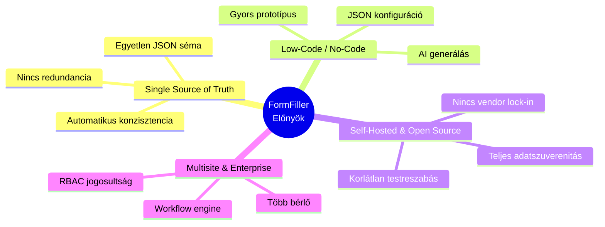
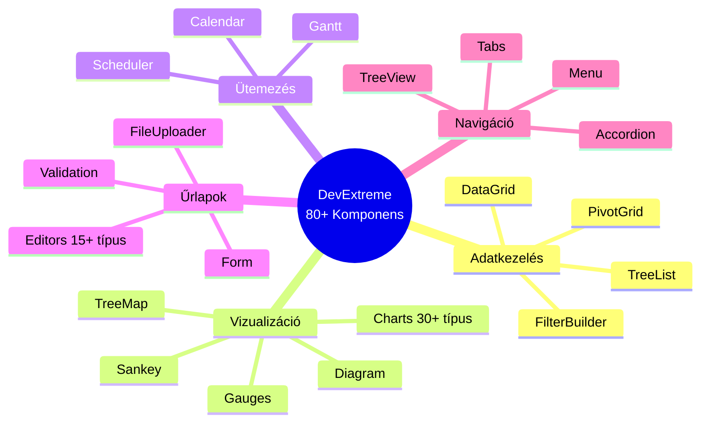
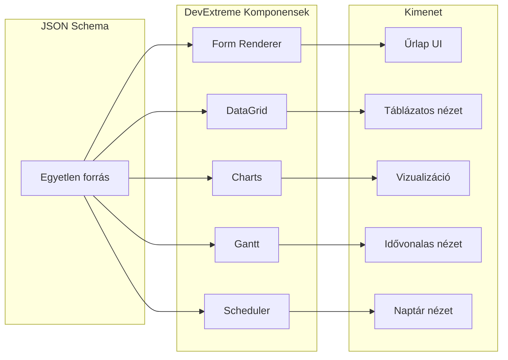
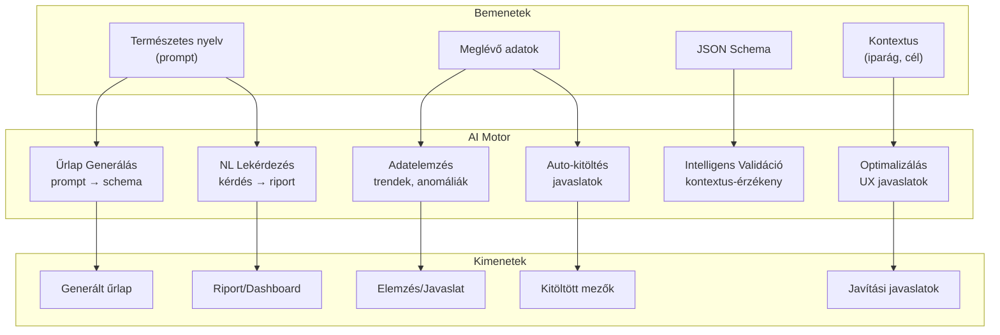
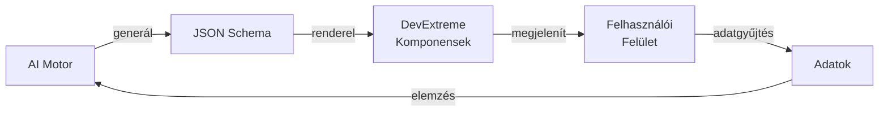
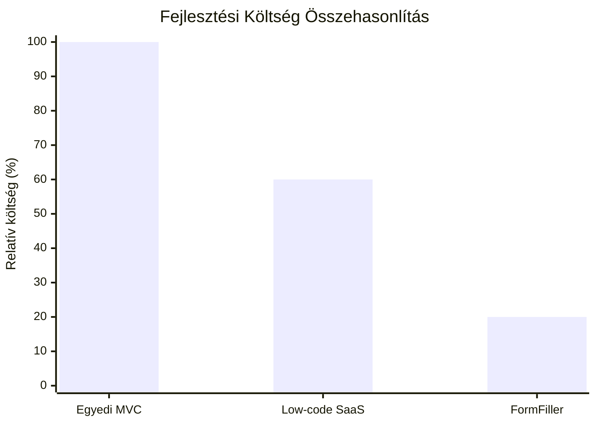
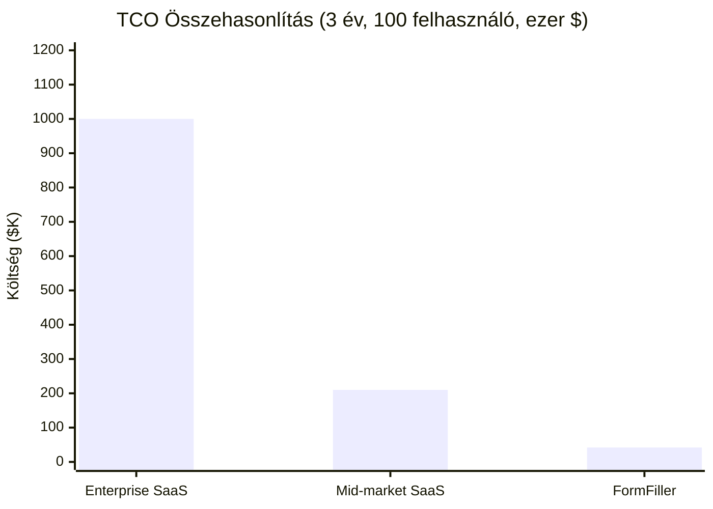
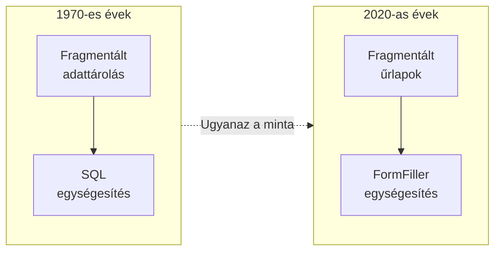

# FormFiller Alkalmazhatóság

Ez a dokumentáció átfogóan vizsgálja a FormFiller rendszer alkalmazhatóságát különböző iparágakban és funkcionális területeken, összehasonlítva a piacon elérhető hagyományos szoftverekkel.

## Tartalomjegyzék

1. [Miért FormFiller?](#miért-formfiller)
2. [DevExtreme Ökoszisztéma](#devextreme-ökoszisztéma)
3. [AI Integráció](#ai-integráció)
4. [Iparági Értékelés](#iparági-értékelés)
5. [Funkcionális Értékelés](#funkcionális-értékelés)
6. [Üzleti Értékajánlat](#üzleti-értékajánlat)
7. [Az Elemzés Konklúziója](#az-elemzés-konklúziója)
8. [Navigáció](#navigáció)

---

## Miért FormFiller?

A FormFiller architektúra egyedülálló előnyöket kínál a hagyományos szoftverekkel szemben:

---

## DevExtreme Ökoszisztéma

A FormFiller a DevExtreme komponenskönyvtárra épül, ami **80+ professzionális UI komponenst** tesz elérhetővé. Ez azt jelenti, hogy a dokumentációban említett összes vizualizációs és adatkezelési funkció könnyen implementálható.

### Kiemelt DevExtreme Komponensek

| Komponens | Funkció | FormFiller alkalmazás |
|-----------|---------|----------------------|
| **Gantt** | Projekt ütemezés, idővonalas nézet | Pályázat ütemezés, HR onboarding, építési projektek |
| **Scheduler** | Naptár, időpontfoglalás | Orvosi időpontok, interjúk, órarend |
| **Charts** | 30+ diagram típus | Dashboard, analitika, KPI monitoring |
| **Diagram** | Workflow vizualizáció | Jóváhagyási folyamatok, szervezeti ábra |
| **PivotGrid** | Pivot táblák, összesítések | Pályázati monitoring, pénzügyi riportok |
| **DataGrid** | Fejlett táblázat | Adatkezelés, szűrés, exportálás |
| **TreeList** | Hierarchikus adatok | Szervezeti struktúra, termékkatalógus |
| **FileManager** | Fájlkezelés | Dokumentumkezelés, csatolmányok |

### DevExtreme + FormFiller Szinergia

> **Fontos:** A DevExtreme komponensek integrációja azt jelenti, hogy a FormFiller nem csak űrlapkezelésre, hanem **komplex üzleti alkalmazások** építésére is alkalmas - dashboard-ok, projekt menedzsment, ütemezés és analitika funkcionalitással.

---

## AI Integráció

Az egységes JSON schema architektúra **különösen alkalmassá teszi** a FormFiller-t AI-alapú funkciókra. A schema mint "single source of truth" lehetővé teszi, hogy az AI rendszer teljes képet kapjon az űrlap struktúrájáról, validációs szabályairól és üzleti logikájáról.

### AI Képességek

### Konkrét AI Felhasználási Esetek

| AI Funkció | Leírás | Példa |
|------------|--------|-------|
| **Űrlap Generálás** | Természetes nyelvű leírásból JSON schema | "Készíts egy KYC űrlapot bankoknak" → teljes schema |
| **Intelligens Validáció** | Kontextus-érzékeny ellenőrzés | Adószám formátum ország alapján |
| **Auto-kitöltés** | Korábbi adatok alapján javaslatok | Cím mezők kitöltése irányítószám alapján |
| **Anomália Detekció** | Szokatlan értékek jelzése | Kiugró összeg a költségvetésben |
| **Természetes Nyelvű Lekérdezés** | Kérdésből riport | "Mutasd az elmúlt hónap jóváhagyásait" |
| **Űrlap Optimalizálás** | UX javítási javaslatok | "Ez a mező 80%-ban üres marad" |
| **Dokumentum Feldolgozás** | PDF/kép → kitöltött űrlap | Számla OCR → beszerzési űrlap |

### Miért Hatékony az AI a FormFiller-rel?

| Tényező | Magyarázat |
|---------|------------|
| **Egységes Schema** | Az AI egyetlen helyen látja az összes információt |
| **Strukturált Adat** | JSON formátum könnyen feldolgozható |
| **Explicit Szabályok** | Validációs szabályok beépítve a schema-ba |
| **Kontextus** | Mező címkék, leírások, típusok gazdagon dokumentáltak |
| **Verziókezelés** | Schema változások nyomon követhetők |

### AI + DevExtreme Együttműködés

> **Példa munkafolyamat:** Felhasználó prompt-tal leír egy igényt → AI generál JSON schema-t → DevExtreme rendereli az űrlapot → Felhasználók kitöltik → AI elemzi az adatokat → Dashboard vizualizáció DevExtreme Charts-szal

---

## Iparági Értékelés

Az alábbi táblázat összefoglalja a FormFiller alkalmazhatóságát különböző iparágakban, a jelenlegi megfelelőséget, fejlesztési potenciált és üzleti értékeket.

### Értékelési skála

| Jelölés | Jelentés |
|---------|----------|
| ★★★★★ | Kiváló - Azonnal alkalmazható, teljes lefedettség |
| ★★★★☆ | Nagyon jó - Kisebb testreszabással alkalmazható |
| ★★★☆☆ | Jó - Közepes fejlesztéssel alkalmazható |
| ★★☆☆☆ | Mérsékelt - Jelentős fejlesztés szükséges |
| ★☆☆☆☆ | Alacsony - Alapvető funkciók hiányoznak |

### Iparági Összefoglaló Táblázat

| Iparág | Megfelelőség | Potenciál | Piaci méret (TAM) | Megtakarítás | Siker | Részletek |
|--------|:------------:|:---------:|------------------:|:------------:|:-----:|:---------:|
| **Egészségügy** | ★★★☆☆ | ★★★★★ | $50-100 Mrd | 60-80% | Magas | [Részletek](./industries/healthcare.md) |
| **Pénzügy/Biztosítás** | ★★★★☆ | ★★★★★ | $80-150 Mrd | 50-70% | Magas | [Részletek](./industries/finance.md) |
| **Közigazgatás** | ★★★★☆ | ★★★★★ | $30-60 Mrd | 70-90% | Magas | [Részletek](./industries/public-sector.md) |
| **Oktatás** | ★★★★★ | ★★★★☆ | $10-25 Mrd | 80-95% | Magas | [Részletek](./industries/education.md) |
| **HR/Toborzás** | ★★★★★ | ★★★★☆ | $15-30 Mrd | 70-85% | Magas | [Részletek](./industries/hr.md) |
| **Telekommunikáció** | ★★★☆☆ | ★★★★★ | $40-80 Mrd | 50-70% | Közepes | [Részletek](./industries/telco.md) |
| **Pályázati rendszerek** | ★★★★☆ | ★★★★★ | $5-15 Mrd | 80-95% | Magas | [Részletek](./industries/grants.md) |
| Gyártás/Ipar | ★★★☆☆ | ★★★★☆ | $40-70 Mrd | 50-70% | Közepes | [Összefoglaló](./industries/index.md#gyártásipar) |
| Retail/E-commerce | ★★☆☆☆ | ★★★☆☆ | $25-50 Mrd | 40-60% | Közepes | [Összefoglaló](./industries/index.md#retaile-commerce) |
| Logisztika | ★★★☆☆ | ★★★★☆ | $20-40 Mrd | 50-70% | Közepes | [Összefoglaló](./industries/index.md#logisztikaszállítmányozás) |
| Ingatlan | ★★★★☆ | ★★★★☆ | $10-20 Mrd | 60-80% | Közepes | [Összefoglaló](./industries/index.md#ingatlan) |
| Non-profit/Civil | ★★★★★ | ★★★★☆ | $5-10 Mrd | 80-95% | Magas | [Összefoglaló](./industries/index.md#non-profitcivil) |
| Jogi szektor | ★★★★☆ | ★★★★☆ | $10-20 Mrd | 60-80% | Közepes | [Összefoglaló](./industries/index.md#jogi-szektor) |
| Építőipar | ★★★☆☆ | ★★★★☆ | $15-30 Mrd | 50-70% | Közepes | [Összefoglaló](./industries/index.md#építőipar) |
| Energia/Közművek | ★★★☆☆ | ★★★★☆ | $20-40 Mrd | 50-70% | Közepes | [Összefoglaló](./industries/index.md#energiaközművek) |
| Mezőgazdaság | ★★★☆☆ | ★★★★☆ | $8-15 Mrd | 60-80% | Közepes | [Összefoglaló](./industries/index.md#mezőgazdaság) |
| Turizmus/Vendéglátás | ★★★★☆ | ★★★★☆ | $10-20 Mrd | 60-80% | Közepes | [Összefoglaló](./industries/index.md#turizmusvendéglátás) |
| Sport/Rendezvény | ★★★★☆ | ★★★★☆ | $5-10 Mrd | 70-85% | Közepes | [Összefoglaló](./industries/index.md#sportrendezvény) |

> 📊 Részletes iparági elemzés: [Iparágak](./industries/index.md)

---

## Funkcionális Értékelés

Az alábbi táblázat a FormFiller-t funkcionális szempontból hasonlítja össze a piaci megoldásokkal.

### Funkcionális Összefoglaló Táblázat

| Funkció | Megfelelőség | Potenciál | Piaci méret | Megtakarítás | Siker | Részletek |
|---------|:------------:|:---------:|------------:|:------------:|:-----:|:---------:|
| **CRM/Ügyfélkezelés** | ★★★☆☆ | ★★★★☆ | $60-90 Mrd | 40-60% | Közepes | [Részletek](./functions/crm.md) |
| **Helpdesk/Ticketing** | ★★★★☆ | ★★★★★ | $15-25 Mrd | 60-80% | Magas | [Részletek](./functions/ticketing.md) |
| **Felmérések/Kérdőívek** | ★★★★★ | ★★★★☆ | $5-10 Mrd | 90-98% | Magas | [Részletek](./functions/survey.md) |
| **Jóváhagyási workflow** | ★★★★★ | ★★★★★ | $10-20 Mrd | 70-90% | Magas | [Részletek](./functions/approval-workflow.md) |
| **Konfigurátor** | ★★★☆☆ | ★★★★★ | $20-40 Mrd | 50-70% | Közepes | [Részletek](./functions/configurator.md) |
| Adatgyűjtés/Forms | ★★★★★ | ★★★★★ | $5-10 Mrd | 90-98% | Magas | [Összehasonlítás](../comparison.md) |
| Projektmenedzsment | ★★☆☆☆ | ★★★☆☆ | $8-15 Mrd | 30-50% | Alacsony | [Összefoglaló](./functions/index.md#projektmenedzsment) |
| Dokumentumkezelés | ★★★☆☆ | ★★★★☆ | $10-20 Mrd | 40-60% | Közepes | [Összefoglaló](./functions/index.md#dokumentumkezelés) |
| Időpontfoglalás | ★★★★☆ | ★★★★☆ | $3-6 Mrd | 70-85% | Közepes | [Összefoglaló](./functions/index.md#időpontfoglalás) |
| Compliance/Audit | ★★★★☆ | ★★★★★ | $8-15 Mrd | 60-80% | Magas | [Összefoglaló](./functions/index.md#complianceaudit) |
| Inventory/Leltár | ★★★☆☆ | ★★★☆☆ | $5-10 Mrd | 40-60% | Alacsony | [Összefoglaló](./functions/index.md#inventoryleltár) |
| Szerződéskezelés | ★★★★☆ | ★★★★☆ | $5-10 Mrd | 50-70% | Közepes | [Összefoglaló](./functions/index.md#szerződéskezelés) |
| Regisztráció | ★★★★★ | ★★★★☆ | $3-6 Mrd | 80-95% | Magas | [Összefoglaló](./functions/index.md#regisztrációbeiratkozás) |
| Panaszkezelés | ★★★★☆ | ★★★★★ | $4-8 Mrd | 60-80% | Magas | [Összefoglaló](./functions/index.md#panaszkezelés) |
| Minőségbiztosítás | ★★★★☆ | ★★★★☆ | $6-12 Mrd | 50-70% | Közepes | [Összefoglaló](./functions/index.md#minőségbiztosítás-qa) |

> 📊 Részletes funkcionális elemzés: [Funkciók](./functions/index.md)

---

## Üzleti Értékajánlat

### Fejlesztési Költség Megtakarítás

> **Megtakarítás:** 80% az egyedi fejlesztéshez képest, 67% a SaaS low-code platformokhoz képest

### Megtakarítás Számítási Módszertan

| Kategória | Hagyományos | FormFiller | Megtakarítás |
|-----------|-------------|------------|--------------|
| **Kódsorok (egyszerű űrlap)** | 500-600 sor | 25-50 sor | ~90% |
| **Definíciós helyek** | 4-6 (DB, API, DTO, UI) | 1 (Schema) | ~80% |
| **Új mező hozzáadása** | 6+ fájl módosítás | 1 fájl | ~85% |
| **Karbantartási költség** | Magas (szinkronizálás) | Alacsony | ~70% |
| **Time-to-market** | Hetek/hónapok | Órák/napok | ~80% |
| **Licencköltség** | $50-500/felhasználó/hó | $0 (open source) | 100% |

### TCO (Total Cost of Ownership) - 3 év

**TCO részletezés:**

| Megoldás | Licenc | Implementáció | Egyéb | Összesen |
|----------|-------:|-------------:|------:|---------:|
| **Enterprise SaaS** | $540K-1.08M | $50K-200K | $30K-100K | **$620K-1.38M** |
| **Mid-market SaaS** | $72K-288K | $10K-30K | $5K-20K | **$87K-338K** |
| **FormFiller** | $0 | $5K-15K | $16K-48K | **$21K-63K** |

> **Megtakarítás:** 95-97% vs Enterprise SaaS, 75-85% vs Mid-market SaaS

### ROI Kalkulátor

| Felhasználók | Időtáv | SaaS költség (átlag) | FormFiller költség | Megtakarítás | ROI |
|-------------:|-------:|---------------------:|-------------------:|-------------:|----:|
| 50 | 1 év | €30,000 | €8,000 | €22,000 | 275% |
| 100 | 1 év | €60,000 | €12,000 | €48,000 | 400% |
| 100 | 3 év | €180,000 | €40,000 | €140,000 | 350% |
| 500 | 3 év | €750,000 | €100,000 | €650,000 | 650% |
| 1000 | 3 év | €1,500,000 | €180,000 | €1,320,000 | 733% |

### Piaci Siker Értékelés

| Siker szint | Jelentés | Példa iparágak |
|-------------|----------|----------------|
| **Magas** | Azonnali versenyelőny, minimális fejlesztéssel | Oktatás, HR, Pályázatok, Non-profit |
| **Közepes** | Kompetitív, célzott fejlesztéssel kiváló | Telco, Gyártás, Építőipar |
| **Alacsony** | Jelentős fejlesztés szükséges | E-commerce (webshop funkciók) |

---

## Az Elemzés Konklúziója

### Fő Tanulságok

A 18 iparág és 15+ funkcionális terület elemzése három alapvető következtetésre vezetett:

| Tanulság | Leírás |
|----------|--------|
| **Horizontális platform** | A FormFiller nem egy iparágra optimalizált eszköz, hanem univerzális platform - 16/18 iparágban érdemben alkalmazható |
| **Lapos költséggörbe** | A komplexitás növekedésével a költség nem nő exponenciálisan, mert minden ugyanarra a JSON schema alapra épül |
| **AI-native előny** | Az egységes reprezentáció azonos AI képességeket biztosít minden iparágban - nincs szükség vertikális AI modellekre |

### Az SQL Párhuzam

A FormFiller architektúra jelentősége egy IT-történeti párhuzamon keresztül érthető meg legjobban.

Az **1970-es évek előtt** minden alkalmazás saját adattárolási megoldást használt. Az **SQL és a relációs modell** ezt a fragmentációt szüntette meg egyetlen absztrakcióval.

**Ma az űrlapok világa** pontosan ott tart, ahol az adatbázisok voltak az SQL előtt: minden iparág (egészségügy, pénzügy, közigazgatás) saját rendszereket használ, saját űrlap definícióval, validációs nyelvvel és workflow motorral.

A FormFiller **ugyanazt az egységesítést hajtja végre** az űrlapok világában, amit az SQL tett az adatbázisokéban:

| SQL/RDBMS | FormFiller |
|-----------|------------|
| Egy lekérdező nyelv | Egy schema formátum (JSON) |
| Egy optimalizáló motor | Egy validációs motor |
| Egy jogosultságkezelés | Egy RBAC rendszer |
| Implementáció-független | Cserélhető rendererek |

### A Kritikus Különbség: AI

Az SQL korában az adatbázisok passzív tárolók voltak. A FormFiller korában az AI aktív partner lehet - az egységes schema lehetővé teszi az automatikus generálást, validálást, kitöltést és elemzést.

> *"Az SQL nem azért győzött, mert jobb volt minden alternatívánál. Azért győzött, mert elég jó volt elég sok mindenre, és radikálisan egyszerűsítette az ökoszisztémát."*
>
> A FormFiller ugyanezt az utat járja - de az AI korában ez az út rövidebb lehet.

📖 **Részletes elemzés:** [Az SQL Pillanat - Történelmi Párhuzam](./industries/index.md#történelmi-párhuzam-az-sql-pillanat)

---

## Navigáció

### Részletes Elemzések

#### Iparágak (részletes oldalakkal)

- [Egészségügy](./industries/healthcare.md) - HIPAA, betegadatok, klinikai űrlapok
- [Pénzügy/Biztosítás](./industries/finance.md) - KYC, compliance, kárigény
- [Közigazgatás](./industries/public-sector.md) - e-government, ügyintézés
- [Oktatás](./industries/education.md) - vizsgák, beadandók, beiratkozás
- [HR/Toborzás](./industries/hr.md) - onboarding, értékelés, szabadság
- [Telekommunikáció](./industries/telco.md) - szolgáltatás konfiguráció, ügyfélportál
- [Pályázati rendszerek](./industries/grants.md) - EU pályázatok, bírálat, monitoring

#### Funkciók (részletes oldalakkal)

- [CRM/Ügyfélkezelés](./functions/crm.md) - lead kezelés, sales pipeline
- [Helpdesk/Ticketing](./functions/ticketing.md) - jegykezelés, SLA
- [Felmérések/Kérdőívek](./functions/survey.md) - kutatás, feedback
- [Jóváhagyási workflow](./functions/approval-workflow.md) - többlépcsős jóváhagyás
- [Konfigurátor](./functions/configurator.md) - termék/szolgáltatás konfiguráció

### További Oldalak

- [Iparági Összefoglaló](./industries/index.md) - 18 iparág áttekintése
- [Funkcionális Összefoglaló](./functions/index.md) - 15+ funkció áttekintése
- [Kreatív Felhasználási Esetek](./creative-uses.md) - innovatív alkalmazások
- [Bővítési Lehetőségek](./extensions.md) - fejlesztési irányok

---

## Kapcsolódó Dokumentációk

- [Architektúra](../architecture.md) - Rendszer felépítés
- [Összehasonlítások](../comparison.md) - Form builder összehasonlítás
- [Továbbfejlesztési Lehetőségek](../roadmap.md) - Fejlesztési irányok
- [DevExtreme Demos](https://js.devexpress.com/React/Demos/WidgetsGallery/) - Komponens galéria (külső link)
