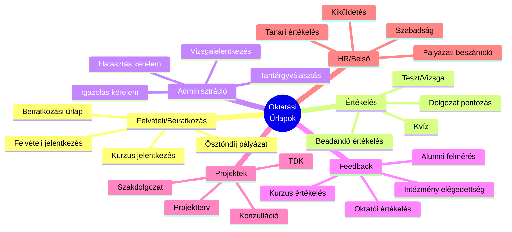
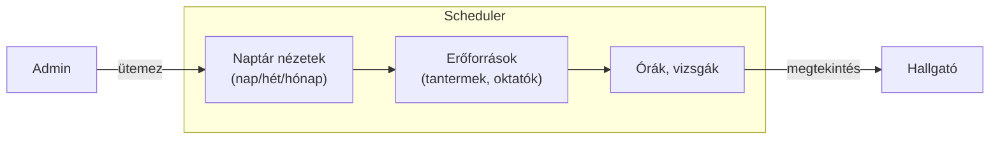
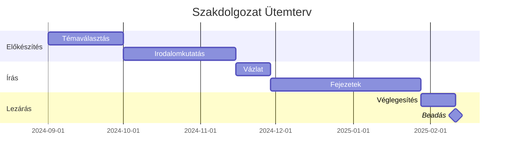
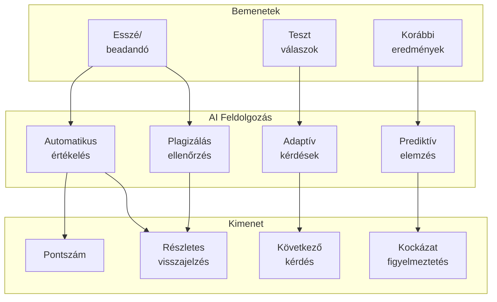
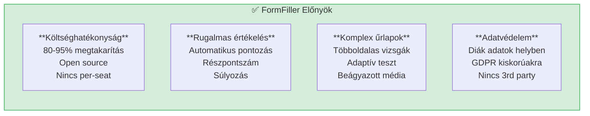
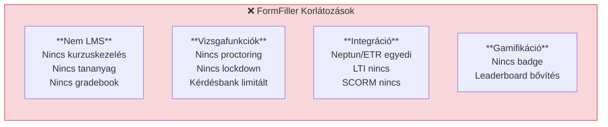

[← Vissza az Iparágak oldalra](index.md)

# Oktatás

Az oktatási szektor az egyik legalkalmasabb terület a FormFiller számára, ahol a vizsgák, beadandók, beiratkozás és adminisztráció terén azonnali értéket teremthet.

## Tartalomjegyzék

1. [Iparági Áttekintés](#iparági-áttekintés)
2. [Jellemző Igények](#jellemző-igények)
3. [Bővítési Lehetőségek](#bővítési-lehetőségek)
4. [AI Integráció](#ai-integráció)
5. [FormFiller Megfeleltetés](#formfiller-megfeleltetés)
6. [Összehasonlító Táblázat](#összehasonlító-táblázat)
7. [Pro/Kontra Elemzés](#prokontra-elemzés)
8. [Bővítési Javaslatok](#bővítési-javaslatok)
9. [Üzleti Értékelés](#üzleti-értékelés)

---

## Iparági Áttekintés

### Piaci Méret és Jellemzők

| Jellemző | Érték |
|----------|-------|
| **Globális piaci méret** | $10-25 Mrd (EdTech forms/assessment) |
| **Éves növekedés** | 15-20% |
| **Fő szegmensek** | K-12, Felsőoktatás, Vállalati képzés |
| **Fő hajtóerő** | Digitalizáció, távoktatás |

### Hagyományos Megoldások

| Szoftver | Típus | Piaci pozíció | Jellemző ár |
|----------|-------|---------------|-------------|
| **Canvas** | LMS | Piacvezető | $5-15/felh./hó |
| **Blackboard** | LMS | Erős | $10-30/felh./hó |
| **Moodle** | LMS | Open source | Ingyenes + hosting |
| **Google Classroom** | LMS | Növekvő | Ingyenes (Edu) |
| **Turnitin** | Plagiarism | Speciális | $3-5/felh./hó |

### Magyar Kontextus

- **Neptun/ETR**: Tanulmányi rendszerek
- **KRÉTA**: Közoktatási adminisztráció
- **EKRETA**: Elektronikus napló
- **Canvas, Moodle**: Felsőoktatási LMS-ek

---

## Jellemző Igények

### Űrlap Típusok



### Speciális Követelmények

| Követelmény | Leírás | FormFiller támogatás |
|-------------|--------|---------------------|
| **Időzített teszt** | Beállított időlimit | ✅ Konfigurálható |
| **Randomizálás** | Kérdések véletlenszerű sorrendje | 🔶 Bővítéssel |
| **Automatikus pontozás** | Objektív kérdések értékelése | ✅ ComputedRules |
| **Neptun integráció** | Tanulmányi rendszer | 🔶 API-val |
| **GDPR (diák adatok)** | Kiskorúak adatvédelme | ✅ Self-hosted |
| **Többnyelvűség** | Nemzetközi hallgatók | ✅ Beépített |

---

## Bővítési Lehetőségek

A FormFiller az oktatásban különösen értékes komponenseket biztosít.

### Releváns Komponensek

| Komponens | Oktatási Alkalmazás | Előny |
|-----------|---------------------|-------|
| **Scheduler** | Órarend, konzultáció | Vizuális naptár |
| **Charts** | Eredmények, statisztika | Grafikus kimutatás |
| **DataGrid** | Hallgató lista, jegyek | Szűrés, rendezés, export |
| **HtmlEditor** | Esszé, beadandó | Formázott szöveg |
| **Gantt** | Projekt terv, szakdolgozat | Ütemezés |
| **PivotGrid** | Összesítések | Aggregált statisztika |
| **Form** | Kvíz, teszt | Komplex kérdőív |

### Konkrét Use Case-ek

#### Órarend Kezelés (Scheduler)



**Funkciók:**
- Heti órarend nézet
- Tanterem foglaltság
- Oktatói naptár
- Vizsga időpontok
- Ütközés ellenőrzés

#### Eredmény Dashboard (Charts)

| Chart típus | Alkalmazás |
|-------------|------------|
| **Bar Chart** | Átlagok összehasonlítása |
| **Line Chart** | Eredmény trend |
| **Pie Chart** | Érdemjegy eloszlás |
| **Scatter** | Korrelációk (jelenlét vs jegy) |

#### Szakdolgozat Ütemezés (Gantt)



---

## AI Integráció

Az egységes JSON schema architektúra hatékony AI integrációt tesz lehetővé az oktatásban.

### AI Felhasználási Esetek

| AI Funkció | Leírás | Várható Haszon |
|------------|--------|----------------|
| **Automatikus értékelés** | Esszé, szöveges válasz | 70% javítási idő megtakarítás |
| **Plagizálás ellenőrzés** | Hasonlóság detekció | Integritás biztosítás |
| **Adaptív kérdések** | Tudásszint alapján | Személyre szabott teszt |
| **Visszajelzés generálás** | Részletes értékelés | Jobb tanulói feedback |
| **Prediktív elemzés** | Bukás kockázat | Korai beavatkozás |
| **Tartalom javaslat** | Hiányosság alapján | Személyre szabott tananyag |

### AI + Schema Szinergia az Oktatásban



### Példa: AI-támogatott Értékelés

| Lépés | AI Funkció | Eredmény |
|-------|------------|----------|
| 1 | Esszé beérkezés | Automatikus struktúra elemzés |
| 2 | Plagizálás ellenőrzés | Hasonlóság riport |
| 3 | Tartalom értékelés | Pontszám javaslat |
| 4 | Feedback generálás | Részletes visszajelzés |
| 5 | Javítási javaslat | Fejlesztési területek |

### AI Előnyök Összefoglalva

| Előny | Hagyományos | AI-támogatott | Javulás |
|-------|-------------|---------------|---------|
| Teszt javítás | 100% manuális | 20% ellenőrzés | 80% |
| Esszé értékelés | 15 perc/db | 3 perc/db | 80% |
| Plagizálás ellenőrzés | Nincs/manuális | Automatikus | 100% |
| Személyes feedback | Ritka | Minden munkára | 100% |

---

## FormFiller Megfeleltetés

### Jelenleg Támogatott Funkciók

| Funkció | FormFiller képesség | Megjegyzés |
|---------|---------------------|------------|
| **Beiratkozási űrlap** | ★★★★★ | Natív támogatás |
| **Kvíz/Teszt** | ★★★★★ | Automatikus pontozás |
| **Kurzus értékelés** | ★★★★★ | Anonim felmérés |
| **Projektterv** | ★★★★★ | Komplex űrlapok |
| **Vizsgajelentkezés** | ✅ Kiváló | Workflow támogatás |
| **Szakdolgozat téma** | ✅ Kiváló | Jóváhagyási folyamat |

### Bővítéssel Támogatható

| Funkció | Szükséges bővítés | Komplexitás |
|---------|-------------------|-------------|
| **Neptun API** | REST csatlakozó | Közepes |
| **Plagiarism check** | Turnitin integráció | Közepes |
| **Kérdésbank** | Pool kezelő modul | Közepes |
| **Proctoring** | Videó monitorozás | Magas |
| **Gamifikáció** | Pont/badge rendszer | Alacsony |

---

## Összehasonlító Táblázat

### FormFiller vs. Hagyományos Megoldások

| Szempont | Canvas | Moodle | Google Classroom | FormFiller |
|----------|:------:|:------:|:----------------:|:----------:|
| **Ár (éves, 1000 felh.)** | $60K+ | $10K* | Ingyenes | $5-10K* |
| **Implementáció** | 2-4 hét | 1-2 hét | Azonnali | 1-2 hét |
| **Testreszabás** | Közepes | Jó | Alacsony | Kiváló |
| **Self-hosted** | Nem | Igen | Nem | Igen |
| **Űrlap komplexitás** | Közepes | Közepes | Alacsony | Kiváló |
| **Automatikus pontozás** | Jó | Jó | Alap | Kiváló |
| **Workflow** | Alap | Alap | Nincs | Kiváló |
| **API** | Jó | Jó | Korlátozott | Nyílt |

*Hosting/karbantartás költség

### Funkcionális Összehasonlítás

| Funkció | Canvas | Moodle | Google Forms | FormFiller |
|---------|:------:|:------:|:------------:|:----------:|
| Teszt/Kvíz | ★★★★☆ | ★★★★☆ | ★★★☆☆ | ★★★★★ |
| Beiratkozás | ★★★☆☆ | ★★★☆☆ | ★★★☆☆ | ★★★★★ |
| Feedback | ★★★★☆ | ★★★★☆ | ★★★★☆ | ★★★★★ |
| Komplex logika | ★★☆☆☆ | ★★★☆☆ | ★★☆☆☆ | ★★★★★ |
| Költség/érték | ★★★☆☆ | ★★★★☆ | ★★★★★ | ★★★★★ |

---

## Pro/Kontra Elemzés

### FormFiller Előnyök



### FormFiller Hátrányok/Korlátozások



### Mikor Válaszd a FormFiller-t?

| Szcenárió | Ajánlott? | Indoklás |
|-----------|:---------:|----------|
| Beiratkozás, jelentkezés | ✅ Igen | Natív támogatás |
| Kvíz, gyakorló teszt | ✅ Igen | Automatikus pontozás |
| Kurzusértékelés | ✅ Igen | Anonim, testreszabható |
| Teljes LMS kiváltás | ❌ Nem | Nem LMS |
| Formális vizsga (proctored) | 🔶 Részben | Proctoring nincs |
| Szakdolgozat adminisztráció | ✅ Igen | Workflow támogatás |
| Ösztöndíj pályázat | ✅ Igen | Komplex űrlapok |

---

## Bővítési Javaslatok

### Prioritásos Fejlesztések

| Fejlesztés | Leírás | Komplexitás | Prioritás |
|------------|--------|:-----------:|:---------:|
| **Kérdésbank** | Pool kezelés, randomizálás | Közepes | Magas |
| **Timer komponens** | Vizsgaidő kezelés | Alacsony | Magas |
| **Neptun API** | Tanulmányi rendszer | Közepes | Közepes |
| **LTI integráció** | LMS beágyazás | Közepes | Közepes |
| **Gamifikáció** | Pont, badge, leaderboard | Alacsony | Közepes |
| **Proctoring** | Videó monitorozás | Magas | Alacsony |

### Példa: Automatikusan Pontozó Teszt

```json
{
  "name": "mathQuiz",
  "title": "Matematika Kvíz",
  "items": [
    {
      "name": "question1",
      "type": "radioGroup",
      "label": "Mennyi 7 × 8?",
      "items": [
        { "value": "54", "label": "54" },
        { "value": "56", "label": "56" },
        { "value": "58", "label": "58" },
        { "value": "62", "label": "62" }
      ],
      "correctAnswer": "56",
      "points": 1
    },
    {
      "name": "question2",
      "type": "text",
      "label": "Írja be a π értékét 2 tizedesjegyre!",
      "correctAnswer": "3.14",
      "points": 2,
      "validationRules": [
        { "type": "pattern", "pattern": "^\\d+\\.\\d{2}$" }
      ]
    },
    {
      "name": "question3",
      "type": "checkboxGroup",
      "label": "Mely számok prímek? (többet is választhat)",
      "items": [
        { "value": "2", "label": "2" },
        { "value": "4", "label": "4" },
        { "value": "7", "label": "7" },
        { "value": "9", "label": "9" },
        { "value": "11", "label": "11" }
      ],
      "correctAnswer": ["2", "7", "11"],
      "points": 3,
      "partialCredit": true
    }
  ],
  "computedFields": [
    {
      "name": "totalScore",
      "expression": "scoreQuestion1 + scoreQuestion2 + scoreQuestion3",
      "label": "Összpontszám"
    },
    {
      "name": "percentage",
      "expression": "(totalScore / 6) * 100",
      "label": "Százalék"
    },
    {
      "name": "grade",
      "expression": "percentage >= 85 ? '5' : percentage >= 70 ? '4' : percentage >= 55 ? '3' : percentage >= 40 ? '2' : '1'",
      "label": "Érdemjegy"
    }
  ]
}
```

---

## Üzleti Értékelés

### Összefoglaló

| Metrika | Érték |
|---------|-------|
| **Jelenlegi megfelelőség** | ★★★★★ |
| **Fejlesztési potenciál** | ★★★★☆ |
| **Piaci méret (TAM)** | $10-25 Mrd |
| **Elérhető megtakarítás** | 80-95% |
| **Piaci siker esélye** | Magas |

### ROI Becslés

| Szcenárió | Hagyományos költség | FormFiller költség | Megtakarítás |
|-----------|--------------------:|-------------------:|-------------:|
| Kis iskola (500 diák) | €10,000/év | €2,000/év | €8,000 (80%) |
| Gimnázium (1000 diák) | €25,000/év | €4,000/év | €21,000 (84%) |
| Egyetemi kar (5000 hallgató) | €100,000/év | €15,000/év | €85,000 (85%) |
| Vállalati képzés | €50,000/év | €8,000/év | €42,000 (84%) |

### Célpiac

| Szegmens | Potenciál | Prioritás |
|----------|:---------:|:---------:|
| Felsőoktatás (vizsgák) | Magas | 1 |
| Középiskolák | Magas | 1 |
| Vállalati képzés | Magas | 2 |
| Nyelviskola | Közepes | 2 |
| Online kurzusok | Közepes | 3 |

---

## Kapcsolódó Dokumentációk

- [Iparági Összefoglaló](./index.md)
- [Felmérések](../functions/survey.md) - Kurzusértékelés
- [Jóváhagyási Workflow](../functions/approval-workflow.md) - Szakdolgozat
- [Kreatív Felhasználás](../creative-uses.md) - Gamifikáció
