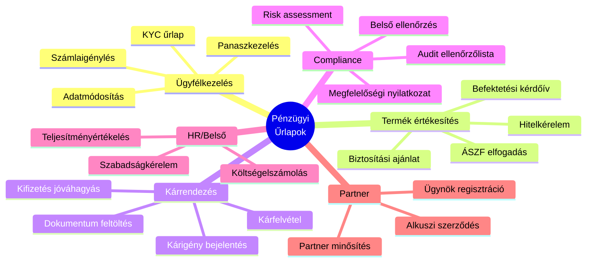
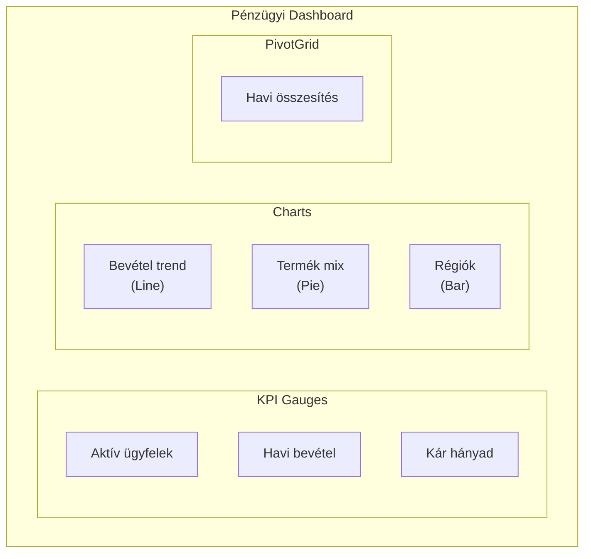
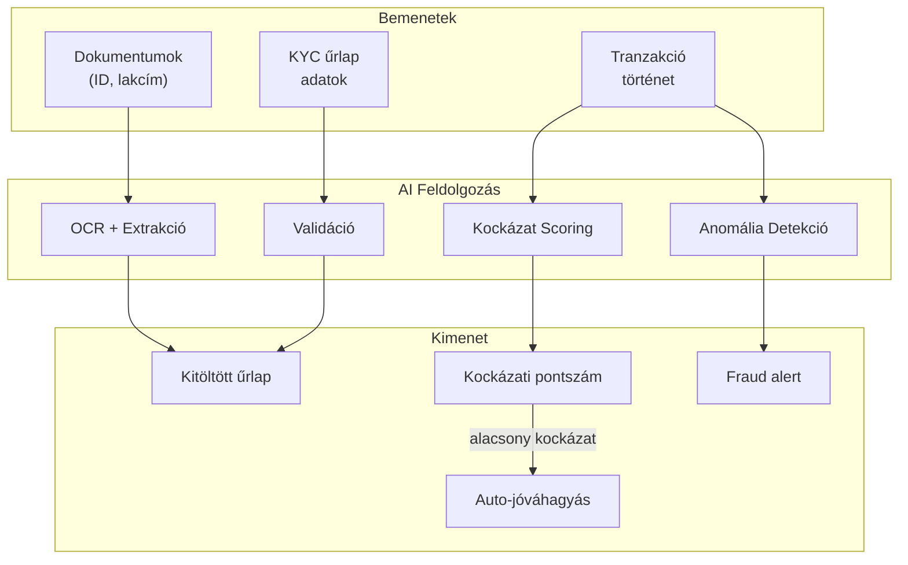
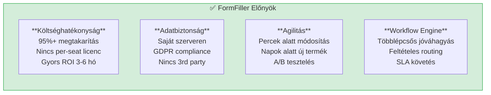
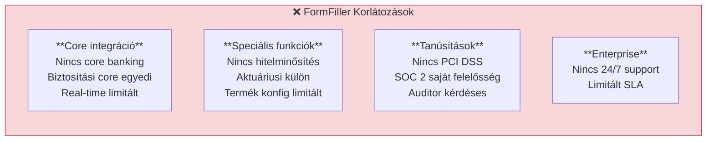

[← Vissza az Iparágak oldalra](index.md)

# Pénzügy és Biztosítás

A pénzügyi szektor szigorú szabályozási környezetben működik, ahol a FormFiller architektúra jelentős előnyöket kínálhat compliance, ügyfélkezelés és belső folyamatok terén.

## Tartalomjegyzék

1. [Iparági Áttekintés](#iparági-áttekintés)
2. [Jellemző Igények](#jellemző-igények)
3. [Bővítési Lehetőségek](#bővítési-lehetőségek)
4. [AI Integráció](#ai-integráció)
5. [FormFiller Megfeleltetés](#formfiller-megfeleltetés)
6. [Összehasonlító Táblázat](#összehasonlító-táblázat)
7. [Pro/Kontra Elemzés](#prokontra-elemzés)
8. [Bővítési Javaslatok](#bővítési-javaslatok)
9. [Üzleti Értékelés](#üzleti-értékelés)

---

## Iparági Áttekintés

### Piaci Méret és Szereplők

| Jellemző | Érték |
|----------|-------|
| **Globális piaci méret** | $80-150 Mrd (pénzügyi IT) |
| **Éves növekedés** | 10-15% |
| **Fő szegmensek** | Bankok, Biztosítók, FinTech |

### Hagyományos Megoldások

| Szoftver | Típus | Piaci pozíció | Jellemző ár |
|----------|-------|---------------|-------------|
| **Salesforce FSC** | CRM + compliance | Piacvezető | $300-500/felh./hó |
| **Guidewire** | Biztosítási core | Vezető (P&C) | $1M - $50M |
| **Duck Creek** | Biztosítási platform | Erős | $500K - $20M |
| **Temenos** | Banki core | Vezető | $1M - $100M |
| **FIS/Fiserv** | Pénzügyi szolgáltatások | Piacvezető | Változó |

### Szabályozási Környezet

- **KYC/AML**: Ügyfél-azonosítás, pénzmosás elleni küzdelem
- **PSD2/PSD3**: Fizetési szolgáltatások szabályozása
- **MiFID II**: Befektetési szolgáltatások
- **GDPR**: Adatvédelem
- **SOX**: Pénzügyi beszámolás
- **Basel III/IV**: Tőkemegfelelés

---

## Jellemző Igények

### Űrlap Típusok



### Speciális Követelmények

| Követelmény | Leírás | FormFiller támogatás |
|-------------|--------|---------------------|
| **Audit trail** | Minden módosítás naplózása | ✅ Beépített |
| **Digitális aláírás** | Szerződések hitelesítése | 🔶 Tervezett |
| **Titkosítás** | Érzékeny adatok védelme | ✅ Self-hosted |
| **Verziókezelés** | Dokumentum verziók | 🔶 Bővítéssel |
| **Workflow** | Többlépcsős jóváhagyás | ✅ Beépített |
| **Integráció** | Core banking, CRM | 🔶 API-n keresztül |

---

## Bővítési Lehetőségek

A FormFiller a pénzügyi szektorban különösen értékes komponenseket biztosít.

### Releváns Komponensek

| Komponens | Pénzügyi Alkalmazás | Előny |
|-----------|---------------------|-------|
| **Charts** | Portfolió dashboard, KPI-k | 30+ diagram típus |
| **PivotGrid** | Pénzügyi riportok, összesítések | OLAP-szerű elemzés |
| **DataGrid** | Tranzakció lista, ügyfél keresés | Fejlett szűrés, export |
| **Diagram** | Workflow vizualizáció | Jóváhagyási folyamatok |
| **Gauges** | KPI mutatók, teljesítmény | Vizuális státusz |
| **Sankey** | Pénzáramlás vizualizáció | Flow diagram |
| **TreeList** | Szervezeti struktúra, jóváhagyók | Hierarchia |

### Konkrét Use Case-ek

#### Pénzügyi Dashboard (Charts + Gauges)



**Funkciók:**
- Real-time KPI monitoring
- Drill-down elemzés
- Időszak összehasonlítás
- Export PDF/Excel

#### Jóváhagyási Workflow Vizualizáció (Diagram)

| Diagram típus | Alkalmazás |
|---------------|------------|
| **Flowchart** | Hitel jóváhagyási folyamat |
| **OrgChart** | Jóváhagyási hierarchia |
| **Custom** | Compliance ellenőrzési lépések |

#### Tranzakció Monitoring (DataGrid + Charts)

| Funkció | Komponens |
|---------|----------------------|
| Tranzakció lista | DataGrid (szűrés, rendezés) |
| Gyanús tranzakciók | DataGrid + Row highlighting |
| Trend elemzés | Charts (összeg idősor) |
| Kategória megoszlás | PieChart |
| Export | DataGrid → Excel/PDF |

---

## AI Integráció

Az egységes JSON schema architektúra hatékony AI integrációt tesz lehetővé a pénzügyi szektorban.

### AI Felhasználási Esetek

| AI Funkció | Leírás | Várható Haszon |
|------------|--------|----------------|
| **KYC dokumentum OCR** | Személyi, lakcím feldolgozás | 80% manuális munka megtakarítás |
| **Automatikus validáció** | Adószám, IBAN ellenőrzés | 90% hibás adatbevitel csökkentés |
| **Fraud detekció** | Anomália észlelés | Korai figyelmeztetés |
| **Kockázat scoring** | Hitelképesség becslés | Gyorsabb döntéshozatal |
| **Dokumentum klasszifikáció** | Szerződés, számla felismerés | Automatikus routing |
| **Chatbot asszisztens** | Ügyfél önkiszolgálás | 24/7 elérhetőség |

### AI + Schema Szinergia a Pénzügyben



### Példa: AI-támogatott KYC Folyamat

| Lépés | AI Funkció | Eredmény |
|-------|------------|----------|
| 1 | Személyi igazolvány OCR | Név, születési dátum, okmányszám |
| 2 | Lakcímkártya OCR | Cím adatok kinyerése |
| 3 | IBAN validáció | Formátum és bank ellenőrzés |
| 4 | PEP/szankciós lista | Automatikus ellenőrzés |
| 5 | Kockázat scoring | Ügyfél kategorizálás |

### AI Előnyök Összefoglalva

| Előny | Hagyományos | AI-támogatott | Javulás |
|-------|-------------|---------------|---------|
| KYC feldolgozás | 2-3 nap | 15-30 perc | 95% |
| Manuális ellenőrzés | 100% | 20-30% | 70-80% |
| Hibás adatbevitel | 5-8% | < 1% | 90% csökkenés |
| Fraud detekció | Utólagos | Real-time | Azonnali |

---

## FormFiller Megfeleltetés

### Jelenleg Támogatott Funkciók

| Funkció | FormFiller képesség | Megjegyzés |
|---------|---------------------|------------|
| **KYC űrlap** | ✅ Kiváló | Komplex validáció, dokumentum upload |
| **Hitelkérelem** | ✅ Kiváló | Számított mezők, feltételes logika |
| **Kárigény bejelentés** | ✅ Jó | Workflow támogatás |
| **Compliance checklist** | ★★★★★ | Natív támogatás |
| **Költségelszámolás** | ✅ Kiváló | Jóváhagyási workflow |
| **Panaszkezelés** | ✅ Jó | Ticketing funkciók |

### Bővítéssel Támogatható

| Funkció | Szükséges bővítés | Komplexitás |
|---------|-------------------|-------------|
| **E-aláírás** | DocuSign/Adobe Sign | Alacsony |
| **Core banking API** | Egyedi csatlakozó | Közepes |
| **Hitelminősítés** | Külső API integráció | Közepes |
| **PDF szerződés** | Sablon motor | Alacsony |
| **Biometrikus ID** | eKYC integráció | Magas |

---

## Összehasonlító Táblázat

### FormFiller vs. Hagyományos Megoldások

| Szempont | Salesforce FSC | Guidewire | Temenos | FormFiller |
|----------|:--------------:|:---------:|:-------:|:----------:|
| **Ár (éves, 100 felh.)** | $360K+ | $1M+ | $500K+ | ~$20K* |
| **Implementáció** | 6-12 hó | 12-24 hó | 12-36 hó | 1-3 hó |
| **Testreszabás** | Közepes | Limitált | Limitált | Kiváló |
| **Self-hosted** | Nem | Opcionális | Opcionális | Igen |
| **Compliance ready** | Igen | Igen | Igen | Konfigurálható |
| **Audit trail** | Igen | Igen | Igen | Igen |
| **Workflow** | Komplex | Komplex | Komplex | Jó |
| **API** | Jó | Korlátozott | Korlátozott | Nyílt |

*Infrastruktúra + karbantartás költség

### Funkcionális Összehasonlítás

| Funkció | Salesforce | Guidewire | Duck Creek | FormFiller |
|---------|:----------:|:---------:|:----------:|:----------:|
| KYC/Onboarding | ★★★★★ | ★★★☆☆ | ★★★☆☆ | ★★★★☆ |
| Kárigény | ★★★☆☆ | ★★★★★ | ★★★★★ | ★★★☆☆ |
| Compliance | ★★★★☆ | ★★★★☆ | ★★★★☆ | ★★★★☆ |
| Belső folyamatok | ★★★☆☆ | ★★☆☆☆ | ★★☆☆☆ | ★★★★★ |
| Költség/érték | ★★☆☆☆ | ★★☆☆☆ | ★★☆☆☆ | ★★★★★ |

---

## Pro/Kontra Elemzés

### FormFiller Előnyök



### FormFiller Hátrányok/Korlátozások



### Mikor Válaszd a FormFiller-t?

| Szcenárió | Ajánlott? | Indoklás |
|-----------|:---------:|----------|
| FinTech startup MVP | ✅ Igen | Gyors, költséghatékony |
| Bank belső folyamatok | ✅ Igen | HR, compliance, admin |
| Biztosító ügyfélportál | ✅ Igen | Kárigény, módosítások |
| Core banking rendszer | ❌ Nem | Speciális funkciók kellenek |
| Hitelezési platform | 🔶 Részben | Front-end űrlapokhoz jó |
| Compliance dokumentáció | ✅ Igen | Audit trail, workflow |

---

## Bővítési Javaslatok

### Prioritásos Fejlesztések

| Fejlesztés | Leírás | Komplexitás | Prioritás |
|------------|--------|:-----------:|:---------:|
| **E-aláírás plugin** | Digitális szerződéskötés | Alacsony | Magas |
| **PDF sablon motor** | Szerződés generálás | Alacsony | Magas |
| **Hitelminősítő API** | KHR, scoring integráció | Közepes | Közepes |
| **Core banking csatlakozó** | Alap műveletek | Magas | Közepes |
| **eKYC/Video ID** | Online azonosítás | Magas | Közepes |
| **Kárkalkulátor** | Biztosítási számítások | Közepes | Alacsony |

### Példa: KYC Űrlap Konfiguráció

```json
{
  "name": "kycForm",
  "title": "Ügyfél-azonosítás (KYC)",
  "items": [
    {
      "type": "group",
      "name": "personalData",
      "label": "Személyes adatok",
      "items": [
        {
          "name": "fullName",
          "type": "text",
          "label": "Teljes név",
          "validationRules": [
            { "type": "required" },
            { "type": "stringLength", "min": 5, "max": 100 }
          ]
        },
        {
          "name": "birthDate",
          "type": "date",
          "label": "Születési dátum",
          "validationRules": [
            { "type": "required" },
            { "type": "custom", "validator": "ageOver18" }
          ]
        },
        {
          "name": "taxId",
          "type": "text",
          "label": "Adóazonosító",
          "validationRules": [
            { "type": "required" },
            { "type": "pattern", "pattern": "^[0-9]{10}$" }
          ]
        }
      ]
    },
    {
      "type": "group",
      "name": "documents",
      "label": "Dokumentumok",
      "items": [
        {
          "name": "idDocument",
          "type": "file",
          "label": "Személyi igazolvány",
          "accept": "image/*,.pdf",
          "validationRules": [{ "type": "required" }]
        },
        {
          "name": "addressProof",
          "type": "file",
          "label": "Lakcímigazolás",
          "accept": "image/*,.pdf"
        }
      ]
    },
    {
      "type": "group",
      "name": "riskAssessment",
      "label": "Kockázatértékelés",
      "items": [
        {
          "name": "pep",
          "type": "boolean",
          "label": "Politikailag exponált személy (PEP)?",
          "defaultValue": false
        },
        {
          "name": "pepDetails",
          "type": "textarea",
          "label": "PEP részletek",
          "visibleIf": "pep === true"
        }
      ]
    }
  ]
}
```

---

## Üzleti Értékelés

### Összefoglaló

| Metrika | Érték |
|---------|-------|
| **Jelenlegi megfelelőség** | ★★★★☆ |
| **Fejlesztési potenciál** | ★★★★★ |
| **Piaci méret (TAM)** | $80-150 Mrd |
| **Elérhető megtakarítás** | 50-70% |
| **Piaci siker esélye** | Magas |

### ROI Becslés

| Szcenárió | Hagyományos költség | FormFiller költség | Megtakarítás |
|-----------|--------------------:|-------------------:|-------------:|
| FinTech startup | €100,000/év | €20,000/év | €80,000 (80%) |
| Bank (belső) | €500,000/év | €80,000/év | €420,000 (84%) |
| Biztosító ügyfélportál | €300,000/év | €50,000/év | €250,000 (83%) |

### Célpiac

| Szegmens | Potenciál | Prioritás |
|----------|:---------:|:---------:|
| FinTech startupok | Magas | 1 |
| Biztosítók (ügyféloldal) | Magas | 1 |
| Bankok (belső folyamatok) | Magas | 2 |
| Alkuszok/Ügynökök | Közepes | 2 |
| Faktoring/Lízing | Közepes | 3 |

---

## Kapcsolódó Dokumentációk

- [Iparági Összefoglaló](./index.md)
- [Egészségügy](./healthcare.md) - Hasonló compliance igények
- [Jóváhagyási Workflow](../functions/approval-workflow.md)
- [CRM Funkciók](../functions/crm.md)
