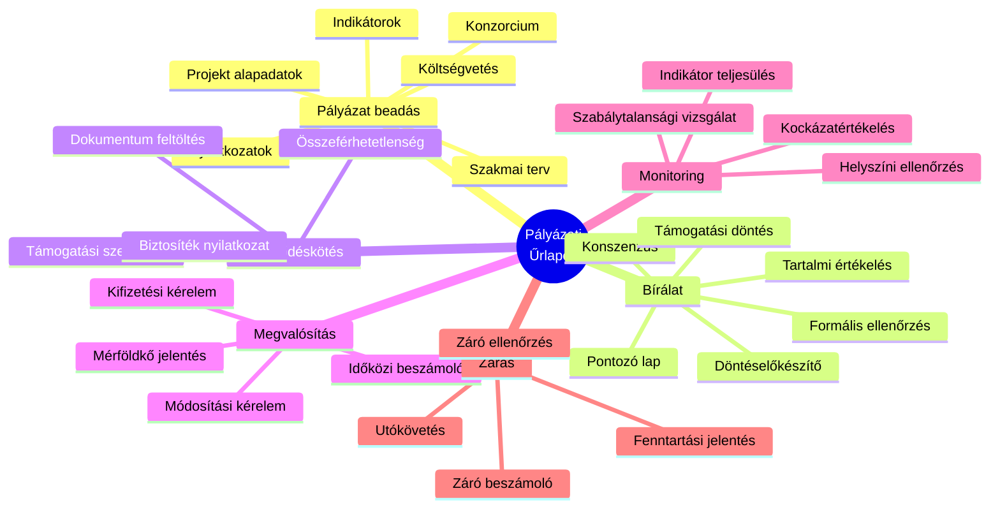
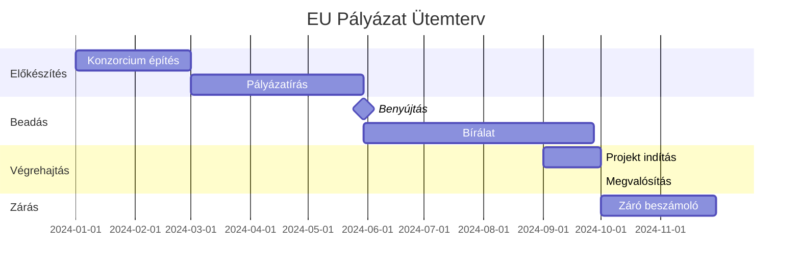
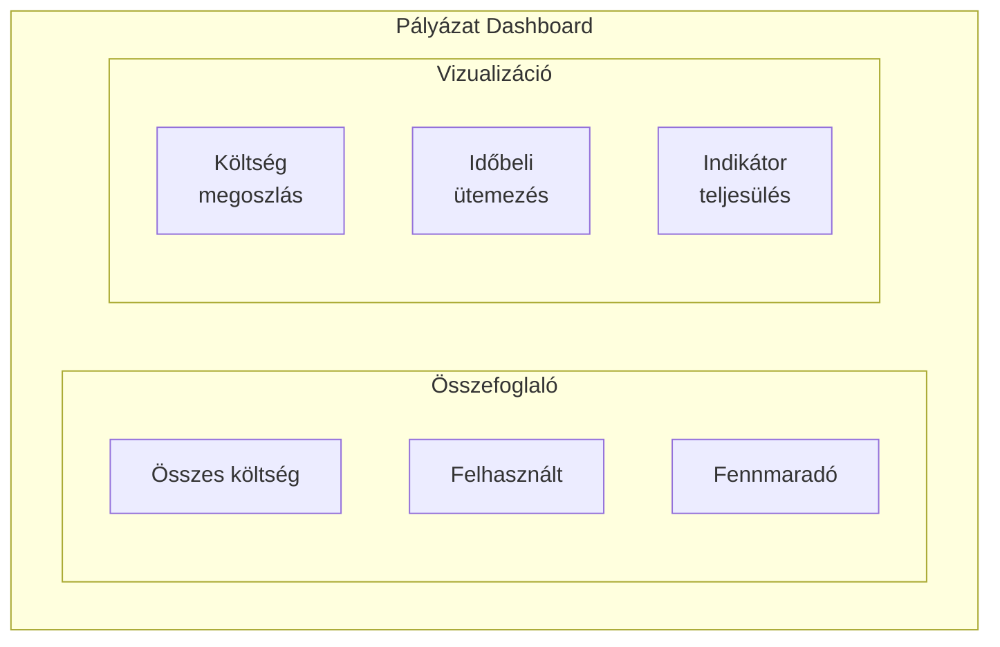
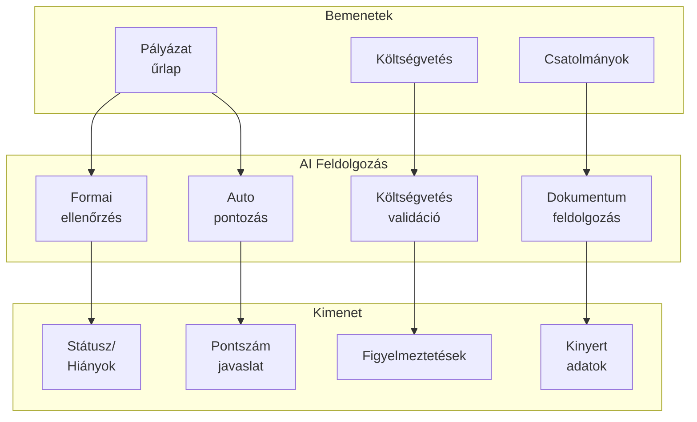
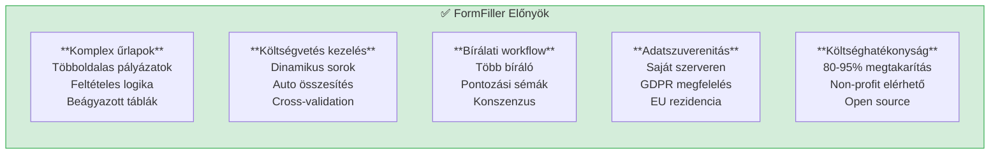
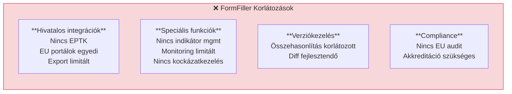

[← Vissza az Iparágak oldalra](index.md)

# Pályázati Rendszerek

A pályázati rendszerek területe kiválóan alkalmas a FormFiller számára, ahol a komplex űrlapok, többlépcsős bírálat, monitoring és beszámolók kezelése terén jelentős értéket teremthet.

## Tartalomjegyzék

1. [Iparági Áttekintés](#iparági-áttekintés)
2. [Jellemző Igények](#jellemző-igények)
3. [Bővítési Lehetőségek](#bővítési-lehetőségek)
4. [AI Integráció](#ai-integráció)
5. [FormFiller Megfeleltetés](#formfiller-megfeleltetés)
6. [Összehasonlító Táblázat](#összehasonlító-táblázat)
7. [Pro/Kontra Elemzés](#prokontra-elemzés)
8. [Bővítési Javaslatok](#bővítési-javaslatok)
9. [Üzleti Értékelés](#üzleti-értékelés)

---

## Iparági Áttekintés

### Piaci Méret és Jellemzők

| Jellemző | Érték |
|----------|-------|
| **Globális piaci méret** | $5-15 Mrd (Grant Management) |
| **EU pályázatok** | €1,200+ Mrd (2021-2027) |
| **Magyar pályázatok** | €40+ Mrd (2021-2027) |
| **Fő hajtóerő** | Digitalizáció, átláthatóság |

### Hagyományos Megoldások

| Szoftver | Típus | Piaci pozíció | Jellemző ár |
|----------|-------|---------------|-------------|
| **Submittable** | Grant management | USA piacvezető | $10-50K/év |
| **Fluxx** | Foundation/Grant | Erős | $20-100K/év |
| **SurveyMonkey Apply** | Application mgmt | Növekvő | $5-25K/év |
| **OpenGrants** | Grant discovery | Speciális | Változó |
| **WizeHive** | Scholarship/Grant | Speciális | $10-40K/év |

### Magyar/EU Kontextus

- **EPTK (Elektronikus Pályázatkezelő Rendszer)**: Hazai pályázatok
- **eMS (Electronic Monitoring System)**: Interreg, határon átnyúló
- **Funding & Tenders Portal**: Horizon Europe
- **Pályázat.gov.hu**: Központi pályázati portál
- **GINOP, VEKOP, TOP**: Operatív programok

---

## Jellemző Igények

### Űrlap Típusok



### Speciális Követelmények

| Követelmény | Leírás | FormFiller támogatás |
|-------------|--------|---------------------|
| **Többoldalas űrlapok** | 10-50+ oldalas pályázatok | ✅ Beépített |
| **Költségvetés tábla** | Dinamikus sorok, összesítés | ✅ Array + computed |
| **Verziókezelés** | Módosítások nyomon követése | 🔶 Bővítéssel |
| **Több bíráló** | Független értékelés | ✅ Workflow |
| **PDF export** | Hivatalos formátum | 🔶 Tervezett |
| **Audit trail** | Ki, mikor, mit módosított | ✅ Beépített |
| **Határidő kezelés** | Beadási, bírálati | ✅ Workflow |

---

## Bővítési Lehetőségek

A FormFiller a pályázati rendszereknél különösen értékes komponenseket biztosít.

### Releváns Komponensek

| Komponens | Pályázati Alkalmazás | Előny |
|-----------|---------------------|-------|
| **Gantt** | Projekt ütemezés | Vizuális időterv, mérföldkövek |
| **Charts** | Költségvetés vizualizáció | Pie, Bar, Waterfall |
| **PivotGrid** | Monitoring összesítések | OLAP-szerű elemzés |
| **TreeView** | Pályázat struktúra | Hierarchikus navigáció |
| **DataGrid** | Pályázat lista | Szűrés, státusz, export |
| **Diagram** | Workflow vizualizáció | Bírálati folyamat |
| **FileManager** | Dokumentum kezelés | Csatolmányok |

### Konkrét Use Case-ek

#### Projekt Ütemezés (Gantt)



**Gantt funkciók:**
- Feladatok és mérföldkövek
- Függőségek (Finish-to-Start)
- Erőforrás hozzárendelés
- Kritikus út kiemelése
- Export PDF/PNG

#### Költségvetés Dashboard (Charts + PivotGrid)

| Vizualizáció | Alkalmazás |
|--------------|------------|
| **Pie Chart** | Költségkategória megoszlás |
| **Waterfall Chart** | Módosítások hatása |
| **Bar Chart** | Partner összehasonlítás |
| **PivotGrid** | Időszak x Kategória összesítés |



#### Indikátor Monitoring (Charts + Gauges)

| Gauge típus | Alkalmazás |
|-------------|------------|
| **Circular Gauge** | Célérték teljesülés % |
| **Linear Gauge** | Előrehaladás |
| **Bullet Chart** | Terv vs. tény |

---

## AI Integráció

Az egységes JSON schema architektúra különösen hatékony AI integrációt tesz lehetővé a pályázati rendszereknél.

### AI Felhasználási Esetek

| AI Funkció | Leírás | Várható Haszon |
|------------|--------|----------------|
| **Pályázat előértékelés** | Formai megfelelőség check | 70% admin megtakarítás |
| **Költségvetés validáció** | Realitás ellenőrzés | Kevesebb hiánypótlás |
| **Automatikus pontozás** | Objektív kritériumok | Gyorsabb bírálat |
| **Dokumentum OCR** | Csatolmányok feldolgozás | Automatikus kinyerés |
| **Összehasonlító elemzés** | Hasonló pályázatok | Benchmark |
| **Beszámoló generálás** | Automatikus összefoglaló | 50% idő megtakarítás |

### AI + Schema Szinergia a Pályázatoknál



### Példa: AI-támogatott Pályázat Bírálat

| Lépés | AI Funkció | Eredmény |
|-------|------------|----------|
| 1 | Pályázat beérkezés | Automatikus formai ellenőrzés |
| 2 | Költségvetés scan | Realitás scoring |
| 3 | Tartalom elemzés | Relevancia meghatározás |
| 4 | Előzetes pontszám | AI javaslat |
| 5 | Bíráló támogatás | Összehasonlító elemzés |

### AI Előnyök Összefoglalva

| Előny | Hagyományos | AI-támogatott | Javulás |
|-------|-------------|---------------|---------|
| Formai ellenőrzés | 30 perc/pályázat | 2 perc | 93% |
| Költségvetés validáció | Manuális | Automatikus | 90% |
| Bírálat előkészítés | 2-4 óra | 30 perc | 85% |
| Indikátor összesítés | 1 óra | 5 perc | 92% |

---

## FormFiller Megfeleltetés

### Jelenleg Támogatott Funkciók

| Funkció | FormFiller képesség | Megjegyzés |
|---------|---------------------|------------|
| **Pályázat beadás** | ★★★★★ | Komplex űrlapok |
| **Költségvetés táblázat** | ★★★★★ | Array + számított mezők |
| **Bírálói pontozás** | ★★★★★ | Súlyozott értékelés |
| **Jóváhagyási workflow** | ★★★★★ | Többlépcsős |
| **Beszámoló** | ★★★★☆ | Indikátorok |
| **Dokumentum feltöltés** | ✅ Kiváló | Fájl kezelés |

### Bővítéssel Támogatható

| Funkció | Szükséges bővítés | Komplexitás |
|---------|-------------------|-------------|
| **PDF export (EPTK stílus)** | Sablon motor | Közepes |
| **Verziókezelés** | Git-szerű diff | Közepes |
| **E-aláírás** | Hivatalos aláírás | Közepes |
| **Indikátor dashboard** | Vizualizáció | Alacsony |
| **Határidő emlékeztetők** | Notification | Alacsony |
| **Konzorcium kezelés** | Multi-user form | Közepes |

---

## Összehasonlító Táblázat

### FormFiller vs. Hagyományos Megoldások

| Szempont | Submittable | Fluxx | EPTK | FormFiller |
|----------|:-----------:|:-----:|:----:|:----------:|
| **Ár (éves)** | $20K+ | $50K+ | Állami | €5-20K* |
| **Implementáció** | 1-2 hó | 2-4 hó | N/A | 1-3 hó |
| **Testreszabás** | Közepes | Jó | Alacsony | Kiváló |
| **Self-hosted** | Nem | Nem | Igen | Igen |
| **Magyar nyelv** | Nem | Nem | Igen | Igen |
| **Workflow** | Jó | Kiváló | Alap | Kiváló |
| **Költségvetés** | Alap | Jó | Jó | Kiváló |
| **PDF export** | Jó | Jó | Jó | Bővítéssel |

*Infrastruktúra + karbantartás

### Funkcionális Összehasonlítás

| Funkció | Submittable | Fluxx | SurveyMonkey Apply | FormFiller |
|---------|:-----------:|:-----:|:------------------:|:----------:|
| Pályázat beadás | ★★★★☆ | ★★★★☆ | ★★★★☆ | ★★★★★ |
| Bírálat | ★★★★☆ | ★★★★★ | ★★★☆☆ | ★★★★☆ |
| Költségvetés | ★★☆☆☆ | ★★★★☆ | ★★☆☆☆ | ★★★★★ |
| Monitoring | ★★★☆☆ | ★★★★☆ | ★★☆☆☆ | ★★★★☆ |
| Költség/érték | ★★★☆☆ | ★★☆☆☆ | ★★★★☆ | ★★★★★ |

---

## Pro/Kontra Elemzés

### FormFiller Előnyök



### FormFiller Hátrányok/Korlátozások



### Mikor Válaszd a FormFiller-t?

| Szcenárió | Ajánlott? | Indoklás |
|-----------|:---------:|----------|
| Alapítvány ösztöndíj | ✅ Igen | Egyszerű, költséghatékony |
| Belső pályázat (vállalati) | ✅ Igen | Gyors bevezetés |
| Önkormányzati pályázat | ✅ Igen | Testreszabható |
| EU pályázat (kiegészítő) | ✅ Igen | Előkészítés, beszámoló |
| Központi állami rendszer | 🔶 Részben | Akkreditáció kell |
| Horizon Europe | 🔶 Részben | Belső használatra |

---

## Bővítési Javaslatok

### Prioritásos Fejlesztések

| Fejlesztés | Leírás | Komplexitás | Prioritás |
|------------|--------|:-----------:|:---------:|
| **PDF export sablonok** | EPTK-szerű formátum | Közepes | Magas |
| **Verzió diff** | Módosítások összehasonlítása | Közepes | Magas |
| **Indikátor modul** | Célérték vs. teljesülés | Alacsony | Magas |
| **Határidő kezelés** | Emlékeztetők, escalation | Alacsony | Közepes |
| **Konzorcium támogatás** | Multi-org form kitöltés | Közepes | Közepes |
| **E-aláírás** | Hivatalos aláírás | Közepes | Közepes |

### Példa: Pályázati Költségvetés

```json
{
  "name": "projectBudget",
  "title": "Projekt Költségvetés",
  "items": [
    {
      "type": "array",
      "name": "budgetLines",
      "label": "Költségvetési tételek",
      "minItems": 1,
      "itemTemplate": {
        "type": "group",
        "items": [
          {
            "name": "category",
            "type": "select",
            "label": "Költségkategória",
            "items": [
              { "value": "personnel", "label": "Személyi költségek" },
              { "value": "equipment", "label": "Eszközök" },
              { "value": "travel", "label": "Utazás" },
              { "value": "subcontract", "label": "Alvállalkozók" },
              { "value": "other", "label": "Egyéb" }
            ],
            "validationRules": [{ "type": "required" }]
          },
          {
            "name": "description",
            "type": "text",
            "label": "Tétel megnevezése",
            "validationRules": [{ "type": "required" }]
          },
          {
            "name": "unit",
            "type": "select",
            "label": "Egység",
            "items": [
              { "value": "piece", "label": "darab" },
              { "value": "month", "label": "hónap" },
              { "value": "hour", "label": "óra" },
              { "value": "km", "label": "km" }
            ]
          },
          {
            "name": "quantity",
            "type": "number",
            "label": "Mennyiség",
            "min": 0,
            "validationRules": [{ "type": "required" }]
          },
          {
            "name": "unitPrice",
            "type": "number",
            "label": "Egységár (Ft)",
            "min": 0,
            "validationRules": [{ "type": "required" }]
          },
          {
            "name": "totalPrice",
            "type": "number",
            "label": "Összesen (Ft)",
            "readonly": true,
            "computed": "quantity * unitPrice"
          },
          {
            "name": "supportRate",
            "type": "number",
            "label": "Támogatási intenzitás (%)",
            "min": 0,
            "max": 100,
            "defaultValue": 100
          },
          {
            "name": "supportAmount",
            "type": "number",
            "label": "Igényelt támogatás (Ft)",
            "readonly": true,
            "computed": "totalPrice * (supportRate / 100)"
          }
        ]
      }
    },
    {
      "type": "group",
      "name": "summary",
      "label": "Összesítés",
      "items": [
        {
          "name": "totalBudget",
          "type": "number",
          "label": "Összes költség (Ft)",
          "readonly": true,
          "computed": "sum(budgetLines, 'totalPrice')"
        },
        {
          "name": "totalSupport",
          "type": "number",
          "label": "Összes támogatás (Ft)",
          "readonly": true,
          "computed": "sum(budgetLines, 'supportAmount')"
        },
        {
          "name": "ownContribution",
          "type": "number",
          "label": "Önerő (Ft)",
          "readonly": true,
          "computed": "totalBudget - totalSupport"
        },
        {
          "name": "avgSupportRate",
          "type": "number",
          "label": "Átlagos támogatási intenzitás (%)",
          "readonly": true,
          "computed": "(totalSupport / totalBudget) * 100"
        }
      ]
    }
  ],
  "validationRules": [
    {
      "type": "custom",
      "validator": "maxSupportRate",
      "params": { "maxRate": 85 },
      "message": "A maximális támogatási intenzitás 85%"
    }
  ]
}
```

### Példa: Bírálói Pontozólap

```json
{
  "name": "evaluationForm",
  "title": "Pályázat Értékelő Lap",
  "items": [
    {
      "type": "group",
      "name": "projectInfo",
      "label": "Projekt azonosítás",
      "items": [
        { "name": "projectId", "type": "text", "readonly": true },
        { "name": "projectTitle", "type": "text", "readonly": true },
        { "name": "applicant", "type": "text", "readonly": true }
      ]
    },
    {
      "type": "group",
      "name": "criteria",
      "label": "Értékelési szempontok",
      "items": [
        {
          "name": "relevance",
          "type": "rating",
          "label": "1. Relevancia és hatás (0-20 pont)",
          "max": 20,
          "weight": 1
        },
        {
          "name": "relevanceComment",
          "type": "textarea",
          "label": "Indoklás",
          "rows": 3
        },
        {
          "name": "methodology",
          "type": "rating",
          "label": "2. Módszertan és megvalósíthatóság (0-30 pont)",
          "max": 30,
          "weight": 1
        },
        {
          "name": "methodologyComment",
          "type": "textarea",
          "label": "Indoklás",
          "rows": 3
        },
        {
          "name": "team",
          "type": "rating",
          "label": "3. Projektcsapat kompetenciái (0-20 pont)",
          "max": 20,
          "weight": 1
        },
        {
          "name": "teamComment",
          "type": "textarea",
          "label": "Indoklás",
          "rows": 3
        },
        {
          "name": "budget",
          "type": "rating",
          "label": "4. Költségvetés realitása (0-15 pont)",
          "max": 15,
          "weight": 1
        },
        {
          "name": "budgetComment",
          "type": "textarea",
          "label": "Indoklás",
          "rows": 3
        },
        {
          "name": "sustainability",
          "type": "rating",
          "label": "5. Fenntarthatóság (0-15 pont)",
          "max": 15,
          "weight": 1
        },
        {
          "name": "sustainabilityComment",
          "type": "textarea",
          "label": "Indoklás",
          "rows": 3
        }
      ]
    },
    {
      "type": "group",
      "name": "summary",
      "label": "Összesítés",
      "items": [
        {
          "name": "totalScore",
          "type": "number",
          "label": "Összpontszám (max 100)",
          "readonly": true,
          "computed": "relevance + methodology + team + budget + sustainability"
        },
        {
          "name": "recommendation",
          "type": "select",
          "label": "Javaslat",
          "items": [
            { "value": "support", "label": "Támogatásra javasolt" },
            { "value": "reserve", "label": "Tartalék listára" },
            { "value": "reject", "label": "Elutasításra javasolt" }
          ],
          "validationRules": [{ "type": "required" }]
        },
        {
          "name": "overallComment",
          "type": "textarea",
          "label": "Összefoglaló vélemény",
          "rows": 5,
          "validationRules": [{ "type": "required" }]
        }
      ]
    }
  ]
}
```

---

## Üzleti Értékelés

### Összefoglaló

| Metrika | Érték |
|---------|-------|
| **Jelenlegi megfelelőség** | ★★★★☆ |
| **Fejlesztési potenciál** | ★★★★★ |
| **Piaci méret (TAM)** | $5-15 Mrd |
| **Elérhető megtakarítás** | 80-95% |
| **Piaci siker esélye** | Magas |

### ROI Becslés

| Szcenárió | Hagyományos költség | FormFiller költség | Megtakarítás |
|-----------|--------------------:|-------------------:|-------------:|
| Alapítvány (kis) | €15,000/év | €3,000/év | €12,000 (80%) |
| Önkormányzat | €30,000/év | €5,000/év | €25,000 (83%) |
| Egyetem (kutatási) | €50,000/év | €10,000/év | €40,000 (80%) |
| Minisztérium (belső) | €200,000/év | €30,000/év | €170,000 (85%) |

### Célpiac

| Szegmens | Potenciál | Prioritás |
|----------|:---------:|:---------:|
| Alapítványok | Magas | 1 |
| Egyetemek (kutatás) | Magas | 1 |
| Önkormányzatok | Magas | 2 |
| Non-profit szervezetek | Magas | 2 |
| Vállalati belső pályázat | Közepes | 3 |
| EU intézmények | Közepes | 3 |

---

## Kapcsolódó Dokumentációk

- [Iparági Összefoglaló](./index.md)
- [Közigazgatás](./public-sector.md) - Kapcsolódó terület
- [Jóváhagyási Workflow](../functions/approval-workflow.md) - Bírálat
- [Felmérések](../functions/survey.md) - Értékelés
