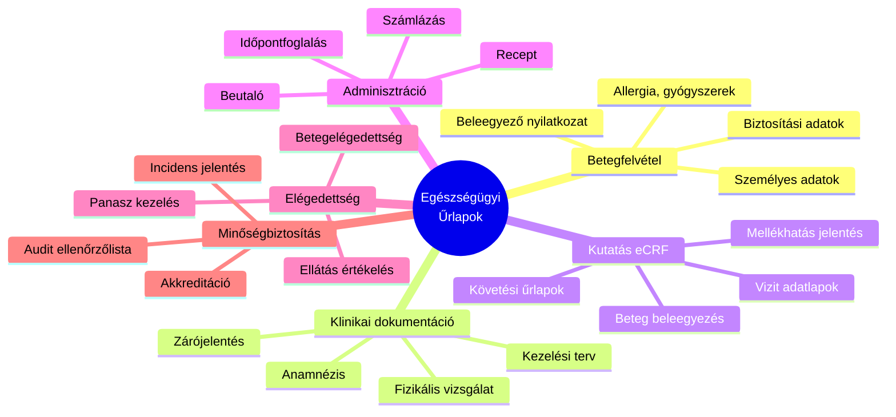
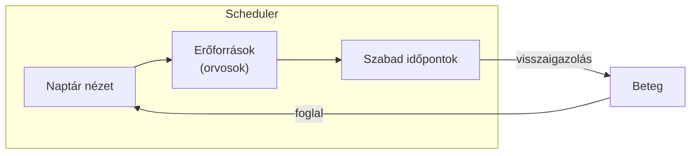
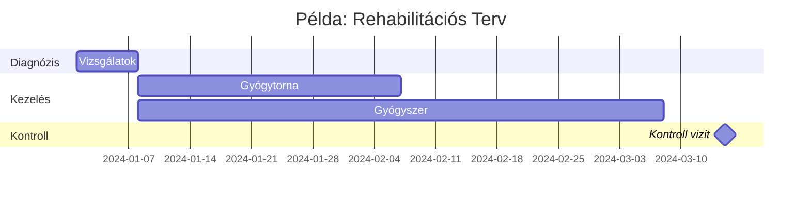
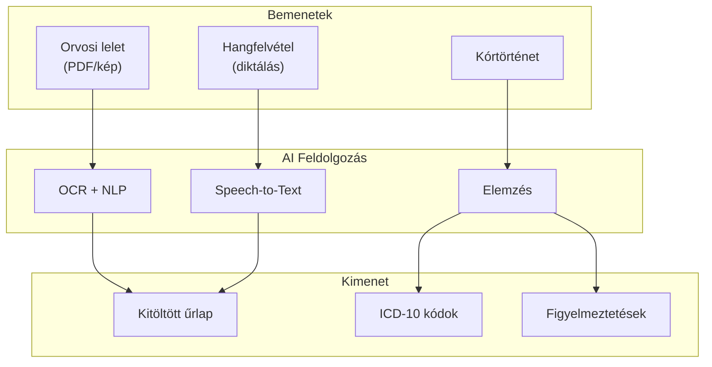
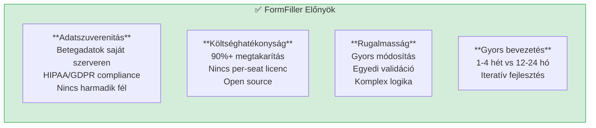
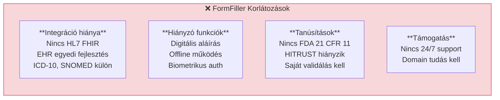

[← Vissza az Iparágak oldalra](index.md)

# Egészségügy

Az egészségügyi szektor az egyik legszabályozottabb és legösszetettebb iparág, ahol a FormFiller architektúra jelentős előnyöket kínálhat a hagyományos megoldásokkal szemben.

## Tartalomjegyzék

1. [Iparági Áttekintés](#iparági-áttekintés)
2. [Jellemző Igények](#jellemző-igények)
3. [Bővítési Lehetőségek](#bővítési-lehetőségek)
4. [AI Integráció](#ai-integráció)
5. [FormFiller Megfeleltetés](#formfiller-megfeleltetés)
6. [Összehasonlító Táblázat](#összehasonlító-táblázat)
7. [Pro/Kontra Elemzés](#prokontra-elemzés)
8. [Bővítési Javaslatok](#bővítési-javaslatok)
9. [Üzleti Értékelés](#üzleti-értékelés)

---

## Iparági Áttekintés

### Piaci Méret és Szereplők

| Jellemző | Érték |
|----------|-------|
| **Globális piaci méret** | $50-100 Mrd (egészségügyi IT) |
| **Éves növekedés** | 8-12% |
| **Fő piacok** | USA, EU, Ázsia |

### Hagyományos Megoldások

| Szoftver | Típus | Piaci részesedés | Jellemző ár |
|----------|-------|------------------|-------------|
| **Epic** | EHR/EMR | ~30% (USA kórházak) | $500K - $50M |
| **Cerner** | EHR/EMR | ~25% (USA) | $300K - $30M |
| **Meditech** | EHR/EMR | ~15% (kisebb kórházak) | $100K - $5M |
| **Veeva** | Klinikai kutatás | Vezető (pharma) | $50K - $500K/év |
| **REDCap** | Kutatási adatgyűjtés | Open source | Ingyenes |

### Szabályozási Környezet

- **HIPAA** (USA): Egészségügyi adatvédelem
- **GDPR** (EU): Személyes adatok védelme
- **FDA 21 CFR Part 11**: Elektronikus aláírás, audit trail
- **HITRUST**: Biztonsági keretrendszer

---

## Jellemző Igények

### Űrlap Típusok



### Speciális Követelmények

| Követelmény | Leírás | FormFiller támogatás |
|-------------|--------|---------------------|
| **Audit trail** | Minden módosítás naplózása | ✅ Beépített |
| **Digitális aláírás** | Orvosi dokumentumok hitelesítése | 🔶 Tervezett |
| **HIPAA compliance** | Adatvédelmi megfelelés | ✅ Self-hosted |
| **Interoperabilitás** | HL7 FHIR, DICOM integráció | 🔶 Bővítéssel |
| **Offline működés** | Mobil eszközök hálózat nélkül | 🔶 Tervezett |
| **Többnyelvűség** | Beteg anyanyelvén | ✅ Beépített |

---

## Bővítési Lehetőségek

A FormFiller az egészségügyben különösen hasznos komponenseket biztosít.

### Releváns Komponensek

| Komponens | Egészségügyi Alkalmazás | Előny |
|-----------|-------------------------|-------|
| **Scheduler** | Orvosi időpontfoglalás | Több orvos naptára, erőforrás nézet |
| **Charts** | Vitál értékek vizualizáció | Vérnyomás, pulzus trend |
| **Gantt** | Kezelési terv ütemezés | Terápia idővonalas nézet |
| **DataGrid** | Beteg lista, keresés | Szűrés, rendezés, export |
| **Form** | Anamnézis, betegfelvétel | Komplex feltételes logika |
| **FileUploader** | Dokumentum feltöltés | Leletek, képek, PDF |
| **HtmlEditor** | Orvosi jelentések | Formázott szöveg |

### Konkrét Use Case-ek

#### Időpontfoglaló Rendszer (Scheduler)



**Funkciók:**
- Több orvos párhuzamos naptára
- Rendelési idő sávok beállítása
- Kapacitás kezelés (pl. max 20 beteg/nap)
- Drag & drop átütemezés
- Google/Outlook szinkronizáció

#### Vitál Monitoring Dashboard (Charts)

| Chart típus | Alkalmazás |
|-------------|------------|
| **Line Chart** | Vérnyomás, pulzus trend |
| **Area Chart** | Testsúly változás |
| **Range Area** | Normál tartomány jelölés |
| **Sparklines** | Táblázatba ágyazott mini grafikonok |

#### Kezelési Terv (Gantt)



---

## AI Integráció

Az egységes JSON schema architektúra különösen hatékony AI integrációt tesz lehetővé az egészségügyben.

### AI Felhasználási Esetek

| AI Funkció | Leírás | Várható Haszon |
|------------|--------|----------------|
| **Orvosi dokumentum OCR** | Lelet, recept digitalizálás | 70% adatrögzítési idő megtakarítás |
| **Intelligens anamnézis** | Kérdések adaptálása válaszok alapján | Pontosabb adatgyűjtés |
| **ICD-10 kód javaslat** | Diagnózis alapján kód javaslat | Gyorsabb kódolás |
| **Prediktív kitöltés** | Korábbi adatokból javaslat | 50% kitöltési idő csökkentés |
| **Anomália detekció** | Kiugró vitál értékek jelzése | Korai figyelmeztetés |
| **Természetes nyelvű keresés** | "Mutasd a magas vérnyomásos betegeket" | Gyors lekérdezés |

### AI + Schema Szinergia az Egészségügyben



### Példa: AI-támogatott Betegfelvétel

| Lépés | AI Funkció | Eredmény |
|-------|------------|----------|
| 1 | Személyi okmány OCR | Személyes adatok automatikus kitöltése |
| 2 | TAJ kártya scan | Biztosítási adatok betöltése |
| 3 | Korábbi látogatás | Anamnézis előtöltés |
| 4 | Tünetek elemzése | Releváns kérdések aktiválása |
| 5 | Diagnózis javaslat | ICD-10 kód ajánlás |

### AI Előnyök Összefoglalva

| Előny | Hagyományos | AI-támogatott | Javulás |
|-------|-------------|---------------|---------|
| Betegfelvételi idő | 15-20 perc | 5-8 perc | 60-70% |
| Adatrögzítési hibák | 5-10% | 1-2% | 80% csökkenés |
| ICD kódolás ideje | 5 perc/beteg | 1 perc/beteg | 80% |
| Dokumentum keresés | 2-5 perc | < 30 mp | 90% |

---

## FormFiller Megfeleltetés

### Jelenleg Támogatott Funkciók

| Funkció | FormFiller képesség | Megjegyzés |
|---------|---------------------|------------|
| **Betegfelvételi űrlap** | ✅ Kiváló | JSON schema alapú, feltételes mezők |
| **Beleegyező nyilatkozat** | ✅ Jó | Digitális aláírás bővítéssel |
| **Anamnézis űrlap** | ✅ Kiváló | Komplex logika, validáció |
| **Elégedettségi felmérés** | ★★★★★ | Natív támogatás |
| **Kutatási adatgyűjtés** | ✅ Jó | eCRF alapfunkciók |
| **Incidens jelentés** | ✅ Kiváló | Workflow támogatás |

### Bővítéssel Támogatható

| Funkció | Szükséges bővítés | Komplexitás |
|---------|-------------------|-------------|
| **HL7 FHIR integráció** | API csatlakozó | Közepes |
| **Digitális aláírás** | E-sign plugin | Alacsony |
| **ICD-10 kódkeresés** | Lookup integráció | Alacsony |
| **PDF generálás** | Export modul | Alacsony |
| **Biometrikus azonosítás** | Auth plugin | Magas |

---

## Összehasonlító Táblázat

### FormFiller vs. Hagyományos Megoldások

| Szempont | Epic | Veeva | REDCap | FormFiller |
|----------|:----:|:-----:|:------:|:----------:|
| **Ár (éves)** | $500K+ | $50K+ | Ingyenes | Ingyenes* |
| **Implementáció** | 12-24 hó | 3-6 hó | 1-2 hó | 1-4 hét |
| **Testreszabás** | Limitált | Közepes | Jó | Kiváló |
| **Self-hosted** | Nem | Nem | Igen | Igen |
| **HIPAA ready** | Igen | Igen | Részben | Igen** |
| **Audit trail** | Igen | Igen | Igen | Igen |
| **Workflow** | Komplex | Jó | Alap | Jó |
| **API** | Zárt | Korlátozott | Nyílt | Nyílt |
| **Offline** | Nem | Nem | Nem | Tervezett |

*Infrastruktúra költség: $200-500/hó  
**Self-hosted, megfelelő konfigurációval

### Funkcionális Összehasonlítás

| Funkció | Epic | Veeva | REDCap | FormFiller |
|---------|:----:|:-----:|:------:|:----------:|
| Betegfelvétel | ★★★★★ | ★★☆☆☆ | ★★★☆☆ | ★★★★☆ |
| Klinikai kutatás | ★★★☆☆ | ★★★★★ | ★★★★★ | ★★★☆☆ |
| Elégedettség | ★★☆☆☆ | ★★★☆☆ | ★★★★☆ | ★★★★★ |
| Integráció | ★★★★★ | ★★★★☆ | ★★★☆☆ | ★★★☆☆ |
| Költség/érték | ★★☆☆☆ | ★★★☆☆ | ★★★★★ | ★★★★★ |

---

## Pro/Kontra Elemzés

### FormFiller Előnyök



### FormFiller Hátrányok/Korlátozások



### Mikor Válaszd a FormFiller-t?

| Szcenárió | Ajánlott? | Indoklás |
|-----------|:---------:|----------|
| Kis klinika betegfelvétel | ✅ Igen | Egyszerű, költséghatékony |
| Kórházi EHR rendszer | ❌ Nem | Komplex integráció szükséges |
| Klinikai kutatás (nem FDA) | ✅ Igen | Rugalmas, testreszabható |
| FDA-szabályozott kutatás | 🔶 Részben | Validálás szükséges |
| Betegelégedettség | ✅ Igen | Natív támogatás |
| Telemedicina intake | ✅ Igen | Gyors, mobil-barát |

---

## Bővítési Javaslatok

### Prioritásos Fejlesztések

| Fejlesztés | Leírás | Komplexitás | Prioritás |
|------------|--------|:-----------:|:---------:|
| **E-aláírás plugin** | DocuSign/HelloSign integráció | Alacsony | Magas |
| **HL7 FHIR csatlakozó** | Orvosi adatcsere szabvány | Közepes | Magas |
| **ICD-10 lookup** | Diagnózis kód keresés | Alacsony | Közepes |
| **SNOMED CT** | Klinikai terminológia | Közepes | Közepes |
| **PDF export sablonok** | Orvosi dokumentum formátumok | Alacsony | Közepes |
| **Offline PWA** | Mobil offline működés | Közepes | Közepes |
| **Biometrikus auth** | Ujjlenyomat, arc | Magas | Alacsony |

### Példa: E-aláírás Integráció

```json
{
  "name": "patientConsent",
  "type": "group",
  "items": [
    {
      "name": "consentText",
      "type": "richtext",
      "readonly": true,
      "content": "Beleegyezem a kezelésbe..."
    },
    {
      "name": "signature",
      "type": "signature",
      "label": "Aláírás",
      "validationRules": [
        { "type": "required", "message": "Aláírás kötelező" }
      ]
    },
    {
      "name": "signedAt",
      "type": "datetime",
      "readonly": true,
      "defaultValue": "{{now}}"
    }
  ]
}
```

---

## Üzleti Értékelés

### Összefoglaló

| Metrika | Érték |
|---------|-------|
| **Jelenlegi megfelelőség** | ★★★☆☆ |
| **Fejlesztési potenciál** | ★★★★★ |
| **Piaci méret (TAM)** | $50-100 Mrd |
| **Elérhető megtakarítás** | 60-80% |
| **Piaci siker esélye** | Magas |

### ROI Becslés

| Szcenárió | Hagyományos költség | FormFiller költség | Megtakarítás |
|-----------|--------------------:|-------------------:|-------------:|
| Kis klinika (10 orvos) | €20,000/év | €3,000/év | €17,000 (85%) |
| Közepes klinika (50 orvos) | €100,000/év | €15,000/év | €85,000 (85%) |
| Kutatási projekt | €50,000 | €10,000 | €40,000 (80%) |

### Célpiac

| Szegmens | Potenciál | Prioritás |
|----------|:---------:|:---------:|
| Magánklinikák | Magas | 1 |
| Kutatóintézetek | Magas | 1 |
| Telemedicina | Magas | 2 |
| Kórházak (kiegészítő) | Közepes | 3 |
| Pharma (nem FDA) | Közepes | 3 |

---

## Kapcsolódó Dokumentációk

- [Iparági Összefoglaló](./index.md)
- [Pénzügy/Biztosítás](./finance.md) - Hasonló compliance igények
- [Jóváhagyási Workflow](../functions/approval-workflow.md)
- [Felmérések](../functions/survey.md)
