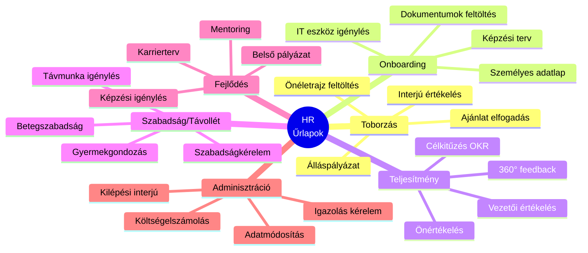
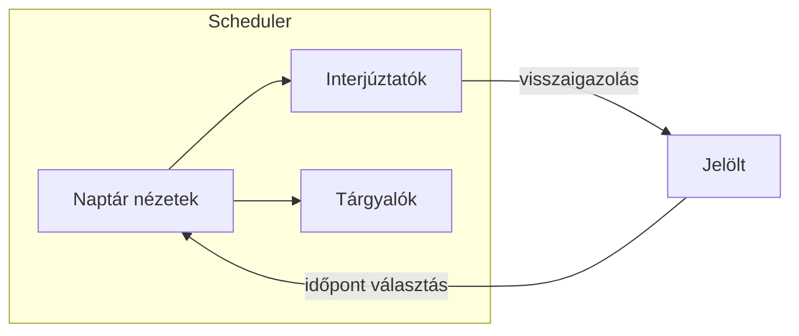
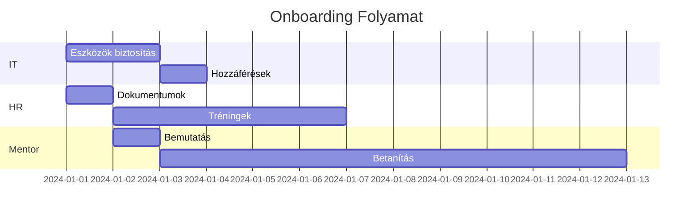
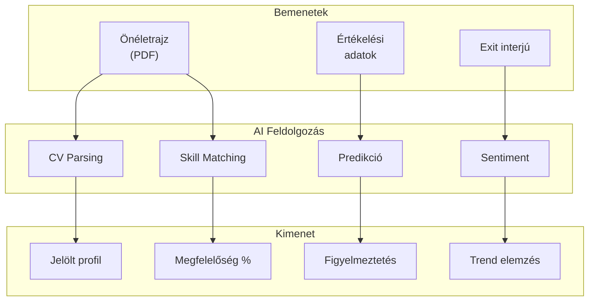
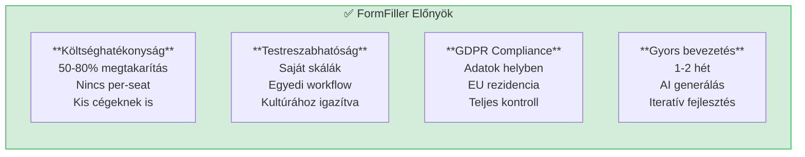
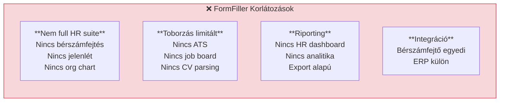

[← Vissza az Iparágak oldalra](index.md)

# HR és Toborzás

A HR és toborzás terület kiválóan alkalmas a FormFiller számára, ahol az onboarding, teljesítményértékelés, szabadságkezelés és toborzás területén azonnali értéket nyújt.

## Tartalomjegyzék

1. [Iparági Áttekintés](#iparági-áttekintés)
2. [Jellemző Igények](#jellemző-igények)
3. [Bővítési Lehetőségek](#bővítési-lehetőségek)
4. [AI Integráció](#ai-integráció)
5. [FormFiller Megfeleltetés](#formfiller-megfeleltetés)
6. [Összehasonlító Táblázat](#összehasonlító-táblázat)
7. [Pro/Kontra Elemzés](#prokontra-elemzés)
8. [Bővítési Javaslatok](#bővítési-javaslatok)
9. [Üzleti Értékelés](#üzleti-értékelés)

---

## Iparági Áttekintés

### Piaci Méret és Jellemzők

| Jellemző | Érték |
|----------|-------|
| **Globális piaci méret** | $15-30 Mrd (HR Tech) |
| **Éves növekedés** | 10-15% |
| **Fő szegmensek** | Core HR, Toborzás, Teljesítménymenedzsment |
| **Fő hajtóerő** | Digitalizáció, távmunka |

### Hagyományos Megoldások

| Szoftver | Típus | Piaci pozíció | Jellemző ár |
|----------|-------|---------------|-------------|
| **Workday** | HCM Suite | Piacvezető | $100-200/felh./év |
| **SAP SuccessFactors** | HCM Suite | Erős | $80-150/felh./év |
| **BambooHR** | SMB HR | Növekvő | $8-15/felh./hó |
| **Greenhouse** | ATS | Toborzás | $6-12K/év |
| **Personio** | SMB HR | EU piacvezető | €5-10/felh./hó |

---

## Jellemző Igények

### Űrlap Típusok



### Speciális Követelmények

| Követelmény | Leírás | FormFiller támogatás |
|-------------|--------|---------------------|
| **GDPR compliance** | Személyes adatok védelme | ✅ Self-hosted |
| **Workflow jóváhagyás** | Vezető, HR, pénzügy | ✅ Beépített |
| **Audit trail** | Ki, mikor módosított | ✅ Beépített |
| **Anonimitás** | 360° feedback | ✅ Konfigurálható |
| **Integráció** | Bérszámfejtő, ERP | 🔶 API-val |
| **Riporting** | HR dashboard | 🔶 Export alapú |

---

## Bővítési Lehetőségek

A FormFiller a HR területen különösen értékes komponenseket biztosít.

### Releváns Komponensek

| Komponens | HR Alkalmazás | Előny |
|-----------|---------------|-------|
| **Scheduler** | Interjú ütemezés, szabadságnaptár | Vizuális naptár |
| **Gantt** | Onboarding terv | Feladatok ütemezése |
| **Charts** | Teljesítmény dashboard | Értékelések vizualizáció |
| **DataGrid** | Alkalmazott lista | Szűrés, export |
| **Diagram** | Szervezeti ábra | OrgChart nézet |
| **Form** | Értékelések, kérelmek | Komplex űrlapok |
| **PivotGrid** | HR riportok | Aggregált statisztikák |

### Konkrét Use Case-ek

#### Interjú Ütemezés (Scheduler)



**Funkciók:**
- Interjúztató elérhetőség
- Tárgyaló foglalás
- Automatikus értesítések
- Google/Outlook szinkronizáció

#### Onboarding Ütemterv (Gantt)



#### Teljesítmény Dashboard (Charts)

| Chart típus | Alkalmazás |
|-------------|------------|
| **Radar Chart** | Kompetencia profil |
| **Bar Chart** | Értékelések összehasonlítása |
| **Line Chart** | Teljesítmény trend |
| **Gauges** | Célteljesülés |

---

## AI Integráció

Az egységes JSON schema architektúra hatékony AI integrációt tesz lehetővé a HR területen.

### AI Felhasználási Esetek

| AI Funkció | Leírás | Várható Haszon |
|------------|--------|----------------|
| **Önéletrajz elemzés** | CV parsing, skill kinyerés | 80% screening idő megtakarítás |
| **Interjú ütemezés** | Automatikus időpont egyeztetés | 90% admin csökkentés |
| **Sentiment analysis** | Exit interjú elemzés | Trendek felismerése |
| **Teljesítmény predikció** | Korai figyelmeztetés | Megelőző intézkedések |
| **Onboarding személyre szabás** | Profil alapján feladatok | Hatékonyabb betanítás |
| **Skill gap elemzés** | Hiányzó kompetenciák | Célzott képzés |

### AI + Schema Szinergia a HR-ben



### Példa: AI-támogatott Toborzás

| Lépés | AI Funkció | Eredmény |
|-------|------------|----------|
| 1 | CV feltöltés | Automatikus skill kinyerés |
| 2 | Pozíció matching | Megfelelőség scoring |
| 3 | Interjú javaslat | Optimális időpontok |
| 4 | Értékelés elemzés | Összesített profil |
| 5 | Döntés támogatás | Rangsor javaslat |

### AI Előnyök Összefoglalva

| Előny | Hagyományos | AI-támogatott | Javulás |
|-------|-------------|---------------|---------|
| CV screening | 5 perc/CV | 30 mp/CV | 90% |
| Interjú ütemezés | 3-5 email | Automatikus | 95% |
| Teljesítmény trend | Manuális elemzés | Automatikus | 90% |
| Exit elemzés | Alkalmi | Rendszeres | 100% |

---

## FormFiller Megfeleltetés

### Jelenleg Támogatott Funkciók

| Funkció | FormFiller képesség | Megjegyzés |
|---------|---------------------|------------|
| **Álláspályázat** | ★★★★★ | Natív támogatás |
| **Onboarding űrlapok** | ★★★★★ | Komplex workflow |
| **Szabadságkérelem** | ★★★★★ | Jóváhagyási lánc |
| **Teljesítményértékelés** | ★★★★★ | Skálák, szöveges |
| **360° feedback** | ✅ Kiváló | Anonim támogatás |
| **Költségelszámolás** | ✅ Kiváló | Fájl feltöltés |

### Bővítéssel Támogatható

| Funkció | Szükséges bővítés | Komplexitás |
|---------|-------------------|-------------|
| **Bérszámfejtő API** | Nexon, SAP csatlakozó | Közepes |
| **Naptár integráció** | Google/Outlook Calendar | Alacsony |
| **E-aláírás** | Szerződések | Alacsony |
| **Szabadság egyenleg** | Kalkulátor modul | Alacsony |
| **Org chart** | Vizualizáció | Közepes |

---

## Összehasonlító Táblázat

### FormFiller vs. Hagyományos Megoldások

| Szempont | Workday | BambooHR | Personio | FormFiller |
|----------|:-------:|:--------:|:--------:|:----------:|
| **Ár (éves, 100 felh.)** | €15K+ | €10K+ | €6K+ | €3-5K* |
| **Implementáció** | 3-6 hó | 1-2 hét | 1-2 hét | 1-2 hét |
| **Testreszabás** | Limitált | Közepes | Közepes | Kiváló |
| **Self-hosted** | Nem | Nem | Nem | Igen |
| **Workflow** | Komplex | Jó | Jó | Kiváló |
| **Magyar nyelv** | Részben | Nem | Részben | Igen |
| **Integráció** | Komplex | Jó | Jó | API |

*Infrastruktúra + karbantartás

### Funkcionális Összehasonlítás

| Funkció | Workday | BambooHR | Personio | FormFiller |
|---------|:-------:|:--------:|:--------:|:----------:|
| Toborzás | ★★★★☆ | ★★★★☆ | ★★★★☆ | ★★★☆☆ |
| Onboarding | ★★★★★ | ★★★★☆ | ★★★★☆ | ★★★★★ |
| Teljesítmény | ★★★★★ | ★★★☆☆ | ★★★★☆ | ★★★★☆ |
| Szabadság | ★★★★☆ | ★★★★★ | ★★★★★ | ★★★★☆ |
| Költség/érték | ★★☆☆☆ | ★★★★☆ | ★★★★☆ | ★★★★★ |

---

## Pro/Kontra Elemzés

### FormFiller Előnyök



### FormFiller Hátrányok/Korlátozások



### Mikor Válaszd a FormFiller-t?

| Szcenárió | Ajánlott? | Indoklás |
|-----------|:---------:|----------|
| KKV HR alapfolyamatok | ✅ Igen | Költséghatékony |
| Enterprise HR kiegészítés | ✅ Igen | Egyedi űrlapok |
| Teljesítményértékelés | ✅ Igen | Rugalmas, testreszabható |
| Teljes HR rendszer | 🔶 Részben | Kiegészítés kell |
| Toborzás (ATS) | ❌ Nem | Speciális funkciók |
| Szabadságkezelés | ✅ Igen | Workflow támogatás |

---

## Bővítési Javaslatok

### Prioritásos Fejlesztések

| Fejlesztés | Leírás | Komplexitás | Prioritás |
|------------|--------|:-----------:|:---------:|
| **Naptár integráció** | Google/Outlook szabadság | Alacsony | Magas |
| **Szabadság egyenleg** | Automatikus számítás | Alacsony | Magas |
| **E-aláírás** | Munkaszerződések | Alacsony | Közepes |
| **Bérszámfejtő API** | Nexon, SAP | Közepes | Közepes |
| **Org chart** | Szervezeti ábra | Közepes | Alacsony |
| **CV parser** | Automatikus feldolgozás | Magas | Alacsony |

### Példa: Teljesítményértékelés Űrlap

```json
{
  "name": "performanceReview",
  "title": "Éves Teljesítményértékelés",
  "items": [
    {
      "type": "group",
      "name": "employeeInfo",
      "label": "Munkatárs adatai",
      "items": [
        { "name": "employeeName", "type": "text", "readonly": true },
        { "name": "department", "type": "text", "readonly": true },
        { "name": "reviewPeriod", "type": "text", "readonly": true }
      ]
    },
    {
      "type": "group",
      "name": "competencies",
      "label": "Kompetenciák értékelése",
      "items": [
        {
          "name": "communication",
          "type": "rating",
          "label": "Kommunikáció",
          "max": 5,
          "validationRules": [{ "type": "required" }]
        },
        {
          "name": "teamwork",
          "type": "rating",
          "label": "Csapatmunka",
          "max": 5
        },
        {
          "name": "problemSolving",
          "type": "rating",
          "label": "Problémamegoldás",
          "max": 5
        },
        {
          "name": "initiative",
          "type": "rating",
          "label": "Kezdeményezőkészség",
          "max": 5
        }
      ]
    },
    {
      "type": "group",
      "name": "goals",
      "label": "Célok teljesülése",
      "items": [
        {
          "name": "goalsList",
          "type": "array",
          "label": "Kitűzött célok",
          "itemTemplate": {
            "type": "group",
            "items": [
              { "name": "goalDescription", "type": "text", "label": "Cél" },
              { "name": "achievement", "type": "select", "label": "Teljesítés",
                "items": [
                  { "value": "exceeded", "label": "Túlteljesítve" },
                  { "value": "met", "label": "Teljesítve" },
                  { "value": "partial", "label": "Részben" },
                  { "value": "notMet", "label": "Nem teljesült" }
                ]
              }
            ]
          }
        }
      ]
    },
    {
      "type": "group",
      "name": "feedback",
      "label": "Szöveges értékelés",
      "items": [
        {
          "name": "strengths",
          "type": "textarea",
          "label": "Erősségek",
          "rows": 4
        },
        {
          "name": "areasForImprovement",
          "type": "textarea",
          "label": "Fejlesztendő területek",
          "rows": 4
        },
        {
          "name": "nextYearGoals",
          "type": "textarea",
          "label": "Jövő évi célok",
          "rows": 4
        }
      ]
    },
    {
      "name": "overallRating",
      "type": "select",
      "label": "Összesített értékelés",
      "items": [
        { "value": "5", "label": "Kiemelkedő (5)" },
        { "value": "4", "label": "Átlag feletti (4)" },
        { "value": "3", "label": "Megfelelő (3)" },
        { "value": "2", "label": "Fejlesztendő (2)" },
        { "value": "1", "label": "Nem megfelelő (1)" }
      ],
      "validationRules": [{ "type": "required" }]
    }
  ]
}
```

---

## Üzleti Értékelés

### Összefoglaló

| Metrika | Érték |
|---------|-------|
| **Jelenlegi megfelelőség** | ★★★★★ |
| **Fejlesztési potenciál** | ★★★★☆ |
| **Piaci méret (TAM)** | $15-30 Mrd |
| **Elérhető megtakarítás** | 70-85% |
| **Piaci siker esélye** | Magas |

### ROI Becslés

| Szcenárió | Hagyományos költség | FormFiller költség | Megtakarítás |
|-----------|--------------------:|-------------------:|-------------:|
| Kisvállalat (50 fő) | €6,000/év | €2,000/év | €4,000 (67%) |
| KKV (200 fő) | €20,000/év | €5,000/év | €15,000 (75%) |
| Nagyvállalat (kiegészítő) | €50,000/év | €10,000/év | €40,000 (80%) |

### Célpiac

| Szegmens | Potenciál | Prioritás |
|----------|:---------:|:---------:|
| KKV (50-500 fő) | Magas | 1 |
| Startup | Magas | 1 |
| Nagyvállalat (kiegészítő) | Közepes | 2 |
| HR tanácsadók | Közepes | 2 |
| Munkaerő-kölcsönzők | Közepes | 3 |

---

## Kapcsolódó Dokumentációk

- [Iparági Összefoglaló](./index.md)
- [Jóváhagyási Workflow](../functions/approval-workflow.md)
- [Felmérések](../functions/survey.md) - 360° feedback
- [Oktatás](./education.md) - Képzési űrlapok
