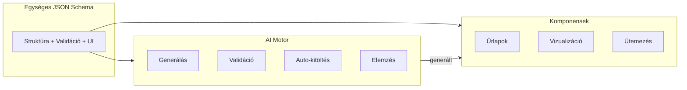
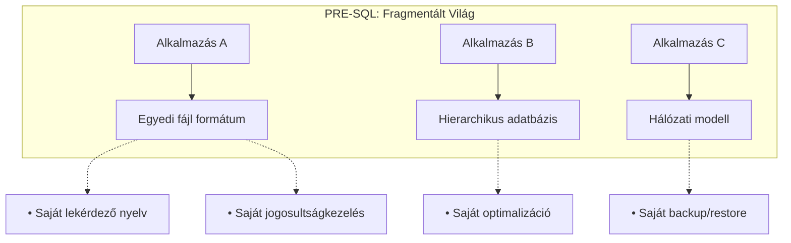
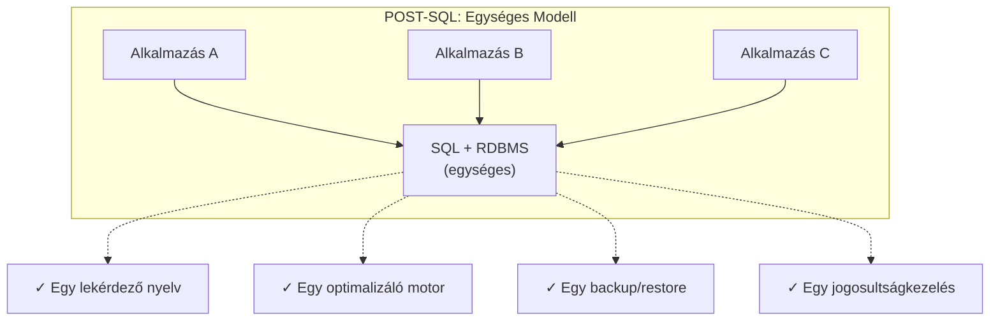
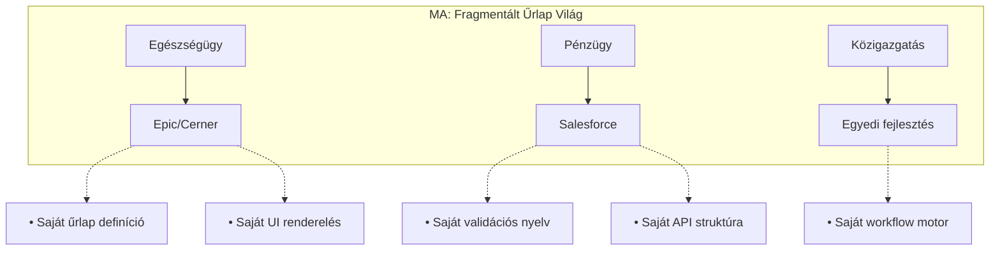
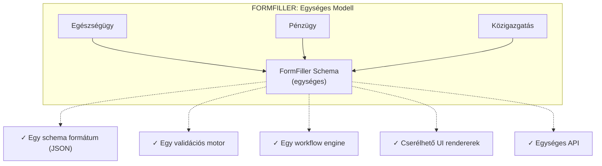
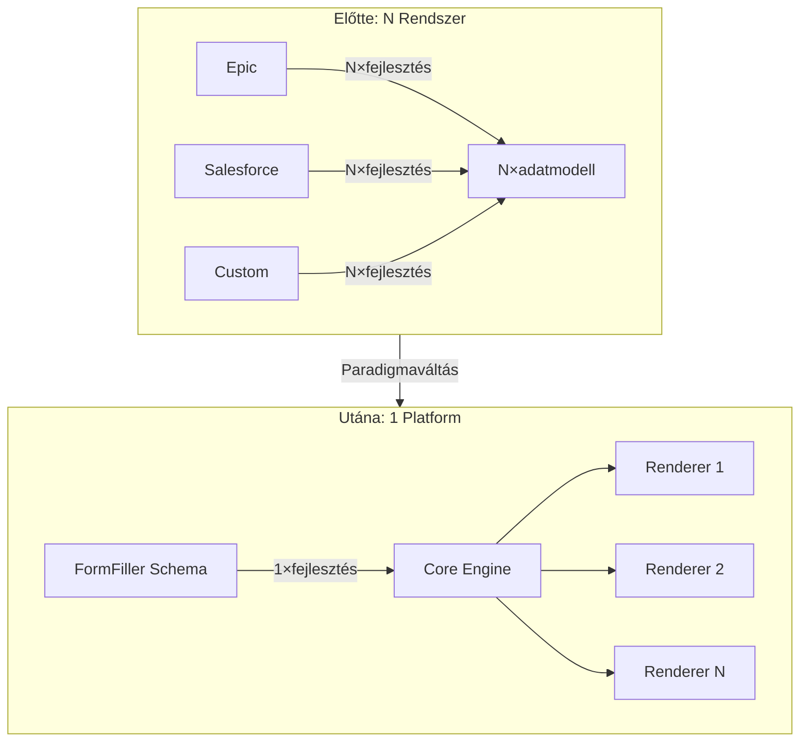

[← Vissza az Alkalmazhatóság főoldalra](../index.md)

# Iparági Alkalmazhatóság

Ez az oldal összefoglalja a FormFiller rendszer alkalmazhatóságát 18 különböző iparágban, részletes elemzéssel a kiemelt területekhez.

## Tartalomjegyzék

1. [Értékelési Módszertan](#értékelési-módszertan)
2. [Komponens és AI Lehetőségek](#komponens-és-ai-lehetőségek)
3. [Kiemelt Iparágak (részletes elemzéssel)](#kiemelt-iparágak)
4. [További Iparágak](#további-iparágak)
5. [Összefoglaló Táblázat](#összefoglaló-táblázat)
6. [Az Elemzés Tanulságai](#az-elemzés-tanulságai)
7. [Történelmi Párhuzam: Az SQL Pillanat](#történelmi-párhuzam-az-sql-pillanat)

---

## Értékelési Módszertan

### Értékelési Szempontok

| Szempont | Leírás |
|----------|--------|
| **Megfelelőség** | Mennyire alkalmas a FormFiller jelenlegi állapotában az iparági igényekre |
| **Potenciál** | Milyen fejlesztési lehetőségek rejlenek a platformban |
| **Piaci méret (TAM)** | Globális piac becsült értéke (Total Addressable Market) |
| **Megtakarítás** | Várható költségcsökkenés a hagyományos megoldásokhoz képest |
| **Siker** | Piaci siker valószínűsége az adott iparágban |

### Csillagos Értékelés

| Csillag | Jelentés |
|---------|----------|
| ★★★★★ | Kiváló - Azonnal alkalmazható |
| ★★★★☆ | Nagyon jó - Kisebb testreszabással |
| ★★★☆☆ | Jó - Közepes fejlesztéssel |
| ★★☆☆☆ | Mérsékelt - Jelentős fejlesztés kell |
| ★☆☆☆☆ | Alacsony - Alapvető funkciók hiányoznak |

---

## Komponens és AI Lehetőségek

A FormFiller 80+ professzionális UI komponenst biztosít minden iparágban. Az egységes JSON schema architektúra pedig különösen hatékony AI integrációt tesz lehetővé.

### Komponensek Iparáganként

| Iparág | Kiemelt Komponensek | Fő Alkalmazás |
|--------|-------------------------------|---------------|
| **Egészségügy** | Scheduler, Charts, Gantt, Form | Időpontfoglalás, vitál monitoring, kezelési terv |
| **Pénzügy** | Charts, PivotGrid, Diagram, DataGrid | Dashboard, riportok, workflow, tranzakciók |
| **Közigazgatás** | Gantt, Diagram, TreeView, FileManager | Projektek, folyamatok, szervezet, iratok |
| **Oktatás** | Scheduler, Charts, DataGrid, HtmlEditor | Órarend, eredmények, hallgatók, feladatok |
| **HR** | Scheduler, Gantt, Charts, DataGrid | Interjúk, onboarding, teljesítmény, alkalmazottak |
| **Telco** | Charts, TreeList, Diagram, DataGrid | Analitika, szolgáltatások, hálózat, ügyfelek |
| **Pályázatok** | Gantt, Charts, PivotGrid, TreeView | Ütemezés, költségvetés, monitoring, struktúra |
| **Gyártás** | DataGrid, Charts, Gauges, Scheduler | Gyártási adatok, KPI, státusz, karbantartás |
| **Ingatlan** | Gallery, DataGrid, Charts, Scheduler | Portfólió, bérlők, analitika, időpontok |
| **Építőipar** | Gantt, Charts, DataGrid, FileManager | Projekt ütemezés, költségek, jelentések, dokumentumok |

### AI Potenciál Iparáganként

| Iparág | AI Funkció | Várható Haszon |
|--------|-----------|----------------|
| **Egészségügy** | Orvosi dokumentum OCR, intelligens anamnézis, prediktív kitöltés | 40-60% adminisztráció csökkentés |
| **Pénzügy** | KYC auto-validáció, anomália detekció, dokumentum feldolgozás | 50-70% manuális ellenőrzés megtakarítás |
| **Közigazgatás** | Kérelem osztályozás, automatikus továbbítás, NL query | 60-80% ügyintézési idő csökkentés |
| **Oktatás** | Automatikus értékelés, plagizálás ellenőrzés, adaptív kérdések | 70-90% javítási idő megtakarítás |
| **HR** | Önéletrajz elemzés, interjú ütemezés, onboarding automatizálás | 50-70% HR adminisztráció csökkentés |
| **Telco** | Prediktív hibakeresés, chatbot ügyféltámogatás, churn előrejelzés | 30-50% ügyfélszolgálati költség csökkentés |
| **Pályázatok** | Pályázat előértékelés, költségvetés validáció, automatikus összesítés | 60-80% bírálati idő megtakarítás |

---

## Kiemelt Iparágak

Az alábbi iparágakhoz részletes elemzés készült külön oldalakon.

### Egészségügy

**[Részletes elemzés →](./healthcare.md)**

| Jellemző | Érték |
|----------|-------|
| Megfelelőség | ★★★☆☆ |
| Potenciál | ★★★★★ |
| Piaci méret | $50-100 Mrd |
| Megtakarítás | 60-80% |
| Siker | Magas |

**Kulcsterületek:**
- Betegfelvételi űrlapok, anamnézis
- Klinikai kutatási adatgyűjtés (eCRF)
- Betegelégedettségi felmérések
- Orvosi jelentések, dokumentáció

**Hagyományos megoldások:** Epic, Cerner, Meditech, Veeva

---

### Pénzügy/Biztosítás

**[Részletes elemzés →](./finance.md)**

| Jellemző | Érték |
|----------|-------|
| Megfelelőség | ★★★★☆ |
| Potenciál | ★★★★★ |
| Piaci méret | $80-150 Mrd |
| Megtakarítás | 50-70% |
| Siker | Magas |

**Kulcsterületek:**
- KYC (Know Your Customer) űrlapok
- Hitelkérelem, számlaigénylés
- Kárigény bejelentés és feldolgozás
- Compliance és audit ellenőrzőlisták

**Hagyományos megoldások:** Salesforce FSC, Guidewire, Duck Creek

---

### Közigazgatás

**[Részletes elemzés →](./public-sector.md)**

| Jellemző | Érték |
|----------|-------|
| Megfelelőség | ★★★★☆ |
| Potenciál | ★★★★★ |
| Piaci méret | $30-60 Mrd |
| Megtakarítás | 70-90% |
| Siker | Magas |

**Kulcsterületek:**
- E-ügyintézés, állampolgári kérelmek
- Engedélyezési folyamatok
- Adóbevallás, támogatási igénylés
- Belső adminisztráció

**Hagyományos megoldások:** SAP Public Sector, Oracle, egyedi fejlesztések

---

### Oktatás

**[Részletes elemzés →](./education.md)**

| Jellemző | Érték |
|----------|-------|
| Megfelelőség | ★★★★★ |
| Potenciál | ★★★★☆ |
| Piaci méret | $10-25 Mrd |
| Megtakarítás | 80-95% |
| Siker | Magas |

**Kulcsterületek:**
- Beiratkozás, jelentkezés
- Vizsgák, dolgozatok, kvízek
- Beadandók, projektek értékelése
- Kurzus értékelés, feedback

**Hagyományos megoldások:** Canvas, Blackboard, Moodle, Google Classroom

---

### HR/Toborzás

**[Részletes elemzés →](./hr.md)**

| Jellemző | Érték |
|----------|-------|
| Megfelelőség | ★★★★★ |
| Potenciál | ★★★★☆ |
| Piaci méret | $15-30 Mrd |
| Megtakarítás | 70-85% |
| Siker | Magas |

**Kulcsterületek:**
- Álláspályázat, önéletrajz fogadás
- Onboarding folyamat
- Teljesítményértékelés
- Szabadságkérelem, távmunka igénylés

**Hagyományos megoldások:** Workday, BambooHR, SAP SuccessFactors

---

### Telekommunikáció

**[Részletes elemzés →](./telco.md)**

| Jellemző | Érték |
|----------|-------|
| Megfelelőség | ★★★☆☆ |
| Potenciál | ★★★★★ |
| Piaci méret | $40-80 Mrd |
| Megtakarítás | 50-70% |
| Siker | Közepes |

**Kulcsterületek:**
- Szolgáltatás konfiguráció, tarifaválasztás
- Ügyfélportál, szerződésmódosítás
- Hibabejelentés, technikus munkavégzés
- SIM/eSIM aktiváció

**Hagyományos megoldások:** Amdocs, Comarch BSS, Netcracker

---

### Pályázati Rendszerek

**[Részletes elemzés →](./grants.md)**

| Jellemző | Érték |
|----------|-------|
| Megfelelőség | ★★★★☆ |
| Potenciál | ★★★★★ |
| Piaci méret | $5-15 Mrd |
| Megtakarítás | 80-95% |
| Siker | Magas |

**Kulcsterületek:**
- Pályázat beadás, többoldalas űrlapok
- Bírálati folyamat, pontozás
- Költségvetés kezelés
- Monitoring, beszámolók

**Hagyományos megoldások:** Submittable, Fluxx, OpenGrants, EPTK

---

## További Iparágak

Az alábbi iparágakhoz összefoglaló elemzés készült.

### Gyártás/Ipar

| Jellemző | Érték |
|----------|-------|
| Megfelelőség | ★★★☆☆ |
| Potenciál | ★★★★☆ |
| Piaci méret | $40-70 Mrd |
| Megtakarítás | 50-70% |
| Siker | Közepes |

**Alkalmazási területek:**
- Minőségellenőrzési checklisztek
- Gépkarbantartási jelentések
- Munkavédelmi dokumentáció
- Beszállítói minősítés

**Hagyományos megoldások:** SAP Manufacturing, Oracle, Siemens

**FormFiller előnyök:**
- Offline működés támogatása (tervezett)
- Mobil-first űrlapok
- Egyszerű integráció meglévő ERP-hez

**Szükséges bővítések:**
- Vonalkód/QR olvasó integráció
- Offline szinkronizálás
- ERP csatlakozók (SAP, Oracle)

---

### Retail/E-commerce

| Jellemző | Érték |
|----------|-------|
| Megfelelőség | ★★☆☆☆ |
| Potenciál | ★★★☆☆ |
| Piaci méret | $25-50 Mrd |
| Megtakarítás | 40-60% |
| Siker | Közepes |

**Alkalmazási területek:**
- Vevői regisztráció, loyalty program
- Termékkonfiguráció (egyedi termékek)
- Reklamáció, visszáru kezelés
- Beszállítói űrlapok

**Hagyományos megoldások:** Shopify, Magento, WooCommerce

**FormFiller előnyök:**
- Egyedi termékek konfigurálása
- Komplex visszáru workflow
- B2B partner portál

**Korlátozások:**
- Nem helyettesíti a webshop funkciókat
- Fizetési integráció szükséges

---

### Logisztika/Szállítmányozás

| Jellemző | Érték |
|----------|-------|
| Megfelelőség | ★★★☆☆ |
| Potenciál | ★★★★☆ |
| Piaci méret | $20-40 Mrd |
| Megtakarítás | 50-70% |
| Siker | Közepes |

**Alkalmazási területek:**
- Fuvarlevél, CMR dokumentumok
- Rakodási ellenőrzőlisták
- Sofőr jelentések
- Vámkezelési űrlapok

**Hagyományos megoldások:** SAP TM, Oracle TMS, Transporeon

**FormFiller előnyök:**
- Mobil űrlapok sofőröknek
- Digitális aláírás lehetőség
- Valós idejű adatgyűjtés

---

### Ingatlan

| Jellemző | Érték |
|----------|-------|
| Megfelelőség | ★★★★☆ |
| Potenciál | ★★★★☆ |
| Piaci méret | $10-20 Mrd |
| Megtakarítás | 60-80% |
| Siker | Közepes |

**Alkalmazási területek:**
- Bérleti szerződés, igényfelmérés
- Ingatlan állapotfelmérés
- Hibabejelentés, karbantartás
- Ügyfél regisztráció, érdeklődés

**Hagyományos megoldások:** Yardi, AppFolio, Propertyware

**FormFiller előnyök:**
- Komplex állapotfelmérő űrlapok
- Fotó csatolás lehetősége
- Bérlői portál

---

### Non-profit/Civil

| Jellemző | Érték |
|----------|-------|
| Megfelelőség | ★★★★★ |
| Potenciál | ★★★★☆ |
| Piaci méret | $5-10 Mrd |
| Megtakarítás | 80-95% |
| Siker | Magas |

**Alkalmazási területek:**
- Adományozói regisztráció
- Önkéntes jelentkezés
- Programra jelentkezés, beiratkozás
- Hatásmérés, beszámolók

**Hagyományos megoldások:** Blackbaud, Salesforce NPSP, Bloomerang

**FormFiller előnyök:**
- Ingyenes (open source) - költségérzékeny szektor
- Egyszerű testreszabás
- GDPR megfelelés

---

### Jogi Szektor

| Jellemző | Érték |
|----------|-------|
| Megfelelőség | ★★★★☆ |
| Potenciál | ★★★★☆ |
| Piaci méret | $10-20 Mrd |
| Megtakarítás | 60-80% |
| Siker | Közepes |

**Alkalmazási területek:**
- Ügyfél felvételi űrlap (intake)
- Ügymenet dokumentáció
- Ellenőrzőlisták (due diligence)
- Időnyilvántartás

**Hagyományos megoldások:** Clio, PracticePanther, MyCase

**FormFiller előnyök:**
- Bizalmas adatok saját szerveren
- Komplex feltételes logika
- Audit trail

---

### Építőipar

| Jellemző | Érték |
|----------|-------|
| Megfelelőség | ★★★☆☆ |
| Potenciál | ★★★★☆ |
| Piaci méret | $15-30 Mrd |
| Megtakarítás | 50-70% |
| Siker | Közepes |

**Alkalmazási területek:**
- Munkavédelmi ellenőrzőlisták
- Napi jelentések, haladási napló
- Anyagrendelés
- Alvállalkozói minősítés

**Hagyományos megoldások:** Procore, Buildertrend, PlanGrid

**FormFiller előnyök:**
- Mobil űrlapok helyszínen
- Fotó dokumentáció
- Offline támogatás (tervezett)

---

### Energia/Közművek

| Jellemző | Érték |
|----------|-------|
| Megfelelőség | ★★★☆☆ |
| Potenciál | ★★★★☆ |
| Piaci méret | $20-40 Mrd |
| Megtakarítás | 50-70% |
| Siker | Közepes |

**Alkalmazási területek:**
- Mérőóra leolvasás
- Hibabejelentés, kiszállás
- Szerződéskötés, tarifaváltás
- Szabályozói jelentések

**Hagyományos megoldások:** SAP Utilities, Oracle Utilities, Itron

**FormFiller előnyök:**
- Mobil field service űrlapok
- Ügyfélportál önkiszolgálás
- Workflow automatizáció

---

### Mezőgazdaság

| Jellemző | Érték |
|----------|-------|
| Megfelelőség | ★★★☆☆ |
| Potenciál | ★★★★☆ |
| Piaci méret | $8-15 Mrd |
| Megtakarítás | 60-80% |
| Siker | Közepes |

**Alkalmazási területek:**
- Gazdálkodási napló
- Növényvédelmi jelentések
- Támogatási igénylés
- Minőségbiztosítás, nyomonkövetés

**Hagyományos megoldások:** Trimble, Climate Corp, Granular

**FormFiller előnyök:**
- Egyszerű, testreszabható űrlapok
- EU támogatási formátumok
- Offline működés (tervezett)

---

### Turizmus/Vendéglátás

| Jellemző | Érték |
|----------|-------|
| Megfelelőség | ★★★★☆ |
| Potenciál | ★★★★☆ |
| Piaci méret | $10-20 Mrd |
| Megtakarítás | 60-80% |
| Siker | Közepes |

**Alkalmazási területek:**
- Foglalási űrlapok
- Vendég regisztráció, check-in
- Éttermi rendelés, menü konfiguráció
- Vendégelégedettségi felmérés

**Hagyományos megoldások:** Opera, Cloudbeds, Mews

**FormFiller előnyök:**
- Többnyelvű támogatás
- Mobil-barát űrlapok
- Egyszerű integráció

---

### Sport/Rendezvény

| Jellemző | Érték |
|----------|-------|
| Megfelelőség | ★★★★☆ |
| Potenciál | ★★★★☆ |
| Piaci méret | $5-10 Mrd |
| Megtakarítás | 70-85% |
| Siker | Közepes |

**Alkalmazási területek:**
- Esemény regisztráció
- Jelentkezési űrlapok (verseny, tábor)
- Egészségügyi nyilatkozat
- Önkéntes koordináció

**Hagyományos megoldások:** Eventbrite, Bizzabo, Cvent

**FormFiller előnyök:**
- Komplex regisztrációs logika
- Csoportos jelentkezés
- Fizetési integráció lehetősége

---

## Összefoglaló Táblázat

| Iparág | Megfelelőség | Potenciál | Piaci méret | Megtakarítás | Komponensek | AI Potenciál | Részletek |
|--------|:------------:|:---------:|------------:|:------------:|:----------:|:------------:|:---------:|
| **Egészségügy** | ★★★☆☆ | ★★★★★ | $50-100 Mrd | 60-80% | Scheduler, Charts | Magas | [Link](./healthcare.md) |
| **Pénzügy/Biztosítás** | ★★★★☆ | ★★★★★ | $80-150 Mrd | 50-70% | PivotGrid, Diagram | Magas | [Link](./finance.md) |
| **Közigazgatás** | ★★★★☆ | ★★★★★ | $30-60 Mrd | 70-90% | Gantt, TreeView | Magas | [Link](./public-sector.md) |
| **Oktatás** | ★★★★★ | ★★★★☆ | $10-25 Mrd | 80-95% | Scheduler, Charts | Magas | [Link](./education.md) |
| **HR/Toborzás** | ★★★★★ | ★★★★☆ | $15-30 Mrd | 70-85% | Gantt, Scheduler | Magas | [Link](./hr.md) |
| **Telekommunikáció** | ★★★☆☆ | ★★★★★ | $40-80 Mrd | 50-70% | TreeList, Charts | Közepes | [Link](./telco.md) |
| **Pályázati rendszerek** | ★★★★☆ | ★★★★★ | $5-15 Mrd | 80-95% | Gantt, PivotGrid | Magas | [Link](./grants.md) |
| Gyártás/Ipar | ★★★☆☆ | ★★★★☆ | $40-70 Mrd | 50-70% | Gauges, DataGrid | Közepes | - |
| Retail/E-commerce | ★★☆☆☆ | ★★★☆☆ | $25-50 Mrd | 40-60% | DataGrid, Gallery | Alacsony | - |
| Logisztika | ★★★☆☆ | ★★★★☆ | $20-40 Mrd | 50-70% | VectorMap, Gantt | Közepes | - |
| Ingatlan | ★★★★☆ | ★★★★☆ | $10-20 Mrd | 60-80% | Gallery, Scheduler | Közepes | - |
| Non-profit/Civil | ★★★★★ | ★★★★☆ | $5-10 Mrd | 80-95% | Charts, Form | Közepes | - |
| Jogi szektor | ★★★★☆ | ★★★★☆ | $10-20 Mrd | 60-80% | DataGrid, FileManager | Magas | - |
| Építőipar | ★★★☆☆ | ★★★★☆ | $15-30 Mrd | 50-70% | Gantt, Gallery | Közepes | - |
| Energia/Közművek | ★★★☆☆ | ★★★★☆ | $20-40 Mrd | 50-70% | Gauges, VectorMap | Közepes | - |
| Mezőgazdaság | ★★★☆☆ | ★★★★☆ | $8-15 Mrd | 60-80% | VectorMap, Charts | Közepes | - |
| Turizmus/Vendéglátás | ★★★★☆ | ★★★★☆ | $10-20 Mrd | 60-80% | Scheduler, Gallery | Közepes | - |
| Sport/Rendezvény | ★★★★☆ | ★★★★☆ | $5-10 Mrd | 70-85% | Scheduler, DataGrid | Közepes | - |

---

## Az Elemzés Tanulságai

### Összefoglaló Megállapítások

Az iparági elemzés három alapvető tanulságot tárt fel:

**1. Univerzális Alkalmazhatóság**

A FormFiller architektúra nem egyetlen vertikumra optimalizált eszköz, hanem **horizontális platform**, amely 18 vizsgált iparágból 16-ban érdemben alkalmazható (★★★☆☆ vagy jobb). Ez nem véletlen: minden iparág alapvetően ugyanazokat a problémákat oldja meg - adatgyűjtés, validáció, workflow, riportolás - csak más domain nyelven.

**2. Fordított Költség-Komplexitás Arány**

A hagyományos megoldásoknál a komplexitás növekedésével exponenciálisan nő a költség. A FormFiller esetében ez a görbe **lapos**: egy egyszerű űrlap és egy 50 mezős, 15 validációs szabállyal rendelkező komplex workflow **ugyanannyi infrastruktúrát igényel**. A különbség csak a JSON schema mérete.

**3. AI-Native Architektúra Előnye**

Az egységes JSON schema reprezentáció nem csak technikai elegancia - ez teszi lehetővé, hogy az AI integráció **azonos módon működjön minden iparágban**. Nincs szükség iparág-specifikus AI modellekre: ugyanaz a generáló, validáló és auto-kitöltő motor működik az egészségügyi anamnézistől a pályázati űrlapig.

### Számokban

| Metrika | Érték |
|---------|-------|
| Vizsgált iparágak | 18 |
| Azonnal alkalmazható (★★★★☆+) | 12 (67%) |
| Teljes piaci méret (TAM) | $400-850 Mrd |
| Átlagos megtakarítás | 60-80% |
| Magas AI potenciál | 10 iparág (56%) |

---

## Történelmi Párhuzam: Az SQL Pillanat

### A Probléma Akkor és Most

A FormFiller architektúra jelentőségének megértéséhez érdemes visszatekinteni az informatika történetének egyik legnagyobb paradigmaváltására.

**1970-es évek előtt** minden alkalmazás saját, egyedi adattárolási megoldást használt:

Minden új alkalmazáshoz újra kellett implementálni az adatkezelés minden aspektusát.

**Az SQL és a relációs modell** ezt a fragmentációt szüntette meg egyetlen, univerzális absztrakcióval:

### A FormFiller Párhuzam

**2020-as évek** - Az űrlapok és workflow-k világa pontosan ott tart, ahol az adatbázisok voltak az SQL előtt:

**A FormFiller architektúra** ugyanazt az egységesítést hajtja végre az űrlapok világában:

### Miért Működött Az SQL?

Az SQL sikere nem a szintaxisában rejlett, hanem a **megfelelő absztrakciós szint** megtalálásában:

| Tulajdonság | SQL/Relációs modell | FormFiller Schema |
|-------------|---------------------|-------------------|
| **Deklaratív** | MIT kérek, nem HOGYAN | MIT gyűjtök, nem HOGYAN renderelem |
| **Implementáció-független** | Bármelyik RDBMS értelmezheti | Bármelyik renderer megjelenítheti |
| **Matematikailag megalapozott** | Relációs algebra | JSON Schema + validációs szabályok |
| **Bővíthető** | Tárolt eljárások, triggerek | Egyedi komponensek, workflow lépések |
| **Optimalizálható** | Query optimizer | Feltételes renderelés, lazy loading |

### Az AI Dimenzió: Amit Az SQL Nem Tudott

Van azonban egy kritikus különbség, ami a FormFiller architektúrát potenciálisan még jelentősebbé teszi:

**Az SQL korában az adatbázisok passzív tárolók voltak** - az intelligencia az alkalmazásban élt.

**A FormFiller korában az AI aktív partner lehet** - az egységes schema lehetővé teszi:

| AI Képesség | SQL Világban | FormFiller Világban |
|-------------|--------------|---------------------|
| **Generálás** | ❌ Nem volt értelmezve | ✅ Schema generálás természetes nyelvből |
| **Validáció** | ⚠️ Constraint-ek, de nem kontextuális | ✅ Szemantikai validáció, anomália detekció |
| **Kitöltés** | ❌ Nem volt értelmezve | ✅ Auto-complete, prediktív bevitel |
| **Elemzés** | ⚠️ OLAP, de manuális setup | ✅ Automatikus mintafelismerés |

### A "Database Moment" Megismétlése

Az SQL nem azonnal győzött - évtizedekbe telt, mire a hierarchikus és hálózati modellek eltűntek. De a váltás elkerülhetetlen volt, mert az SQL **radikálisan csökkentette a komplexitást** anélkül, hogy feláldozta volna a kifejezőerőt.

A FormFiller architektúra ugyanezt az egyensúlyt célozza:

### Konklúzió

A FormFiller nem "még egy form builder". **Strukturális innováció**, ami az űrlap-alapú adatgyűjtés és workflow kezelés világában ugyanazt a szerepet töltheti be, mint az SQL/RDBMS az adattárolás világában.

A különbség: míg az SQL-nek évtizedekre volt szüksége az elterjedéshez, a FormFiller az AI korában érkezik, ahol az egységes, géppel értelmezhető reprezentáció **azonnali, exponenciális előnyöket** biztosít.

> *"Az SQL nem azért győzött, mert jobb volt az összes alternatívánál minden szempontból. Azért győzött, mert elég jó volt elég sok mindenre, és radikálisan egyszerűsítette az ökoszisztémát."*
> 
> A FormFiller ugyanezt az utat járja - de az AI korában ez az út rövidebb lehet.

---

## Kapcsolódó Dokumentációk

- [Alkalmazhatóság Főoldal](../index.md) - Átfogó összefoglaló
- [Funkcionális Elemzés](../functions/index.md) - Funkció alapú értékelés
- [Bővítési Lehetőségek](../extensions.md) - Fejlesztési irányok
