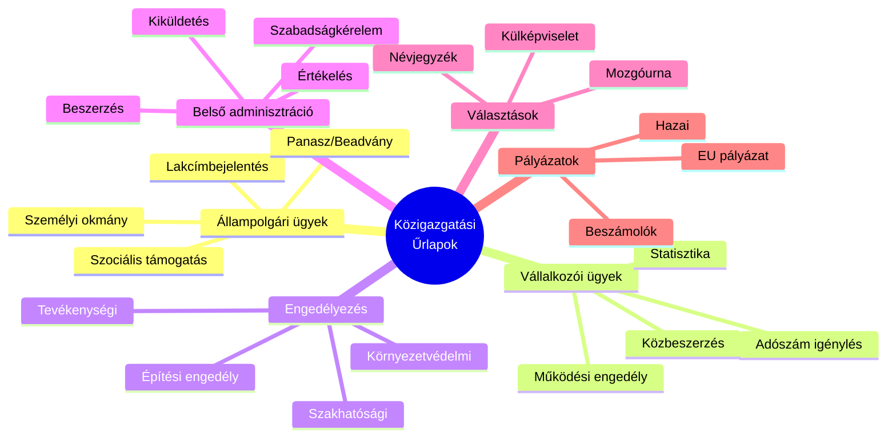
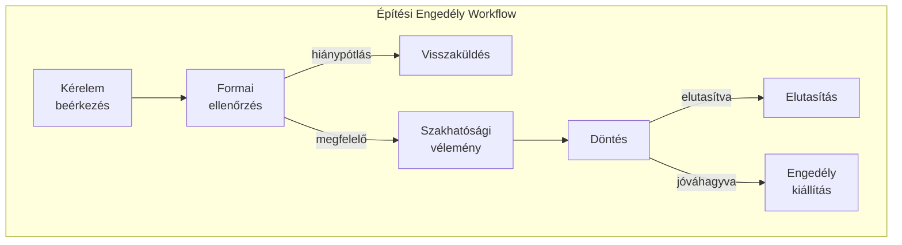
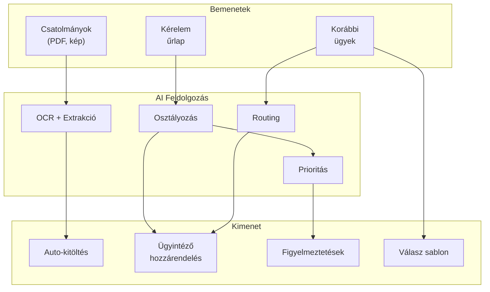
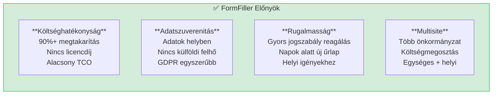
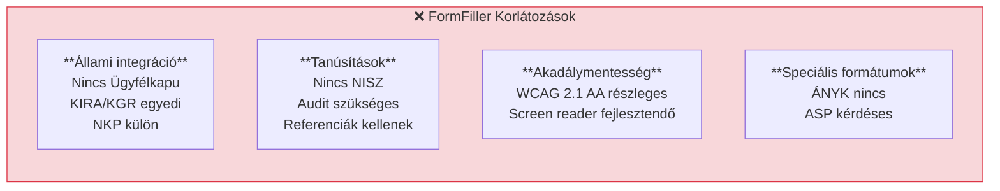

[← Vissza az Iparágak oldalra](index.md)

# Közigazgatás

A közigazgatás és állami szektor kiemelt terület a FormFiller számára, ahol az e-government, digitális ügyintézés és belső adminisztráció terén jelentős értéket teremthet.

## Tartalomjegyzék

1. [Iparági Áttekintés](#iparági-áttekintés)
2. [Jellemző Igények](#jellemző-igények)
3. [Bővítési Lehetőségek](#bővítési-lehetőségek)
4. [AI Integráció](#ai-integráció)
5. [FormFiller Megfeleltetés](#formfiller-megfeleltetés)
6. [Összehasonlító Táblázat](#összehasonlító-táblázat)
7. [Pro/Kontra Elemzés](#prokontra-elemzés)
8. [Bővítési Javaslatok](#bővítési-javaslatok)
9. [Üzleti Értékelés](#üzleti-értékelés)

---

## Iparági Áttekintés

### Piaci Méret és Jellemzők

| Jellemző | Érték |
|----------|-------|
| **Globális piaci méret** | $30-60 Mrd (e-government IT) |
| **Éves növekedés** | 12-18% |
| **Fő régiók** | EU, Észak-Amerika, Ázsia |
| **Fő hajtóerő** | Digitalizáció, hatékonyság |

### Hagyományos Megoldások

| Szoftver | Típus | Piaci pozíció | Jellemző ár |
|----------|-------|---------------|-------------|
| **SAP Public Sector** | ERP + Forms | Piacvezető | $1M - $50M |
| **Oracle** | ERP + E-Gov | Erős | $500K - $20M |
| **Microsoft Dynamics** | CRM + ERP | Növekvő | $100K - $5M |
| **Egyedi fejlesztés** | Testreszabott | Gyakori | $100K - $10M |
| **Adobe Experience** | Űrlapkezelés | Forms | $50K - $500K/év |

### Magyar Kontextus

- **Ügyfélkapu / Digitális Állampolgárság Program**
- **E-papír, E-kérelem rendszerek**
- **KIRA, KGR (Költségvetési Gazdálkodási Rendszer)**
- **Önkormányzati ASP**

---

## Jellemző Igények

### Űrlap Típusok



### Speciális Követelmények

| Követelmény | Leírás | FormFiller támogatás |
|-------------|--------|---------------------|
| **Akadálymentesség** | WCAG 2.1 AA megfelelés | 🔶 Részben |
| **Ügyfélkapu integráció** | Magyar e-azonosítás | 🔶 Bővítéssel |
| **E-aláírás** | Hitelesített elektronikus aláírás | 🔶 Tervezett |
| **ÁNYK formátum** | Általános Nyomtatványkitöltő | 🔶 Export |
| **Multisite** | Több önkormányzat | ✅ Beépített |
| **Audit trail** | Jogszabályi megfelelés | ✅ Beépített |

---

## Bővítési Lehetőségek

A FormFiller a közigazgatásban különösen hasznos komponenseket biztosít.

### Releváns Komponensek

| Komponens | Közigazgatási Alkalmazás | Előny |
|-----------|--------------------------|-------|
| **Gantt** | Projekt ütemezés, pályázatok | Vizuális időterv |
| **Diagram** | Workflow vizualizáció | Jóváhagyási folyamatok |
| **TreeView** | Szervezeti struktúra | Hierarchia megjelenítés |
| **FileManager** | Iratkezelés | Dokumentumok, csatolmányok |
| **DataGrid** | Ügyek listája, keresés | Szűrés, export |
| **Charts** | Statisztika, dashboard | KPI monitoring |
| **Scheduler** | Időpontfoglalás | Ügyfélfogadás |

### Konkrét Use Case-ek

#### Engedélyezési Folyamat Vizualizáció (Diagram)



#### Projekt Monitoring (Gantt)

| Funkció | Gantt |
|---------|------------------|
| Pályázat ütemterv | Feladatok, mérföldkövek |
| EU projekt | Szakaszok, függőségek |
| Beruházás követés | Erőforrás nézet |
| Határidő figyelmeztetés | SLA integráció |

#### Statisztikai Dashboard (Charts)

| Chart típus | Alkalmazás |
|-------------|------------|
| **Bar Chart** | Ügyszám összehasonlítás |
| **Line Chart** | Trend elemzés |
| **Pie Chart** | Ügy típus megoszlás |
| **Gauges** | SLA teljesülés |

---

## AI Integráció

Az egységes JSON schema architektúra hatékony AI integrációt tesz lehetővé a közigazgatásban.

### AI Felhasználási Esetek

| AI Funkció | Leírás | Várható Haszon |
|------------|--------|----------------|
| **Kérelem osztályozás** | Automatikus routing | 70% gyorsabb továbbítás |
| **Dokumentum OCR** | Igazolványok, okmányok | 80% adatrögzítés megtakarítás |
| **Hiánypótlás javaslat** | Hiányzó dokumentumok | Kevesebb körlevél |
| **Természetes nyelvű keresés** | "Mutasd a függő ügyeket" | Gyors lekérdezés |
| **Automatikus válasz** | Sablonlevél generálás | 50% ügyintézési idő csökkentés |
| **Prioritás meghatározás** | Sürgősség becslés | Hatékonyabb erőforrás allokáció |

### AI + Schema Szinergia



### Példa: AI-támogatott Ügyintézés

| Lépés | AI Funkció | Eredmény |
|-------|------------|----------|
| 1 | Kérelem beérkezés | Automatikus kategorizálás |
| 2 | Csatolmány OCR | Adatok kinyerése |
| 3 | Hiányosság ellenőrzés | Hiánypótlás lista generálás |
| 4 | Ügyintéző javaslat | Kompetencia alapú routing |
| 5 | Válasz sablon | Automatikus szöveg generálás |

### AI Előnyök Összefoglalva

| Előny | Hagyományos | AI-támogatott | Javulás |
|-------|-------------|---------------|---------|
| Ügy routing | 1-2 óra | < 5 perc | 95% |
| Adatrögzítés | 15-20 perc | 3-5 perc | 75% |
| Válaszlevél | 30 perc | 5 perc | 83% |
| Hiánypótlás azonosítás | 10 perc | 1 perc | 90% |

---

## FormFiller Megfeleltetés

### Jelenleg Támogatott Funkciók

| Funkció | FormFiller képesség | Megjegyzés |
|---------|---------------------|------------|
| **Kérelem űrlapok** | ✅ Kiváló | Komplex validáció |
| **Engedélyezési workflow** | ✅ Kiváló | Többlépcsős jóváhagyás |
| **Belső adminisztráció** | ★★★★★ | Natív támogatás |
| **Statisztikai adatgyűjtés** | ✅ Jó | Export funkciók |
| **Panaszkezelés** | ✅ Jó | Ticketing workflow |
| **Multisite (több önkormányzat)** | ✅ Kiváló | Tenant izoláció |

### Bővítéssel Támogatható

| Funkció | Szükséges bővítés | Komplexitás |
|---------|-------------------|-------------|
| **Ügyfélkapu integráció** | OAuth/SAML | Közepes |
| **E-aláírás (hitelesített)** | E-Szignó, Microsec | Közepes |
| **ÁNYK export** | XML konverter | Alacsony |
| **PDF/A archiválás** | PDF motor | Alacsony |
| **WCAG 2.1 teljes** | A11y fejlesztés | Közepes |

---

## Összehasonlító Táblázat

### FormFiller vs. Hagyományos Megoldások

| Szempont | SAP PS | Oracle | Egyedi fejl. | FormFiller |
|----------|:------:|:------:|:------------:|:----------:|
| **Ár (éves)** | €500K+ | €300K+ | €200K+ | €15-30K* |
| **Implementáció** | 12-24 hó | 12-18 hó | 6-12 hó | 1-3 hó |
| **Testreszabás** | Komplex | Komplex | Teljes | Egyszerű |
| **Self-hosted** | Drága | Drága | Igen | Igen |
| **Multisite** | Igen | Igen | Egyedi | Beépített |
| **Workflow** | Komplex | Jó | Egyedi | Jó |
| **Magyar nyelv** | Részben | Részben | Igen | Igen |

*Infrastruktúra + karbantartás költség

### Funkcionális Összehasonlítás

| Funkció | SAP | Adobe Forms | KIRA | FormFiller |
|---------|:---:|:-----------:|:----:|:----------:|
| E-ügyintézés | ★★★★☆ | ★★★☆☆ | ★★★☆☆ | ★★★★☆ |
| Workflow | ★★★★★ | ★★★☆☆ | ★★☆☆☆ | ★★★★☆ |
| Belső admin | ★★★★☆ | ★★☆☆☆ | ★★★☆☆ | ★★★★★ |
| Testreszabás | ★★☆☆☆ | ★★★☆☆ | ★☆☆☆☆ | ★★★★★ |
| Költség/érték | ★☆☆☆☆ | ★★☆☆☆ | ★★★☆☆ | ★★★★★ |

---

## Pro/Kontra Elemzés

### FormFiller Előnyök



### FormFiller Hátrányok/Korlátozások



### Mikor Válaszd a FormFiller-t?

| Szcenárió | Ajánlott? | Indoklás |
|-----------|:---------:|----------|
| Önkormányzat belső ügyei | ✅ Igen | Gyors, költséghatékony |
| Önkormányzati ügyfélszolgálat | ✅ Igen | Testreszabható |
| Központi e-ügyintézés | 🔶 Részben | Integrációk szükségesek |
| KIRA kiváltás | ❌ Nem | Speciális funkciók |
| EU pályázat monitoring | ✅ Igen | Workflow, riporting |
| Belső HR folyamatok | ✅ Igen | Natív támogatás |

---

## Bővítési Javaslatok

### Prioritásos Fejlesztések

| Fejlesztés | Leírás | Komplexitás | Prioritás |
|------------|--------|:-----------:|:---------:|
| **Ügyfélkapu OAuth** | Magyar e-azonosítás | Közepes | Magas |
| **E-aláírás (AVDH)** | Hitelesített aláírás | Közepes | Magas |
| **WCAG 2.1 AA** | Akadálymentesítés | Közepes | Magas |
| **PDF/A export** | Archiválási formátum | Alacsony | Közepes |
| **ÁNYK export** | XML konverzió | Alacsony | Közepes |
| **ASP integráció** | Önkormányzati ASP | Magas | Alacsony |

### Példa: Építési Engedély Workflow

```json
{
  "name": "buildingPermitWorkflow",
  "steps": [
    {
      "name": "submit",
      "type": "form",
      "config": "buildingPermitForm",
      "nextStep": "formalCheck"
    },
    {
      "name": "formalCheck",
      "type": "approval",
      "assignee": "role:clerk",
      "sla": "5 workdays",
      "outcomes": {
        "approved": "technicalReview",
        "rejected": "returnToApplicant"
      }
    },
    {
      "name": "technicalReview",
      "type": "approval",
      "assignee": "role:engineer",
      "sla": "15 workdays",
      "outcomes": {
        "approved": "finalDecision",
        "needsInfo": "requestInfo",
        "rejected": "rejection"
      }
    },
    {
      "name": "finalDecision",
      "type": "approval",
      "assignee": "role:headOfDepartment",
      "sla": "5 workdays",
      "outcomes": {
        "approved": "issuePermit",
        "rejected": "rejection"
      }
    },
    {
      "name": "issuePermit",
      "type": "action",
      "actions": [
        { "type": "generatePdf", "template": "permitDocument" },
        { "type": "notify", "to": "applicant", "template": "permitIssued" },
        { "type": "archive", "format": "pdf-a" }
      ]
    }
  ]
}
```

---

## Üzleti Értékelés

### Összefoglaló

| Metrika | Érték |
|---------|-------|
| **Jelenlegi megfelelőség** | ★★★★☆ |
| **Fejlesztési potenciál** | ★★★★★ |
| **Piaci méret (TAM)** | $30-60 Mrd |
| **Elérhető megtakarítás** | 70-90% |
| **Piaci siker esélye** | Magas |

### ROI Becslés

| Szcenárió | Hagyományos költség | FormFiller költség | Megtakarítás |
|-----------|--------------------:|-------------------:|-------------:|
| Kis önkormányzat (<10K lakos) | €30,000/év | €5,000/év | €25,000 (83%) |
| Közepes önkormányzat | €80,000/év | €15,000/év | €65,000 (81%) |
| Megyei szint | €200,000/év | €40,000/év | €160,000 (80%) |
| Központi intézmény | €500,000/év | €80,000/év | €420,000 (84%) |

### Célpiac

| Szegmens | Potenciál | Prioritás |
|----------|:---------:|:---------:|
| Önkormányzatok (belső) | Magas | 1 |
| Önkormányzatok (ügyfélszolg.) | Magas | 1 |
| Minisztériumok (belső) | Közepes | 2 |
| Közintézmények | Magas | 2 |
| EU intézmények | Közepes | 3 |

---

## Kapcsolódó Dokumentációk

- [Iparági Összefoglaló](./index.md)
- [Pályázati Rendszerek](./grants.md) - Kapcsolódó terület
- [Jóváhagyási Workflow](../functions/approval-workflow.md)
- [Felmérések](../functions/survey.md)
