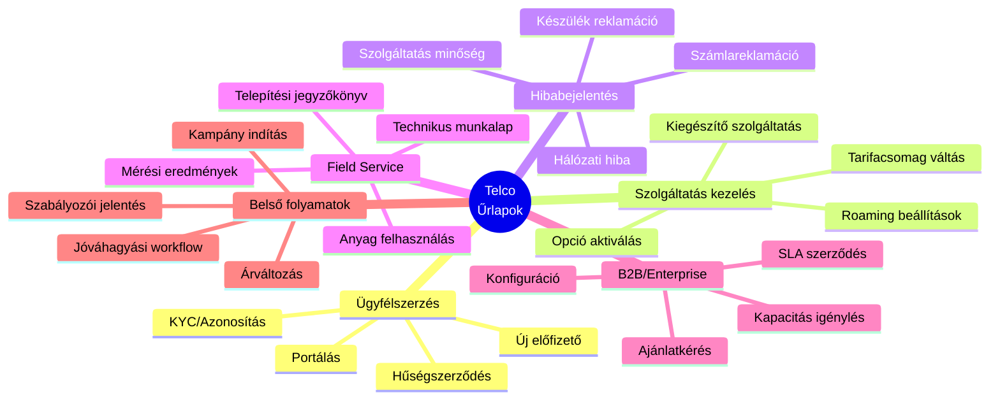
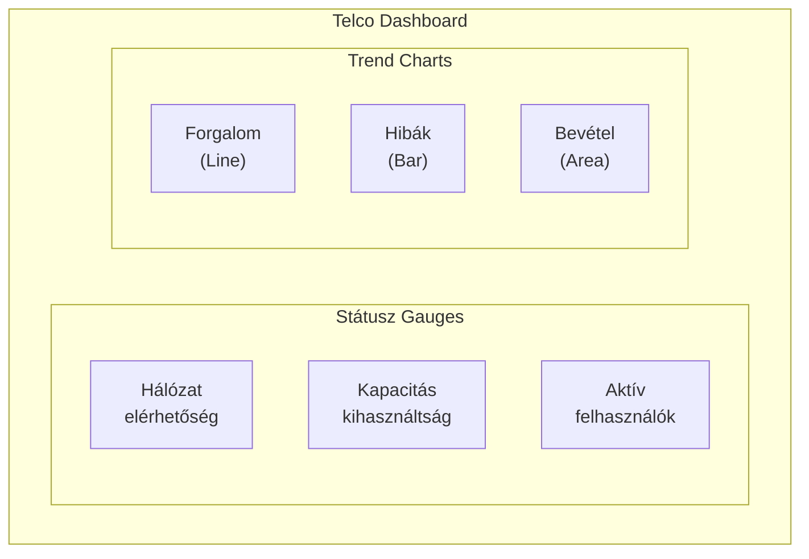
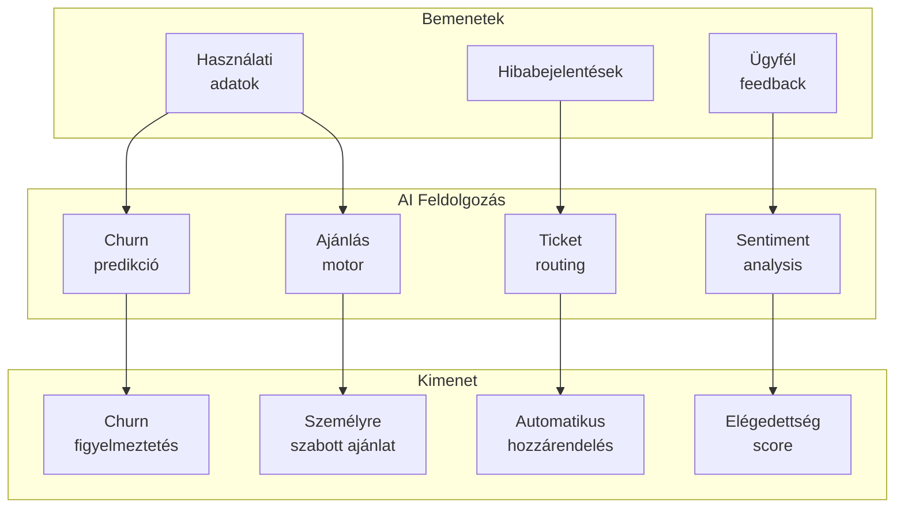
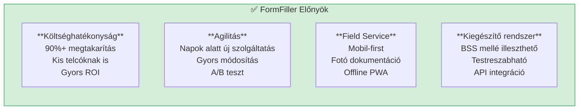
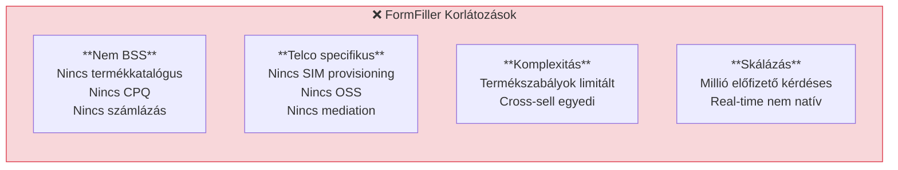

[← Vissza az Iparágak oldalra](index.md)

# Telekommunikáció

A telekommunikációs szektor összetett szolgáltatás-konfigurációs és ügyfélkezelési igényei miatt érdekes terület a FormFiller számára, ahol jelentős fejlesztési potenciál rejlik.

## Tartalomjegyzék

1. [Iparági Áttekintés](#iparági-áttekintés)
2. [Jellemző Igények](#jellemző-igények)
3. [Bővítési Lehetőségek](#bővítési-lehetőségek)
4. [AI Integráció](#ai-integráció)
5. [FormFiller Megfeleltetés](#formfiller-megfeleltetés)
6. [Összehasonlító Táblázat](#összehasonlító-táblázat)
7. [Pro/Kontra Elemzés](#prokontra-elemzés)
8. [Bővítési Javaslatok](#bővítési-javaslatok)
9. [Üzleti Értékelés](#üzleti-értékelés)

---

## Iparági Áttekintés

### Piaci Méret és Jellemzők

| Jellemző | Érték |
|----------|-------|
| **Globális piaci méret** | $40-80 Mrd (Telco IT/BSS/OSS) |
| **Éves növekedés** | 5-10% |
| **Fő szegmensek** | Mobil, Fix vonal, Internet, TV |
| **Fő hajtóerő** | 5G, IoT, digitális transzformáció |

### Hagyományos Megoldások

| Szoftver | Típus | Piaci pozíció | Jellemző ár |
|----------|-------|---------------|-------------|
| **Amdocs** | BSS/OSS Suite | Piacvezető | $10M - $500M |
| **Comarch BSS** | BSS Suite | Erős EU | $1M - $50M |
| **Netcracker** | BSS/OSS | Erős | $5M - $100M |
| **CSG** | Billing/Revenue | Speciális | $1M - $20M |
| **Salesforce Vlocity** | CRM + CPQ | Növekvő | $100-300/felh./hó |

### Magyar Telco Piac

- **Magyar Telekom**: SAP, egyedi rendszerek
- **Vodafone**: Amdocs
- **Yettel**: Comarch BSS
- **Digi**: Egyedi/hibrid

---

## Jellemző Igények

### Űrlap Típusok



### Speciális Követelmények

| Követelmény | Leírás | FormFiller támogatás |
|-------------|--------|---------------------|
| **Termékkatalógus** | Dinamikus termék konfiguráció | 🔶 Bővítéssel |
| **CPQ logika** | Configure-Price-Quote | 🔶 Bővítéssel |
| **Számlázás integráció** | Billing rendszer API | 🔶 Egyedi |
| **CRM integráció** | Ügyfél adatok | 🔶 API-val |
| **SIM kezelés** | Aktiválás, csere | 🔶 Workflow |
| **Mobil field service** | Technikus app | 🔶 PWA |

---

## Bővítési Lehetőségek

A FormFiller a telekommunikációban különösen hasznos komponenseket biztosít.

### Releváns Komponensek

| Komponens | Telco Alkalmazás | Előny |
|-----------|------------------|-------|
| **Charts** | Hálózat analitika, KPI-k | 30+ diagram típus |
| **TreeList** | Szolgáltatás katalógus | Hierarchikus nézet |
| **Diagram** | Hálózat topológia | Vizuális kapcsolatok |
| **DataGrid** | Ügyfél lista, tranzakciók | Szűrés, export |
| **Gauges** | Szolgáltatás státusz | Real-time monitoring |
| **Scheduler** | Technikus ütemezés | Field service |
| **Sankey** | Adatforgalom vizualizáció | Flow elemzés |

### Konkrét Use Case-ek

#### Hálózat Monitoring Dashboard (Charts + Gauges)



#### Szolgáltatás Katalógus (TreeList)

| Szint | Tartalom |
|-------|----------|
| 1 | Szolgáltatás kategória (Mobil, Internet, TV) |
| 2 | Alap csomagok |
| 3 | Kiegészítő opciók |
| 4 | Egyszeri díjas szolgáltatások |

#### Field Service Ütemezés (Scheduler + Gantt)

```mermaid
gantt
    title Technikus Munkarend
    dateFormat  HH:mm
    section Tech1
    Telepítés #123    :a1, 08:00, 2h
    Hibaelhárítás #456 :a2, 10:30, 1h30m
    section Tech2
    Karbantartás       :b1, 08:00, 3h
    Telepítés #789     :b2, 12:00, 2h
```



---

## AI Integráció

Az egységes JSON schema architektúra hatékony AI integrációt tesz lehetővé a telco szektorban.

### AI Felhasználási Esetek

| AI Funkció | Leírás | Várható Haszon |
|------------|--------|----------------|
| **Prediktív hibakeresés** | Hiba előrejelzés | 40% kevesebb leállás |
| **Churn predikció** | Lemorzsolódás előrejelzés | Megelőző akciók |
| **Chatbot ügyféltámogatás** | Automatikus válaszok | 50% ügyfélszolgálati megtakarítás |
| **Ajánlás motor** | Személyre szabott csomagok | 30% upsell növekedés |
| **Anomália detekció** | Szokatlan forgalom | Fraud megelőzés |
| **NL Query** | "Mutasd a top 10 panaszt" | Gyors elemzés |

### AI + Schema Szinergia a Telco-ban



### Példa: AI-támogatott Ügyfélszolgálat

| Lépés | AI Funkció | Eredmény |
|-------|------------|----------|
| 1 | Ticket beérkezés | Automatikus kategorizálás |
| 2 | Prioritás meghatározás | Sürgősség scoring |
| 3 | Válasz javaslat | Sablon generálás |
| 4 | Routing | Legjobb ügyintéző |
| 5 | Megoldás | Knowledge base javaslat |

### AI Előnyök Összefoglalva

| Előny | Hagyományos | AI-támogatott | Javulás |
|-------|-------------|---------------|---------|
| Ticket kategorizálás | 2-3 perc | < 10 mp | 95% |
| Churn előrejelzés | Utólagos | Proaktív | 100% |
| Csomag ajánlás | Általános | Személyre szabott | 300% konverzió |
| Hiba diagnózis | 15-20 perc | 2-3 perc | 85% |

---

## FormFiller Megfeleltetés

### Jelenleg Támogatott Funkciók

| Funkció | FormFiller képesség | Megjegyzés |
|---------|---------------------|------------|
| **Ügyfél regisztráció** | ★★★★☆ | KYC, dokumentumok |
| **Hibabejelentés** | ★★★★★ | Ticketing workflow |
| **Reklamáció kezelés** | ★★★★★ | Jóváhagyási lánc |
| **Technikus munkalap** | ✅ Jó | Mobil űrlap |
| **SLA monitoring űrlap** | ✅ Jó | Adatgyűjtés |
| **Belső jóváhagyások** | ★★★★★ | Natív workflow |

### Bővítéssel Támogatható

| Funkció | Szükséges bővítés | Komplexitás |
|---------|-------------------|-------------|
| **Termékkatalógus** | Dinamikus lookup | Közepes |
| **CPQ motor** | Árkalkulátor plugin | Magas |
| **Billing API** | Számlázó integráció | Magas |
| **CRM szinkron** | Salesforce/egyedi API | Közepes |
| **Offline field service** | PWA + sync | Közepes |
| **SIM aktiválás** | Provisioning API | Magas |

---

## Összehasonlító Táblázat

### FormFiller vs. Hagyományos Megoldások

| Szempont | Amdocs | Comarch | Salesforce | FormFiller |
|----------|:------:|:-------:|:----------:|:----------:|
| **Ár (éves)** | $10M+ | $1M+ | $500K+ | €50-150K* |
| **Implementáció** | 12-36 hó | 6-18 hó | 3-12 hó | 1-6 hó |
| **Testreszabás** | Magas költség | Közepes | Limitált | Kiváló |
| **Self-hosted** | Opcionális | Opcionális | Nem | Igen |
| **CPQ** | Teljes | Teljes | Jó | Alap + bővítés |
| **Billing** | Teljes | Teljes | Integráció | Nincs |
| **API** | Komplex | Komplex | Jó | Nyílt |

*Kis-közepes telco vagy kiegészítő rendszer

### Funkcionális Összehasonlítás

| Funkció | Amdocs | Comarch | Vlocity | FormFiller |
|---------|:------:|:-------:|:-------:|:----------:|
| Szolgáltatás konfig | ★★★★★ | ★★★★★ | ★★★★☆ | ★★☆☆☆ |
| Ügyfélkezelés | ★★★★★ | ★★★★☆ | ★★★★★ | ★★★☆☆ |
| Field service | ★★★★☆ | ★★★★☆ | ★★★☆☆ | ★★★★☆ |
| Belső folyamatok | ★★☆☆☆ | ★★☆☆☆ | ★★★☆☆ | ★★★★★ |
| Költség/érték | ★☆☆☆☆ | ★★☆☆☆ | ★★☆☆☆ | ★★★★★ |

---

## Pro/Kontra Elemzés

### FormFiller Előnyök



### FormFiller Hátrányok/Korlátozások



### Mikor Válaszd a FormFiller-t?

| Szcenárió | Ajánlott? | Indoklás |
|-----------|:---------:|----------|
| Kis telco / MVNO | ✅ Igen | Költséghatékony start |
| Field service űrlapok | ✅ Igen | Mobil, flexibilis |
| Ügyfélportál (egyszerű) | ✅ Igen | Gyors bevezetés |
| Teljes BSS kiváltás | ❌ Nem | Speciális funkciók |
| Belső folyamatok | ✅ Igen | Workflow támogatás |
| B2B ajánlatok | 🔶 Részben | CPQ bővítéssel |

---

## Bővítési Javaslatok

### Prioritásos Fejlesztések

| Fejlesztés | Leírás | Komplexitás | Prioritás |
|------------|--------|:-----------:|:---------:|
| **Termékkatalógus lookup** | Dinamikus termék lista | Közepes | Magas |
| **CPQ plugin** | Árkalkulátor | Magas | Magas |
| **Offline PWA** | Field service | Közepes | Magas |
| **CRM csatlakozó** | Salesforce, SAP | Közepes | Közepes |
| **Provisioning API** | SIM aktiválás | Magas | Közepes |
| **Billing integráció** | Számla adatok | Magas | Alacsony |

### Példa: Szolgáltatás Módosítás Űrlap

```json
{
  "name": "serviceChange",
  "title": "Szolgáltatás Módosítás",
  "items": [
    {
      "type": "group",
      "name": "customerInfo",
      "label": "Ügyfél azonosítás",
      "items": [
        {
          "name": "phoneNumber",
          "type": "text",
          "label": "Telefonszám",
          "validationRules": [
            { "type": "required" },
            { "type": "pattern", "pattern": "^\\+36[0-9]{9}$" }
          ]
        },
        {
          "name": "customerId",
          "type": "lookup",
          "label": "Ügyfél",
          "dataSource": "customers",
          "displayField": "name",
          "dependsOn": "phoneNumber"
        }
      ]
    },
    {
      "type": "group",
      "name": "currentService",
      "label": "Jelenlegi szolgáltatás",
      "items": [
        {
          "name": "currentPlan",
          "type": "text",
          "label": "Jelenlegi csomag",
          "readonly": true,
          "valueFrom": "lookup:customer.currentPlan"
        },
        {
          "name": "monthlyFee",
          "type": "number",
          "label": "Havidíj (Ft)",
          "readonly": true
        }
      ]
    },
    {
      "type": "group",
      "name": "newService",
      "label": "Új szolgáltatás",
      "items": [
        {
          "name": "newPlan",
          "type": "lookup",
          "label": "Új csomag",
          "dataSource": "tariffPlans",
          "displayField": "name",
          "validationRules": [{ "type": "required" }]
        },
        {
          "name": "addons",
          "type": "checkboxGroup",
          "label": "Kiegészítő szolgáltatások",
          "dataSource": "addons",
          "dependsOn": "newPlan"
        },
        {
          "name": "activationDate",
          "type": "date",
          "label": "Aktiválás dátuma",
          "min": "{{today}}",
          "validationRules": [{ "type": "required" }]
        }
      ]
    },
    {
      "type": "group",
      "name": "pricing",
      "label": "Árazás",
      "items": [
        {
          "name": "newMonthlyFee",
          "type": "number",
          "label": "Új havidíj (Ft)",
          "readonly": true,
          "computed": "calculateMonthlyFee(newPlan, addons)"
        },
        {
          "name": "oneTimeFee",
          "type": "number",
          "label": "Egyszeri díj (Ft)",
          "readonly": true
        },
        {
          "name": "discount",
          "type": "number",
          "label": "Kedvezmény (%)",
          "max": 50,
          "visibleIf": "userRole === 'supervisor'"
        }
      ]
    },
    {
      "name": "customerConsent",
      "type": "checkbox",
      "label": "Az ügyfél elfogadja a módosítást",
      "validationRules": [{ "type": "required", "message": "Ügyfél beleegyezés kötelező" }]
    }
  ]
}
```

---

## Üzleti Értékelés

### Összefoglaló

| Metrika | Érték |
|---------|-------|
| **Jelenlegi megfelelőség** | ★★★☆☆ |
| **Fejlesztési potenciál** | ★★★★★ |
| **Piaci méret (TAM)** | $40-80 Mrd |
| **Elérhető megtakarítás** | 50-70% |
| **Piaci siker esélye** | Közepes |

### ROI Becslés

| Szcenárió | Hagyományos költség | FormFiller költség | Megtakarítás |
|-----------|--------------------:|-------------------:|-------------:|
| MVNO (új) | €500,000 | €100,000 | €400,000 (80%) |
| Field service modul | €200,000/év | €30,000/év | €170,000 (85%) |
| Ügyfélportál kiegészítés | €300,000 | €50,000 | €250,000 (83%) |

### Célpiac

| Szegmens | Potenciál | Prioritás |
|----------|:---------:|:---------:|
| MVNO / Kis telco | Magas | 1 |
| Field service kiegészítés | Magas | 1 |
| B2B szolgáltatók | Közepes | 2 |
| ISP (internetszolgáltatók) | Közepes | 2 |
| Kábel TV | Közepes | 3 |

---

## Kapcsolódó Dokumentációk

- [Iparági Összefoglaló](./index.md)
- [Konfigurátor Rendszerek](../functions/configurator.md) - CPQ
- [Helpdesk/Ticketing](../functions/ticketing.md) - Hibabejelentés
- [Bővítési Lehetőségek](../extensions.md)
