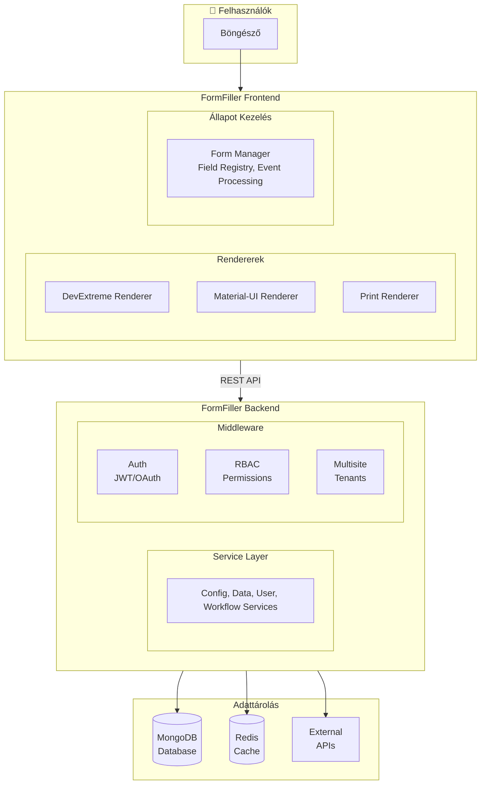
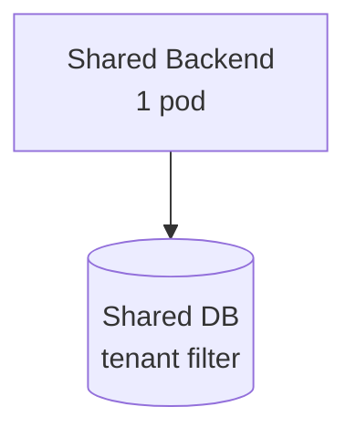
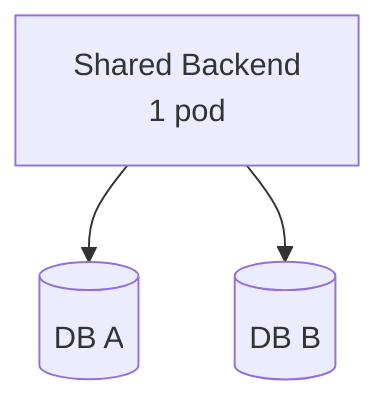
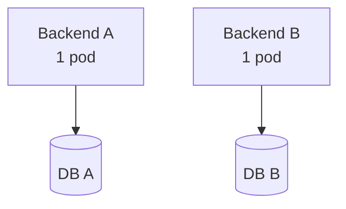
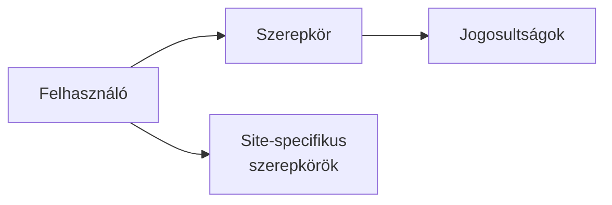

# FormFiller Architektúra

## Rendszer Áttekintés

A FormFiller egy moduláris, multisite képes low-code keretrendszer, amely jelenleg űrlapkezelésre fókuszáló megvalósítással rendelkezik. Az alábbi diagram mutatja a fő komponensek kapcsolatát:



## Komponensek

### Frontend

A frontend React és TypeScript alapú, DevExtreme UI komponenseket használ.

**Fő modulok:**
- **Rendererek**: Űrlap megjelenítő motorok (DevExtreme, MUI, Print)
- **Form Manager**: Központi állapotkezelő az űrlapokhoz
- **Event Handler Registry**: Eseménykezelő regisztráció és végrehajtás
- **Field Update Services**: Mező frissítési logika

**Könyvtárstruktúra:**
```
src/
├── components/      # React komponensek
│   ├── form/       # Űrlap komponensek
│   └── views/      # Nézet komponensek (Grid, Tree)
├── services/       # Üzleti logika és API hívások
├── factories/      # Renderer gyárak
├── managers/       # Állapot menedzserek
├── eventHandlers/  # Eseménykezelők
└── contexts/       # React kontextusok
```

### Backend

A backend Node.js és TypeScript alapú, Express keretrendszerrel.

**Fő modulok:**
- **Service Layer**: Üzleti logika (Config, Data, User, Workflow)
- **Middleware**: Auth, RBAC, Multisite, Validation
- **Models**: Mongoose modellek MongoDB-hez

**Könyvtárstruktúra:**
```
src/
├── config/        # Konfigurációs fájlok
├── middleware/    # Express middleware-ek
├── models/        # Mongoose modellek
├── services/      # Üzleti logika
├── routes/        # API útvonalak
├── types/         # TypeScript típusok
└── utils/         # Segédfüggvények
```

### Schema

Közös típus definíciók és validációs logika a frontend és backend között.

**Fő komponensek:**
- **FieldConfig**: Mező típusok definíciója
- **ItemConfig**: Nézet konfigurációk
- **ValidationRule**: Validációs szabályok
- **SchemaValidator**: Validációs motor

### Validator

Fejlett validációs rendszer beágyazott struktúrák és feltételes szabályok támogatásával.

**Funkciók:**
- Párhuzamos validáció végrehajtás
- Függőségi gráf alapú feldolgozás
- Gyorsítótárazás
- Külső API integráció

## Adatfolyam

### Űrlap Betöltés

```
1. Frontend kér konfigurációt (GET /api/config/:configId)
2. Backend visszaadja a JSON sémát
3. Frontend Form Manager feldolgozza a sémát
4. Megfelelő Renderer rendereli az űrlapot
5. Ha van rekord, betölti az adatokat (GET /api/data/:configId/:recordId)
```

### Űrlap Mentés

```
1. Felhasználó kitölti az űrlapot
2. Form Manager összegyűjti a mező értékeket
3. Validator validálja az adatokat
4. Frontend elküldi az adatokat (POST/PUT /api/data/:configId)
5. Backend validálja és elmenti MongoDB-be
```

### Eseménykezelés

```
1. Mező érték változik
2. Form Manager triggereli az eseményt
3. Event Handler Registry megkeresi a kezelőket
4. Kezelők végrehajtódnak (setValue, calculate, validate stb.)
5. Érintett mezők frissülnek
```

## Multisite Architektúra

A rendszer három telepítési módot támogat:

### 1. Shared Backend - Shared DB



- Egyetlen backend és adatbázis
- Tenant szűrés minden query-ben
- Legegyszerűbb és legköltséghatékonyabb

### 2. Shared Backend - Isolated DB



- Egyetlen backend
- Tenant-enként külön adatbázis
- Jobb adat izoláció

### 3. Isolated Backend



- Tenant-enként külön backend és adatbázis
- Teljes izoláció
- Független skálázás

## Biztonság

### Autentikáció

- **JWT Token**: API hívások autentikációja
- **OAuth 2.0**: Google bejelentkezés támogatás
- **Token Blacklist**: Kijelentkezés és token visszavonás

### Jogosultságkezelés (RBAC)



**Beépített szerepkörök:**
- admin, manager, owner, editor, contributor, creator, viewer

### Multisite Biztonság

- Tenant izoláció minden szinten
- Site-specifikus jogosultságok
- Cross-tenant hozzáférés blokkolása

## Teljesítmény

### Frontend Optimalizációk

- Lazy loading komponensek
- Memoizáció (useMemo, useCallback)
- Virtual scrolling nagy listákhoz
- Code splitting

### Backend Optimalizációk

- Redis gyorsítótár
- MongoDB indexek
- Lean queries
- Response tömörítés (gzip)

### Validáció Optimalizációk

- Schema gyorsítótárazás
- Párhuzamos validáció
- Inkrementális validáció

## Technológiai Stack

| Réteg | Technológia |
|-------|-------------|
| Frontend | React 19, TypeScript, DevExtreme, Vite |
| Backend | Node.js 18+, Express, TypeScript |
| Adatbázis | MongoDB 4.4+ |
| Cache | Redis (opcionális) |
| Konténerizáció | Docker |
| Orchestráció | Kubernetes, Helm |
| CI/CD | GitHub Actions |

