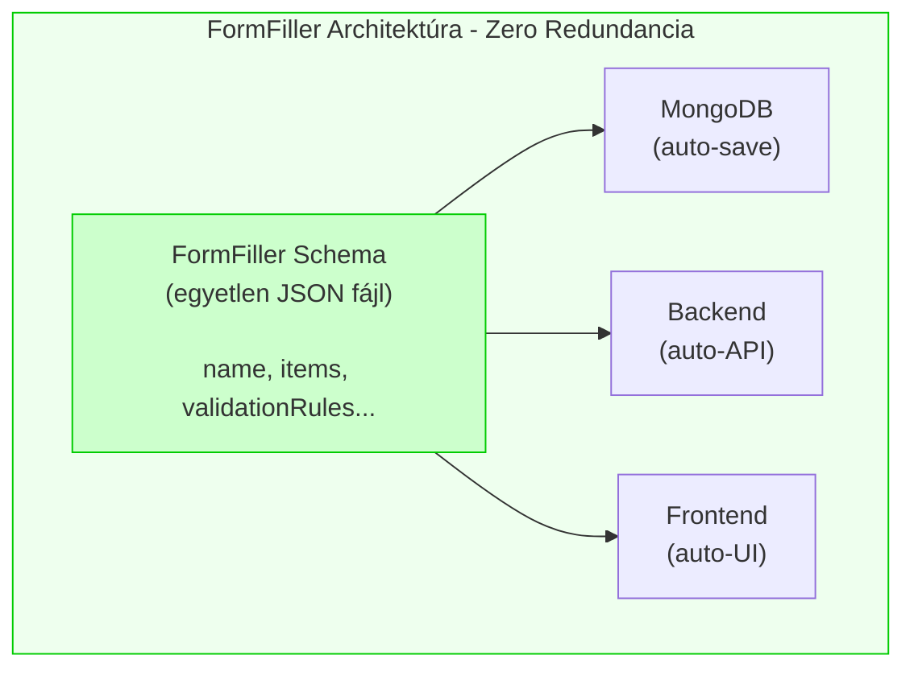
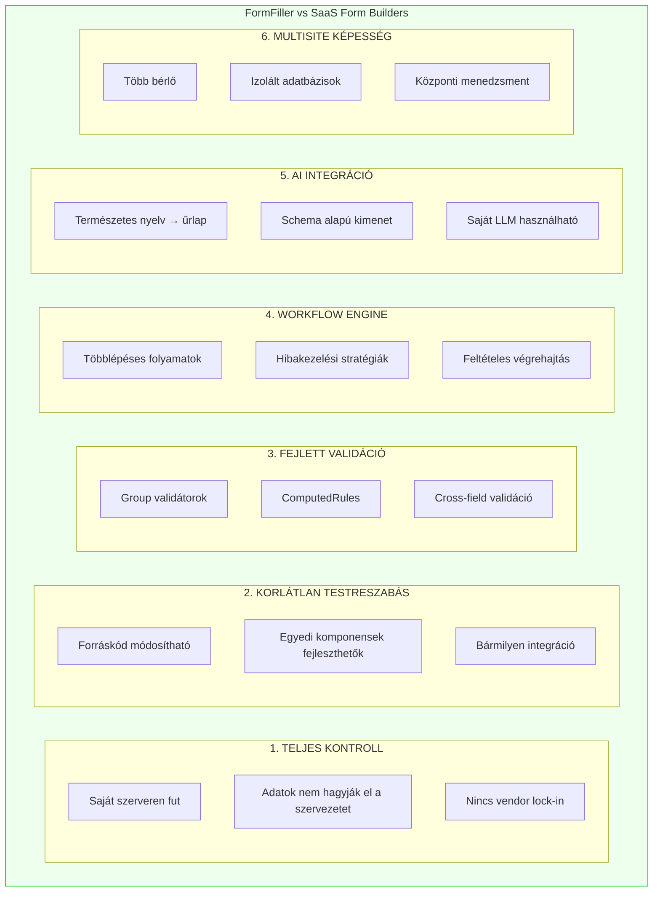
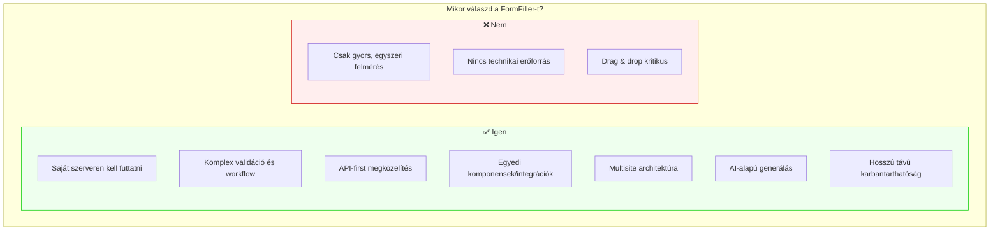

# Összehasonlítások

Ez a dokumentum összehasonlítja a FormFiller rendszert más megközelítésekkel és szolgáltatásokkal.

## Tartalomjegyzék

1. [Architektúra Összehasonlítás (MVC/MVP vs FormFiller)](#architektúra-összehasonlítás)
2. [Form Builder Szolgáltatások Összehasonlítása](#form-builder-összehasonlítás)
3. [Összegző Értékelés](#összegző-értékelés)

---

## Architektúra Összehasonlítás

### Hagyományos MVC/MVP Rendszerek Problémái

A klasszikus Model-View-Controller (MVC) vagy Model-View-Presenter (MVP) architektúrák jelentős redundanciát eredményeznek:

#### Redundancia Probléma

```mermaid
flowchart TB
    subgraph mvc["MVC/MVP Architektúra - Redundancia"]
        subgraph db["ADATBÁZIS RÉTEG"]
            DB1["users.sql - CREATE TABLE"]
            DB2["Migrációk kezelése"]
            DB3["Indexek, constraintek"]
        end
        
        DUP1["↓ Duplikálás"]
        
        subgraph backend["BACKEND RÉTEG"]
            BE1["User.model.ts - interface"]
            BE2["UserDTO.ts - validáció"]
            BE3["user.validation.ts - Joi/Yup"]
            BE4["user.controller.ts - CRUD"]
            BE5["user.service.ts - Logic"]
        end
        
        DUP2["↓ Duplikálás"]
        
        subgraph frontend["FRONTEND RÉTEG"]
            FE1["user.types.ts - interface (újra!)"]
            FE2["UserForm.tsx - komponens"]
            FE3["user.validation.ts (újra!)"]
            FE4["user.api.ts - API hívások"]
            FE5["user.store.ts - State"]
        end
        
        db --> DUP1 --> backend --> DUP2 --> frontend
    end
    
    style mvc fill:#ffeeee,stroke:#cc0000
    style DUP1 fill:#ffcccc,stroke:#cc0000
    style DUP2 fill:#ffcccc,stroke:#cc0000
```



#### Konkrét Számok

Egy egyszerű "User" entitás hagyományos MVC-ben:

| Fájl/Komponens | Sorok (kb.) | Cél |
|----------------|-------------|-----|
| DB migráció | 20 | Tábla létrehozás |
| Backend Model | 30 | TypeScript interface |
| Backend DTO | 40 | Validációs dekorátorok |
| Backend Controller | 80 | CRUD endpoints |
| Backend Service | 60 | Business logic |
| Frontend Types | 30 | Interface (duplikált!) |
| Frontend Form | 150 | React komponens |
| Frontend Validation | 40 | Validáció (duplikált!) |
| Frontend API | 50 | HTTP hívások |
| Frontend Store | 60 | State management |
| **Összesen** | **~560 sor** | |

### FormFiller Megoldás



#### Ugyanaz a "User" űrlap FormFiller-ben:

```json
{
  "name": "userForm",
  "title": "Felhasználó Regisztráció",
  "items": [
    {
      "name": "name",
      "type": "text",
      "label": "Teljes név",
      "validationRules": [
        { "type": "required", "message": "Kötelező mező" },
        { "type": "stringLength", "min": 2, "max": 100 }
      ]
    },
    {
      "name": "email",
      "type": "text",
      "label": "Email cím",
      "validationRules": [
        { "type": "required" },
        { "type": "email", "message": "Érvénytelen email formátum" }
      ]
    }
  ]
}
```

**Összesen: ~25 sor** (vs. 560 sor hagyományos MVC-ben)

### Összehasonlító Táblázat

| Szempont | Hagyományos MVC | FormFiller |
|----------|-----------------|------------|
| **Definíciós helyek** | 4-6 (DB, Model, DTO, Controller, Form, Store) | 1 (Schema) |
| **Kódsorok (egyszerű űrlap)** | ~500-600 | ~25-50 |
| **Új mező hozzáadása** | 6+ fájl módosítás | 1 fájl (vagy UI) |
| **Validáció konzisztencia** | Manuálisan szinkronizált | Automatikusan garantált |
| **Típusbiztonság** | Manuális karbantartás | Schema-ból generált |
| **Módosítás kockázata** | Magas (sok érintett pont) | Alacsony (egy pont) |
| **Tanulási görbe** | Magas (sok technológia) | Közepes (JSON + szabályok) |
| **Fejlesztési sebesség** | Napok | Órák/Percek |

### Módosítás Hatása

**Példa: "email" mező átnevezése "emailAddress"-re**

**Hagyományos MVC-ben:**
1. `users.sql` - ALTER TABLE
2. `User.model.ts` - property átnevezés
3. `UserDTO.ts` - property átnevezés
4. `user.validation.ts` - séma módosítás
5. `user.types.ts` (frontend) - interface módosítás
6. `UserForm.tsx` - input name módosítás
7. `user.validation.ts` (frontend) - séma módosítás
8. Tesztek frissítése (backend + frontend)

**FormFiller-ben:**
1. Schema JSON módosítás: `"name": "email"` → `"name": "emailAddress"`

---

## Form Builder Összehasonlítás

### Összehasonlított Rendszerek

| | Google Forms | Microsoft Forms | Typeform | JotForm | FormFiller |
|---|:---:|:---:|:---:|:---:|:---:|
| **Ár** | Ingyenes | Ingyenes* | Freemium | Freemium | Open Source |
| **Self-hosted** | Nem | Nem | Nem | Nem | **Igen** |

*Microsoft 365 előfizetéssel

### Funkciók Összehasonlítása

#### Alapvető Funkciók

| Funkció | Google Forms | MS Forms | Typeform | JotForm | FormFiller |
|---------|:---:|:---:|:---:|:---:|:---:|
| Drag & Drop szerkesztő | Igen | Igen | Igen | Igen | Tervezett |
| Sablonok | Igen | Igen | Igen | Igen | Igen |
| Mobilbarát | Igen | Igen | Igen | Igen | Igen |
| Beágyazás | Igen | Igen | Igen | Igen | Igen |
| Többnyelvűség | Részleges | Részleges | Nem | Igen | **Teljes** |

#### Haladó Funkciók

| Funkció | Google Forms | MS Forms | Typeform | JotForm | FormFiller |
|---------|:---:|:---:|:---:|:---:|:---:|
| Feltételes logika | Alap | Alap | Jó | Jó | **Kiváló** |
| Számított mezők | Nem | Nem | Nem | Igen | **Igen** |
| Validáció testreszabás | Alap | Alap | Alap | Jó | **Kiváló** |
| Fájl feltöltés | Igen | Igen | Igen | Igen | Igen |
| Digitális aláírás | Nem | Nem | Nem | Igen | Tervezett |

#### Adatkezelés

| Funkció | Google Forms | MS Forms | Typeform | JotForm | FormFiller |
|---------|:---:|:---:|:---:|:---:|:---:|
| Válaszok exportálása | CSV, Sheets | Excel | CSV | Több formátum | **JSON, CSV, Excel** |
| API hozzáférés | Korlátozott | Korlátozott | Igen | Igen | **Teljes REST API** |
| Webhook | Nem | Power Automate | Igen | Igen | **Igen** |
| Adatbázis integráció | Sheets | Excel | Nem | MySQL, stb. | **MongoDB natív** |

#### Workflow és Automatizáció

| Funkció | Google Forms | MS Forms | Typeform | JotForm | FormFiller |
|---------|:---:|:---:|:---:|:---:|:---:|
| Email értesítések | Alap | Alap | Igen | Igen | **Testreszabható** |
| Workflow engine | Nem | Power Automate* | Nem | Alap | **Beépített** |
| Jóváhagyási folyamat | Nem | Nem | Nem | Igen | **Igen** |
| Automatikus műveletek | Nem | Power Automate* | Zapier | Igen | **Natív** |

*Külön termék/előfizetés

#### Biztonság és Compliance

| Funkció | Google Forms | MS Forms | Typeform | JotForm | FormFiller |
|---------|:---:|:---:|:---:|:---:|:---:|
| GDPR megfelelés | Igen | Igen | Igen | Igen | **Teljes kontroll** |
| Adatok helye | Google Cloud | Azure | AWS | Változó | **Saját szerver** |
| SSO integráció | Google | Azure AD | Nem | Igen | **LDAP, OAuth, SAML** |
| Audit log | Nem | Részleges | Nem | Igen | **Részletes** |
| Szerepkör kezelés | Alap | Alap | Nem | Igen | **RBAC** |

#### Fejlesztői Funkciók

| Funkció | Google Forms | MS Forms | Typeform | JotForm | FormFiller |
|---------|:---:|:---:|:---:|:---:|:---:|
| API dokumentáció | Korlátozott | Korlátozott | Jó | Jó | **Teljes (Swagger)** |
| SDK-k | Nem | Nem | Igen | Igen | **TypeScript** |
| Custom komponensek | Nem | Nem | Nem | Igen | **Igen** |
| White-label | Nem | Nem | Fizetős | Igen | **Alapból** |
| Forráskód hozzáférés | Nem | Nem | Nem | Nem | **Teljes** |

### FormFiller Egyedi Előnyei



### Mikor Válaszd a FormFiller-t?

| Követelmény | SaaS (Google/MS/etc.) | FormFiller |
|-------------|:---------------------:|:----------:|
| Gyors, egyszerű felmérések | Jobb választás | - |
| Alkalmi használat | Jobb választás | - |
| Adatvédelmi követelmények (GDPR, SOC2) | - | **Jobb választás** |
| Komplex validációs logika | - | **Jobb választás** |
| Workflow automatizáció | - | **Jobb választás** |
| Egyedi UI/branding | - | **Jobb választás** |
| API-first megközelítés | - | **Jobb választás** |
| On-premise telepítés | Nem lehetséges | **Jobb választás** |
| Forráskód hozzáférés | Nem lehetséges | **Jobb választás** |

---

## Összegző Értékelés

### Csillagos Értékelés (1-5 ★)

| Kategória | Google Forms | MS Forms | Typeform | JotForm | FormFiller |
|-----------|:------------:|:--------:|:--------:|:-------:|:----------:|
| **Könnyű használat** | ★★★★★ | ★★★★☆ | ★★★★★ | ★★★★☆ | ★★★☆☆ |
| **Testreszabhatóság** | ★★☆☆☆ | ★★☆☆☆ | ★★★☆☆ | ★★★★☆ | ★★★★★ |
| **Validáció** | ★★☆☆☆ | ★★☆☆☆ | ★★☆☆☆ | ★★★★☆ | ★★★★★ |
| **Workflow** | ★☆☆☆☆ | ★★★☆☆ | ★★☆☆☆ | ★★★☆☆ | ★★★★★ |
| **API/Integráció** | ★★☆☆☆ | ★★☆☆☆ | ★★★★☆ | ★★★★☆ | ★★★★★ |
| **Adatvédelem** | ★★★☆☆ | ★★★☆☆ | ★★★☆☆ | ★★★★☆ | ★★★★★ |
| **Ár-érték** | ★★★★★ | ★★★★☆ | ★★★☆☆ | ★★★☆☆ | ★★★★★ |
| **Skálázhatóság** | ★★★★☆ | ★★★★☆ | ★★★☆☆ | ★★★★☆ | ★★★★★ |
| **Fejlesztői élmény** | ★★☆☆☆ | ★★☆☆☆ | ★★★☆☆ | ★★★★☆ | ★★★★★ |
| **Self-hosting** | ☆☆☆☆☆ | ☆☆☆☆☆ | ☆☆☆☆☆ | ☆☆☆☆☆ | ★★★★★ |
| | | | | | |
| **Összesen** | **24/50** | **25/50** | **28/50** | **36/50** | **47/50** |

### Értékelés Magyarázat

| Csillag | Jelentés |
|---------|----------|
| ★★★★★ | Kiváló - Piacvezető vagy egyedi funkció |
| ★★★★☆ | Nagyon jó - Átlag feletti megoldás |
| ★★★☆☆ | Jó - Átlagos, megfelelő |
| ★★☆☆☆ | Gyenge - Korlátozott funkcionalitás |
| ★☆☆☆☆ | Minimális - Alapvető vagy hiányzik |
| ☆☆☆☆☆ | Nem elérhető |

### Összefoglaló Táblázat - Célcsoportok

| Célcsoport | Ajánlott Megoldás | Indoklás |
|------------|-------------------|----------|
| **Magánszemélyek, hobbi** | Google Forms | Ingyenes, egyszerű |
| **Kisvállalkozás (MS 365)** | Microsoft Forms | Integrált ökoszisztéma |
| **Marketing, UX** | Typeform | Vizuálisan vonzó |
| **SMB, egyedi igények** | JotForm | Jó egyensúly funkció/ár |
| **Enterprise, fejlesztők** | **FormFiller** | Teljes kontroll, testreszabás |
| **GDPR-érzékeny iparágak** | **FormFiller** | On-premise, adatszuverenitás |
| **Komplex üzleti logika** | **FormFiller** | Workflow, validáció |

### Végső Ajánlás



---

## Kapcsolódó Dokumentációk

- [Főoldal](./index.md) - Projekt áttekintés és motiváció
- [Architektúra](./architecture.md) - Rendszer felépítés
- [Továbbfejlesztési Lehetőségek](./roadmap.md) - Fejlesztési irányok
- [Schema](./developer/schema.md) - Low-code definíciós nyelv
- [Workflow](./developer/features/workflow.md) - Workflow kezelés
