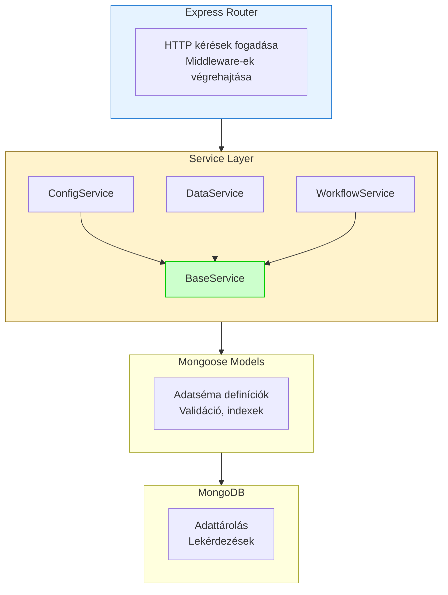
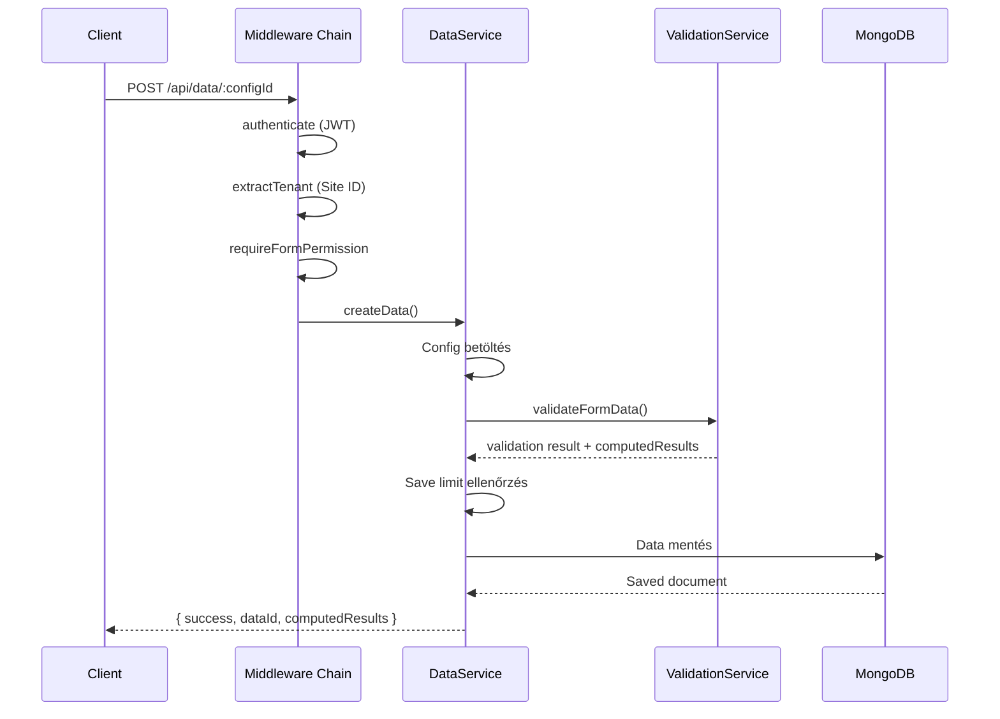
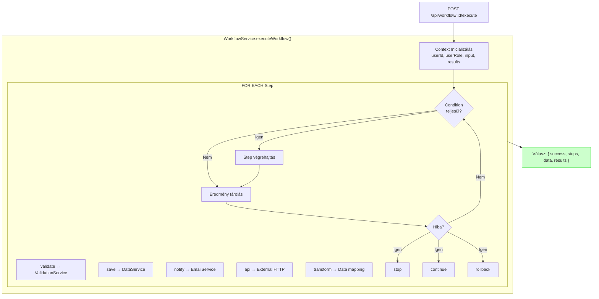
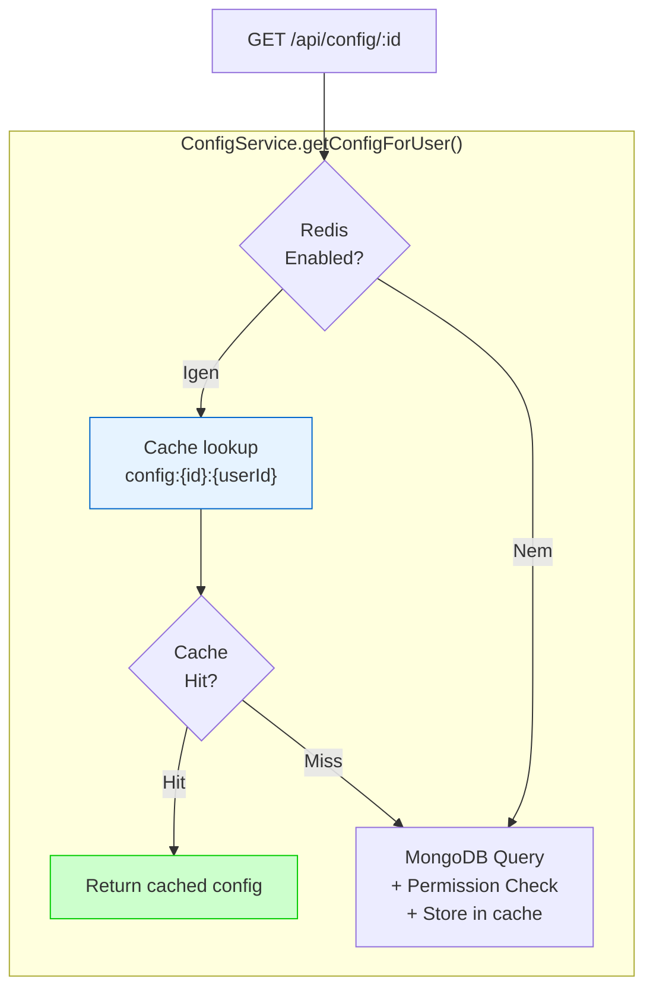

# Backend Fejlesztés

## Áttekintés

A FormFiller backend egy Node.js és TypeScript alapú szerver alkalmazás, amely Express keretrendszerre épül. A backend felelős az űrlap konfigurációk kezeléséért, az adatok validálásáért és tárolásáért, a workflow-k végrehajtásáért, valamint a felhasználói jogosultságok kezeléséért.

## Architektúra Előnyei

### Service-Alapú Felépítés




### Főbb Előnyök

| Előny | Leírás |
|-------|--------|
| **Modularitás** | Minden funkció külön service-ben, könnyű karbantartás és tesztelés |
| **BaseService öröklődés** | Közös CRUD műveletek egyszer implementálva, minden service örökli |
| **Típusbiztonság** | TypeScript típusok végig az alkalmazásban |
| **Middleware lánc** | Autentikáció, jogosultság, validáció middleware-ekben |
| **Centralizált hibakezelés** | AppError osztály egységes hibaformátum |
| **Skálázhatóság** | Stateless design, horizontálisan skálázható |

### BaseService - Közös Alapműveletek

Minden domain-specifikus service a `BaseService` osztályból származik:

```typescript
export abstract class BaseService<T extends Document> {
  constructor(protected model: Model<T>) {}

  async findById(id: string): Promise<T | null>
  async findOne(query: any): Promise<T | null>
  async findAll(query: any = {}): Promise<T[]>
  async create(data: Partial<T>): Promise<T>
  async update(id: string, data: Partial<T>): Promise<T | null>
  async delete(id: string): Promise<T | null>
  async count(query: any = {}): Promise<number>
  async exists(query: any): Promise<boolean>
}
```

Ez biztosítja:
- **DRY elv** - Nem kell minden service-ben újraimplementálni a CRUD műveleteket
- **Konzisztencia** - Minden service ugyanúgy működik az alapműveleteknél
- **Kiterjeszthetőség** - Domain-specifikus metódusok hozzáadása egyszerű

## Projekt Struktúra

```
src/
├── config/              # Környezeti és alkalmazás konfiguráció
│   ├── env.ts          # Környezeti változók validálása
│   ├── auth.ts         # JWT és autentikáció beállítások
│   └── i18n.ts         # Nemzetköziesítés konfiguráció
│
├── middleware/          # Express middleware-ek
│   ├── auth.ts         # JWT token ellenőrzés
│   ├── rbac.ts         # Szerepkör alapú jogosultságkezelés
│   ├── multisite.ts    # Többbérlős rendszer tenant kezelés
│   ├── rateLimiter.ts  # Rate limiting
│   └── errorHandler.ts # Központi hibakezelés
│
├── models/              # Mongoose adatmodellek
│   ├── User.ts         # Felhasználók
│   ├── Config.ts       # Űrlap konfigurációk
│   ├── Data.ts         # Beküldött adatok
│   ├── Workflow.ts     # Workflow definíciók
│   ├── FormRole.ts     # Űrlap szintű szerepkörök
│   ├── FormPermission.ts # Űrlap jogosultságok
│   └── Site.ts         # Multisite tenant-ok
│
├── services/            # Üzleti logika réteg
│   ├── BaseService.ts       # Közös CRUD műveletek
│   ├── UserService.ts       # Felhasználó kezelés
│   ├── ConfigService.ts     # Konfiguráció kezelés
│   ├── DataService.ts       # Adatkezelés és validáció
│   ├── WorkflowService.ts   # Workflow végrehajtás
│   ├── ValidationService.ts # Validáció integráció
│   ├── RoleService.ts       # Szerepkör kezelés
│   ├── PermissionService.ts # Jogosultság kezelés
│   └── EmailService.ts      # Email küldés
│
├── routes/              # API végpontok
│   ├── auth.ts         # /api/auth/*
│   ├── users.ts        # /api/users/*
│   ├── config.ts       # /api/config/*
│   ├── data.ts         # /api/data/*
│   ├── workflow.ts     # /api/workflow/*
│   ├── roles.ts        # /api/roles/*
│   └── permissions.ts  # /api/permissions/*
│
├── types/               # TypeScript típusdefiníciók
│   └── express.d.ts    # Express request kiterjesztés
│
└── utils/               # Segédfüggvények
    ├── logger.ts       # Winston logger
    ├── cache.ts        # Redis cache kezelés
    ├── errors.ts       # Egyedi hiba osztályok
    └── configValidator.ts # Schema validáció
```

## Hívási Láncok

### 1. Űrlap Mentés Folyamata




### 2. Workflow Végrehajtás Folyamata




### 3. Config Lekérés Cachelt Folyamata



## Workflow Kezelés Áttekintés

A workflow rendszer lehetővé teszi összetett üzleti folyamatok deklaratív definiálását és automatikus végrehajtását.

### Támogatott Step Típusok

| Típus | Leírás | Használat |
|-------|--------|-----------|
| `validate` | Űrlap adatok validálása | Schema és szabályok ellenőrzése |
| `save` | Adatok mentése adatbázisba | DataService.createData() hívás |
| `notify` | Email értesítés küldése | EmailService integráció |
| `api` | Külső API hívás | Webhook, integráció |
| `transform` | Adatok átalakítása | Mapping, formázás |
| `conditional` | Feltételes elágazás | Üzleti logika alapján |

### Hibakezelési Stratégiák

- **stop**: Hiba esetén a workflow leáll
- **continue**: Hiba esetén folytatódik a következő lépéssel
- **rollback**: Hiba esetén visszavonás (korlátozott támogatás)

Részletes workflow dokumentáció: [features/workflow.md](./features/workflow.md)

## Cache és Teljesítmény

### Redis Cache

Ha engedélyezve van (`REDIS_ENABLED=true`), a rendszer cache-eli:

```typescript
// Cache prefixek és TTL-ek
const CachePrefix = {
  CONFIG: 'config:',           // Űrlap konfigurációk
  USER: 'user:',               // Felhasználói adatok
  PERMISSION: 'permission:',   // Jogosultságok
};

const CacheTTL = {
  CONFIG: 300,      // 5 perc
  USER: 600,        // 10 perc
  PERMISSION: 120,  // 2 perc
};
```

### Optimalizált Lekérdezések

```typescript
// Csak szükséges mezők betöltése
const config = await Config.findById(configId)
  .select('preferences siteId')  // Csak ami kell
  .lean();                       // Plain JS object (gyorsabb)

// Index használat
configSchema.index({ createdBy: 1, isActive: 1 });
configSchema.index({ siteId: 1, type: 1 });
```

### Teljesítmény Tippek

1. **Lean queries**: `.lean()` használata ha nem kell Mongoose document
2. **Projection**: Csak szükséges mezők lekérése `.select()`-tel
3. **Indexek**: Gyakran szűrt mezőkre index definíció
4. **Batch műveletek**: `insertMany()`, `bulkWrite()` használata
5. **Connection pooling**: Mongoose alapértelmezett pool kezelése

## Middleware-ek

### Autentikáció

```typescript
import { authenticate } from './middleware/auth';

router.get('/protected', authenticate, (req, res) => {
  // req.user elérhető (userId, role, email)
});
```

### Jogosultságkezelés

```typescript
import { checkPermission } from './middleware/rbac';

router.post('/admin', 
  authenticate,
  checkPermission('configs', 'create'),
  (req, res) => {
    // Admin művelet
  }
);
```

### Űrlap Szintű Jogosultság

```typescript
import { requireFormPermission } from './middleware/formPermission';

router.post('/data/:configId',
  authenticate,
  requireFormPermission('createResults'),
  async (req, res) => {
    // Űrlaphoz van jogosultsága
  }
);
```

### Multisite

```typescript
import { extractTenant } from './middleware/multisite';

// Automatikusan beállítja req.tenantId-t a Host header alapján
router.use(extractTenant);
```

## API Fejlesztés

### Új Endpoint Hozzáadása

1. Hozd létre a route-ot a `routes/` könyvtárban
2. Implementáld a service metódust
3. Dokumentáld Swagger-rel

```typescript
// routes/example.ts
import { Router } from 'express';
import { exampleService } from '../services';
import { authenticate } from '../middleware/auth';

const router = Router();

/**
 * @swagger
 * /api/example:
 *   get:
 *     summary: Példa endpoint
 *     responses:
 *       200:
 *         description: Sikeres válasz
 */
router.get('/', authenticate, async (req, res, next) => {
  try {
    const result = await exampleService.getAll();
    res.json(result);
  } catch (error) {
    next(error);
  }
});

export default router;
```

## Hibakezelés

### AppError Osztály

```typescript
import { AppError } from '../middleware/errorHandler';

// Egyszerű hiba
throw new AppError('Konfiguráció nem található', 404);

// Hiba extra adatokkal
throw new AppError('Validáció sikertelen', 400, {
  validationErrors: errors,
  fieldResults: results
});
```

### Központi Hibakezelő

Minden hiba a központi error handler-en megy keresztül:

```typescript
// middleware/errorHandler.ts
export const errorHandler = (err, req, res, next) => {
  logger.error('Error:', { 
    message: err.message, 
    stack: err.stack,
    statusCode: err.statusCode 
  });
  
  res.status(err.statusCode || 500).json({
    success: false,
    error: err.message,
    ...(process.env.NODE_ENV === 'development' && { stack: err.stack })
  });
};
```

## Tesztelés

```bash
# Tesztek futtatása
npm test

# Coverage jelentés
npm run test:coverage

# Specifikus teszt futtatása
npm test -- --grep "ConfigService"
```

## Hasznos Parancsok

```bash
# Fejlesztői szerver (hot reload)
npm run dev

# Build
npm run build

# Éles futtatás
npm start

# Adatbázis seed
npm run seed

# Admin felhasználó létrehozása
npm run create-admin

# API dokumentáció generálás
npm run docs

# Linter
npm run lint
```

## Kapcsolódó Dokumentációk

- [Workflow Kezelés](./features/workflow.md) - Részletes workflow dokumentáció
- [Adatkezelés](./features/data-management.md) - Data Service és exportálás
- [Jogosultságkezelés](./features/rbac.md) - RBAC rendszer
- [Felhasználó Kezelés](./features/user-management.md) - User Service
- [Validáció](./validation.md) - Validációs szabályok
