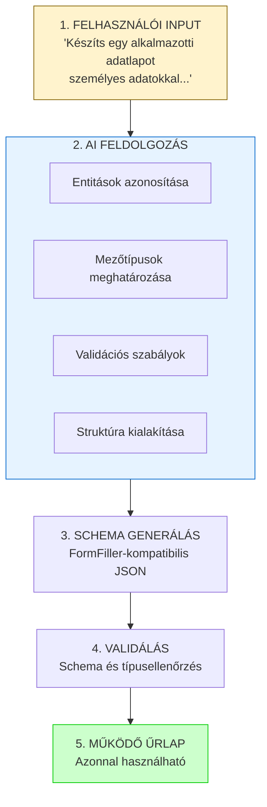
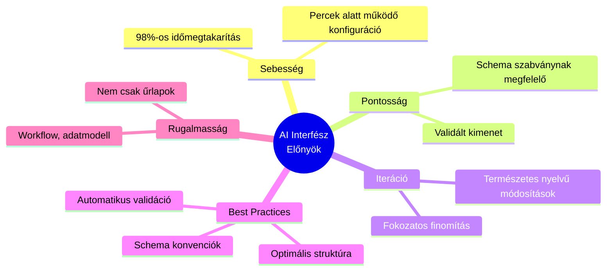

# AI Interfész

A FormFiller rendszer **működő AI interfészt** biztosít, amely drasztikusan csökkenti az űrlapok és egyéb struktúrák létrehozásának idejét. Ez nem jövőbeli terv, hanem **jelenleg is elérhető, éles funkció**.

## Áttekintés

Az AI interfész lehetővé teszi:

- **Természetes nyelvű űrlap generálást** - Egyszerű szöveges leírásból működő schema
- **Komplex struktúrák létrehozását** - Nem csak űrlapok, hanem workflow-k, adatmodell is
- **Iteratív finomítást** - "Add hozzá..." típusú kérések kezelése
- **Validációs szabályok automatikus felismerését** - A leírásból kikövetkeztetett szabályok

## Drasztikus Időmegtakarítás

| Módszer | Átlagos Idő | Megtakarítás |
|---------|-------------|--------------|
| Hagyományos kódolás (MVC) | 4-8 óra | - |
| Kézi JSON schema írás | 30-60 perc | ~85% |
| **AI generálás** | **2-5 perc** | **~98%** |

Az AI interfész a hagyományos fejlesztéshez képest **akár 98%-os időmegtakarítást** jelent!

## Működési Elv




## Használati Útmutató

### Alap Generálás

Egyszerű prompt a frontend felületen:

```
Prompt: "Készíts egy kapcsolatfelvételi űrlapot név, email, 
        telefonszám és üzenet mezőkkel. Az email legyen kötelező."
```

Eredmény:
```json
{
  "type": "form",
  "title": "Kapcsolatfelvétel",
  "items": [
    { 
      "name": "name", 
      "title": "Név", 
      "type": "text",
      "validationRules": [{ "type": "required" }]
    },
    { 
      "name": "email", 
      "title": "Email", 
      "type": "text",
      "validationRules": [
        { "type": "required" },
        { "type": "email" }
      ]
    },
    { 
      "name": "phone", 
      "title": "Telefonszám", 
      "type": "text" 
    },
    { 
      "name": "message", 
      "title": "Üzenet", 
      "type": "textarea" 
    }
  ]
}
```

### Komplex Struktúrák Generálása

Az AI képes összetett, beágyazott struktúrákat is generálni:

```
Prompt: "Készíts egy rendelési űrlapot, ahol a vevő adatait 
        (név, email) és a szállítási címet külön csoportban kérem be.
        Lehessen több terméket felvinni mennyiséggel és árral,
        és automatikusan számolódjon a végösszeg."
```

Az AI felismeri:
- Csoportosítás szükségességét
- Grid (táblázatos) bevitel igényét
- ComputedRules szükségességét az összeg számításhoz

### Iteratív Finomítás

Az AI támogatja az iteratív fejlesztést:

```
1. Prompt: "Készíts egy regisztrációs űrlapot"
   → Alap regisztrációs form generálása

2. Prompt: "Add hozzá a telefonszámot is, és legyen jelszó megerősítés"
   → Meglévő schema bővítése

3. Prompt: "A jelszó legyen minimum 8 karakter"
   → Validációs szabály hozzáadása
```

## Támogatott Generálási Típusok

### 1. Űrlapok

```
Prompt típusok:
• "Készíts [típus] űrlapot..."
• "Hozz létre adatbekérő lapot..."
• "Generálj regisztrációs formot..."
```

### 2. Workflow Definíciók

```
Prompt: "Készíts egy jóváhagyási workflow-t, ahol először a 
        közvetlen felettes, majd a HR vezető hagyja jóvá a szabadságkérelmet.
        Elutasítás esetén értesítés menjen a kérelmezőnek."
```

Az AI generál:
- Workflow lépéseket
- Állapot átmeneteket
- Értesítési szabályokat

### 3. Adatstruktúrák

```
Prompt: "Tervezz egy CRM adatstruktúrát ügyfelekkel, kapcsolattartókkal,
        és üzleti lehetőségekkel. Az ügyfelekhez tartozhassanak projektek."
```

Az AI generál:
- Entitás definíciókat
- Kapcsolatokat
- Alapvető validációkat

### 4. Vizsgasorok és Kvízek

```
Prompt: "Készíts egy 10 kérdéses tesztet JavaScript alapokból.
        Minden kérdés 10 pontot ér, és számolódjon az összpontszám.
        60% felett legyen sikeres a vizsga."
```

Az AI generál:
- Kérdés mezőket
- ComputedRules-t a pontozáshoz
- Eredmény kiértékelést

## Nem-Űrlap Célú Alkalmazások

Az AI interfész **nem korlátozódik űrlapokra**. A FormFiller deklaratív schema nyelve alkalmas bármilyen strukturált adat leírására:

| Alkalmazás | Példa Prompt |
|------------|--------------|
| **Rendszerkonfiguráció** | "Definiálj egy e-commerce beállítás struktúrát" |
| **API specifikáció** | "Készíts endpoint definíciót termék CRUD-hoz" |
| **Jogosultságkezelés** | "Tervezz RBAC struktúrát admin, manager, user szerepekkel" |
| **Tartalomkezelés** | "Hozz létre blog post sémát kategóriákkal és címkékkel" |
| **Riport definíció** | "Definiálj havi értékesítési riport struktúrát" |

## AI Előnyök Összefoglalása



## Integráció a Rendszerrel

Az AI által generált schema azonnal használható:

1. **Frontend renderelés** - A generált JSON azonnal megjeleníthető
2. **Backend validáció** - A validációs szabályok automatikusan érvényesülnek
3. **Adatbázis tárolás** - A struktúra MongoDB-ben tárolható
4. **Workflow integráció** - Workflow definíciók azonnal futtathatók

## Példa: Teljes Munkafolyamat

```
1. Felhasználó: "Készíts egy szabadságkérelem űrlapot dátumokkal,
               indoklással, és jóváhagyási workflow-val"

2. AI generál:
   - Form schema (dátum mezők, indoklás textarea)
   - Validációk (dátum tartomány, kötelező mezők)
   - Workflow (benyújtás → jóváhagyás → értesítés)

3. Eredmény: 2 perc alatt működő szabadságkérelem rendszer
   (Hagyományos fejlesztés: 1-2 nap)
```

## Következő Lépések

Az AI interfész folyamatosan fejlődik. Tervezett bővítések:

- Vizuális editor integráció (AI + Drag & Drop)
- Meglévő rendszerek elemzése és optimalizálása
- Multi-language prompt támogatás
- Template javaslatok kontextus alapján

