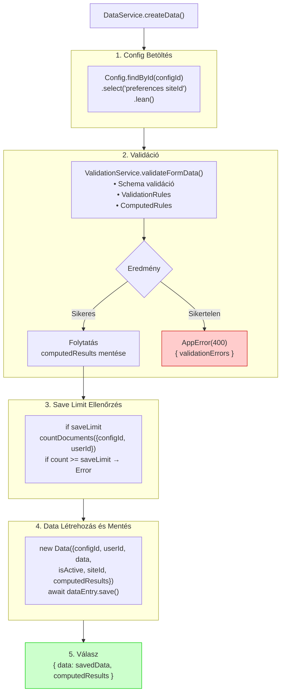
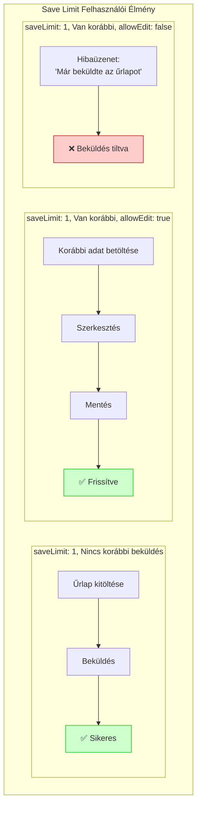

# Adatkezelés

## Áttekintés

A FormFiller adatkezelő rendszere felelős az űrlapokból beérkező adatok validálásáért, tárolásáért, lekérdezéséért és exportálásáért. A központi komponens a `DataService`, amely integrálja a validációt és az adatbázis műveleteket.

## Data Model

### Struktúra

```typescript
interface IData extends Document {
  configId: ObjectId;        // Kapcsolódó űrlap konfiguráció
  userId?: ObjectId;         // Beküldő felhasználó (opcionális)
  siteId?: ObjectId;         // Multisite tenant (ha van)
  data: Record<string, any>; // Beküldött adatok
  computedResults?: Record<string, any>; // Számított eredmények
  workflow?: any[];          // Workflow végrehajtás log
  isActive: boolean;         // Soft delete flag
  createdAt: Date;
  updatedAt: Date;
}
```

### Adatbázis Indexek

```javascript
// Gyors lekérdezések optimalizálása
dataSchema.index({ configId: 1, createdAt: -1 });
dataSchema.index({ userId: 1, configId: 1 });
dataSchema.index({ siteId: 1, isActive: 1 });
dataSchema.index({ createdAt: -1 });
```

## Mentés Folyamata

### Teljes Folyamat Diagram



### Kód Példa

```typescript
// DataService.createData() egyszerűsített változat
async createData(
  configId: string, 
  userId: string | undefined, 
  data: Record<string, any>, 
  locale: string = 'en'
): Promise<{ data: IData; computedResults?: Record<string, any> }> {
  
  // 1. Config betöltés
  const config = await Config.findById(configId)
    .select('preferences siteId')
    .lean();
    
  if (!config) {
    throw new AppError('Configuration not found', 404);
  }

  // 2. Validáció
  const validationService = new ValidationService();
  const validationResult = await validationService.validateFormData(
    configId,
    data,
    { locale, mode: 'sequential' }
  );

  if (!validationResult.valid) {
    throw new AppError('Validation failed', 400, {
      validationErrors: validationResult.errors
    });
  }

  // 3. Save limit ellenőrzés
  if (config.preferences?.saveLimit && userId) {
    const count = await Data.countDocuments({
      configId, userId, isActive: true
    });
    if (count >= config.preferences.saveLimit) {
      throw new AppError('Save limit reached', 400);
    }
  }

  // 4. Mentés
  const dataEntry = new Data({
    configId,
    userId,
    data,
    isActive: true,
    ...(config.siteId && { siteId: config.siteId }),
    ...(validationResult.computedResults && { 
      computedResults: validationResult.computedResults 
    })
  });

  const savedData = await dataEntry.save();
  
  return {
    data: savedData,
    computedResults: validationResult.computedResults
  };
}
```

## Lekérdezések

### Alapvető Lekérdezések

```typescript
// Összes adat egy űrlaphoz
const results = await dataService.findAll({
  configId: 'config-id',
  isActive: true
});

// Felhasználó saját adatai
const myData = await dataService.findAll({
  userId: 'user-id',
  configId: 'config-id',
  isActive: true
});

// Egy adat lekérése
const data = await dataService.findById('data-id');
```

### Szűrés és Rendezés

```typescript
// API endpoint: GET /api/data/:configId
// Query params: page, limit, sortBy, sortOrder, filters

async getDataList(
  configId: string,
  options: {
    page?: number;
    limit?: number;
    sortBy?: string;
    sortOrder?: 'asc' | 'desc';
    filters?: Record<string, any>;
  }
): Promise<{ data: IData[]; total: number; page: number; pages: number }> {
  
  const { page = 1, limit = 20, sortBy = 'createdAt', sortOrder = 'desc' } = options;
  
  const query: any = { configId, isActive: true };
  
  // Szűrők alkalmazása
  if (options.filters) {
    Object.entries(options.filters).forEach(([key, value]) => {
      query[`data.${key}`] = value;
    });
  }
  
  const total = await Data.countDocuments(query);
  const pages = Math.ceil(total / limit);
  
  const data = await Data.find(query)
    .sort({ [sortBy]: sortOrder === 'desc' ? -1 : 1 })
    .skip((page - 1) * limit)
    .limit(limit)
    .lean();
  
  return { data, total, page, pages };
}
```

### Aggregációk

```typescript
// Statisztikák egy űrlaphoz
async getConfigStats(configId: string): Promise<{
  total: number;
  today: number;
  thisWeek: number;
  byUser: { userId: string; count: number }[];
}> {
  const now = new Date();
  const startOfDay = new Date(now.setHours(0, 0, 0, 0));
  const startOfWeek = new Date(now.setDate(now.getDate() - now.getDay()));
  
  const [total, today, thisWeek, byUser] = await Promise.all([
    Data.countDocuments({ configId, isActive: true }),
    Data.countDocuments({ configId, isActive: true, createdAt: { $gte: startOfDay } }),
    Data.countDocuments({ configId, isActive: true, createdAt: { $gte: startOfWeek } }),
    Data.aggregate([
      { $match: { configId: new ObjectId(configId), isActive: true } },
      { $group: { _id: '$userId', count: { $sum: 1 } } },
      { $project: { userId: '$_id', count: 1, _id: 0 } }
    ])
  ]);
  
  return { total, today, thisWeek, byUser };
}
```

## Exportálás

### Támogatott Formátumok

| Formátum | MIME Type | Használat |
|----------|-----------|-----------|
| JSON | `application/json` | API integráció, import |
| CSV | `text/csv` | Excel, táblázatkezelők |
| Excel | `application/vnd.openxmlformats-...` | Üzleti jelentések |

### Export API

```typescript
// GET /api/data/:configId/export?format=csv&filters=...

async exportData(
  configId: string,
  format: 'json' | 'csv' | 'excel',
  filters?: Record<string, any>
): Promise<Buffer | object[]> {
  
  const data = await this.findAll({
    configId,
    isActive: true,
    ...filters
  });
  
  switch (format) {
    case 'json':
      return data;
      
    case 'csv':
      return this.convertToCsv(data);
      
    case 'excel':
      return this.convertToExcel(data);
  }
}
```

### CSV Export

```typescript
private convertToCsv(data: IData[]): string {
  if (data.length === 0) return '';
  
  // Mezők kinyerése az első rekordból
  const fields = Object.keys(data[0].data);
  
  // Header sor
  const header = ['id', 'createdAt', ...fields].join(',');
  
  // Adat sorok
  const rows = data.map(item => {
    const values = [
      item._id.toString(),
      item.createdAt.toISOString(),
      ...fields.map(f => {
        const value = item.data[f];
        // Escape comma and quotes
        if (typeof value === 'string' && (value.includes(',') || value.includes('"'))) {
          return `"${value.replace(/"/g, '""')}"`;
        }
        return value ?? '';
      })
    ];
    return values.join(',');
  });
  
  return [header, ...rows].join('\n');
}
```

### Excel Export (exceljs)

```typescript
import * as ExcelJS from 'exceljs';

private async convertToExcel(data: IData[]): Promise<Buffer> {
  const workbook = new ExcelJS.Workbook();
  const sheet = workbook.addWorksheet('Data');
  
  if (data.length === 0) {
    return await workbook.xlsx.writeBuffer() as Buffer;
  }
  
  // Mezők kinyerése
  const fields = Object.keys(data[0].data);
  
  // Header
  sheet.addRow(['ID', 'Létrehozva', ...fields]);
  
  // Stílus a header-nek
  sheet.getRow(1).font = { bold: true };
  sheet.getRow(1).fill = {
    type: 'pattern',
    pattern: 'solid',
    fgColor: { argb: 'FFE0E0E0' }
  };
  
  // Adat sorok
  data.forEach(item => {
    sheet.addRow([
      item._id.toString(),
      item.createdAt,
      ...fields.map(f => item.data[f] ?? '')
    ]);
  });
  
  // Oszlop szélességek
  sheet.columns.forEach(col => {
    col.width = 20;
  });
  
  return await workbook.xlsx.writeBuffer() as Buffer;
}
```

## Save Limit

### Konfiguráció

Az űrlap konfigurációban beállítható, hogy egy felhasználó hányszor küldheti be az űrlapot:

```json
{
  "preferences": {
    "saveLimit": 1,           // Max 1 beküldés
    "allowEdit": true,        // Szerkesztés engedélyezve
    "allowDelete": false      // Törlés tiltva
  }
}
```

### Save Limit Típusok

| Érték | Viselkedés |
|-------|------------|
| `null` vagy `undefined` | Korlátlan beküldés |
| `1` | Egyszeri beküldés (pl. jelentkezés, szavazás) |
| `N` | Maximum N beküldés (pl. heti jelentések) |

### Implementáció

```typescript
// Ellenőrzés mentés előtt
if (config.preferences?.saveLimit && userId) {
  const existingSaveCount = await Data.countDocuments({
    configId,
    userId,
    isActive: true
  });

  if (existingSaveCount >= config.preferences.saveLimit) {
    throw new AppError(
      i18next.t('data.saveLimitReached', { limit: saveLimit, lng: locale }),
      400
    );
  }
}
```

### Felhasználói Felületen



## ComputedResults Tárolás

### Engedélyezés

```json
{
  "preferences": {
    "storeComputedResults": true
  }
}
```

### Használati Esetek

| Eset | Példa |
|------|-------|
| **Vizsga pontozás** | Összpontszám, részeredmények tárolása |
| **Kalkulátor** | Számított értékek (ár, mennyiség) |
| **Kockázatértékelés** | Risk score, kategória |
| **Besorolás** | Automatikus kategorizálás eredménye |

### Példa

```json
// Mentett Data dokumentum
{
  "_id": "data-123",
  "configId": "exam-config",
  "userId": "student-456",
  "data": {
    "question1": "A",
    "question2": "B",
    "question3": "C"
  },
  "computedResults": {
    "score": 85,
    "grade": "B+",
    "passed": true,
    "breakdown": {
      "section1": 30,
      "section2": 25,
      "section3": 30
    }
  },
  "isActive": true,
  "createdAt": "2024-01-15T10:30:00Z"
}
```

## Soft Delete

### Működés

Ahelyett, hogy fizikailag törölnénk a rekordokat, `isActive: false`-ra állítjuk:

```typescript
async deleteData(dataId: string, userId: string): Promise<IData | null> {
  const data = await Data.findById(dataId);
  
  if (!data) {
    throw new AppError('Data not found', 404);
  }
  
  // Jogosultság ellenőrzés
  if (data.userId?.toString() !== userId) {
    throw new AppError('Not authorized to delete this data', 403);
  }
  
  // Soft delete
  data.isActive = false;
  return data.save();
}
```

### Előnyök

- **Visszaállíthatóság**: Véletlen törlés visszavonható
- **Audit trail**: Minden adat megmarad
- **Referenciális integritás**: Hivatkozások nem törnek el

### Lekérdezések Szűrése

```typescript
// Minden lekérdezésnél szűrés aktív rekordokra
const activeData = await Data.find({
  configId,
  isActive: true  // Fontos!
});
```

## API Végpontok

### Data Routes

| Metódus | Útvonal | Leírás |
|---------|---------|--------|
| GET | `/api/data/:configId` | Adatok listázása |
| GET | `/api/data/:configId/:dataId` | Egy adat lekérése |
| POST | `/api/data/:configId` | Új adat létrehozása |
| PUT | `/api/data/:configId/:dataId` | Adat frissítése |
| DELETE | `/api/data/:configId/:dataId` | Adat törlése (soft) |
| GET | `/api/data/:configId/export` | Adatok exportálása |
| GET | `/api/data/:configId/stats` | Statisztikák |

### Példa API Hívások

```bash
# Adatok listázása szűréssel és lapozással
GET /api/data/config-123?page=1&limit=20&sortBy=createdAt&sortOrder=desc
Authorization: Bearer <token>

# Új adat létrehozása
POST /api/data/config-123
Authorization: Bearer <token>
Content-Type: application/json

{
  "name": "Kiss János",
  "email": "kiss.janos@example.com",
  "message": "Teszt üzenet"
}

# CSV export
GET /api/data/config-123/export?format=csv
Authorization: Bearer <token>
```

## Best Practices

### 1. Mindig Validálj

```typescript
// ✅ Jó - Validáció mentés előtt
const result = await validationService.validateFormData(configId, data);
if (!result.valid) {
  throw new AppError('Validation failed', 400, result.errors);
}
await dataService.createData(configId, userId, data);

// ❌ Rossz - Közvetlen mentés validáció nélkül
await Data.create({ configId, userId, data });
```

### 2. Használj Indexeket

```typescript
// ✅ Jó - Gyakori lekérdezésekhez index
dataSchema.index({ configId: 1, isActive: 1, createdAt: -1 });

// Lekérdezés az index mentén
await Data.find({ configId, isActive: true }).sort({ createdAt: -1 });
```

### 3. Kezeld a Save Limitet

```typescript
// ✅ Jó - Save limit ellenőrzés
if (config.preferences?.saveLimit) {
  const count = await Data.countDocuments({ configId, userId, isActive: true });
  if (count >= config.preferences.saveLimit) {
    // Visszajelzés a felhasználónak
    throw new AppError('Save limit reached', 400);
  }
}
```

### 4. Soft Delete Használata

```typescript
// ✅ Jó - Soft delete
data.isActive = false;
await data.save();

// ❌ Rossz - Hard delete
await Data.findByIdAndDelete(dataId);
```

## Kapcsolódó Dokumentációk

- [Backend Fejlesztés](../backend.md) - Backend architektúra
- [Validáció](../validation.md) - Validációs szabályok
- [Workflow Kezelés](./workflow.md) - Workflow integráció
- [Schema](../schema.md) - Űrlap konfiguráció

