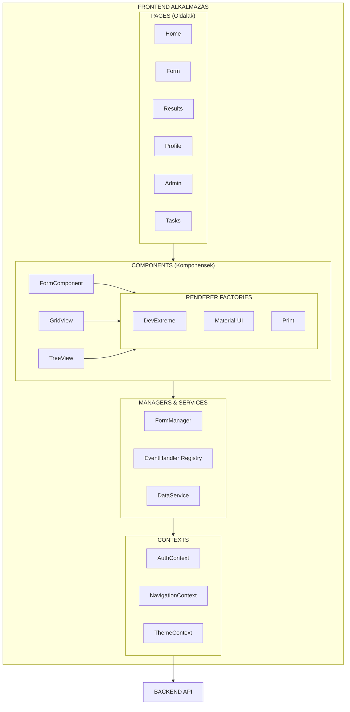
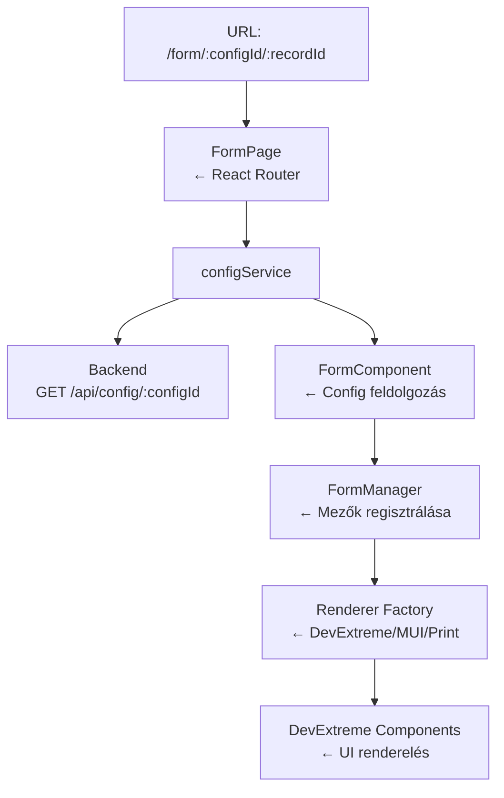
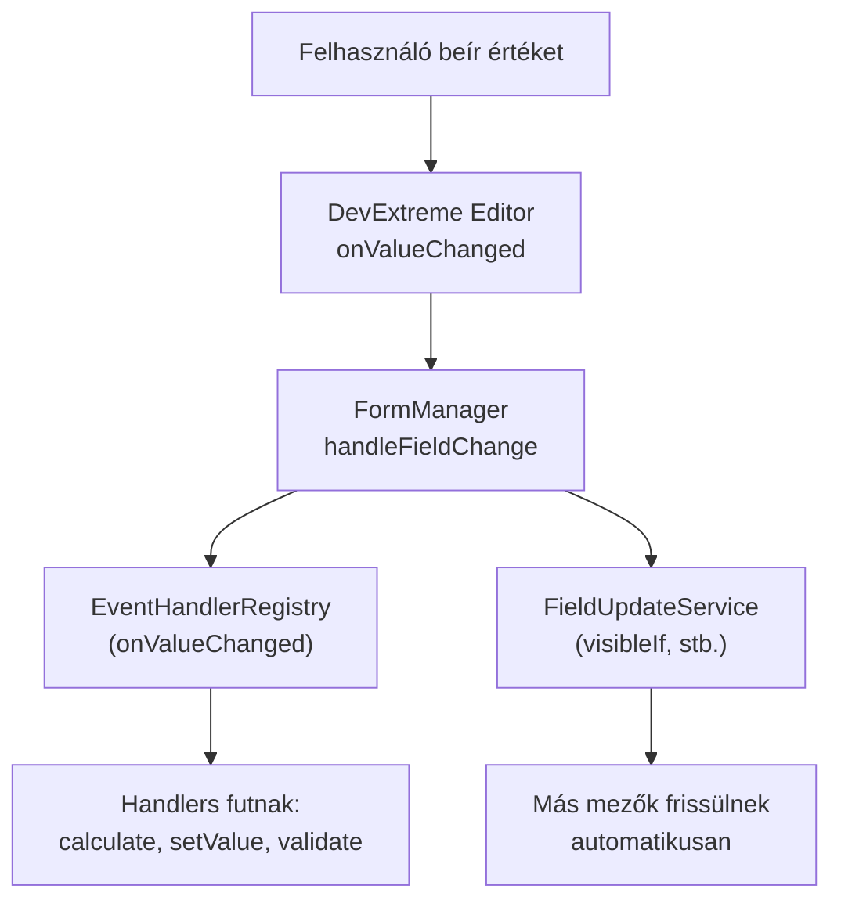
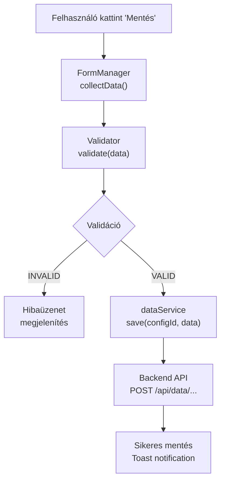

# Frontend Fejlesztés

## Áttekintés

A FormFiller frontend egy modern, React és TypeScript alapú single-page alkalmazás (SPA), amely dinamikusan renderel űrlapokat, adatrácsokat és fa struktúrákat JSON konfiguráció alapján.

### Fő Előnyök

| Előny | Leírás |
|-------|--------|
| **Konfiguráció-vezérelt** | Nincs hardcoded UI - minden a schema-ból jön |
| **Több renderelő motor** | DevExtreme, Material-UI, Print - ugyanaz a config |
| **Reaktív** | Mezők automatikusan reagálnak egymásra |
| **Típusbiztos** | Teljes TypeScript lefedettség |
| **Moduláris** | Könnyen bővíthető új komponensekkel |
| **Offline-képes** | Optimista UI, háttér szinkronizáció |

### Sematikus Felépítés


```mermaid
flowchart TB
    subgraph App["FRONTEND ALKALMAZÁS"]
        subgraph Pages["PAGES (Oldalak)"]
            P1[Home]
            P2[Form]
            P3[Results]
            P4[Profile]
            P5[Admin]
            P6[Tasks]
        end
        
        subgraph Components["COMPONENTS (Komponensek)"]
            C1[FormComponent]
            C2[GridView]
            C3[TreeView]
            
            subgraph Renderers["RENDERER FACTORIES"]
                R1[DevExtreme]
                R2[Material-UI]
                R3[Print]
            end
        end
        
        subgraph Managers["MANAGERS & SERVICES"]
            M1[FormManager]
            M2[EventHandler Registry]
            M3[DataService]
        end
        
        subgraph Contexts["CONTEXTS"]
            CTX1[AuthContext]
            CTX2[NavigationContext]
            CTX3[ThemeContext]
        end
    end
    
    API[BACKEND API]
    
    Pages --> Components
    C1 --> Renderers
    C2 --> Renderers
    C3 --> Renderers
    Components --> Managers
    Managers --> Contexts
    Contexts --> API
```

### Hívási Láncok

#### Űrlap Megjelenítés


```mermaid
flowchart TB
    URL["URL: /form/:configId/:recordId"]
    FP["FormPage<br/>← React Router"]
    CS["configService"]
    BE["Backend<br/>GET /api/config/:configId"]
    FC["FormComponent<br/>← Config feldolgozás"]
    FM["FormManager<br/>← Mezők regisztrálása"]
    RF["Renderer Factory<br/>← DevExtreme/MUI/Print"]
    DX["DevExtreme Components<br/>← UI renderelés"]
    
    URL --> FP
    FP --> CS
    CS --> BE
    CS --> FC
    FC --> FM
    FM --> RF
    RF --> DX
```

#### Mező Érték Változás


```mermaid
flowchart TB
    U["Felhasználó beír értéket"]
    DX["DevExtreme Editor<br/>onValueChanged"]
    FM["FormManager<br/>handleFieldChange"]
    EHR["EventHandlerRegistry<br/>(onValueChanged)"]
    FUS["FieldUpdateService<br/>(visibleIf, stb.)"]
    H["Handlers futnak:<br/>calculate, setValue, validate"]
    F["Más mezők frissülnek<br/>automatikusan"]
    
    U --> DX
    DX --> FM
    FM --> EHR
    FM --> FUS
    EHR --> H
    FUS --> F
```

#### Mentési Folyamat


```mermaid
flowchart TB
    U["Felhasználó kattint 'Mentés'"]
    FM["FormManager<br/>collectData()"]
    V["Validator<br/>validate(data)"]
    VAL{Validáció}
    ERR["Hibaüzenet<br/>megjelenítés"]
    DS["dataService<br/>save(configId, data)"]
    API["Backend API<br/>POST /api/data/..."]
    OK["Sikeres mentés<br/>Toast notification"]
    
    U --> FM
    FM --> V
    V --> VAL
    VAL -->|INVALID| ERR
    VAL -->|VALID| DS
    DS --> API
    API --> OK
```

## Részletes Dokumentációk

A specifikus funkciók részletes leírása külön dokumentumokban:

- [Felhasználó Kezelés](./features/user-management.md) - Regisztráció, bejelentkezés, profil
- [Jogosultságkezelés (RBAC)](./features/rbac.md) - Szerepkörök, engedélyek, UI szűrés
- [Multisite Kezelés](./features/multisite.md) - Több bérlős működés a frontenden
- [Téma és Lokalizáció](./features/theming.md) - Témák, többnyelvűség

## Architektúra

A frontend React és TypeScript alapú, Vite build rendszerrel és DevExtreme UI komponensekkel. Az űrlap megjelenítési logika a `formfiller-embed` csomagba került az újrafelhasználhatóság érdekében.

## Projekt Struktúra

```
src/
├── components/          # React komponensek
│   ├── form/           # Űrlap wrapper komponensek
│   ├── header/         # Fejléc
│   ├── footer/         # Lábléc
│   ├── config-editor/  # Konfiguráció szerkesztő
│   └── views/          # Nézet modulok (Grid, Tree)
├── pages/              # Oldal komponensek
│   ├── home/           # Kezdőlap
│   ├── form/           # Űrlap oldal
│   ├── results/        # Eredmények oldal
│   ├── profile/        # Profil oldal
│   └── admin/          # Admin oldalak
├── services/           # Üzleti logika és API
│   ├── configService.ts    # Config API hívások
│   ├── dataService.ts      # Data API hívások
│   └── authService.ts      # Auth API hívások
├── contexts/           # React kontextusok (Auth, Navigation, Theme)
├── interfaces/         # TypeScript interfészek (re-export az embed-ből)
├── types/              # Típus definíciók
├── utils/              # Segédfüggvények
└── themes/             # DevExtreme témák
```

## Embed Csomag Integráció

A frontend a `formfiller-embed` csomagot használja az űrlapok megjelenítéséhez. Ez a szétválasztás biztosítja:

- **Újrafelhasználhatóság**: Azonos űrlap renderelés a fő alkalmazásban és külső integrációkban
- **Karbantarthatóság**: Egyetlen forráspont az űrlap logikához
- **Bundle optimalizáció**: Az embed önállóan betölthető

```typescript
import { EmbedForm, useEmbedForm } from 'formfiller-embed';

// Komponens használata
<EmbedForm
  configId="my-form"
  apiBaseUrl={API_URL}
  onSubmitSuccess={handleSuccess}
/>

// Hook használata egyéni rendereléshez
const { formData, setFieldValue, submit } = useEmbedForm({
  configId: 'my-form',
  apiBaseUrl: API_URL
});
```

## Rendererek

A rendszer három renderelő motort támogat:

### DevExtreme Renderer

A fő renderelő motor, teljes funkcionalitással:

```typescript
import { DevExtremeFormRenderer } from './factories/DevExtremeFormRenderer';

const renderer = new DevExtremeFormRenderer();
const form = renderer.render(config, data, mode);
```

### Material-UI Renderer

Alternatív Material Design megjelenés:

```typescript
import { MUIFormRenderer } from './factories/MUIFormRenderer';
```

### Print Renderer

Nyomtatásra optimalizált nézet.

## Form Manager

A FormManager a központi állapotkezelő az űrlapokhoz, amely a `formfiller-embed` csomagban található. A jobb karbantarthatóság érdekében specializált al-menedzserekre lett bontva:

### Architektúra

```typescript
import { FormManager } from 'formfiller-embed';

const formManager = new FormManager(config);

// Al-menedzserek specifikus feladatokat kezelnek:
// - FormStateManager: Űrlap adat és érték kezelés
// - FormValidationManager: Validációs logika és hibakövetés
// - FormVisibilityManager: Mező láthatóság és letiltott állapotok
```

### Használat

```typescript
// Mező regisztrálása
formManager.registerField('firstName', {
  value: '',
  onChange: (value) => console.log('Changed:', value)
});

// Érték beállítása (FormStateManager-re delegálva)
formManager.setValue('firstName', 'John');

// Validáció (FormValidationManager-re delegálva)
const isValid = await formManager.validateForm();

// Láthatóság ellenőrzése (FormVisibilityManager-re delegálva)
const isVisible = formManager.isFieldVisible('conditionalField');

// Adatok összegyűjtése
const formData = formManager.collectFormData();
```

### Al-menedzser Felelősségek

| Menedzser | Felelősség |
|-----------|------------|
| FormStateManager | Űrlap adatok tárolása, érték get/set, adat normalizálás |
| FormValidationManager | Validáció végrehajtás, hibakövetés, hiba callback-ek |
| FormVisibilityManager | visibleIf/disabledIf kiértékelés, mező állapot frissítések |

## Eseménykezelés

Deklaratív eseménykezelő rendszer:

```typescript
// Konfiguráció
const fieldConfig = {
  name: 'quantity',
  type: 'number',
  onValueChanged: [
    { handler: 'log', params: { message: 'Quantity changed' } },
    { handler: 'calculate', params: { target: 'total', formula: 'quantity * price' } }
  ]
};

// Egyéni handler regisztrálása
EventHandlerRegistry.register('myHandler', (context, params) => {
  // Handler implementáció
});
```

## API Hívások

A `dataService` kezeli az API kommunikációt:

```typescript
import { configService, dataService } from './services/dataService';

// Konfiguráció lekérése
const config = await configService.getById(configId);

// Adatok lekérése
const data = await dataService.query(configId, { filter, sort, skip, take });

// Mentés
await dataService.save(configId, formData);
```

## Kontextusok

### Auth Context

```typescript
import { useAuth } from './contexts/AuthContext';

const { user, login, logout, isAuthenticated } = useAuth();
```

### Navigation Context

```typescript
import { useNavigation } from './contexts/NavigationContext';

const { navigate, currentRoute } = useNavigation();
```

## Komponens Fejlesztés

### Új Komponens Létrehozása

```typescript
// components/MyComponent/MyComponent.tsx
import React from 'react';
import './MyComponent.scss';

interface MyComponentProps {
  title: string;
  onAction: () => void;
}

export const MyComponent: React.FC<MyComponentProps> = ({ title, onAction }) => {
  return (
    <div className="my-component">
      <h2>{title}</h2>
      <button onClick={onAction}>Action</button>
    </div>
  );
};
```

## Témák

DevExtreme témák a `themes/` könyvtárban:

```bash
# Téma build
npm run build-themes
```

## Hasznos Parancsok

```bash
# Fejlesztői szerver
npm start

# Build
npm run build

# Tesztek
npm test

# Téma build
npm run build-themes
```

