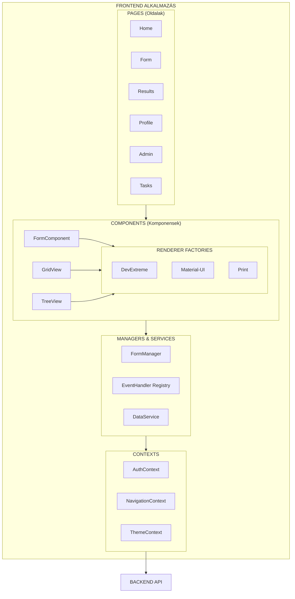
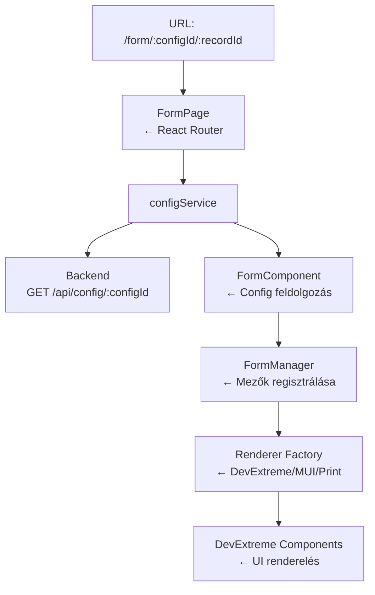
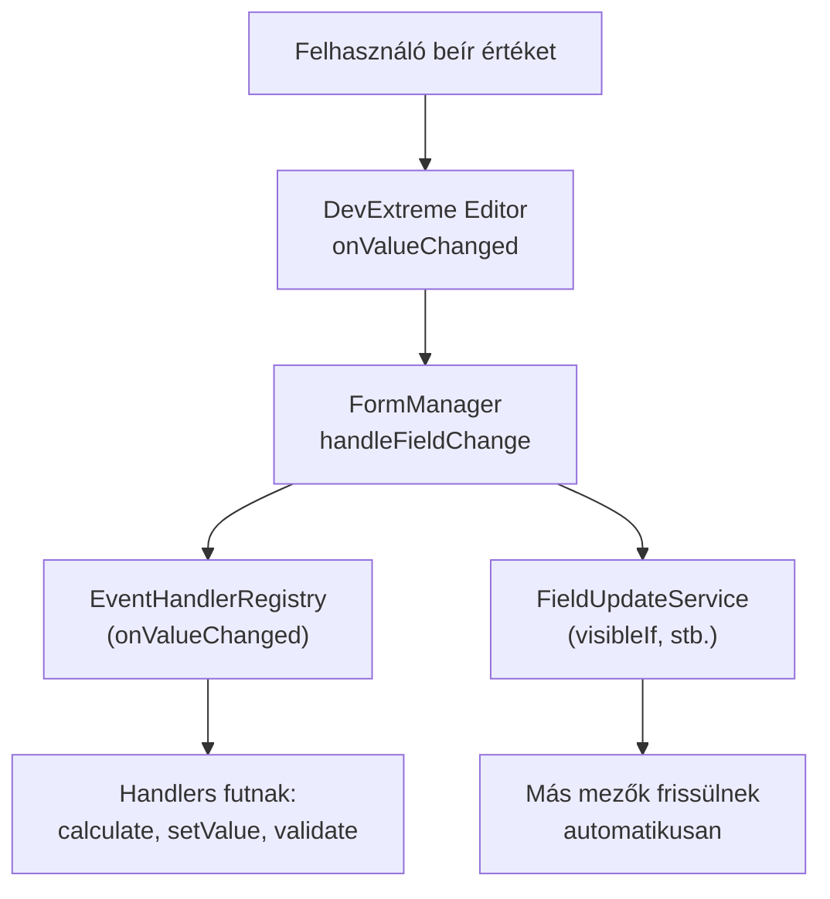
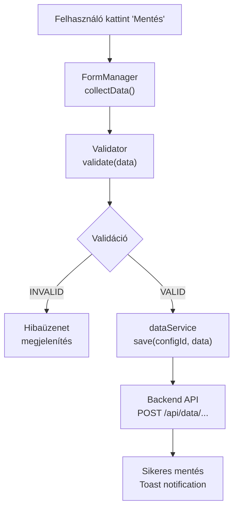

# Frontend Fejlesztés

## Áttekintés

A FormFiller frontend egy modern, React és TypeScript alapú single-page alkalmazás (SPA), amely dinamikusan renderel űrlapokat, adatrácsokat és fa struktúrákat JSON konfiguráció alapján.

### Fő Előnyök

| Előny | Leírás |
|-------|--------|
| **Konfiguráció-vezérelt** | Nincs hardcoded UI - minden a schema-ból jön |
| **Több renderelő motor** | DevExtreme, Material-UI, Print - ugyanaz a config |
| **Reaktív** | Mezők automatikusan reagálnak egymásra |
| **Típusbiztos** | Teljes TypeScript lefedettség |
| **Moduláris** | Könnyen bővíthető új komponensekkel |
| **Offline-képes** | Optimista UI, háttér szinkronizáció |

### Sematikus Felépítés



### Hívási Láncok

#### Űrlap Megjelenítés



#### Mező Érték Változás



#### Mentési Folyamat



## Részletes Dokumentációk

A specifikus funkciók részletes leírása külön dokumentumokban:

- [Felhasználó Kezelés](./features/user-management.md) - Regisztráció, bejelentkezés, profil
- [Jogosultságkezelés (RBAC)](./features/rbac.md) - Szerepkörök, engedélyek, UI szűrés
- [Multisite Kezelés](./features/multisite.md) - Több bérlős működés a frontenden
- [Téma és Lokalizáció](./features/theming.md) - Témák, többnyelvűség

## Architektúra

A frontend React és TypeScript alapú, Vite build rendszerrel és DevExtreme UI komponensekkel.

## Projekt Struktúra

```
src/
├── components/          # React komponensek
│   ├── form/           # Űrlap komponensek
│   ├── header/         # Fejléc
│   ├── footer/         # Lábléc
│   └── views/          # Nézet modulok (Grid, Tree)
├── pages/              # Oldal komponensek
│   ├── home/           # Kezdőlap
│   ├── form/           # Űrlap oldal
│   ├── results/        # Eredmények oldal
│   └── profile/        # Profil oldal
├── services/           # Üzleti logika és API
│   ├── dataService.ts  # API hívások
│   └── EventHandlerRegistry.ts
├── factories/          # Renderer gyárak
├── managers/           # Állapot menedzserek
├── eventHandlers/      # Eseménykezelők
├── contexts/           # React kontextusok
├── interfaces/         # TypeScript interfészek
├── types/              # Típus definíciók
├── utils/              # Segédfüggvények
└── themes/             # DevExtreme témák
```

## Rendererek

A rendszer három renderelő motort támogat:

### DevExtreme Renderer

A fő renderelő motor, teljes funkcionalitással:

```typescript
import { DevExtremeFormRenderer } from './factories/DevExtremeFormRenderer';

const renderer = new DevExtremeFormRenderer();
const form = renderer.render(config, data, mode);
```

### Material-UI Renderer

Alternatív Material Design megjelenés:

```typescript
import { MUIFormRenderer } from './factories/MUIFormRenderer';
```

### Print Renderer

Nyomtatásra optimalizált nézet.

## Form Manager

Központi állapotkezelő az űrlapokhoz:

```typescript
import { FormManager } from './managers/FormManager';

const formManager = new FormManager();

// Mező regisztrálása
formManager.registerField('firstName', {
  value: '',
  onChange: (value) => console.log('Changed:', value)
});

// Érték beállítása
formManager.setValue('firstName', 'John');

// Adatok összegyűjtése
const formData = formManager.collectData();
```

## Eseménykezelés

Deklaratív eseménykezelő rendszer:

```typescript
// Konfiguráció
const fieldConfig = {
  name: 'quantity',
  type: 'number',
  onValueChanged: [
    { handler: 'log', params: { message: 'Quantity changed' } },
    { handler: 'calculate', params: { target: 'total', formula: 'quantity * price' } }
  ]
};

// Egyéni handler regisztrálása
EventHandlerRegistry.register('myHandler', (context, params) => {
  // Handler implementáció
});
```

## API Hívások

A `dataService` kezeli az API kommunikációt:

```typescript
import { configService, dataService } from './services/dataService';

// Konfiguráció lekérése
const config = await configService.getById(configId);

// Adatok lekérése
const data = await dataService.query(configId, { filter, sort, skip, take });

// Mentés
await dataService.save(configId, formData);
```

## Kontextusok

### Auth Context

```typescript
import { useAuth } from './contexts/AuthContext';

const { user, login, logout, isAuthenticated } = useAuth();
```

### Navigation Context

```typescript
import { useNavigation } from './contexts/NavigationContext';

const { navigate, currentRoute } = useNavigation();
```

## Komponens Fejlesztés

### Új Komponens Létrehozása

```typescript
// components/MyComponent/MyComponent.tsx
import React from 'react';
import './MyComponent.scss';

interface MyComponentProps {
  title: string;
  onAction: () => void;
}

export const MyComponent: React.FC<MyComponentProps> = ({ title, onAction }) => {
  return (
    <div className="my-component">
      <h2>{title}</h2>
      <button onClick={onAction}>Action</button>
    </div>
  );
};
```

## Témák

DevExtreme témák a `themes/` könyvtárban:

```bash
# Téma build
npm run build-themes
```

## Hasznos Parancsok

```bash
# Fejlesztői szerver
npm start

# Build
npm run build

# Tesztek
npm test

# Téma build
npm run build-themes
```

