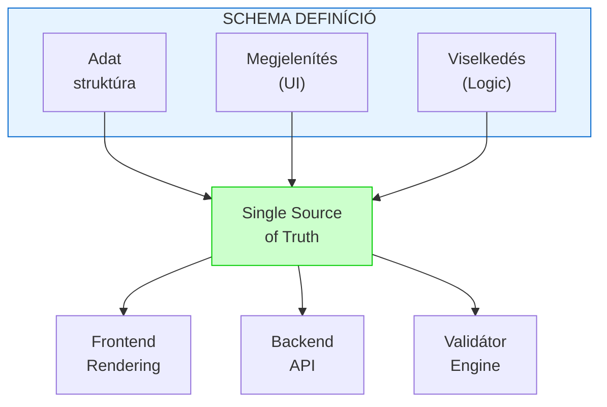
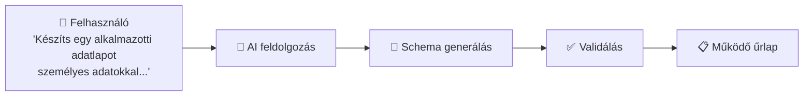
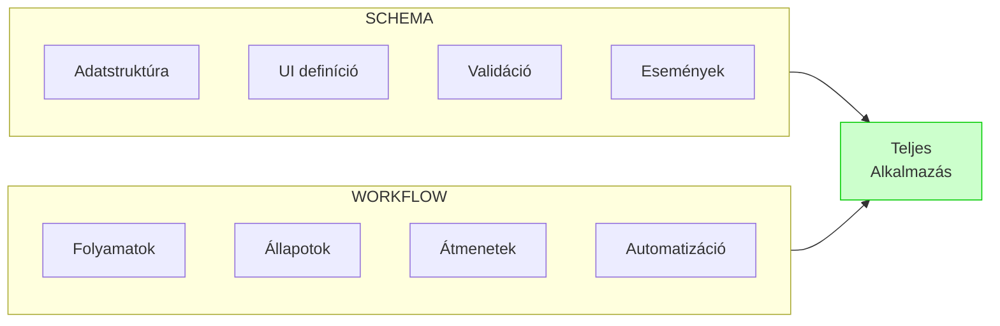

# Schema és Típusok

A `formfiller-schema` csomag a FormFiller rendszer **központi eleme** - ez definiálja a low-code platform által megvalósítható elemek strukturális felépítését.

## A Schema Szerepe

### Low-Code Definíciós Nyelv

A schema tulajdonképpen egy **deklaratív programozási nyelvként** értelmezhető. Egyetlen JSON struktúrában definiálható:

- **Adatstruktúra**: Mezők, típusok, kapcsolatok
- **Megjelenítés**: Űrlapok, rácsok, fa struktúrák
- **Viselkedés**: Validációk, feltételes logika, események
- **Üzleti szabályok**: ComputedRules, cross-field validáció




### Single Source of Truth

Ellentétben a hagyományos MVC architektúrákkal, ahol az adatmodellt, a megjelenítést és a validációt külön-külön, redundánsan kell definiálni:

| Hagyományos MVC | FormFiller Schema |
|-----------------|-------------------|
| Model definíció (backend) | **Egyetlen schema** |
| Adatbázis migráció | definiálja az összes |
| API endpoint-ok | réteget egyszerre |
| Frontend form komponensek | |
| Frontend validáció | |
| Backend validáció | |

**Előnyök:**
- Nincs redundancia - egy helyen módosítva mindenhol érvényesül
- Konzisztencia garantált - frontend és backend ugyanazt a definíciót használja
- Gyorsabb fejlesztés - nem kell minden réteget külön implementálni
- Kevesebb hiba - nincs eltérés a rétegek között
- AI kompatibilitás - könnyen feldolgozható és generálható mesterséges intelligenciával

### AI Kompatibilitás

A schema struktúra egyik kevésbé nyilvánvaló, de rendkívül értékes előnye az **AI technológiákkal való kompatibilitás**.

> **Fontos:** Az AI interfész **jelenleg is működő, éles funkció** a FormFiller rendszerben, nem jövőbeli terv!

#### Miért Ideális AI Feldolgozásra?

A schema világos, deklaratív szabályokat határoz meg:

| Tulajdonság | AI Előny |
|-------------|----------|
| **Strukturált JSON formátum** | Könnyen parseolható, generálható |
| **Véges típuskészlet** | Az AI pontosan tudja, milyen elemek léteznek |
| **Explicit szabályok** | Nincs rejtett logika, minden deklarált |
| **Hierarchikus felépítés** | Természetes fa struktúra az AI számára |
| **Validálható kimenet** | Az AI által generált schema ellenőrizhető |

#### AI Generált Űrlapok

A FormFiller beépített AI funkciója képes természetes nyelvű leírásból működő űrlapot generálni:



**Hogyan működik:**

1. **Prompt értelmezés**: AI megérti a felhasználói igényt
2. **Schema generálás**: AI a schema szabályai szerint generál JSON-t
3. **Validáció**: A generált schema automatikusan validálódik
4. **Finomhangolás**: Felhasználó módosíthat, AI újragenerálhat

**Példa AI Generált Schema:**

```json
// Felhasználói kérés: "Egyszerű kapcsolatfelvételi űrlap"
{
  "type": "form",
  "title": "Kapcsolatfelvétel",
  "items": [
    { "name": "name", "title": "Név", "type": "text", 
      "validationRules": [{"type": "required"}] },
    { "name": "email", "title": "Email", "type": "text",
      "validationRules": [{"type": "required"}, {"type": "email"}] },
    { "name": "subject", "title": "Tárgy", "type": "text" },
    { "name": "message", "title": "Üzenet", "type": "textarea",
      "validationRules": [{"type": "required"}] }
  ],
  "preferences": { "addSaveBtn": true }
}
```

#### AI Előnyök a Fejlesztésben

| Funkció | Leírás |
|---------|--------|
| **Gyors prototípus** | Percek alatt működő űrlap természetes nyelvből |
| **Iteratív finomítás** | "Add hozzá telefonszám mezőt is" |
| **Komplex struktúrák** | AI kezeli a beágyazott csoportokat, feltételeket |
| **Best practices** | AI a schema szabályai szerint generál |
| **Hibamentes output** | Validálható, típushelyes kimenet |

#### Drasztikus Időmegtakarítás

A működő AI interfész **radikálisan csökkenti a fejlesztési időt**:

| Módszer | Átlagos Idő | Megtakarítás |
|---------|-------------|--------------|
| Hagyományos kódolás (MVC) | 4-8 óra | - |
| Kézi JSON schema írás | 30-60 perc | ~85% |
| **AI generálás** | **2-5 perc** | **~98%** |

#### Nem-Űrlap Célú Alkalmazások

Az AI interfész **nem korlátozódik űrlapokra**. A FormFiller deklaratív schema nyelve alkalmas bármilyen strukturált adat leírására:

| Alkalmazás | Példa |
|------------|-------|
| **Workflow definíciók** | Jóváhagyási folyamatok, állapotgépek |
| **Adatstruktúrák** | CRM, ERP entitás modellek |
| **Rendszerkonfigurációk** | Beállítások, paraméterek |
| **Üzleti szabályok** | Árazás, kedvezmények, jogosultságok |
| **Riport definíciók** | Jelentés struktúrák, dashboard-ok |

> 📚 Részletes dokumentáció: [AI Interfész](./features/ai-interface.md)

#### Összehasonlítás Hagyományos Kóddal

| | Hagyományos Kód | FormFiller Schema |
|-|-----------------|-------------------|
| AI generálás | Nehéz - szintaxis érzékeny | Egyszerű - strukturált JSON |
| Validálás | Futtatni kell a kódot | JSON Schema validáció |
| Hibaarány | Magas (szintaxis hibák) | Alacsony (típus ellenőrzés) |
| Értelmezés | AI-nak nehéz megérteni | Explicit, deklaratív |

A schema deklaratív természete tehát nem csak a fejlesztést egyszerűsíti, hanem **új lehetőségeket nyit az AI-alapú fejlesztési eszközök** számára is.

### Schema + Workflow = Teljes Alkalmazás

A schema a Workflow sémával kiegészítve **szinte bármely tipikus üzleti alkalmazás** leírható:



**Példa: Webáruház működése FormFiller-ben**

| Funkció | Schema elem | Workflow elem |
|---------|-------------|---------------|
| Termék katalógus | Grid config + lookup | - |
| Kosár kezelés | Beágyazott grid + computedRules (összeg) | - |
| Megrendelés űrlap | Form config + validáció | - |
| Rendelés feldolgozás | - | Státusz átmenetek |
| Értesítések | - | Email workflow lépések |
| Készlet frissítés | - | Automatikus workflow |

**Más megvalósítható rendszerek:**
- CRM rendszer
- Projektmenedzsment
- HR adminisztráció
- Ügyfélszolgálat (ticketing)
- Leltár/készletkezelés
- Dokumentum workflow
- Vizsgáztatási rendszer

### Path Alapú Mezőkezelés

A FormFiller egyik egyedi és rendkívül hasznos tulajdonsága a **path alapú mezőkezelés**, amely lehetővé teszi az adatok komplex, hierarchikus struktúrában történő tárolását.

#### Path Szintaxis

```
egyszerű mező:        name                              → { "name": "..." }
csoport mező:         address.city                      → { "address": { "city": "..." } }
mély beágyazás:       customer.billing.zipCode          → { "customer": { "billing": { "zipCode": "..." } } }
grid sor:             items[0].quantity                 → { "items": [{ "quantity": ... }] }
összes grid sor:      items[*].total                    → (minden sor total mezője)
```

#### Előnyök

| Előny | Leírás |
|-------|--------|
| **Szemantikus struktúra** | Az adatok hierarchiája jelentést hordoz - pl. `billing.address` vs `shipping.address` |
| **Logikai csoportosítás** | Összetartozó mezők együtt tárolódnak az adatbázisban |
| **Űrlap-adat megfelelés** | Az adat struktúra visszatükrözi az űrlap logikai felépítését |
| **MongoDB kompatibilitás** | Natív beágyazott dokumentum tárolás, nincs szükség join-okra |
| **Könnyebb lekérdezés** | Path alapú keresés és aggregáció (`"customer.billing.city": "Budapest"`) |
| **Jelentéstartalom** | Az adatok önleírók, a struktúra maga is információt hordoz |

#### Példa: Rendelési Űrlap Adatstruktúrája

```json
// Schema definíció
{
  "type": "form",
  "items": [
    {
      "type": "group",
      "name": "customer",
      "items": [
        { "name": "name", "type": "text" },
        {
          "type": "group",
          "name": "billing",
          "items": [
            { "name": "address", "type": "text" },
            { "name": "zipCode", "type": "text" }
          ]
        },
        {
          "type": "group", 
          "name": "shipping",
          "items": [
            { "name": "address", "type": "text" },
            { "name": "zipCode", "type": "text" }
          ]
        }
      ]
    },
    {
      "name": "items",
      "type": "grid",
      "gridConfig": {
        "columns": [
          { "dataField": "product", "type": "text" },
          { "dataField": "quantity", "dataType": "number" },
          { "dataField": "price", "dataType": "number" }
        ]
      }
    }
  ]
}
```

A fenti schema alapján mentett adat:

```json
{
  "customer": {
    "name": "Kiss János",
    "billing": {
      "address": "Budapest, Fő u. 1.",
      "zipCode": "1011"
    },
    "shipping": {
      "address": "Debrecen, Piac u. 5.",
      "zipCode": "4024"
    }
  },
  "items": [
    { "product": "Laptop", "quantity": 1, "price": 250000 },
    { "product": "Egér", "quantity": 2, "price": 5000 }
  ]
}
```

#### Összehasonlítás Lapos Struktúrával

| Lapos struktúra | Hierarchikus (FormFiller) |
|-----------------|---------------------------|
| `billingAddress`, `shippingAddress` | `billing.address`, `shipping.address` |
| Kézzel kell csoportosítani | Automatikus csoportosítás |
| Nincs szemantikus jelentés | A struktúra maga hordoz jelentést |
| Nehéz bővíteni | Könnyen bővíthető új szintekkel |
| JOIN szükséges (relációs DB) | Beágyazott dokumentum (MongoDB) |

#### MongoDB Lekérdezés Előnyök

```javascript
// Lapos struktúra esetén
db.orders.find({ billingCity: "Budapest" });

// FormFiller hierarchikus struktúra esetén
db.orders.find({ "customer.billing.city": "Budapest" });

// Aggregáció a beágyazott tömbön
db.orders.aggregate([
  { $unwind: "$items" },
  { $group: { _id: "$customer.name", total: { $sum: "$items.price" } } }
]);
```

A path alapú struktúra tehát nem csupán a schema olvashatóságát javítja, hanem **az adatok jelentéstartalmat kapnak**, és a tárolás tükrözi az üzleti logikát.

### Tömör Programkód

Egy komplex űrlap, ami hagyományos kódban több száz sor lenne, schema-ban tömören leírható:

```json
{
  "type": "form",
  "title": "Megrendelés",
  "items": [
    {
      "itemType": "group",
      "caption": "Vevő adatai",
      "items": [
        { "name": "customerName", "type": "text", "validationRules": [{"type": "required"}] },
        { "name": "email", "type": "text", "validationRules": [{"type": "email"}] }
      ]
    },
    {
      "name": "orderItems",
      "type": "grid",
      "gridConfig": {
        "columns": [
          { "dataField": "product", "lookup": { "dataSource": "/api/products" } },
          { "dataField": "quantity", "dataType": "number" },
          { "dataField": "unitPrice", "dataType": "number" },
          { "dataField": "lineTotal", "dataType": "number", "calculateValue": "quantity * unitPrice" }
        ]
      }
    }
  ],
  "computedRules": [
    { "targetField": "orderTotal", "formula": "sum(orderItems[*].lineTotal)" }
  ]
}
```

Ez a ~30 soros JSON leírás magában foglalja:
- Adatstruktúrát (mezők, típusok)
- UI-t (csoportosítás, grid, form)
- Validációt (kötelező, email formátum)
- Üzleti logikát (sortétel összeg, végösszeg)
- Adatkapcsolatokat (termék lookup)

## Fő Típusok

### FieldConfig

Mező konfiguráció típus:

```typescript
interface FieldConfig {
  name: string;                    // Mező azonosító
  title?: string;                  // Megjelenített cím
  type: FieldType;                 // Mező típus
  dataType?: DataType;             // Adat típus
  editorOptions?: EditorOptions;   // Editor beállítások
  validationRules?: ValidationRule[]; // Validációs szabályok
  visibleIf?: ConditionalRule;     // Feltételes láthatóság
  disabledIf?: ConditionalRule;    // Feltételes letiltás
  requiredIf?: ConditionalRule;    // Feltételes kötelezőség
  lookup?: LookupConfig;           // Lookup konfiguráció
}
```

### FieldType

Támogatott mező típusok:

```typescript
type FieldType = 
  | 'text' | 'number' | 'date' | 'datetime' | 'boolean'
  | 'lookup' | 'tagbox' | 'textarea' | 'html'
  | 'file' | 'image' | 'signature'
  | 'group' | 'tabbed' | 'tab'
  | 'grid' | 'tree' | 'form';
```

### ValidationRule

DevExtreme-kompatibilis validációs szabályok:

```typescript
interface ValidationRule {
  type: ValidationType;
  message?: string;
  // Típus-specifikus mezők
  min?: number;
  max?: number;
  pattern?: string;
  // ...
}

type ValidationType = 
  | 'required' | 'email' | 'numeric'
  | 'stringLength' | 'range' | 'pattern'
  | 'compare' | 'custom';
```

### ItemConfig

Nézet konfiguráció (grid, tree, form):

```typescript
interface ItemConfig {
  id: string;
  title: string;
  type: 'grid' | 'tree' | 'form';
  items: FieldConfig[];
  preferences?: FormPreferences;
}
```

## Használat

### Frontend

```typescript
import { 
  FieldConfig, 
  ItemConfig, 
  validateField 
} from 'formfiller-schema';

// Típusos konfiguráció
const field: FieldConfig = {
  name: 'email',
  title: 'Email cím',
  type: 'text',
  validationRules: [
    { type: 'required' },
    { type: 'email' }
  ]
};

// Validáció
const result = validateField(field);
```

### Backend

```typescript
import { 
  ViewConfig, 
  validateConfig,
  SchemaValidator 
} from 'formfiller-schema';

// Config model TypeScript interface-szel
const config: ViewConfig = req.body.config;

// Validáció
const validator = new SchemaValidator();
const result = validator.validate(config, schema);

if (!result.valid) {
  return res.status(400).json({ errors: result.errors });
}
```

## SchemaValidator

Többszintű validáció támogatás:

```typescript
import { SchemaValidator, ValidationLevel } from 'formfiller-schema';

const validator = new SchemaValidator();

// STRICT - éles környezethez
const strictResult = validator.validate(config, schema, {
  level: ValidationLevel.STRICT
});

// LOOSE - staging környezethez
const looseResult = validator.validate(config, schema, {
  level: ValidationLevel.LOOSE
});

// DEVELOPMENT - fejlesztéshez
const devResult = validator.validate(config, schema, {
  level: ValidationLevel.DEVELOPMENT
});
```

## SchemaCache

Gyorsítótárazott validátorok:

```typescript
import { getSchemaCache } from 'formfiller-schema';

const cache = getSchemaCache();
const validator = cache.getValidator('configSchema', schema);

// Többszöri használat - gyorsítótárból
validator(config1);
validator(config2);

// Statisztikák
console.log(`Hit rate: ${cache.getHitRate() * 100}%`);
```

## Fejlesztés

### Schema Módosítása

1. Módosítsd a típusokat a `formfiller-schema` projektben
2. Futtasd a build-et: `npm run build`
3. Disztributáld: `npm run distribute`
4. Indítsd újra a backend és frontend projekteket

### Új Mező Típus Hozzáadása

1. Add hozzá a `FieldType` union-hoz
2. Definiáld a típus-specifikus interface-t
3. Implementáld a validációt
4. Implementáld a frontend renderelést

