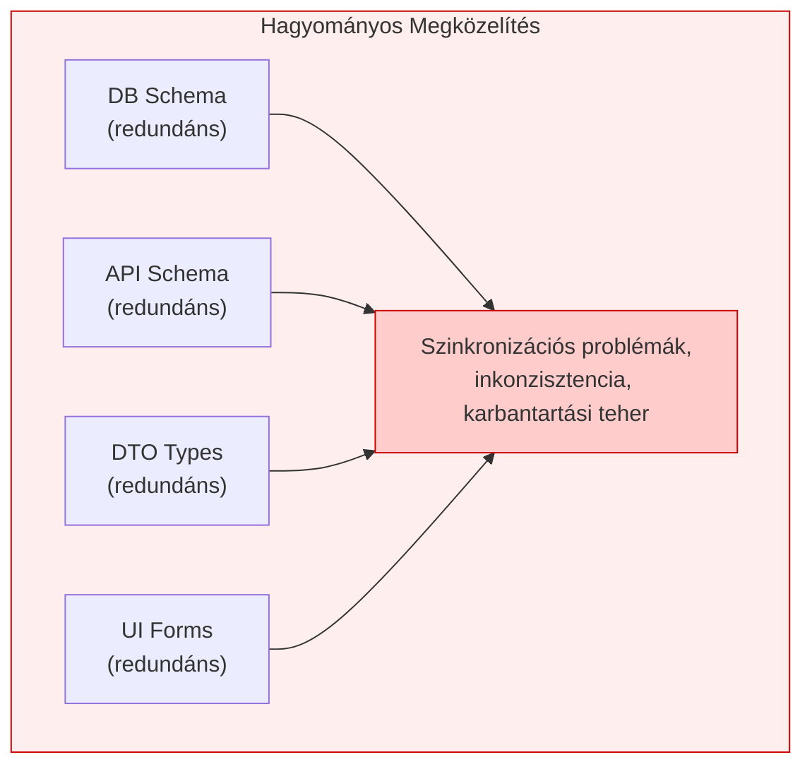
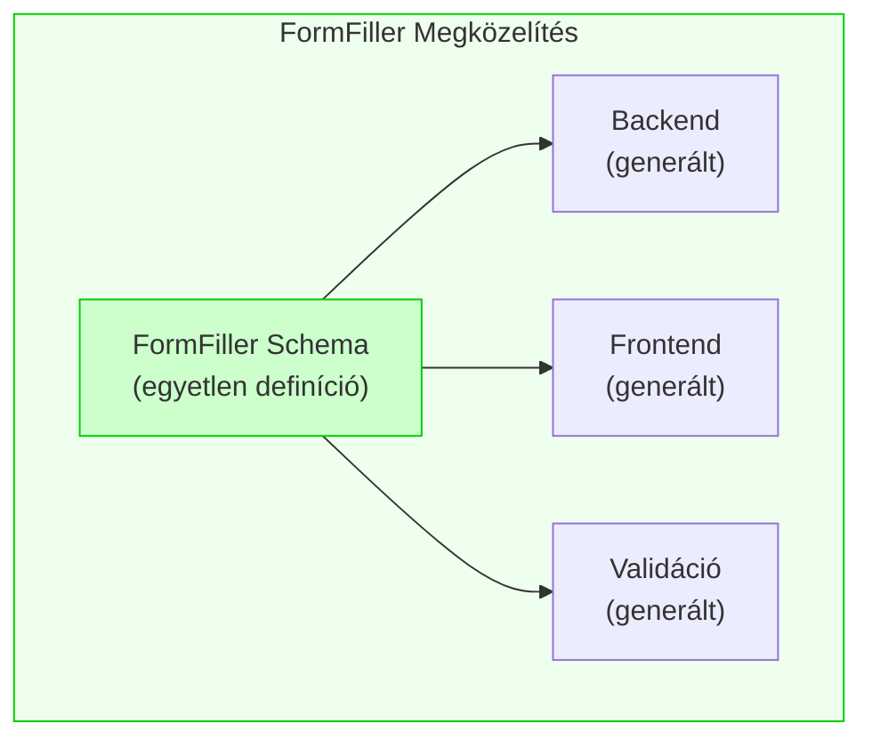
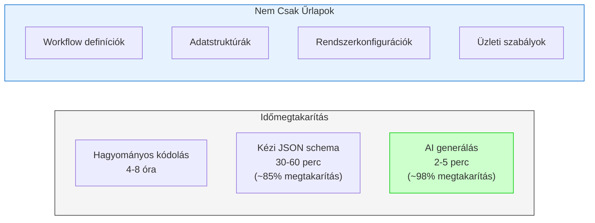

# FormFiller Dokumentáció

> A dokumentáció [angol nyelven](/formfiller-docs/) is elérhető.

A FormFiller egy modern, konfigurálható űrlapkezelő rendszer, amely lehetővé teszi dinamikus űrlapok, adatrácsok és fa struktúrák létrehozását és kezelését JSON séma alapján.

## Motiváció

### Milyen Igény Hívta Életre a Projektet?

Az üzleti alkalmazások fejlesztése során újra és újra szembesülünk ugyanazokkal a kihívásokkal:

**Hagyományos fejlesztési problémák:**
- Minden űrlaphoz egyedi kódot kell írni
- A validációs szabályokat többször implementáljuk (frontend, backend, adatbázis)
- Egy mező módosítása több fájl módosítását igényli
- A karbantartás költsége exponenciálisan nő a komplexitással

**Létező űrlapkezelők korlátai:**
- A SaaS megoldások (Google Forms, Typeform) rugalmatlanok összetett üzleti logikához
- Nincs kontroll az adatok felett (adatvédelem, GDPR)
- Korlátozott testreszabhatóság és integráció
- Workflow és automatizáció hiánya vagy drága

**Az egyedi fejlesztés csapdái:**
- Magas kezdeti és folyamatos fejlesztési költség
- Technikai adósság felhalmozódása
- Nehéz skálázhatóság és karbantartás

### Tervezési Filozófia

> *"A tökéletesség nem akkor valósul meg, amikor már nincs mit hozzátenni, hanem amikor már nincs mit elvenni."*
> 
> — Antoine de Saint-Exupéry

A FormFiller ezt a filozófiát követi a következő elvek mentén:

#### Single Source of Truth (Egyetlen Igazságforrás)

**Hagyományos Megközelítés:**



**FormFiller Megközelítés:**



#### Minimalizmus a Gyakorlatban

| Elv | Hagyományos | FormFiller |
|-----|-------------|------------|
| **Mező definíció** | 4+ helyen (DB, API, DTO, UI) | 1 helyen (Schema) |
| **Validáció** | Frontend + Backend külön | Egyszer, mindenhol érvényes |
| **UI változtatás** | Kód módosítás + deploy | JSON konfiguráció módosítás |
| **Új űrlap** | Napok fejlesztés | Percek alatt konfigurálható |

#### Deklaratív vs Imperatív

A FormFiller deklaratív megközelítést alkalmaz: **leírjuk MIT akarunk**, nem azt, HOGYAN érjük el.

```json
// Hagyományos (imperatív): ~50 sor kód
// - Form component
// - State management
// - Validation logic
// - API calls
// - Error handling

// FormFiller (deklaratív): ~10 sor konfiguráció
{
  "name": "email",
  "type": "text",
  "label": "Email cím",
  "validationRules": [
    { "type": "required", "message": "Kötelező mező" },
    { "type": "email", "message": "Érvénytelen email" }
  ]
}
```

### Miért "Kevesebb a Több"?

A FormFiller megfelel Saint-Exupéry elvének, mert:

1. **Nincs redundancia**: Egyetlen JSON definiál mindent
2. **Nincs felesleges absztrakció**: Közvetlen leképezés konfiguráció → UI
3. **Nincs boilerplate kód**: A rendszer generálja ami szükséges
4. **Nincs lock-in**: Nyílt forráskód, saját infrastruktúra

Részletes összehasonlítás más rendszerekkel: [Összehasonlítások](./comparison.md)

---

## Rendszer Áttekintés

A FormFiller egy multisite képes alkalmazás, amely a következő fő komponensekből áll:

| Komponens | Leírás | Technológia |
|-----------|--------|-------------|
| [Backend](https://github.com/LowCoders/formfiller-backend) (hamarosan elérhető) | REST API és üzleti logika | Node.js, TypeScript, Express, MongoDB |
| [Frontend](https://github.com/LowCoders/formfiller-frontend) (hamarosan elérhető) | Felhasználói felület | React, TypeScript, DevExtreme |
| [Schema](https://github.com/LowCoders/formfiller-schema) (hamarosan elérhető) | Közös típusok és validáció | TypeScript, JSON Schema |
| [Validator](https://github.com/LowCoders/formfiller-validator) (hamarosan elérhető) | Fejlett validációs rendszer | TypeScript |
| [Types](https://github.com/LowCoders/formfiller-types) (hamarosan elérhető) | Közös típus definíciók | TypeScript |
| [Deployment](https://github.com/LowCoders/formfiller-deployment) (hamarosan elérhető) | Telepítési konfigurációk | Helm, Kubernetes, Docker |

## Fő Funkciók

- **Dinamikus Űrlapok**: JSON séma alapú űrlap renderelés
- **Több Renderelő Motor**: DevExtreme, Material-UI, Print nézet
- **Adatrácsok és Fa Struktúrák**: Komplex adatmegjelenítés
- **Feltételes Mezők**: visibleIf, disabledIf, requiredIf támogatás
- **Lookup Mezők**: Dinamikus legördülő listák függőségekkel
- **Eseménykezelés**: Deklaratív eseménykezelő rendszer
- **RBAC**: Szerepkör alapú jogosultságkezelés
- **Multisite**: Több bérlős architektúra
- **🤖 AI Interfész**: Működő mesterséges intelligencia alapú konfiguráció generálás

### AI Interfész - Működő Funkció

A FormFiller **jelenleg is működő AI interfésszel** rendelkezik, amely drasztikusan csökkenti az űrlapok és egyéb struktúrák létrehozásának idejét:



**Példa használat:**
```
Prompt: "Készíts egy szabadságkérelem űrlapot kezdő és záró dátummal,
        indoklással, és jóváhagyási workflow-val"

Eredmény: 2-3 perc alatt működő rendszer
(Hagyományos fejlesztés: 1-2 nap)
```

> 📚 Részletes dokumentáció: [AI Interfész](./developer/features/ai-interface.md)

## Dokumentáció Struktúra

### [Fejlesztői Dokumentáció](./developer/index.md)

- Backend fejlesztés
- Frontend fejlesztés
- Schema és típusok
- API referencia
- Eseménykezelés
- Validáció

### [Felhasználói Dokumentáció](./user/index.md)

- Kezdő lépések
- Űrlap konfiguráció
- Adminisztráció

### [Telepítési Dokumentáció](./deployment/index.md)

- Hagyományos (VPS) telepítés
- Docker telepítés
- Kubernetes telepítés

### [Összehasonlítások](./comparison.md)

- MVC/MVP rendszerekkel való összehasonlítás
- Form builder szolgáltatások összehasonlítása
- Összegző táblázat csillagos értékeléssel

### [Továbbfejlesztési Lehetőségek](./roadmap.md)

- AI és gépi tanulás fejlesztések
- Vizuális szerkesztő és kollaboráció
- Platform kiterjesztések és integrációk
- Fejlesztési roadmap

## Architektúra

A rendszer felépítésének részletes leírása: [Architektúra](./architecture.md)

## Gyors Indítás

### Fejlesztői Környezet

```bash
# Backend
cd formfiller-backend
npm install
npm run dev

# Frontend (másik terminálban)
cd formfiller-frontend
npm install
npm start
```

### Docker

```bash
cd formfiller-deployment/docker-compose
docker-compose up -d
```

### Kubernetes

```bash
cd formfiller-deployment
./scripts/deploy.sh minikube
```

## Támogatás

Kérdések és hibák esetén használd az issue tracker-t a megfelelő repóban.
