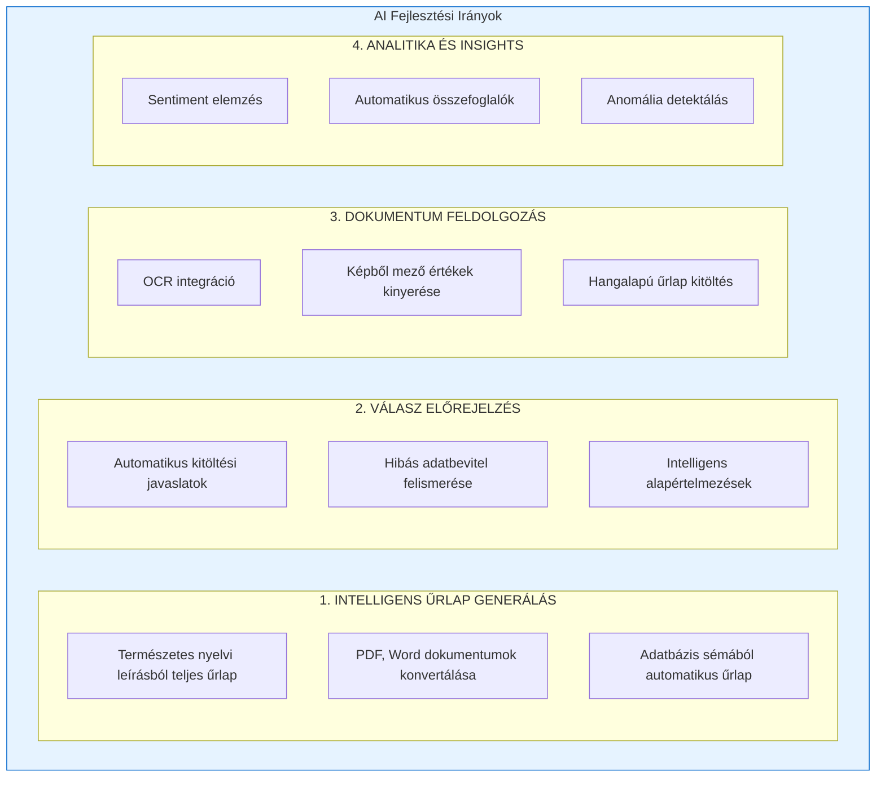
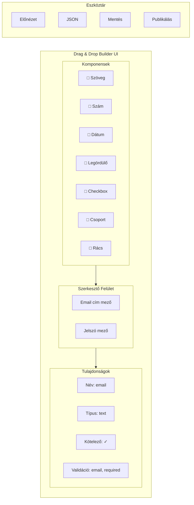
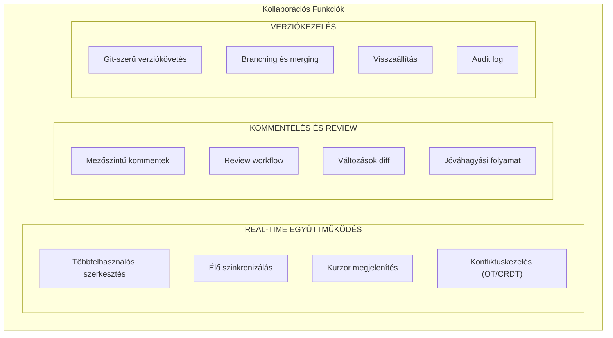
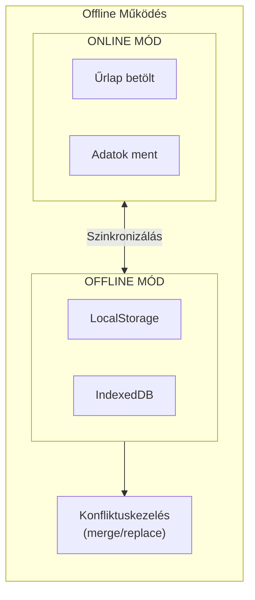
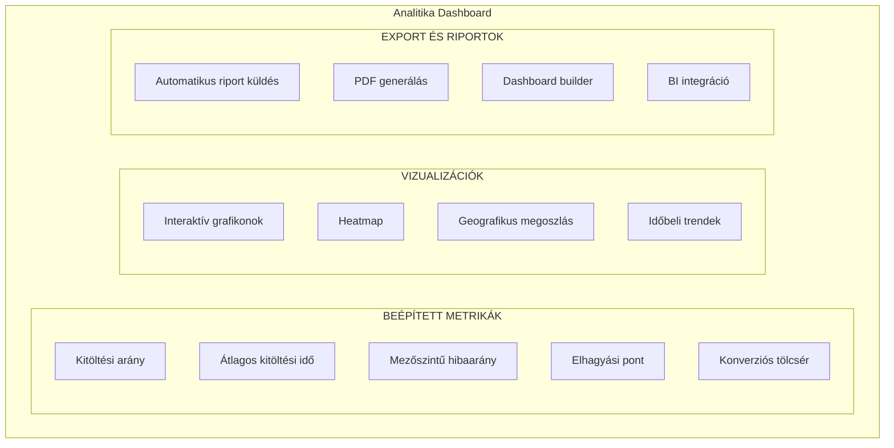
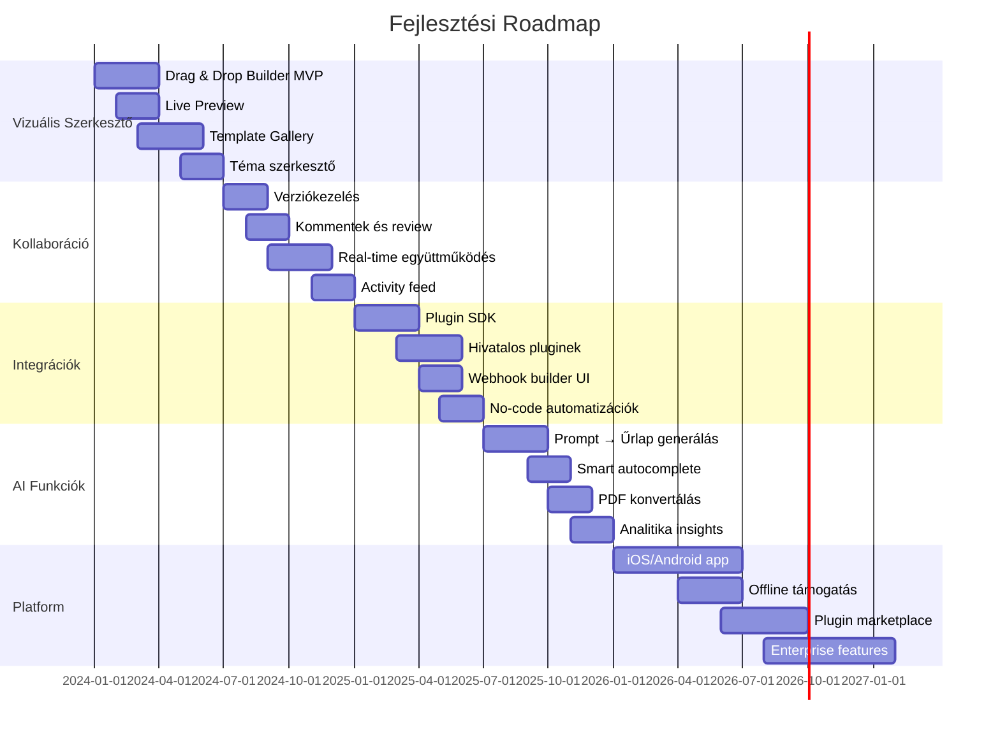

# Továbbfejlesztési Lehetőségek

A FormFiller nyílt architektúrája számos kreatív továbbfejlesztési lehetőséget kínál. Ez a dokumentum felvázolja a lehetséges fejlesztési irányokat.

## Tartalomjegyzék

1. [AI és Gépi Tanulás](#ai-és-gépi-tanulás)
2. [Vizuális Fejlesztések](#vizuális-fejlesztések)
3. [Kollaboráció](#kollaboráció)
4. [Platform Kiterjesztések](#platform-kiterjesztések)
5. [Automatizáció és Integráció](#automatizáció-és-integráció)
6. [Analitika és Riportálás](#analitika-és-riportálás)
7. [Fejlesztési Roadmap](#fejlesztési-roadmap)

---

## AI és Gépi Tanulás



### AI Funkcionalitás Részletezése

| Funkció | Leírás | Technológia |
|---------|--------|-------------|
| **Prompt → Űrlap** | Természetes nyelvi leírásból komplett űrlap generálás | OpenAI, Claude, Llama |
| **PDF → Űrlap** | Meglévő papír alapú űrlapok digitalizálása | OCR + LLM |
| **DB → Űrlap** | Adatbázis séma alapján űrlap ajánlás | Schema analysis |
| **Smart Autocomplete** | Korábbi válaszok alapján javaslatok | ML, embedding |
| **Anomaly Detection** | Szokatlan válaszok jelzése | Statistical ML |
| **Voice Input** | Hangalapú űrlap kitöltés | Speech-to-text |

---

## Vizuális Fejlesztések

| Funkció | Leírás | Prioritás |
|---------|--------|-----------|
| **Drag & Drop Builder** | Vizuális űrlap szerkesztő kód nélkül | Magas |
| **Live Preview** | Valós idejű előnézet szerkesztés közben | Magas |
| **Téma Szerkesztő** | Vizuális CSS testreszabás | Közepes |
| **Template Gallery** | Előre elkészített sablonok böngészése | Közepes |
| **Responsive Tervező** | Mobile-first design eszközök | Közepes |
| **Icon Library** | Beépített ikon könyvtár | Alacsony |
| **Animation Editor** | Átmenetek és animációk szerkesztése | Alacsony |

### Vizuális Szerkesztő Koncepció



---

## Kollaboráció



### Kollaboráció Részletezése

| Funkció | Leírás | Komplexitás |
|---------|--------|-------------|
| **Real-time editing** | Figma-szerű együttműködés | Magas |
| **Kommentek** | Mezőkhöz fűzhető megjegyzések | Közepes |
| **Verziókezelés** | Git-szerű history, branching | Magas |
| **Review workflow** | Jóváhagyási folyamat | Közepes |
| **Diff viewer** | Verziók összehasonlítása | Közepes |
| **Activity feed** | Aktivitás napló | Alacsony |

---

## Platform Kiterjesztések

### Plugin Rendszer

```typescript
// Példa plugin interface
interface FormFillerPlugin {
  name: string;
  version: string;
  
  // Új mező típusok regisztrálása
  registerFieldTypes?(): FieldType[];
  
  // Validátorok hozzáadása
  registerValidators?(): Validator[];
  
  // Workflow lépések
  registerWorkflowSteps?(): WorkflowStep[];
  
  // UI komponensek
  registerComponents?(): React.ComponentType[];
  
  // Lifecycle hooks
  onFormLoad?(form: FormConfig): void;
  onFormSubmit?(data: any): void;
}
```

### Plugin Ötletek

| Plugin | Leírás | Kategória |
|--------|--------|-----------|
| **E-aláírás** | Digitális aláírás integráció (DocuSign, HelloSign) | Aláírás |
| **Fizetés** | Stripe, PayPal, Square integráció | Pénzügy |
| **CRM** | Salesforce, HubSpot szinkronizálás | Üzleti |
| **Dokumentum** | PDF generálás, e-számla | Dokumentum |
| **Naptár** | Google Calendar, Outlook integráció | Ütemezés |
| **Térképes mező** | Google Maps cím választó | Lokáció |
| **Kódolvasó** | QR/vonalkód beolvasás | Input |
| **Értékelés** | Csillagos értékelő komponens | UI |

### Mobilalkalmazás

| Platform | Funkciók | Technológia |
|----------|----------|-------------|
| **iOS/Android App** | Natív űrlap kitöltés, offline támogatás | React Native |
| **PWA** | Installálható web app, push értesítések | Service Worker |
| **Tablet optimalizálás** | Nagyobb képernyőre szabott UI | Responsive |

### Offline Támogatás



---

## Automatizáció és Integráció

### No-Code Automatizációk

```json
// Példa: Automatikus szabály definiálása
{
  "name": "auto-assign-reviewer",
  "trigger": {
    "event": "form.submitted",
    "condition": "data.priority === 'high'"
  },
  "actions": [
    {
      "type": "notify",
      "to": "senior-reviewers@company.com",
      "template": "urgent-review"
    },
    {
      "type": "setField",
      "field": "status",
      "value": "urgent-review"
    },
    {
      "type": "createTask",
      "assignee": "{{config.seniorReviewer}}",
      "dueIn": "4h"
    }
  ]
}
```

### Trigger Típusok

| Trigger | Leírás |
|---------|--------|
| `form.submitted` | Űrlap beküldésekor |
| `form.updated` | Adat módosításakor |
| `form.deleted` | Adat törlésekor |
| `field.changed` | Mező érték változásakor |
| `schedule.cron` | Időzített futás |
| `webhook.received` | Külső webhook érkezésekor |

### Action Típusok

| Action | Leírás |
|--------|--------|
| `notify` | Email/SMS/Push értesítés |
| `setField` | Mező érték beállítása |
| `createTask` | Task létrehozás (Jira, Asana) |
| `callApi` | Külső API hívás |
| `runWorkflow` | Workflow indítás |
| `export` | Adat exportálás |

### Integráció Katalógus

| Kategória | Integrációk |
|-----------|-------------|
| **CRM** | Salesforce, HubSpot, Pipedrive, Zoho |
| **Projektmenedzsment** | Jira, Asana, Trello, Monday, ClickUp |
| **Kommunikáció** | Slack, Microsoft Teams, Discord, Email, SMS |
| **Fájlkezelés** | Google Drive, Dropbox, OneDrive, S3, SharePoint |
| **Fizetés** | Stripe, PayPal, Square, Braintree |
| **Marketing** | Mailchimp, SendGrid, ActiveCampaign, Klaviyo |
| **Analitika** | Google Analytics, Mixpanel, Segment, Amplitude |
| **ERP** | SAP, Oracle, Microsoft Dynamics, NetSuite |
| **Adatbázis** | PostgreSQL, MySQL, BigQuery, Snowflake |
| **Automatizáció** | Zapier, Make (Integromat), n8n |

---

## Analitika és Riportálás



### Dashboard Widgetek

| Widget | Leírás |
|--------|--------|
| **Summary Cards** | Kulcs metrikák (beküldések, completion rate) |
| **Line Chart** | Időbeli trendek |
| **Bar Chart** | Mező szerinti összehasonlítás |
| **Pie Chart** | Választás megoszlás |
| **Heatmap** | Interakció intenzitás |
| **Funnel** | Konverziós tölcsér |
| **Map** | Földrajzi megoszlás |
| **Table** | Részletes adatok |

---

## Fejlesztési Roadmap

### Javasolt Fázisok

| Fázis | Időkeret | Fejlesztések | Prioritás |
|-------|----------|--------------|-----------|
| **1. Alapok** | 0-6 hónap | Drag & Drop Builder, Template Gallery, Live Preview | Magas |
| **2. Együttműködés** | 6-12 hónap | Real-time szerkesztés, Verziókezelés, Kommentek | Magas |
| **3. Integráció** | 12-18 hónap | Plugin rendszer, Integráció katalógus, Webhook builder | Közepes |
| **4. AI** | 18-24 hónap | AI űrlap generálás, Válasz előrejelzés, OCR | Közepes |
| **5. Platform** | 24+ hónap | Mobilapp, Offline mód, Marketplace | Alacsony |

### Részletes Roadmap



### Közösségi Hozzájárulás

A nyílt forráskódú projekt lehetőséget ad közösségi fejlesztésekre:

| Terület | Hozzájárulási Lehetőség |
|---------|-------------------------|
| **Dokumentáció** | Fordítások, útmutatók, példák |
| **Pluginek** | Egyedi komponensek, integrációk |
| **Sablonok** | Iparági sablonok (HR, egészségügy, oktatás) |
| **Témák** | CSS témák, design rendszerek |
| **Lokalizáció** | Új nyelvek támogatása |
| **Tesztelés** | Bug reportok, feature requestek |

---

## Kapcsolódó Dokumentációk

- [Főoldal](./index.md) - Projekt áttekintés
- [Összehasonlítások](./comparison.md) - Rendszer összehasonlítások
- [Architektúra](./architecture.md) - Rendszer felépítés
- [Schema](./developer/schema.md) - Low-code definíciós nyelv
- [Workflow](./developer/features/workflow.md) - Workflow kezelés

