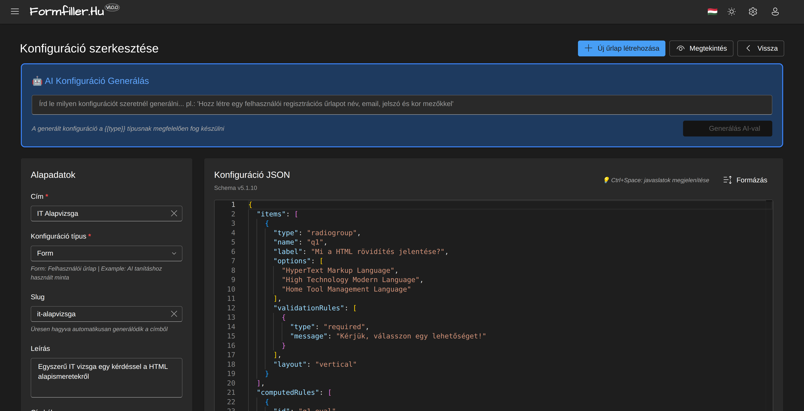
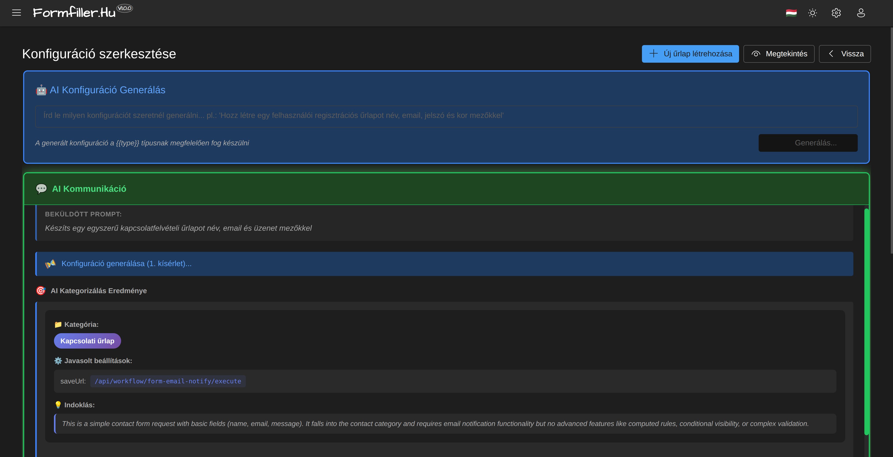

# Űrlap Konfiguráció

Ez az útmutató segít az űrlapok létrehozásában és testreszabásában.

*A konfiguráció szerkesztő felülete*

## Áttekintés

Az űrlapok JSON konfiguráció alapján jönnek létre. A konfiguráció meghatározza:
- Milyen mezők jelenjenek meg
- Milyen típusúak legyenek
- Milyen validációk vonatkozzanak rájuk
- Hogyan viselkedjenek (feltételes megjelenítés, számítások)

## Konfiguráció Szerkesztő

### Megnyitás

1. Nyisd meg az Adminisztráció menüt
2. Válaszd a "Konfigurációk" menüpontot
3. Kattints egy meglévő konfigurációra vagy az "Új" gombra

### Felület Elemei

- **Faszerkezet**: Bal oldalon a mező hierarchia
- **Tulajdonságok**: Jobb oldalon az aktuális elem beállításai
- **Előnézet**: Élő előnézet az űrlapról
- **JSON Szerkesztő**: Haladó felhasználóknak

## AI Konfiguráció Generálás

Az AI segítségével automatikusan generálhatsz űrlap konfigurációkat természetes nyelvi leírásból.

### Használat

1. Írd be a kívánt űrlap leírását a prompt mezőbe
2. Kattints a "Generálás AI-val" gombra

*AI prompt bevitele a generáláshoz*

### Generálás Folyamata

*Az AI kategorizálja és elemzi a kérést*

A rendszer:
- Automatikusan kategorizálja az űrlap típusát
- Javasol megfelelő beállításokat (pl. saveUrl)
- Magyar nyelvű mezőneveket és validációkat generál

### Eredmény

*A generálás eredménye a token használattal*

A generált konfiguráció:
- Közvetlenül a JSON szerkesztőben jelenik meg
- Tartalmazza a validációs szabályokat
- Token használat és költség kimutatás

## Mező Típusok

### Szöveges Mezők

| Típus | Leírás | Használat |
|-------|--------|-----------|
| `text` | Egysoros szöveg | Név, cím |
| `textarea` | Többsoros szöveg | Megjegyzés, leírás |
| `html` | Rich text szerkesztő | Formázott tartalom |

### Számok

| Típus | Leírás | Használat |
|-------|--------|-----------|
| `number` | Szám | Mennyiség, ár |

**Beállítások:**
- Minimum/maximum érték
- Tizedesek száma
- Spinner gombok megjelenítése

### Dátumok

| Típus | Leírás | Használat |
|-------|--------|-----------|
| `date` | Csak dátum | Születési dátum |
| `datetime` | Dátum és idő | Időpont foglalás |

**Beállítások:**
- Minimum/maximum dátum
- Megjelenítési formátum

### Kiválasztások

| Típus | Leírás | Használat |
|-------|--------|-----------|
| `boolean` | Igen/Nem | Elfogadás |
| `lookup` | Legördülő lista | Kategória választás |
| `tagbox` | Többszörös választás | Címkék |

### Fájlok

| Típus | Leírás | Használat |
|-------|--------|-----------|
| `file` | Fájl feltöltés | Dokumentumok |
| `image` | Kép feltöltés | Profilkép |
| `signature` | Aláírás | Jóváhagyás |

## Struktúra Elemek

### Csoportok

Mezők vizuális csoportosítása:

1. Adj hozzá "Csoport" elemet
2. Állítsd be a címet
3. Húzd bele a mezőket

**Beállítások:**
- Oszlopok száma (1-4)
- Összeomlasztható-e

### Fülek

Több lapra osztás:

1. Adj hozzá "Fülek" elemet
2. Hozd létre a füleket
3. Oszd el a mezőket a fülek között

### Beágyazott Rács

Táblázatos adatbevitel az űrlapon belül:

1. Adj hozzá "Rács" mezőt
2. Definiáld az oszlopokat
3. Állítsd be a hozzáadás/törlés engedélyezést

## Validáció Beállítása

### Kötelező Mező

1. Válaszd ki a mezőt
2. A Tulajdonságok panelen jelöld be a "Kötelező" opciót
3. Add meg a hibaüzenetet (opcionális)

### Szöveghossz

1. Válaszd a "Szöveghossz" validációt
2. Állítsd be a minimum és/vagy maximum értéket
3. Add meg a hibaüzenetet

### Számtartomány

1. Válaszd a "Tartomány" validációt
2. Állítsd be a minimum és/vagy maximum értéket
3. Add meg a hibaüzenetet

### Egyéni Minta (Regex)

1. Válaszd a "Minta" validációt
2. Add meg a regex mintát
3. Add meg a hibaüzenetet

**Gyakori minták:**
- Telefonszám: `^\+?[0-9]{9,15}$`
- Irányítószám: `^[0-9]{4}$`
- URL: `^https?://.*`

## Feltételes Logika

### Feltételes Megjelenítés

Mező megjelenítése más mező értéke alapján:

1. Válaszd ki a mezőt
2. Nyisd meg a "Feltételek" fület
3. Válaszd a "Látható ha" opciót
4. Add meg a feltételt:
   - Hivatkozott mező
   - Elvárt értékek

**Példa:** A "Házastárs neve" mező csak akkor jelenik meg, ha a "Családi állapot" értéke "Házas".

### Feltételes Letiltás

Hasonlóan, de a mező letiltásához:

1. Válaszd a "Letiltott ha" opciót
2. Add meg a feltételt

### Feltételes Kötelezőség

Mező kötelezővé tétele feltételesen:

1. Válaszd a "Kötelező ha" opciót
2. Add meg a feltételt

## Lookup Mezők

### Statikus Lista

Előre definiált értékek:

1. Válaszd a `lookup` típust
2. Válaszd a "Statikus lista" forrást
3. Add meg az értékeket

### Dinamikus Lista

Adatbázisból töltött értékek:

1. Válaszd a `lookup` típust
2. Válaszd az "API" forrást
3. Add meg az API endpoint-ot

### Függő Lookup

Másik mező értékétől függő lista:

1. Konfiguráld a fő lookup mezőt
2. A függő mezőnél válaszd a "Függ ettől" opciót
3. Válaszd ki a szülő mezőt
4. Add meg a szűrési kifejezést

## Számított Mezők

### Egyszerű Számítás

Mezők értékéből számított érték:

1. Hozd létre a számított mezőt
2. Állítsd "Csak olvasható"-ra
3. Add hozzá az eseménykezelőt:
   - Esemény: A forrás mező változásakor
   - Művelet: Számítás
   - Képlet: pl. `quantity * unitPrice`

### Összegzés

Beágyazott rács sorainak összegzése:

1. Hozd létre az összeg mezőt
2. Add hozzá a számítási eseményt
3. Használd a `sum()` függvényt

## Előnézet és Tesztelés

### Élő Előnézet

A szerkesztő jobb oldalán látod az élő előnézetet.

### Tesztelés

1. Kattints a "Tesztelés" gombra
2. Töltsd ki a tesztadatokkal
3. Ellenőrizd a viselkedést

## Mentés és Publikálás

### Vázlat Mentése

- `Ctrl+S` vagy "Mentés" gomb
- A vázlat nem jelenik meg a felhasználóknak

### Publikálás

1. Ellenőrizd a konfigurációt
2. Kattints a "Publikálás" gombra
3. Az űrlap elérhetővé válik

## Tippek

### Felhasználóbarát Űrlapok

- Csoportosítsd a kapcsolódó mezőket
- Használj érthető címkéket
- Add meg a placeholder szöveget
- Írd le a várt formátumot

### Teljesítmény

- Kerüld a túl sok mezőt egy űrlapon
- Használj füleket hosszú űrlapoknál
- Optimalizáld a lookup adatforrásokat

### Karbantarthatóság

- Használj beszédes mezőneveket
- Dokumentáld az egyéni logikát
- Teszteld a változtatásokat

