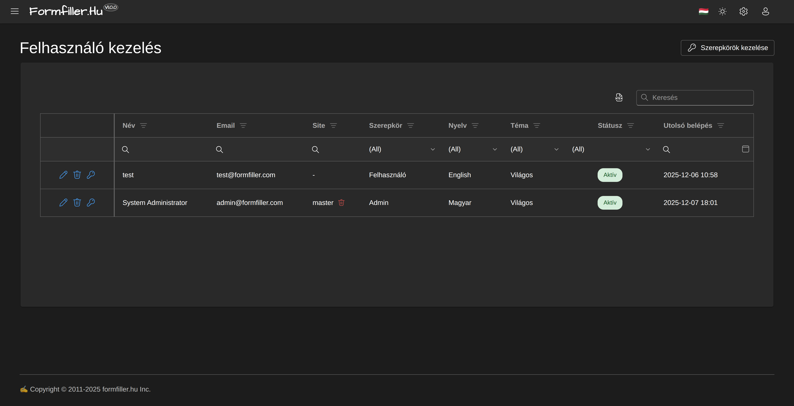

# Adminisztrációs Útmutató

Ez az útmutató a rendszer adminisztrátorainak szól.

## Adminisztrátori Jogosultságok

Az adminisztrátorok a következő műveleteket végezhetik:

- Felhasználók kezelése
- Szerepkörök és jogosultságok beállítása
- Konfigurációk (űrlapok) létrehozása és módosítása
- Rendszerbeállítások módosítása
- Site-ok kezelése (multisite módban)

## Felhasználók Kezelése

*A felhasználók kezelése felület*

### Felhasználók Listázása

1. Nyisd meg az "Adminisztráció" menüt
2. Válaszd a "Felhasználók" menüpontot

### Új Felhasználó Létrehozása

1. Kattints az "Új felhasználó" gombra
2. Add meg az adatokat:
   - Név
   - Email cím
   - Szerepkör(ök)
3. A rendszer elküldi a meghívó emailt

### Felhasználó Szerkesztése

1. Kattints a felhasználó nevére
2. Módosítsd az adatokat
3. Mentsd el

### Felhasználó Deaktiválása

1. Nyisd meg a felhasználó adatlapját
2. Kattints a "Deaktiválás" gombra
3. Erősítsd meg

A deaktivált felhasználó nem tud bejelentkezni, de az adatai megmaradnak.

### Felhasználó Törlése

**Figyelem:** Ez végleges művelet!

1. Nyisd meg a felhasználó adatlapját
2. Kattints a "Törlés" gombra
3. Erősítsd meg

## Szerepkörök és Jogosultságok

*A rendszer szerepkörök áttekintése*

### Beépített Szerepkörök

| Szerepkör | Leírás |
|-----------|--------|
| `admin` | Teljes hozzáférés mindenhez |
| `manager` | Felhasználók és konfigurációk kezelése |
| `owner` | Saját site teljes kezelése |
| `editor` | Konfigurációk és adatok szerkesztése |
| `contributor` | Adatok létrehozása és módosítása |
| `creator` | Csak adatok létrehozása |
| `viewer` | Csak olvasási jog |

### Egyéni Szerepkör Létrehozása

1. Nyisd meg a "Szerepkörök" menüpontot
2. Kattints az "Új szerepkör" gombra
3. Add meg:
   - Név
   - Leírás
   - Jogosultságok
4. Mentsd el

### Jogosultságok Beállítása

Minden jogosultság a következő műveleteket tartalmazhatja:
- Létrehozás (create)
- Olvasás (read)
- Módosítás (update)
- Törlés (delete)

**Erőforrás típusok:**
- Konfigurációk (configs)
- Adatok (data)
- Felhasználók (users)
- Szerepkörök (roles)
- Site-ok (sites)

### Felhasználó Szerepkör Hozzárendelése

1. Nyisd meg a felhasználó adatlapját
2. A "Szerepkörök" szekcióban adj hozzá/távolíts el szerepköröket
3. Mentsd el

## Konfigurációk Kezelése

### Konfigurációk Listázása

1. Nyisd meg a "Konfigurációk" menüpontot
2. Szűrj típus vagy címkék szerint

### Új Konfiguráció Létrehozása

1. Kattints az "Új konfiguráció" gombra
2. Válassz típust:
   - Űrlap (form)
   - Rács (grid)
   - Fa (tree)
3. Add meg a címet és leírást
4. Tervezd meg az űrlapot a szerkesztőben
5. Publikáld

### Konfiguráció Másolása

1. Nyisd meg a másolandó konfigurációt
2. Kattints a "Másolás" gombra
3. Add meg az új nevet
4. Módosítsd szükség szerint

### Konfiguráció Exportálása/Importálása

**Exportálás:**
1. Nyisd meg a konfigurációt
2. Kattints az "Export" gombra
3. Mentsd el a JSON fájlt

**Importálás:**
1. Kattints az "Import" gombra
2. Válaszd ki a JSON fájlt
3. Ellenőrizd és mentsd el

## Site Kezelés (Multisite)

### Site-ok Listázása

1. Nyisd meg a "Site-ok" menüpontot
2. Látod az összes site-ot és állapotukat

### Új Site Létrehozása

1. Kattints az "Új site" gombra
2. Add meg:
   - Site név (URL-ben megjelenik)
   - Megjelenített név
   - Tulajdonos email
3. A rendszer automatikusan létrehozza a site-ot

### Site Beállítások

1. Nyisd meg a site-ot
2. Módosítsd a beállításokat:
   - Név
   - Tulajdonos
   - Engedélyezett funkciók
   - Egyéni beállítások

### Site Deaktiválása/Törlése

**Deaktiválás:** A site ideiglenesen nem elérhető, de az adatok megmaradnak.

**Törlés:** Véglegesen törli a site-ot és minden adatát.

## Rendszer Monitoring

### Naplók Megtekintése

1. Nyisd meg a "Naplók" menüpontot
2. Szűrj:
   - Időszak
   - Felhasználó
   - Művelet típus
   - Súlyosság

### Rendszer Állapot

A "Rendszer állapot" oldalon látod:
- Aktív felhasználók száma
- Tárolt rekordok száma
- Rendszer erőforrás használat
- Utolsó backup időpontja

## Biztonsági Beállítások

### Jelszó Szabályzat

Beállítható:
- Minimum hossz
- Kötelező karakterek (nagy/kisbetű, szám, speciális)
- Lejárati idő
- Korábbi jelszavak tiltása

### Munkamenet Beállítások

- Munkamenet időtúllépés
- Egyidejű bejelentkezések száma
- IP alapú korlátozás

### Kétfaktoros Hitelesítés

1. Engedélyezd a 2FA-t a rendszerbeállításokban
2. Felhasználók egyénileg aktiválhatják

## Backup és Visszaállítás

### Automatikus Backup

A rendszer napi automatikus backup-ot készít. Beállítható:
- Backup időpontja
- Megőrzési idő
- Tárolási hely

### Manuális Backup

1. Nyisd meg a "Backup" menüpontot
2. Kattints a "Backup készítése" gombra
3. Várj a befejezésre
4. Töltsd le a backup fájlt

### Visszaállítás

**Figyelem:** A visszaállítás felülírja az aktuális adatokat!

1. Nyisd meg a "Backup" menüpontot
2. Válaszd ki a visszaállítandó backup-ot
3. Kattints a "Visszaállítás" gombra
4. Erősítsd meg

## Hibaelhárítás

### Felhasználó Nem Tud Bejelentkezni

Ellenőrizd:
1. A felhasználó aktív-e
2. A jelszó nem járt-e le
3. Nincs-e IP korlátozás
4. A site aktív-e (multisite módban)

### Jogosultsági Problémák

1. Ellenőrizd a felhasználó szerepköreit
2. Ellenőrizd a szerepkör jogosultságait
3. Ellenőrizd a site-specifikus jogosultságokat

### Teljesítmény Problémák

1. Ellenőrizd a rendszer állapotot
2. Ellenőrizd a nagy konfigurációkat
3. Ellenőrizd a lekérdezések számát

